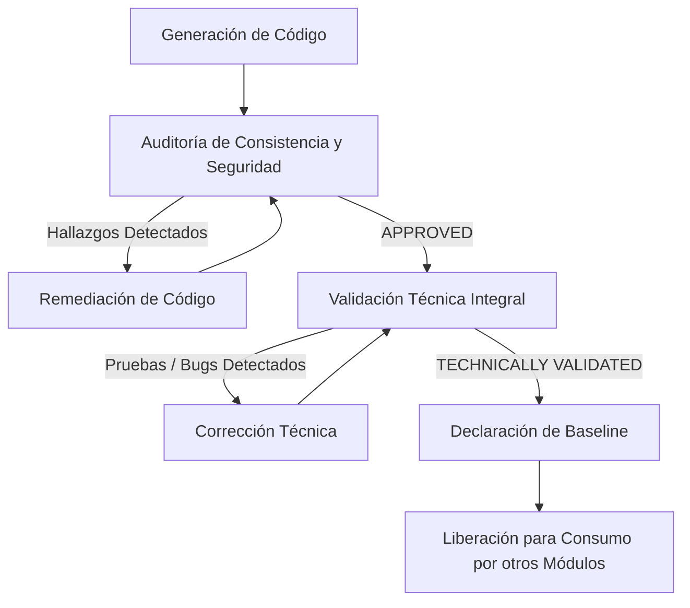

# BASELINES.md: Registro Oficial de Líneas Base del Proyecto
## Sistema Inteligente de Reclutamiento (SIR) – Nacional Seguros

Este documento constituye el **Registro Maestro de Líneas Base (Baselines)** del proyecto **Sistema Inteligente de Reclutamiento (SIR)** de **Nacional Seguros**. Su finalidad es registrar formalmente el estado de certificación, control de versiones e inmutabilidad de los módulos y componentes del sistema que han sido validados para el inicio seguro del desarrollo de capas y módulos subsecuentes.

---

## 1. Objetivo

### ¿Qué es una Baseline?
Una **Línea Base (Baseline)** es una referencia técnica y funcional aprobada que representa un conjunto de especificaciones, código fuente, base de datos y configuraciones congelados en un instante de tiempo. Actúa como el pimiento y cimiento sobre el cual se construyen los siguientes incrementos del sistema.

### ¿Cuándo un componente puede convertirse en Baseline?
Un módulo o componente califica para convertirse en Baseline únicamente tras superar con éxito los procesos independientes de **Auditoría de Consistencia/Seguridad** (obteniendo el estado `APPROVED`) y la **Validación Técnica Integral** (obteniendo el estado `TECHNICALLY VALIDATED`).

### ¿Quién autoriza una Baseline?
La declaración formal de una línea base es autorizada y certificada en conjunto por:
*   El **Comité de Arquitectura** (Enterprise Architect y Solution Architect)
*   El **Líder Técnico** (Technical Lead)
*   El **Auditor del Proyecto** (Project Auditor)
*   El **Gestor de Configuración y Liberaciones** (Release Manager)

### ¿Cómo se controla una modificación posterior?
Una vez que un componente es declarado Baseline, entra en estado de **congelamiento**. No se permite ninguna mutación de código de forma directa en el repositorio principal. Toda modificación posterior debe canalizarse a través de una **Solicitud Formal de Cambio (RFC)**, un estudio de impacto, su posterior aprobación y un incremento del número de versión semántica del componente.

---

## 2. Criterios para declarar una Baseline

Para que un componente sea declarado Baseline de forma oficial, debe cumplir rigurosamente con los siguientes requisitos previos:
*   [x] **Código generado:** Código fuente completo, estructurado e integrado en el repositorio.
*   [x] **Auditoría:** Reporte emitido con dictamen final de **`APPROVED`**.
*   [x] **Validación Técnica:** Reporte emitido con dictamen final de **`TECHNICALLY VALIDATED`**.
*   [x] **Sin observaciones críticas:** Cero hallazgos abiertos de severidad Crítica o Alta.
*   [x] **Arquitectura aprobada:** 100% de cumplimiento con Clean Architecture, SOLID, DDD y CQRS.
*   [x] **Consistencia del PRD:** Cobertura de las reglas y alcances funcionales del PRD aprobado.
*   [x] **Contratos OpenAPI:** Respuestas y peticiones 100% conformes a la especificación Swagger.
*   [x] **Base de Datos compatible:** Compatibilidad e integración física con SQL Server 2022.

---

## 3. Registro Oficial de Baselines

A continuación se detalla el listado de Líneas Base del proyecto SIR:

| Código | Componente | Estado Auditoría | Validación Técnica | Versión | Fecha | Responsable | Estado |
| :---: | :--- | :---: | :---: | :---: | :---: | :--- | :---: |
| **BL-00** | Solución Base .NET 8 | `APPROVED` | `TECHNICALLY VALIDATED` | v1.0.0 | 2026-06-25 | ReleaseManager / TechLead | **CERTIFICADO** |
| **BL-01** | Seguridad | `APPROVED` | `TECHNICALLY VALIDATED` | v1.0.0 | 2026-06-26 | SecurityArchitect / TechLead | **CERTIFICADO** |
| **BL-02** | Catálogos Maestros | `APPROVED` | `TECHNICALLY VALIDATED` | v1.0.0 | 2026-06-26 | SolutionArchitect / TechLead | **CERTIFICADO** |
| **BL-03** | Gestión de Solicitudes | `APPROVED` | `TECHNICALLY VALIDATED` | v1.0.0 | 2026-06-27 | DomainArchitect / TechLead | **CERTIFICADO** |
| **BL-04** | Perfiles | `APPROVED` | `TECHNICALLY VALIDATED` | v1.0.0 | 2026-06-27 | DomainArchitect / TechLead | **CERTIFICADO** |
| **BL-05** | Vacantes | — | — | — | — | DomainArchitect | *PENDIENTE* |
| **BL-06** | Postulantes | — | — | — | — | DomainArchitect | *PENDIENTE* |
| **BL-07** | Matching IA | — | — | — | — | SolutionArchitect | *PENDIENTE* |
| **BL-08** | Scoring IA | — | — | — | — | SolutionArchitect | *PENDIENTE* |
| **BL-09** | Entrevistas | — | — | — | — | SolutionArchitect | *PENDIENTE* |
| **BL-10** | Ofertas | — | — | — | — | SolutionArchitect | *PENDIENTE* |
| **BL-11** | Contrataciones | — | — | — | — | SolutionArchitect | *PENDIENTE* |
| **BL-12** | SLA | — | — | — | — | DomainArchitect | *PENDIENTE* |
| **BL-13** | Reportes | — | — | — | — | SolutionArchitect | *PENDIENTE* |
| **BL-14** | Observabilidad | — | — | — | — | TechnicalLead | *PENDIENTE* |
| **BL-15** | Integraciones | — | — | — | — | IntegrationArchitect | *PENDIENTE* |
| **BL-16** | Hardening Final | — | — | — | — | SecurityArchitect | *PENDIENTE* |

---

## 4. Estado Actual del Proyecto

Actualmente, se declaran certificadas y cerradas las siguientes líneas base:
*   **BL-00:** Solución Base (Cimientos de Clean Architecture y configuración de dependencias).
*   **BL-01:** Seguridad (JWT, PBKDF2, MFA TOTP de dos fases, simulación de LDAP corporativa).
*   **BL-02:** Catálogos Maestros (Parametrización jerárquica con prevención de recursión infinita).
*   **BL-03:** Gestión de Solicitudes (Registro, actualización, Kanban, transiciones con persistencia de comentarios en base de datos e interceptor RLS).

**Estado general de desarrollo:** Los componentes base del Módulo 01, Módulo 02 y Módulo 03 están completamente consolidados. **Se habilita formalmente el inicio del desarrollo del Módulo 04 – Perfiles.**

---

## 5. Política de Control de Cambios

Cualquier Baseline certificada bajo este registro está sujeta a la siguiente política de modificación:
1.  **Inmutabilidad:** Ninguna Baseline puede modificarse directamente en el branch principal de producción.
2.  **Solicitud Formal (RFC):** Todo cambio debe solicitarse formalmente mediante un Ticket de Cambio (RFC) justificando el motivo (mejora, corrección de bug post-auditoría, etc.).
3.  **Estudio de Impacto:** Los arquitectos analizarán el impacto del cambio sobre las dependencias del sistema.
4.  **Aprobación del Cambio:** La implementación requiere la aprobación explícita de los líderes técnicos del proyecto.
5.  **Compilación y Suite de Test Completa:** El parche de cambio debe pasar la suite completa de pruebas unitarias/integración de la solución sin ninguna regresión.
6.  **Actualización de Versión:** Tras implementarse, se actualizará el parche en el versionamiento semántico.

---

## 6. Versionamiento de Baselines

El versionamiento de cada Baseline sigue la convención de **Versionamiento Semántico (SemVer)**:

```text
vMayor.Menor.Patch
```

*   **Mayor:** Cambios mayores que introducen incompatibilidad en contratos de API o alteración mayor de la base de datos (ej. v2.0.0).
*   **Menor:** Nuevas funcionalidades retrocompatibles en el módulo (ej. v1.1.0).
*   **Patch:** Correcciones menores, optimizaciones o parches de remediación de seguridad retrocompatibles (ej. v1.0.1).

---

## 7. Historial de Cambios en Baselines

| Fecha | Baseline | Cambio Realizado | Responsable | Motivo | Nueva Versión |
| :---: | :---: | :--- | :--- | :--- | :---: |
| 2026-06-25 | **BL-00** | Creación oficial de la Solución Base (Módulo 00) | ReleaseManager | Baseline inicial de infraestructura | v1.0.0 |
| 2026-06-26 | **BL-01** | Certificación del Módulo de Seguridad (Módulo 01) | SecurityArchitect | Integración de autenticación y políticas | v1.0.0 |
| 2026-06-26 | **BL-02** | Certificación del Módulo de Catálogos (Módulo 02) | SolutionArchitect | Cierre de parametrización base | v1.0.0 |
| 2026-06-27 | **BL-03** | Certificación de Gestión de Solicitudes (Módulo 03) | DomainArchitect | Finalización y validación del módulo | v1.0.0 |
| 2026-06-27 | **BL-04** | Certificación del Módulo de Perfiles (Módulo 04) | DomainArchitect | Validación y aprobación del profesiograma con IA | v1.0.0 |
| 2026-07-12 | **BL-02** | Inclusión de Regionales, Tipos de Solicitud y Modalidades de Trabajo | TechLead | Migración estructural de catálogos a tablas físicas y CRUD completo | v1.1.0 |
| 2026-07-12 | **BL-03** | Refactorización de Solicitudes y campos de perfil | TechLead | Reemplazo de columnas obsoletas por IDs de tablas maestras | v1.1.0 |
| 2026-07-12 | **BL-05** | Adaptación de Vacantes por remoción de FechaIdeal | TechLead | Nulabilidad de FechaLimiteCobertura en DTO y mapeos | v1.0.1 |

---

## 8. Flujo Oficial de Certificación de Módulos

El flujo obligatorio para que cualquier módulo subsiguiente sea incorporado al registro de Baselines es:



---

## 9. Certificación de Líneas Base

Se certifica formalmente que las líneas base registradas como **`CERTIFICADO`** constituyen la única referencia autorizada de diseño, persistencia y API para el desarrollo del **Sistema Inteligente de Reclutamiento (SIR)**. Todos los desarrollos de los módulos de negocio superiores (comenzando por el **Módulo 04 – Perfiles**) deberán depender y consumir exclusivamente los servicios y contratos declarados y congelados bajo este registro de Baselines.

---
*Fin del Registro Maestro de Baselines.*
