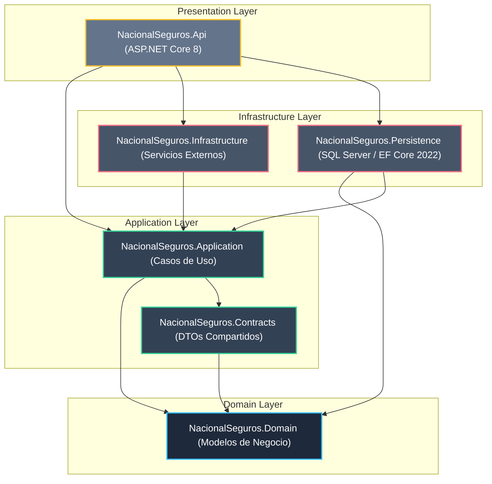
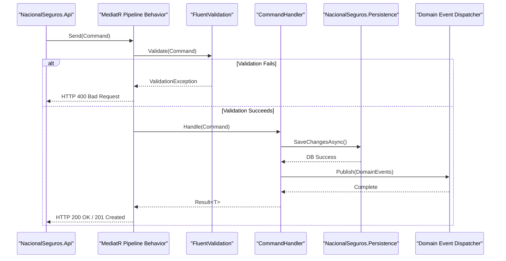
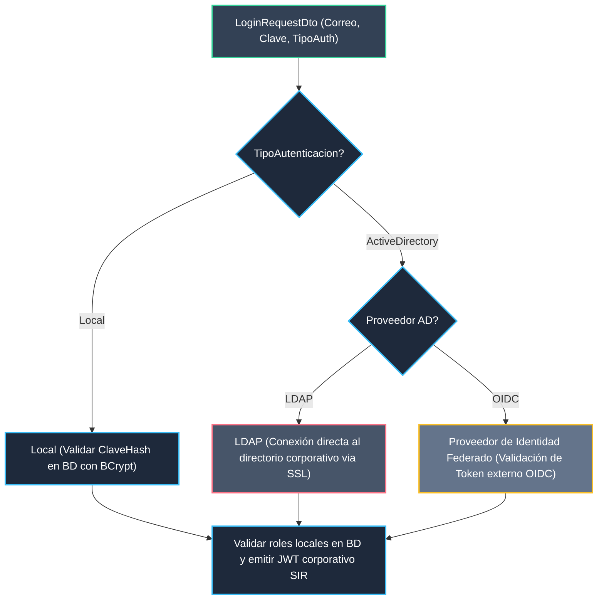

# Especificación de Arquitectura de Backend: .NET 8 (Clean Architecture & DDD)
## Proyecto: Sistema Inteligente de Reclutamiento (SIR) - Nacional Seguros

Este documento define la arquitectura técnica detallada para el desarrollo del backend del **Sistema Inteligente de Reclutamiento** para **Nacional Seguros**. Está estructurado bajo los principios de **Clean Architecture**, **Domain-Driven Design (DDD)**, **CQRS (Command Query Responsibility Segregation)**, y sigue estrictamente las políticas corporativas de seguridad, auditoría e integración asíncrona establecidas en el PRD, ERD y OpenAPI aprobados.

---

## 1. Arquitectura General y Capas

El backend se divide en proyectos independientes para separar la lógica de negocio pura de las implementaciones tecnológicas, garantizando que el núcleo del dominio permanezca aislado.



### 1.1 Responsabilidad de las Capas
1. **NacionalSeguros.Domain:** Contiene los modelos de datos puros de negocio (Entidades, Aggregates, Value Objects), interfaces de repositorios, reglas de negocio intrínsecas y eventos de dominio. Es completamente agnóstica de frameworks externos.
2. **NacionalSeguros.Application:** Contiene los flujos de casos de uso (Commands/Queries con MediatR), validadores FluentValidation, lógica de orquestación, y servicios de aplicación. Depende exclusivamente de la capa de Dominio.
3. **NacionalSeguros.Contracts:** Contiene los DTOs (Data Transfer Objects) que definen el contrato de entrada y salida expuesto por la API. Es compartida por la API y los consumidores del servicio.
4. **NacionalSeguros.Persistence:** Contiene la implementación concreta del acceso a base de datos. Define el `ApplicationDbContext`, mapeos de Fluent API, implementaciones de repositorios, interceptores de auditoría y migraciones para SQL Server 2022.
5. **NacionalSeguros.Infrastructure:** Implementa servicios de infraestructura externos como el envío de correos (SMTP), cliente HTTP con resiliencia Polly para workflows de n8n, tokenizadores de seguridad (JWT), e integración con el servicio de directorio de identidad corporativo.
6. **NacionalSeguros.Api:** Punto de entrada del sistema. Aloja los controladores REST (ASP.NET Core Web API), configuraciones de inyección de dependencias (DI), middlewares globales de excepciones, idempotencia, y políticas de seguridad (MFA y RBAC).

---

## 2. Estructura de la Solución (Visual Studio Solution Tree)

La jerarquía física de directorios y archivos de la solución de Visual Studio se organiza de la siguiente manera:

```text
NacionalSeguros.SIR/
├── NacionalSeguros.SIR.sln
├── src/
│   ├── NacionalSeguros.Domain/
│   │   ├── Aggregates/
│   │   ├── Entities/
│   │   ├── ValueObjects/
│   │   ├── Exceptions/
│   │   ├── Events/
│   │   ├── Repositories/
│   │   └── NacionalSeguros.Domain.csproj
│   ├── NacionalSeguros.Application/
│   │   ├── Behaviours/
│   │   ├── Commands/
│   │   ├── Queries/
│   │   ├── Validators/
│   │   ├── Services/
│   │   └── NacionalSeguros.Application.csproj
│   ├── NacionalSeguros.Contracts/
│   │   ├── Requests/
│   │   ├── Responses/
│   │   ├── Common/
│   │   └── NacionalSeguros.Contracts.csproj
│   ├── NacionalSeguros.Persistence/
│   │   ├── Context/
│   │   ├── Configurations/
│   │   ├── Interceptors/
│   │   ├── Repositories/
│   │   ├── Migrations/
│   │   └── NacionalSeguros.Persistence.csproj
│   ├── NacionalSeguros.Infrastructure/
│   │   ├── Security/
│   │   ├── Notifications/
│   │   ├── Integration/
│   │   └── NacionalSeguros.Infrastructure.csproj
│   └── NacionalSeguros.Api/
│       ├── Controllers/
│       ├── Middlewares/
│       ├── Filters/
│       ├── Extensions/
│       ├── appsettings.json
│       ├── Program.cs
│       └── NacionalSeguros.Api.csproj
└── tests/
    ├── NacionalSeguros.UnitTests/
    ├── NacionalSeguros.IntegrationTests/
    └── NacionalSeguros.ArchitectureTests/
```

---

## 3. Catálogo de Proyectos e Importaciones (NuGet Packages)

A continuación se detalla la configuración técnica y los paquetes NuGet requeridos por cada proyecto de la solución:

| Proyecto | Tipo de Proyecto | Paquetes NuGet Clave | Propósito Principal |
| :--- | :--- | :--- | :--- |
| **NacionalSeguros.Domain** | Class Library | Ninguno (Independencia total) | Modelar la lógica de negocio central del SIR de Nacional Seguros. |
| **NacionalSeguros.Application** | Class Library | `MediatR` (12.x)<br>`FluentValidation.DependencyInjection` | Definir los casos de uso del sistema, validaciones y lógica de control. |
| **NacionalSeguros.Contracts** | Class Library | Ninguno | DTOs de Requests y Responses compartidos para comunicación de APIs. |
| **NacionalSeguros.Persistence** | Class Library | `Microsoft.EntityFrameworkCore.SqlServer` (8.x)<br>`Microsoft.EntityFrameworkCore.Relational`<br>`Dapper` (2.x) | Lógica de persistencia, consultas CRUD optimizadas y comandos directos. |
| **NacionalSeguros.Infrastructure** | Class Library | `Microsoft.Extensions.Http.Polly` (8.x)<br>`System.DirectoryServices.Protocols` (LDAP)<br>`System.IdentityModel.Tokens.Jwt` | Clientes HTTP resilientes para n8n, conexión LDAP corporativo, y emisión/validación de JWT. |
| **NacionalSeguros.Api** | Web API | `Microsoft.AspNetCore.Authentication.JwtBearer`<br>`Microsoft.Identity.Web` (Directorio Corporativo)<br>`Serilog.AspNetCore`<br>`OpenTelemetry` | Servidor Web ASP.NET Core, enrutamiento, seguridad JWT y Directorio Corporativo, trazabilidad y logging. |
| **NacionalSeguros.Tests** | xUnit Test Project | `xunit`<br>`Moq`<br>`FluentAssertions`<br>`NetArchTest.eShop` | Pruebas unitarias de handlers, integración de endpoints y testeo arquitectónico. |

---

## 4. Diseño del Dominio (Domain Layer)

### 4.1 Catálogo de Entidades (Entity Catalog)
Las entidades de negocio mapean exactamente las especificaciones físicas definidas en el ERD y el Diccionario de Datos:

1. **Usuario:** Identidad operativa (`UsuarioId`, `Nombre`, `Correo`, `ClaveHash`, `TipoAutenticacion`, `ActiveDirectoryId`, `Estado`, `MfaHabilitado`, `MfaSecreto`).
2. **Rol & Permiso:** Control de acceso basado en roles (`RolId`, `Nombre`, `Descripcion` y `PermisoId`, `Codigo`, `Nombre`).
3. **Solicitud:** Requerimiento inicial (`SolicitudId`, `Cargo`, `Area`, `SolicitanteId`, `DecisorId`, `Ubicacion`, `Modalidad`, `Seniority`, `Prioridad`, `FechaIdeal`, `Funciones`, `Skills`, `EstadoId`).
4. **PerfilCargo:** Profesiograma activo (`PerfilCargoId`, `SolicitudId`, `Cargo`, `Descripcion`, `Version`, `EstadoId`).
5. **Vacante:** Proceso operativo abierto (`VacanteId`, `PerfilCargoId`, `SolicitudId`, `EstadoId`, `FechaApertura`, `BandaSalarialMin`, `BandaSalarialMax`).
6. **Postulante:** Candidato evaluado (`PostulanteId`, `Nombres`, `Apellidos`, `Correo`, `DocumentoIdentidad`, `PretensionSalarial`, `Origen`, `EstadoPipelineId`).
7. **Entrevista:** Programación de citas (`EntrevistaId`, `VacanteId`, `PostulanteId`, `FechaHora`, `TipoEntrevista`, `EstadoId`).
8. **Matching & Scoring:** Idoneidad determinada por la IA (`MatchingId`, `ScoreCoincidencia`, `CoincidenciasText`, `BrechasText` y `ScoringId`, `ScoreSkills`, `ScoreExperiencia`, `ScoreFinal`, `JustificacionText`).
9. **SLA & SLAExecution:** Tiempos de control operativo (`SLAId`, `Nombre`, `DiasMaximos`, `Modulo` y `SLAExecutionId`, `FechaInicio`, `FechaLimite`, `FechaFin`, `Cumplido`).
10. **PromptVersion:** Versionado de prompts de IA en BD (`PromptVersionId`, `PromptId`, `VersionNumber`, `PromptSystem`, `PromptUser`, `Activo`).
11. **AgentExecution:** Auditoría de llamadas a LLM (`ExecutionId`, `AgenteId`, `PromptVersionId`, `UsuarioId`, `FechaInicio`, `FechaFin`, `DuracionMs`, `InputJson`, `OutputJson`, `ResultadoStatus`, `TokensInput`, `TokensOutput`, `CostoEstimado`).
12. **AgentRecommendation:** Recomendaciones que requieren aprobación humana (`AgentRecommendationId`, `ExecutionId`, `EntidadAsociada`, `EntidadId`, `RecomendacionText`, `NivelConfianza`, `UsuarioAprobadorId`, `EstadoRecomendacion`).

### 4.2 Value Objects (Objetos de Valor)
Encapsulan validaciones e invariantes de negocio:
* **Email:** Valida la estructura formal de un correo corporativo.
* **DocumentoIdentidad:** Asegura la consistencia en el formato del documento (tipo y número de cédula).
* **BandaSalarial (Always Encrypted):** Encapsula el valor mínimo y máximo de salario, controlando la lógica de cifrado en reposo para protección de datos confidenciales.
* **ScoreCoincidencia (Always Encrypted):** Encapsula el puntaje porcentual de matching de la IA con cifrado de origen.

### 4.3 Aggregates (Agregados y Roots)
Agrupan transacciones para asegurar la integridad de datos:
* **UsuarioAggregate:** Root: `Usuario`. Contiene las entidades asociadas `Sesion` e `HistorialAcceso`.
* **SolicitudAggregate:** Root: `Solicitud`. Contiene `AprobacionSolicitud`, `SolicitudAdjunto` y `SolicitudComentario`.
* **PerfilCargoAggregate:** Root: `PerfilCargo`. Contiene `PerfilVersion`.
* **VacanteAggregate:** Root: `Vacante`. Contiene `Publicacion`.
* **PostulanteAggregate:** Root: `Postulante`. Contiene `Expediente`.
* **EntrevistaAggregate:** Root: `Entrevista`. Contiene `EventoAgenda`.

### 4.4 Domain Events (Eventos de Dominio)
Disparados tras cambios de estado transaccionales para activar flujos secundarios (ej: n8n, notificaciones):
* `SolicitudCreadaEvent`: Disparado al crear una solicitud en `Borrador`.
* `SolicitudEnviadaAprobacionEvent`: Transición a `En Validación`.
* `SolicitudAprobadaEvent`: Dispara el workflow de perfilación asíncrona (`WF-01` en n8n).
* `PerfilGeneracionIniciadaEvent`: Dispara el diseño asíncrono de profesiograma por IA (`WF-02`).
* `PerfilAprobadoEvent`: Habilita la creación de la `Vacante`.
* `PostulanteRegistradoEvent`: Dispara el parseo del currículum por la IA (`WF-05`).
* `PostulacionMatchingCompletadaEvent`: Dispara el scoring explicable de IA (`WF-06`).
* `EntrevistaProgramadaEvent`: Dispara la sincronización con Teams y WhatsApp (`WF-07`).

---

## 5. Capa de Aplicación (Application Layer)

Implementa el patrón **CQRS** utilizando la librería **MediatR** y valida la entrada en el pipeline usando **FluentValidation**.



### 5.1 Catálogo de Commands y Handlers
| Command | Handler | Validator Rules (FluentValidation) |
| :--- | :--- | :--- |
| `AutenticarUsuarioCommand` | `AutenticarUsuarioCommandHandler` | Correo obligatorio y formato email. Clave obligatoria. TipoAuth válido (`Local` / `ActiveDirectory`). |
| `CrearSolicitudCommand` | `CrearSolicitudCommandHandler` | CargoCodigo y AreaCodigo no nulos. Justificacion > 10 caracteres. RemuneracionOfrecida > 0. |
| `AprobarSolicitudCommand` | `AprobarSolicitudCommandHandler` | SolicitudId obligatorio. AprobadorId debe pertenecer al rol `Decisor` o `RRHH`. |
| `GenerarPerfilCargoCommand` | `GenerarPerfilCargoCommandHandler` | SolicitudId aprobado. Bloquear si ya existe un perfil en proceso o aprobado para la solicitud. |
| `AprobarPerfilCargoCommand` | `AprobarPerfilCargoCommandHandler` | PerfilCargoId obligatorio. Transita perfil a `Aprobada`. |
| `RegistrarPostulanteCommand` | `RegistrarPostulanteCommandHandler` | Nombres y Apellidos no nulos. DocumentoIdentidad único. cvFile (.pdf / .docx, máx 5MB). |
| `ProgramarEntrevistaCommand` | `ProgramarEntrevistaCommandHandler` | VacanteId y PostulanteId válidos. FechaHora a futuro. No colisionar con agenda de entrevistador. |
| `ConfirmarAsistenciaEntrevistaCommand` | `ConfirmarAsistenciaEntrevistaCommandHandler` | EntrevistaId válido. Ejecutado por Postulante o Callback n8n. |
| `ReprogramarEntrevistaCommand` | `ReprogramarEntrevistaCommandHandler` | Validar máximo 3 reprogramaciones en `SLAExecution`. |
| `GenerarOfertaCommand` | `GenerarOfertaCommandHandler` | Postulante en estado `Terna`. Banda salarial acorde a la vacante. |

### 5.2 Catálogo de Queries y Handlers
| Query | Handler | Tipo de Lectura / Optimización |
| :--- | :--- | :--- |
| `GetUsuarioByIdQuery` | `GetUsuarioByIdQueryHandler` | EF Core `AsNoTracking()` |
| `ListSolicitudesQuery` | `ListSolicitudesQueryHandler` | EF Core con filtros dinámicos y paginado. |
| `GetPerfilCargoByIdQuery` | `GetPerfilCargoByIdQueryHandler` | EF Core `AsNoTracking()` incluyendo versiones. |
| `ListVacantesQuery` | `ListVacantesQueryHandler` | EF Core `AsNoTracking()` con filtros por estado y área. |
| `GetPostulanteByIdQuery` | `GetPostulanteByIdQueryHandler` | EF Core resuelto con expediente. |
| `GetDashboardEjecutivoQuery` | `GetDashboardEjecutivoQueryHandler` | Dapper query directo sobre `MetricSnapshot` para alta velocidad. |
| `GetDashboardSLAQuery` | `GetDashboardSLAQueryHandler` | Dapper query directo sobre `SLAExecution`. |
| `ListAuditLogsQuery` | `ListAuditLogsQueryHandler` | EF Core `AsNoTracking()` exclusivo para rol `Auditor` / `Administrador`. |

---

## 6. Capa de Presentación (API Layer)

### 6.1 Versionado y Enrutamiento
* **Esquema de Versionado:** Versionado en URL. Toda ruta del sistema está expuesta bajo `/api/v{version}/` (ej. `/api/v1/solicitudes`).
* **Formatos de Serialización:** JSON camelCase.

### 6.2 Middlewares y Filtros de la API
1. **`CorrelationIdMiddleware`:**
   * Intercepta toda petición entrante y verifica si tiene la cabecera `X-Correlation-ID`.
   * Si no existe, genera un nuevo `CorrelationId` (`Guid.NewGuid()`).
   * Registra el `CorrelationId` en el `LogContext` de Serilog para que aparezca en todos los logs de la solicitud.
   * Añade la cabecera `X-Correlation-ID` en la respuesta HTTP saliente.
2. **`ExceptionHandlingMiddleware` (Control Global de Errores):**
   * Captura cualquier excepción no controlada en los controladores, handlers o base de datos.
   * Asocia la excepción al `CorrelationId` activo.
   * Escribe un log de nivel `Error` detallado.
   * Devuelve un payload JSON estándar de error según las especificaciones del PRD y OpenAPI:
     ```json
     {
       "Code": "INTERNAL_SERVER_ERROR",
       "Message": "Ocurrió un error inesperado en el servidor.",
       "Detail": "Mensaje técnico descriptivo (solo en ambiente de desarrollo).",
       "CorrelationId": "f7a391cb-d3f3-4d6d-b8d9-2ef53ea493b8"
     }
     ```
3. **`IdempotencyFilter` (Idempotencia de Callbacks de n8n):**
   * Filtro de acción aplicable a endpoints callback (`POST /callbacks/*`).
   * Lee la cabecera `X-Correlation-ID`.
    * **Caché Híbrida de Idempotencia:**
      - En entorno de **Desarrollo Local**: Utiliza `IMemoryCache` en memoria local de la aplicación.
      - En entornos **QA y Producción**: Utiliza un proveedor de caché distribuida compatible (`IDistributedCache`) con expiración de 60 segundos, para garantizar la consistencia en arquitecturas multi-nodo balanceadas horizontalmente.
   * Si ya fue procesada, intercepta el flujo de inmediato y responde con un `HTTP 200 OK` (o `HTTP 202 Accepted`) con el código de error semántico `IDEMPOTENCY_CALLBACK_DUPLICATED`, evitando inserciones dobles en `StateHistory` y reprocesamientos de IA.
   * Si no fue procesada, registra la clave y continúa el flujo de ejecución.

---

## 7. Capa de Persistencia (Persistence Layer)

### 7.1 Entity Framework Core 2022 Configuration
* **`ApplicationDbContext`:** Contexto oficial que implementa `IApplicationDbContext` para desacoplamiento.
* **Mapeos Fluidos (Fluent API):** Todas las entidades se mapean a tablas en singular para consistencia interna de .NET, pero apuntan al nombre físico en plural de SQL Server mediante `.ToTable("Usuarios")`.
* **Filtros de Consulta Globales (Soft Delete):** Mapeo transversal para ignorar registros marcados como eliminados:
  ```csharp
  modelBuilder.Entity<Usuario>().HasQueryFilter(u => !u.IsDeleted);
  modelBuilder.Entity<Solicitud>().HasQueryFilter(s => !s.IsDeleted);
  modelBuilder.Entity<Vacante>().HasQueryFilter(v => !v.IsDeleted);
  modelBuilder.Entity<Postulante>().HasQueryFilter(p => !p.IsDeleted);
  ```
* **Cifrado de Datos (Always Encrypted):** La configuración de persistencia indica que las siguientes columnas están cifradas en la base de datos y se leen de forma transparente mediante el driver de SQL Server en la API con el token en el almacén de secretos corporativo:
  * `Vacante.BandaSalarialMin`
  * `Vacante.BandaSalarialMax`
  * `Postulante.PretensionSalarial`
  * `Matching.ScoreCoincidencia`
  * `Scoring.ScoreFinal`

### 7.2 Implementación del Trigger y Validación de Dependencias Circulares
Como control preventivo del hallazgo de jerarquías circulares en la tabla `Parametro` (ej: Gerencia A es hija de Gerencia B, y Gerencia B es hija de Gerencia A), se implementa un control de doble factor:

1. **Trigger en SQL Server:** trigger `trg_Parametro_PreventCircular` que lanza un `RAISERROR` con código 50000 y revierte la transacción (`ROLLBACK TRANSACTION`) si detecta un ciclo jerárquico recursivo mediante una CTE.
2. **Defensa en el Repositorio .NET:**
   * La interfaz `IParametroRepository` expone la validación del árbol jerárquico:
     ```csharp
     public async Task<bool> ValidateNoCircularDependency(int parametroId, int? padreId)
     ```
   * Si el validador retorna falso, el handler lanza un `CircularDependencyException`, el cual es capturado por el `ExceptionHandlingMiddleware` retornando un `HTTP 400 Bad Request` con el código de error `CIRCULAR_DEPENDENCY_DETECTED`.

### 7.3 Modelo Físico de Gestión de Feriados para Cálculo de SLA
Para evitar el vencimiento falso de SLAs en fines de semana o feriados oficiales, la persistencia define la tabla `Feriado`:

```sql
CREATE TABLE Feriado (
    FeriadoId INT IDENTITY(1,1) CONSTRAINT PK_Feriado PRIMARY KEY,
    Fecha DATE NOT NULL CONSTRAINT UQ_Feriado_Fecha UNIQUE,
    Descripcion NVARCHAR(150) NOT NULL,
    EsRecurrente BIT NOT NULL CONSTRAINT DF_Feriado_EsRecurrente DEFAULT 0,
    CreatedBy NVARCHAR(100) NOT NULL,
    CreatedDate DATETIME2(7) NOT NULL CONSTRAINT DF_Feriado_CreatedDate DEFAULT GETUTCDATE(),
    ModifiedBy NVARCHAR(100) NULL,
    ModifiedDate DATETIME2(7) NULL,
    DeletedBy NVARCHAR(100) NULL,
    DeletedDate DATETIME2(7) NULL,
    IsDeleted BIT NOT NULL CONSTRAINT DF_Feriado_IsDeleted DEFAULT 0
);
```

El servicio `SLAExecutionService` inyecta un proveedor de feriados que cachea estos datos en memoria y excluye dinámicamente fines de semana y las fechas registradas en la tabla `Feriado` al calcular la `FechaLimite` de cada etapa.

---

## 8. Seguridad del Sistema

### 8.1 Autenticación Híbrida (Local vs Directorio Corporativo (LDAP/OIDC))
La autenticación se bifurca en el `AutenticarUsuarioCommandHandler` analizando la configuración del usuario en la base de datos:



* **Restricción de Integridad en DB:** La base de datos aplica el Check Constraint `CK_Usuario_ClaveHash_AD` para garantizar que si un usuario pertenece al directorio corporativo, su `ClaveHash` local es obligatoriamente `NULL`.
* **Aprovisionamiento Automático en el Directorio Corporativo:** Si un usuario inicia sesión correctamente a través del directorio corporativo pero no está registrado localmente, el backend autoprovisiona el registro del usuario con `TipoAutenticacion = 'ActiveDirectory'`, `ClaveHash = NULL`, el estado en `'Activo'`, le asigna los roles por defecto y escribe el log de auditoría `'AUTO_PROVISION_AD'`.

### 8.2 Refresh Token Rotation (RTR) y Prevención de Reuso
* **Rotación en cada refresco:** Cuando un cliente solicita un nuevo JWT de acceso enviando su Refresh Token expirado en `/auth/refresh`, el backend genera un **nuevo** JWT y un **nuevo** Refresh Token. El Refresh Token antiguo se marca inmediatamente como consumido/inactivo (`Activa = 0`) en la tabla `Sesion`.
* **Detección de Reuso:** Si un cliente envía un Refresh Token que ya figura como inactivo en la base de datos:
  1. El backend sospecha de robo de sesión (Replay Attack).
  2. Registra el evento en `AuditLog` con severidad crítica y acción `'TOKEN_REUSE_DETECTED'`.
  3. Lanza una excepción `TokenReuseException`.
  4. Modifica la base de datos de inmediato invalidando **todas** las sesiones activas del usuario asociado (`UPDATE Sesion SET Activa = 0 WHERE UsuarioId = @UsuarioId`).
  5. El middleware de excepciones retorna `HTTP 403 Forbidden` con el código `TOKEN_REUSE_DETECTED`.

### 8.3 Estrategia de Recuperación y Respaldo de CMK (Always Encrypted)
Para garantizar el no repudio y evitar la pérdida permanente de datos sensibles en producción, se implementa una estrategia estricta de respaldo y roles en el proveedor corporativo de gestión de secretos:
* **Configuración de Seguridad del Proveedor de Gestión de Secretos:**
  - **Soft-Delete y Purge Protection:** Se configuran parámetros de borrado suave y protección de purga para evitar que la clave de cifrado maestro de columna (CMK) sea eliminada físicamente de forma permanente.
  - **RBAC Cryptographic Permissions:** El pool de la API de .NET 8 tiene asignados los permisos mínimos de cifrado/descifrado sobre el almacén de secretos corporativo, mientras que las acciones de creación y rotación se restringen a los roles de administración del oficial de seguridad de TI/CISO.
* **Respaldo y Restauración de Claves (DRP):**
  - Respaldo periódico e inmutable de la CMK mediante los comandos nativos de respaldo del proveedor corporativo de gestión de secretos.
  - La restauración de la clave en un entorno de contingencia se realiza de forma segura mediante los comandos de recuperación del proveedor de secretos.
* **Aislamiento en Desarrollo:** Para desarrollo local, no se tiene acceso al almacén de secretos corporativo de producción. Se utilizan llaves autogeneradas del almacén local de certificados del sistema operativo o local de base de datos.

### 8.4 Estrategia de Throttling y Control de Cuotas en el Proveedor de Modelos de Lenguaje (LLM)
Para mitigar riesgos de denegación de servicio (HTTP 429 - Too Many Requests) en el proveedor de modelos de lenguaje (LLM) por picos de tráfico en análisis curricular concurrente, el backend implementa:
* **Token Bucket Rate Limiting (Middleware):** Middleware en .NET 8 que limita las peticiones concurrentes dirigidas a workflows n8n a un máximo de 50 peticiones por minuto.
* **Semáforo y Control de Concurrencia:** Los Handlers de MediatR para Matching y Scoring (`AGE-04` y `AGE-05`) utilizan `SemaphoreSlim(10, 10)` para restringir las llamadas salientes simultáneas hacia el proveedor de modelos de lenguaje (LLM) configurado, encolando en memoria local los excedentes de manera asíncrona.

---

## 9. Trazabilidad y Auditoría Centralizada

El sistema recopila registros inmutables de auditoría en tres vertientes especializadas:

### 9.1 Interceptor de Auditoría en Entity Framework Core
Se implementa un `AuditInterceptor` heredado de `SaveChangesInterceptor`:
* Captura las entidades modificadas en el `ChangeTracker` de EF Core.
* Resuelve el `UsuarioNombre` y `Rol` del claim del token JWT activo del usuario.
* Mapea y guarda de forma asíncrona un registro en `AuditLogs` por cada operación de inserción, actualización o borrado lógico.
* Mapea en `AuditDetails` el desglose campo por campo modificado.
* **Control de Privacidad / Sanitización:** El interceptor analiza los metadatos de la entidad buscando atributos `[SensitiveData]` (ej: bandas salariales, puntaje final de matching). Si se detecta un campo sensible, el interceptor sobrescribe los valores guardados en los JSON de `EstadoAnterior` y `EstadoNuevo` reemplazándolos con `'*****'`, garantizando que los auditores no puedan visualizar salarios o scores de candidatos en texto plano.

### 9.2 Historial de Transiciones de Estados (`StateHistory`)
Cualquier cambio de estado operativo en Solicitudes, Vacantes y Postulantes escribe una fila en la tabla `StateHistory`, registrando:
* `Entidad` y `EntidadId` (ej. 'Solicitud', 12)
* `EstadoAnterior` y `EstadoNuevo` (ej. 'Borrador', 'PendienteAprobacion')
* `UsuarioId` y `RolId` del ejecutor
* `Fecha` y `Comentario` (ej. justificación de rechazo)
* `Canal` ('Web', 'n8n')

### 9.3 Registro de Ejecución de Agentes de IA (`AgentExecution`)
Cada llamada externa delegada a un agente inteligente mediante workflows de n8n es registrada en `AgentExecutions`:
* Mapea el `AgentName` y el `PromptVersionId` utilizado (resuelto desde base de datos).
* Almacena el `InputJson` enviado y el `OutputJson` de respuesta estructurada devuelto por la IA.
* Mapea la duración (`DuracionMs`), el conteo exacto de tokens (`TokensInput` / `TokensOutput`) y el costo en USD calculado según la tarifa del modelo cargado en base de datos.
* Asocia el registro a un `CorrelationId` único para enlazar el log de ejecución de la IA con el log HTTP de la API y el `StateHistory`.

---

## 10. Integración Asíncrona con n8n

### 10.1 Comunicación y Resiliencia (.NET ──> n8n)
La API invoca los webhooks de n8n utilizando un cliente HTTP tipado (`n8nClient`):
* Configurado a través de `IHttpClientFactory`.
* Requiere autenticación de API Key inyectada en las cabeceras (`X-API-Key`) del webhook de n8n.
* Utiliza una política de reintentos con retraso exponencial y circuit breaker mediante **Polly** para tolerar caídas temporales de n8n:
  ```csharp
  // Configuración de Polly con reintento exponencial, jitter y circuit breaker
  var jitterer = new Random();
  services.AddHttpClient<In8nClient, n8nClient>()
      .AddPolicyHandler(HttpPolicyExtensions
          .HandleTransientHttpError()
          .WaitAndRetryAsync(3, retryAttempt => 
              TimeSpan.FromSeconds(Math.Pow(2, retryAttempt)) + TimeSpan.FromMilliseconds(jitterer.Next(0, 100))))
      .AddPolicyHandler(HttpPolicyExtensions
          .HandleTransientHttpError()
          .CircuitBreakerAsync(5, TimeSpan.FromSeconds(30)));
  ```

### 10.2 Idempotencia y Procesamiento de Callbacks (n8n ──> .NET)
Para webhooks que n8n consume de regreso en la API de .NET (ej: `/callbacks/cv-parsing` o `/callbacks/scoring`):
* Toda petición enviada por n8n debe incluir la cabecera `X-Correlation-ID` que inició el flujo.
* Los controladores de callback utilizan el filtro `[IdempotentCallbackFilter]` (basado en `IdempotencyFilter`).
* Si el workflow de n8n sufre un reintento y llama dos veces al callback con el mismo `X-Correlation-ID`, la API detecta el reuso en caché (60 segundos de vigencia), detiene la petición de forma segura e inmediatamente devuelve un status `HTTP 200 OK` / `HTTP 202 Accepted` con el mensaje `IDEMPOTENCY_CALLBACK_DUPLICATED`, garantizando que la base de datos no sufra transiciones de estado duplicadas ni incoherencias.

---

## 11. Observabilidad (Logging, CorrelationId y OpenTelemetry)

* **Logging Estructurado con Serilog:** El backend formatea todos los logs de salida como eventos JSON estructurados. Se configuran dos sinks principales:
  1. **Consola:** Para depuración local en formato legible.
  2. **File Sink (Archivos rotativos diarios):** Guardados en la ruta corporativa en formato JSON estructurado, listos para ser indexados por herramientas de monitoreo como Splunk o Grafana Loki.
* **Propagación del CorrelationId:**
  * Toda traza del log incluye la propiedad `CorrelationId`.
  * En llamadas de salida a n8n u otros servicios HTTP, la API adjunta el header `X-Correlation-ID` para que las herramientas de observabilidad puedan unir la transacción en todos los servicios de la arquitectura de Nacional Seguros.
* **OpenTelemetry Instrumentation:** El proyecto `NacionalSeguros.Api` inicializa en `Program.cs` los proveedores de telemetría:
  * Monitorea métricas clave de sistema (uso de CPU, peticiones concurrentes, duración de requests HTTP).
  * Monitorea trazas distribuidas (duración de queries de Entity Framework Core y llamados externos a n8n).

### 11.1 Sanitización de Logs y Excepciones
Para garantizar la confidencialidad de la información y mitigar la exposición accidental de secretos en las trazas del servidor:
* **Filtros de Expresiones Regulares en Serilog:** Se configura un enriquecedor personalizado en Serilog que escanea todas las cadenas de texto del log y reemplaza con `[REDACTED]` cualquier coincidencia de patrones sensibles tales como:
  - `bearer\s+[a-zA-Z0-9\-\._~\+\/]+=*` (Tokens JWT en tránsito)
  - `password=\w+` o `clave=\w+` (Credenciales locales)
  - `TokenJwt\s*:\s*\"[^\"]+\"`
* **Middleware de Excepciones Sanitizado:** El `ExceptionHandlingMiddleware` intercepta errores de bajo nivel (como excepciones de Entity Framework o ADO.NET) y suprime la cadena de conexión original y los parámetros del servidor del mensaje del log físico y de la respuesta JSON saliente, previniendo fuga de metadatos del motor SQL Server 2022.

---

## 12. Riesgos Técnicos y Recomendaciones

### 12.1 Riesgos Detectados:
1. **Riesgo de Bloqueos en Trigger Jerárquico:** Si la tabla `Parametro` sufre cargas masivas de datos concurrentes, la ejecución repetida de la CTE recursiva en el trigger de base de datos podría provocar bloqueos de tablas (Lock Escalation) e impactar el rendimiento.
2. **Exposición de Secretos en el appsettings de Desarrollo:** El uso de credenciales de directorios de identidad corporativos en texto plano en entornos no productivos aumenta el riesgo de fuga accidental al confirmar archivos de configuración en el control de versiones.
3. **Consumo Excesivo e Ineficiente de API de IA:** Si los callbacks de n8n no se completan y el cliente HTTP de .NET reintenta la llamada enviando prompts repetidamente, se generarán cobros redundantes en el proveedor de modelos de lenguaje (LLM).

### 12.2 Recomendaciones Arquitectónicas:
1. **Uso de Caché en Árboles de Catálogos:** La capa de persistencia debe cachear la jerarquía de catálogos en memoria del servidor (`IMemoryCache` con vencimiento por expiración absoluta de 1 hora) y resolver la validación `ValidateNoCircularDependency` en memoria antes de persistir, evitando consultas recursivas repetidas en base de datos. El trigger de BD debe actuar únicamente como control de última línea de defensa.
2. **Uso de User Secrets para Desarrollo Local:** Queda estrictamente prohibido colocar contraseñas de LDAP o claves de acceso federado en el archivo `appsettings.json`. El equipo de desarrollo debe utilizar la herramienta **Secret Manager** (`dotnet user-secrets`) de .NET para almacenar las claves localmente en sus estaciones de trabajo.
3. **Throttling y Límite de Ejecución por Solicitud:** La lógica de negocio en la capa de aplicación debe validar en la tabla `AgentExecution` si ya existe un llamado activo para el `SolicitudId` o `PostulanteId` evaluado. Si existe un proceso en estado `'Corriendo'`, la API debe rechazar peticiones adicionales con un `HTTP 409 Conflict`.
