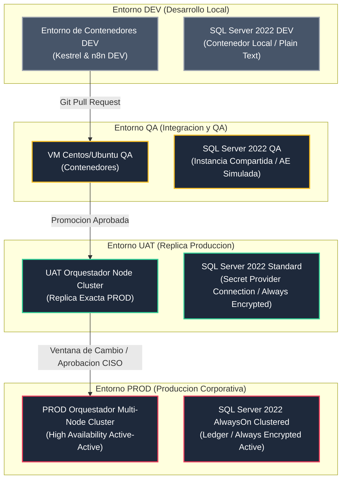
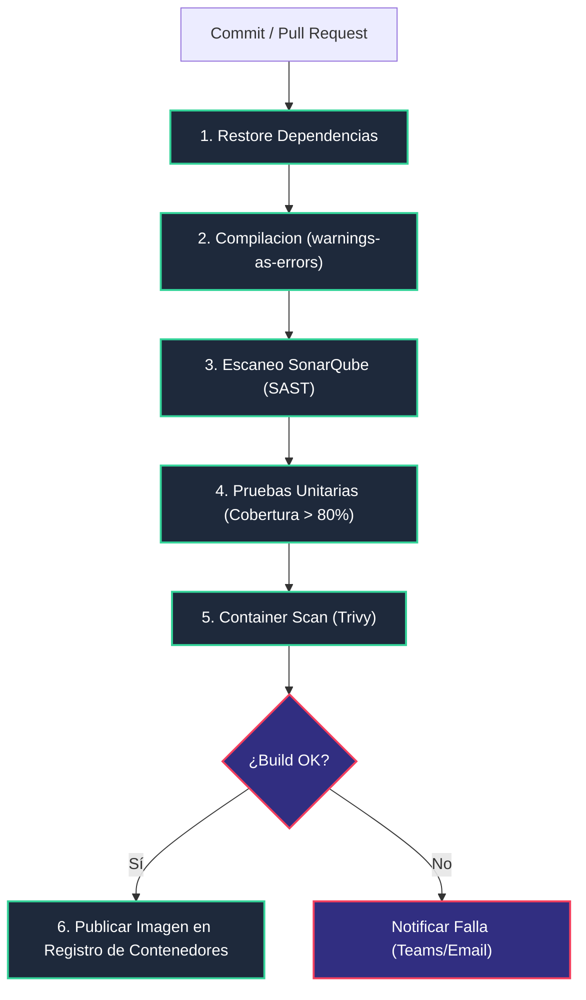
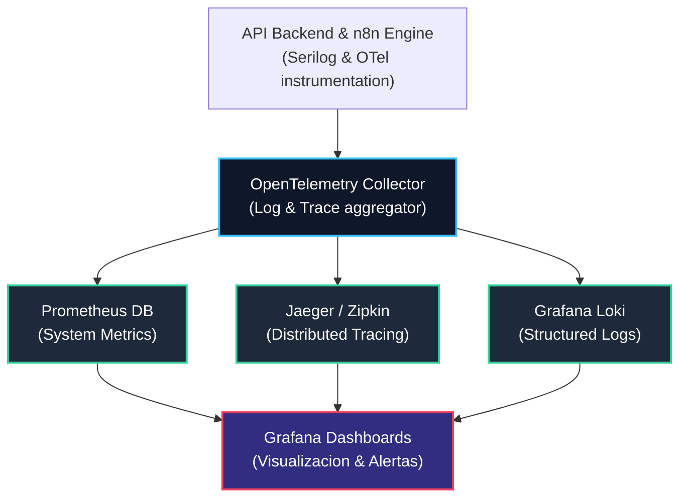

# Arquitectura DevOps (Enterprise DevOps Architecture - EDA)
## Proyecto: Sistema Inteligente de Reclutamiento (SIR) - Nacional Seguros

> **Versión:** 1.0.0 | **Estado:** APROBADO PARA AUDITORÍA  
> **Fecha:** 2026-06-26  
> **Autores:** Enterprise DevOps Architect, Cloud Architect, Platform Architect, Solution Architect, Site Reliability Engineer (SRE), DevSecOps Architect, Technical Lead, Project Auditor  

---

## 1. Introducción

### 1.1 Objetivo
El propósito de este documento es definir la **Arquitectura DevOps (EDA)** del **Sistema Inteligente de Reclutamiento (SIR)** para **Nacional Seguros**. Este documento especifica el diseño de los entornos de despliegue, el modelo de ramificación y control de versiones, la automatización de los pipelines de integración continua (CI) y despliegue continuo (CD), las políticas de calidad del código, el plan de observabilidad y monitoreo proactivo, las estrategias de respaldo y recuperación ante desastres (DRP), y el gobierno de la operación y seguridad (DevSecOps) del proyecto.

### 1.2 Alcance
El alcance contempla la automatización del ciclo de vida del software para la Fase 1 del proyecto, incluyendo:
*   Contenedores y configuraciones de orquestación local y nube.
*   Flujo GitFlow y políticas de Pull Requests en el repositorio corporativo.
*   Diseño de pipelines de compilación, análisis estático, testeo automatizado y empaquetado.
*   Setup de los 4 entornos de ciclo de vida: DEV, QA, UAT y Producción (PROD).
*   Monitoreo proactivo mediante telemetría OpenTelemetry, registros centralizados Serilog y dashboards de observabilidad de infraestructura y costos de Inteligencia Artificial.
*   Plan de respaldos y recuperación criptográfica para Always Encrypted y bases de datos Ledger.

### 1.3 Ambientes Operativos
El sistema SIR se distribuye a través de cuatro entornos lógicos con controles de seguridad e infraestructura progresivos:
*   **Desarrollo (DEV):** Entorno de pruebas unitarias locales y compilación rápida para desarrollo.
*   **Aseguramiento de Calidad (QA):** Entorno para pruebas automatizadas de integración, tests E2E y SonarQube.
*   **Aceptación de Usuario (UAT):** Réplica de producción para validación final de negocio conectada al almacén de secretos corporativo productivo.
*   **Producción (PROD):** Entorno altamente disponible y redundante bajo las políticas de alta seguridad de Nacional Seguros.

### 1.4 Matriz de Responsabilidades (RACI)

| Rol del Proyecto | Planificación | Configuración CI/CD | Gestión de Cambios (PROD) | Diagnóstico L3 | Backups / DRP |
| :--- | :---: | :---: | :---: | :---: | :---: |
| **DevOps / Platform Architect** | **A** | **R** | **R** | **C** | **R** |
| **Tech Lead / Software Architect**| **R** | **C** | **C** | **R** | **C** |
| **QA Engineer** | **C** | **C** | **N/A** | **C** | **N/A** |
| **SysAdmin / DBA** | **C** | **N/A** | **A** | **C** | **R** |
| **CISO / Security Officer** | **C** | **A** | **A** | **C** | **A** |

*R = Responsible (Responsable de ejecutar), A = Accountable (Aprobador final), C = Consulted (Consultor), I = Informed (Informado).*

---

## 2. Estrategia DevOps

Nacional Seguros implementa una cultura DevOps orientada al aseguramiento de la calidad continua, la inmutabilidad de los artefactos de software, la automatización DevSecOps y el control GitOps:

```
[Código / GitFlow] ──► [Pipelines de CI (SonarQube)] ──► [Container Registry (ACR)] ──► [Pipelines de CD (AKV Secrets)] ──► [PROD HA (Ledger)]
```

*   **DevOps:** Automatización de flujos de integración y entrega de valor ágil para acortar el tiempo de salida a producción (Time-to-Market) de los módulos del SIR.
*   **DevSecOps:** La seguridad es transversal en el pipeline de desarrollo. Se integran de forma obligatoria análisis estático de seguridad (SAST), escaneo de vulnerabilidades en librerías de terceros (Dependency Scanning) y escaneo de imágenes de contenedor antes de autorizar la promoción de versiones.
*   **GitOps (Infraestructura como Código):** Toda la configuración de despliegue, incluyendo variables y dependencias del gestor de contenedores (Compose) de base de datos SQL Server y la capa de caché distribuida, se gobierna y versiona en el repositorio de código, garantizando la repetibilidad e inmutabilidad de los entornos.
*   **CI/CD Automatizado:** La compilación y las pruebas unitarias se ejecutan automáticamente ante cada cambio, mientras que las promociones hacia UAT y Producción exigen aprobaciones manuales documentadas y ventanas de mantenimiento aprobadas.

---

## 3. Arquitectura de Ambientes

A continuación se detalla la configuración y topología técnica de cada uno de los entornos lógicos del proyecto:



### 3.1 Entorno de Desarrollo (DEV)
*   **Objetivo:** Permitir la edición, pruebas unitarias y depuración de código de forma rápida por los desarrolladores en sus estaciones locales de trabajo.
*   **Infraestructura:** API Node .NET 8 local y cliente Angular corriendo nativamente (puerto 4200). SQL Server 2022 y la capa de caché distribuida en contenedores locales. Instancia de n8n local.
*   **Configuración y Base de Datos:** Base de datos relacional recreada mediante migraciones de EF Core 9. Los campos sensibles de Always Encrypted se configuran simulados en texto plano en la configuración local de desarrollo para agilizar el debugging.
*   **Gestión de Secretos:** Uso obligatorio de la herramienta **Secret Manager** (`dotnet user-secrets`) de .NET. Queda prohibido ingresar claves LDAP del directorio corporativo o de API Keys en el archivo `appsettings.json`.

### 3.2 Entorno de Aseguramiento de Calidad (QA)
*   **Objetivo:** Ejecutar las pruebas funcionales automáticas y de integración, validación E2E y análisis de SonarQube.
*   **Infraestructura:** Servidores físicos locales o máquinas virtuales en intranet corporativa. Despliegue de backend y frontend mediante contenedores.
*   **Configuración y Base de Datos:** Base de datos SQL Server QA persistente, poblada con datos semilla realistas de la tabla `Feriado` y catálogos de parámetros.
*   **Variables de Entorno:** Configuración con flag `"ActiveDirectory:Simulate": false` para forzar la validación contra la instancia de directorio corporativo de QA de Nacional Seguros.

### 3.3 Entorno de Aceptación de Usuario (UAT)
*   **Objetivo:** Réplica de producción para que los usuarios funcionales de RRHH y gerencias validen la operación del SIR de forma oficial antes del pase a producción.
*   **Infraestructura:** Clúster de contenedores orquestados en el orquestador de contenedores configurable o réplica local. Conectado al proveedor de secretos corporativo de pruebas.
*   **Configuración y Base de Datos:** SQL Server 2022 Standard con Always Encrypted configurado resolviendo la CMK del almacén de secretos corporativo.
*   **Variables de Entorno:** Conectado a los webhooks productivos de LinkedIn Easy Apply y WhatsApp Business de pruebas.

### 3.4 Entorno de Producción (PROD)
*   **Objetivo:** Operación comercial real en vivo para el negocio de Nacional Seguros.
*   **Infraestructura:** Clúster de orquestación de contenedores corporativo con alta disponibilidad, redundancia en zonas geográficas y balanceador de carga. Clúster de base de datos SQL Server configurado en grupo de disponibilidad AlwaysOn.
*   **Configuración y Base de Datos:** SQL Server 2022 Standard con Ledger inmutable y Always Encrypted activo con protección de purga en el almacén de secretos corporativo.
*   **Monitoreo:** Telemetría estructurada con exportadores OpenTelemetry conectada al clúster de observabilidad (Grafana Loki y Prometheus).

---

## 4. Control de Versiones

La solución del SIR utiliza el modelo de ramificación **GitFlow** estricto para asegurar la trazabilidad del código y prevenir la promoción de errores:

```
main       ●───────────────────────────────● (v1.0.0 Tagged)
            \                             /
release      \             ●───●         / (Release Candidate)
              \           /     \       /
develop        ●───●─────●───────●─────● (Integration)
                  \     /
feature            ●───● (HU Tasks)
```

*   **Ramas del Repositorio:**
    *   `main`:** Contiene el código productivo estable. Solo recibe fusiones de ramas `release/*` y `hotfix/*`.
    *   `develop`:** Rama de integración para desarrollo. Es el destino común de las características completadas.
    *   `feature/M-XX-desc`:** Ramas de trabajo para características específicas de un módulo (ej. `feature/M-02-catalogos`). Nacen de `develop` y vuelven a `develop` mediante Pull Requests.
    *   `release/vX.Y.Z-RC`:** Ramas de preparación para producción. Nacen de `develop` para la realización de pruebas de QA.
    *   `hotfix/vX.Y.Z-patch`:** Correcciones urgentes de producción. Nacen de `main` y se integran en `main` y `develop` de forma inmediata.
*   **Merge Strategy (Estrategia de Fusión):**
    *   PRs dirigidas a `develop` utilizan **Squash and Merge** para mantener un historial limpio en base de commits de features atómicas.
    *   Fusiones de `release/*` a `main` utilizan **Merge Commit** (con generación de commit de fusión) para preservar el historial completo de la rama de estabilización.
*   **Versionado Semántico (SemVer 2.0.0):**
    *   Nomenclatura: `MAJOR.MINOR.PATCH` (ej. `v1.0.0`). Cada tag generado es inmutable y se utiliza para disparar automáticamente el pipeline de CD productivo.

---

## 5. Integración Continua (CI)

El pipeline de CI se ejecuta automáticamente ante cada commit en las ramas `feature/*` y `develop`:



1.  **Restauración de Dependencias:** El pipeline descarga los paquetes NuGet de .NET y npm de Angular configurados.
2.  **Compilación Limpia:** Compilación del código backend y frontend. Las advertencias de compilación se tratan como errores (`WarningsAsErrors` activo en `Directory.Build.props`).
3.  **Análisis Estático (SonarQube):** Inspección de la base de código. Se bloquea la PR si SonarQube reporta vulnerabilidades de seguridad abiertas o si la deuda técnica supera el límite del Quality Gate del proyecto.
4.  **Ejecución de Pruebas Unitarias:** Ejecución automática de las suites xUnit (Backend) y Jasmine (Frontend). Se requiere de manera obligatoria una cobertura mayor o igual al **80%** en la capa de aplicación y dominio.
5.  **Trivy Container Scan:** Escaneo de la imagen de contenedor final de runtime.
6.  **Publicación de Artefactos:** Si todos los pasos se completan con éxito, se genera la imagen del contenedor etiquetada con el commit SHA y se publica en el **Registro de Contenedores corporativo**.

---

## 6. Despliegue Continuo (CD)

El pipeline de Despliegue Continuo (CD) controla la promoción de las imágenes inmutables de contenedores a lo largo de los entornos:

*   **Despliegue DEV/QA (Automático):** Al fusionarse una Pull Request en `develop`, se compila y despliega de inmediato la nueva imagen en el entorno de desarrollo y QA, permitiendo el testeo rápido.
*   **Despliegue UAT (Semiautomático):** Al crearse una rama de `release/*`, se despliega en UAT. Requiere aprobación manual de aceptación funcional en el pipeline antes del despliegue en la plataforma de UAT.
*   **Despliegue PROD (Manual / Ventana de Cambio):** Gatillado al generar una etiqueta (tag) en `main` (ej. `v1.0.0`).
    *   **Aprobaciones Requeridas:** Firma digital de aprobación del Product Owner (Negocio), DevOps Architect y CISO (Seguridad).
    *   **Blue/Green Deployment:** Para el clúster de API backend Nodes, el pipeline levanta un clúster secundario con la nueva versión (Green) mientras el actual sigue activo (Blue). Tras la verificación satisfactoria de salud (`/health`), el balanceador de carga redirige de forma progresiva el tráfico al clúster secundario sin interrupción de servicio para el usuario final.
*   **Estrategia de Rollback (Reversión):** Si el endpoint de salud `/health` detecta un fallo en la versión Green durante el Blue/Green o se reportan errores masivos (HTTP 500) en el middleware en los primeros 10 minutos:
    *   El balanceador de carga redirige de inmediato el 100% del tráfico al clúster Blue original de producción.
    *   Se escribe un log de severidad crítica alertando el inicio del proceso de rollback.

---

## 7. Contenedores y Orquestación

La inmutabilidad de la infraestructura se asegura mediante el empaquetado en contenedores compatibles:

*   **Estrategia de Imágenes de Contenedor:**
    *   *Backend:* Archivo de configuración de contenedores (Dockerfile) optimizado mediante **Multi-stage builds**. La fase de compilación utiliza el SDK completo de .NET 8.0, mientras que la fase final de runtime utiliza la imagen base minimalista de ASP.NET Core 8 (`mcr.microsoft.com/dotnet/aspnet:8.0`) corriendo bajo usuario no root (`non-root USER`) para restringir escalamiento de privilegios.
    *   *Frontend:* El build de producción de Angular se empaqueta e inyecta en una imagen minimalista de servidor web configurada con cabeceras de seguridad estrictas (HSTS, CSP, X-Frame-Options).
*   **Gestor de Contenedores Compose (Entornos DEV y QA):**
    *   El repositorio incluye el archivo `docker-compose.yml` que orquesta la base de datos SQL Server 2022 y la capa de caché distribuida de forma integrada con el backend de .NET para agilizar el inicio del desarrollo local.
*   **Registro de Contenedores Corporativo:** Repositorio privado corporativo que almacena y audita el historial de imágenes inmutables del SIR.

---

## 8. Configuración

*   **appsettings.json (Configuración Base):** Aloja las configuraciones genéricas, duraciones de expiración de JWT resueltas dinámicamente y endpoints base.
*   **Variables de Entorno:** Configuradas a nivel del sistema operativo del contenedor en el orquestador de contenedores. EF Core y .NET 8 asocian estas variables mapeándolas a la clase de configuraciones correspondientes (ej. `ConnectionStrings:DefaultConnection` se inyecta desde la variable de entorno `CONNECTIONSTRINGS__DEFAULTCONNECTION`).
*   **Aislamiento de Entornos:** Queda estrictamente prohibido el hardcodeo de cadenas de conexión de base de datos en los archivos del proyecto. Cada entorno inyecta sus variables correspondientes de forma aislada.

---

## 9. Gestión de Secretos

Para evitar la fuga accidental de credenciales corporativas, Nacional Seguros delega la gestión a los servicios centrales de seguridad:

```
[Almacén de Secretos Corporativo] ──► (Inyección Segura) ──► [Contenedores en el Orquestador]
        ▲
        │ (Lectura de certificados criptográficos)
[driver Always Encrypted de SQL Server]
```

*   **Almacén de Secretos Corporativo:** Es la única fuente oficial de verdad para secretos productivos (cadenas de conexión de base de datos, API Keys de WhatsApp/LinkedIn y secretos JWT).
*   **Inyección Criptográfica:** El driver de Always Encrypted en .NET consulta de forma transparente el almacén de secretos corporativo para descifrar las columnas en los enclaves seguros locales del servidor API, sin que los desarrolladores o DBAs visualicen el contenido de los certificados.
*   **Rotación Anual:** Las credenciales y llaves maestras (CMK) del almacén de secretos se rotan anualmente de forma programada y coordinada por el Oficial de Seguridad (CISO).

---

## 10. Calidad de Código y Pruebas

*   **SonarQube Quality Gate:** Estándares de aceptación obligatorios en las Pull Requests:
    *   **0 Vulnerabilidades** de seguridad abiertas.
    *   **0 Code Smells** de severidad crítica.
    *   Cobertura de pruebas unitarias mayor o igual al **80%** en la capa de negocio.
    *   Porcentaje de código duplicado inferior al **3%**.
*   **Políticas de Aprobación de PR:**
    *   Se requiere de forma obligatoria la aprobación y firma de al menos **2 Ingenieros de Desarrollo Principales (Tech Leads)**.
    *   El pipeline de CI debe completarse al 100% de manera exitosa antes de habilitar el botón de merge.

---

## 11. Observabilidad y Monitoreo

La observabilidad unificada se implementa en base a logs estructurados, métricas del sistema y trazas distribuidas:



*   **Logs Estructurados (Serilog):** Salidas formateadas en JSON inyectadas con el `CorrelationId` de la transacción. Serilog aplica regex que censuran tokens de autenticación o claves LDAP antes de escribir el archivo físico.
*   **Logs Estructurados (Serilog):** Salidas formateadas en JSON inyectadas con el `CorrelationId` de la transacción. Serilog aplica regex que censuran tokens de autenticación o claves de directorio antes de escribir el archivo físico.
*   **Trazabilidad Distribuida (OpenTelemetry):** Trazas distribuidas que asocian la duración de llamadas de la API de .NET, base de datos SQL y callbacks de n8n, permitiendo indexar los logs a través del `X-Correlation-ID`.
*   **Dashboards de Observabilidad (Grafana):** Paneles visuales que muestran:
    *   *Métricas de Salud:* Latencias de endpoints (menores a 200 ms objetivo), porcentaje de peticiones con error (HTTP 500).
    *   *Métricas de Negocio:* Cumplimiento de SLAs de respuesta de la tabla `SLAExecution`.
    *   *Métricas Financieras de IA:* Tokens e inferencias registradas en la tabla `AgentExecution` mapeadas por el CorrelationId.
*   **Health Checks:** Endpoint `/health` expuesto en la API que es sondeado periódicamente por el orquestador de contenedores para verificar la conectividad de red con SQL Server y la capa de almacenamiento distribuido.

---

## 12. Monitoreo Operativo

El equipo de SRE y operaciones supervisa las siguientes métricas críticas de infraestructura:

*   **Disponibilidad del Sistema:** Alerta inmediata si el endpoint `/health` responde con status no saludable durante 3 ciclos de sondeo consecutivos (30 segundos).
*   **Consumo de Servidor (Orquestador & VM):** Alerta de advertencia si el uso de CPU o memoria RAM supera el **80%** durante 5 minutos; escalamiento a alerta crítica y escalado horizontal si supera el **90%**.
*   **Rendimiento de Base de Datos:** Monitoreo activo de planes de consulta mediante **Query Store** en SQL Server 2022 para identificar y corregir de forma proactiva bloqueos causados por CTEs en el árbol jerárquico.
*   **Monitoreo n8n:** Alerta crítica si n8n reporta fallos a través de `WF-ERR-01` o si la cola de reintentos supera las 20 peticiones concurrentes.
*   **Monitoreo del LLM:** Control del conteo de tokens mensuales y costos financieros para evitar desvíos del presupuesto asignado.

---

## 13. Recuperación ante Desastres (DRP)

Estrategia de respaldo y recuperación de datos para asegurar el cumplimiento normativo e inmutabilidad de la base de datos de Nacional Seguros:

*   **Políticas de Respaldo de Base de Datos:**
    *   *Backups Completos:* Semanales (domingos 02:00 AM) con cifrado nativo activo de SQL Server.
    *   *Backups Diferenciales:* Diarios (lunes a sábados 02:00 AM).
    *   *Backups de Logs de Transacciones:* Cada 15 minutos de forma automatizada para minimizar pérdida de datos.
*   **Parámetros de Recuperación (Objetivos SLA):**
    *   **RPO (Recovery Point Objective):** Máximo **15 minutos** de pérdida potencial de datos de negocio.
    *   **RTO (Recovery Time Objective):** Máximo **4 horas** de indisponibilidad del sistema ante fallas catastróficas.
*   **DRP de Llaves Maestras (CMK Always Encrypted):** La pérdida de la llave maestra de encriptación inhabilita permanentemente los datos salariales. Es obligatorio exportar el backup cifrado de la CMK de la gestión de secretos corporativa e importar la llave en una bóveda secundaria de contingencia en caso de desastre geográfico.

---

## 14. Seguridad DevSecOps

*   **SAST (Static Application Security Testing):** Escaneo estático en SonarQube. Se detecta de forma temprana inyecciones SQL, debilidades criptográficas y mala gestión de excepciones.
*   **Dependency Scanning:** El pipeline de CI ejecuta herramientas de análisis NuGet y npm. Se bloquea la PR si se detectan paquetes obsoletos con severidad de vulnerabilidad alta o crítica en el National Vulnerability Database (NVD).
*   **Container Scanning (Trivy):** Las imágenes de contenedor generadas se escanean de manera mandatoria con Trivy antes del despliegue en UAT y Producción. Se bloquea la imagen si el sistema operativo base del contenedor posee vulnerabilidades sin parches aplicados.
*   **Firma de Artefactos de Contenedores:** Las imágenes promovidas a producción se firman criptográficamente para certificar que no fueron manipuladas en el Registro de Contenedores.

---

## 15. Operación y Gestión de Procesos ITIL

*   **Gestión de Incidentes (Soporte L1/L2/L3):**
    *   *L1 (Mesa de Ayuda):* Recepción del ticket y captura del CorrelationId reportado por el usuario en el modal del frontend.
    *   *L2 (Operaciones TI):* Diagnóstico inicial en Grafana Loki usando el CorrelationId para unificar la traza entre el API y n8n.
    *   *L3 (Desarrollo/Tech Lead):* Corrección de código o base de datos en caso de errores de software no controlados.
*   **Gestión de Cambios:** Todo pase a producción de la base de código o del esquema de base de datos requiere la aprobación formal del Comité de Cambios (CAB) de Nacional Seguros.
*   **Gestión de Releases:** Las versiones estables se despliegan en ventanas de mantenimiento nocturnas (01:00 AM - 04:00 AM) para minimizar el impacto a los usuarios y optimizar el Blue/Green deployment de la API.

---

## 16. Roadmap Operacional y Despliegue

La implementación y automatización del pipeline DevOps acompaña de forma incremental el Plan Maestro de Construcción:

*   **Sprint 1: Cimientos y Automatización Base (Semanas 1-2):**
    *   Setup de los repositorios Git (`sir-backend`, `sir-frontend`, `sir-workflows`).
    *   Configuración del pipeline de CI de compilación y pruebas automatizadas en `develop`.
    *   Levantamiento de la base de datos DEV local mediante el gestor de contenedores Compose.
*   **Sprint 2: Integración de Bitácoras (Semanas 3-4):**
    *   Integración del análisis de SonarQube en el pipeline de CI.
    *   Setup del middleware global de excepciones e inyección del CorrelationId en logs Serilog.
*   **Sprint 3: Cifrado y Setup del Proveedor de Secretos (Semanas 5-6):**
    *   Aprovisionamiento del almacén de secretos corporativo para pruebas en UAT.
    *   Configuración del driver de Always Encrypted en el pipeline de QA para resolver claves de la gestión de secretos corporativa.
*   **Sprint 4: Telemetría y n8n (Semanas 7-8):**
    *   Setup de los contenedores de n8n QA y configuraciones de API Keys de webhooks en base de datos.
    *   Monitoreo del conteo de tokens y costes del LLM en logs de la tabla `AgentExecution`.
*   **Sprint 5: Directorio Corporativo & Alta Disponibilidad (Semanas 9-10):**
    *   Configuración de permisos de Microsoft Graph API (Teams/Outlook) en el directorio de identidad corporativo de UAT.
    *   Despliegue del backend en el clúster del orquestador de contenedores en UAT.
*   **Sprint 6: SLAs, Dashboards de Observabilidad y Pentesting (Semanas 11-12):**
    *   Configuración de dashboards en Grafana recolectando datos de OpenTelemetry y SLAs.
    *   Ejecución de pruebas de penetración (Pentesting) de seguridad y validación criptográfica de Ledger en Producción.

---

## 17. Riesgos DevOps y Mitigaciones

| ID | Riesgo Identificado | Severidad | Impacto Técnico / Operativo | Control Mitigante Implementado |
| :---: | :--- | :---: | :--- | :--- |
| **R-DO-01** | **Bloqueo de Pipeline por Exceso de Warnings** | 🟠 Medio | Retrasos en integraciones de desarrollo por compilaciones rechazadas. |Warnings tratados como errores activados en local para forzar a los desarrolladores a corregir antes de subir PR. |
| **R-DO-02** | **Inconsistencia de Versiones de BD en Sprints** | 🔴 Alto | Fallos de base de datos en UAT por inconsistencia entre el script SQL y EF Core. | dry-runs obligatorios del script maestro y uso estricto de contenedores idénticos en DEV y QA. |
| **R-DO-03** | **Caída del Clúster de n8n** | 🔴 Alto | Pérdida de callbacks de IA y transiciones críticas colgadas indefinidamente. | Configuración de clúster redundante activo-activo para n8n y encolamiento con reintentos automáticos de red. |
| **R-DO-04** | **Pérdida de Correlación en Logs Distribuidos** | 🟠 Medio | Imposibilidad de diagnosticar incidentes de soporte al no enlazar trazas API-n8n. | Validación obligatoria de la cabecera `X-Correlation-ID` en el middleware del backend y webhooks de n8n. |
| **R-DO-05** | **Exposición de Credenciales en Imágenes de Contenedor** | 🔴 Alto | Fuga de contraseñas de base de datos o secretos JWT al publicar en el Registro de Contenedores. | Prohibición estricta de hardcodear credenciales en la configuración de la imagen. Inyección dinámica por variables de entorno y el almacén de secretos corporativo. |

---

## 18. Decisiones Arquitectónicas (ADRs DevOps)

*   **ADR-01: Adopción del flujo GitFlow estándar:**
    *   *Justificación:* El proyecto SIR cuenta con aprobaciones funcionales estrictas de QA y negocio para el pase a producción. GitFlow garantiza la estabilidad de la rama `main` y aísla la integración diaria en `develop`.
*   **ADR-02: Uso obligatorio de contenedores e imágenes minimalistas (non-root):**
    *   *Justificación:* Asegura la consistencia y portabilidad del software en los entornos. La configuración `non-root` mitiga riesgos de seguridad de elevación de privilegios en el orquestador de contenedores.
*   **ADR-03: Integración de SonarQube y Cobertura mínima del 80%:**
    *   *Justificación:* Garantiza la mantenibilidad y calidad técnica del backend y frontend, evitando regresiones en la integración continua.
*   **ADR-04: Blue/Green Deployment para despliegues en Producción:**
    *   *Justificación:* Minimiza la interrupción del servicio y permite revertir de forma automática y transparente (Rollback) a la versión anterior si se detectan fallas de salud en producción.
*   **ADR-05: Centralización de telemetría mediante OpenTelemetry y Grafana:**
    *   *Justificación:* Provee observabilidad transversal distribuida. Enlazar trazas, métricas de consumo de CPU y costes financieros del LLM en un único dashboard simplifica la operación.
*   **ADR-06: Automatización de respaldos de transacciones cada 15 minutos:**
    *   *Justificación:* Minimiza el RPO a un límite aceptable de 15 minutos de pérdida potencial de datos de negocio de reclutamiento.

---

## 19. Anexos

### 19.1 Glosario DevOps
*   **CI/CD:** Integración Continua y Despliegue Continuo (Continuous Integration / Continuous Deployment).
*   **Blue/Green Deployment:** Estrategia de liberación donde se mantienen dos entornos de producción idénticos (uno activo y uno inactivo) para reducir tiempos de caída y habilitar rollbacks instantáneos.
*   **SonarQube:** Herramienta SAST utilizada para analizar la calidad del código, detectar bugs, vulnerabilidades de seguridad y deuda técnica.
*   **Virtual Scroll:** Componente UI que renderiza únicamente los elementos visibles en pantalla de una lista masiva de datos, optimizando el rendimiento de la memoria del navegador.
*   **CorrelationId:** UUID global inyectado en las cabeceras HTTP de una solicitud para correlacionar y agrupar las trazas de logs de múltiples microservicios o contenedores.

### 19.2 Acrónimos
*   **EDA:** Enterprise DevOps Architecture (Arquitectura DevOps Empresarial).
*   **SRE:** Site Reliability Engineering.
*   **CI:** Continuous Integration.
*   **CD:** Continuous Deployment.
*   **Registro:** Registro de Contenedores corporativo.
*   **Orquestador:** Orquestador de contenedores corporativo.
*   **Secretos:** Almacén de secretos corporativo.
*   **RPO:** Recovery Point Objective (Objetivo de Punto de Recuperación).
*   **RTO:** Recovery Time Objective (Objetivo de Tiempo de Recuperación).
*   **DRP:** Disaster Recovery Plan (Plan de Recuperación ante Desastres).

### 19.3 Checklist de Despliegue (Deployment Checklist)
*   [ ] Modificaciones físicas de base de datos validadas e instaladas con `instalar_sir.sql`.
*   [ ] Migraciones de EF Core 9 aplicadas satisfactoriamente en el entorno de destino.
*   [ ] Certificados criptográficos resueltos y Column Master Key (CMK) activa en el almacén de secretos corporativo.
*   [ ] Pipeline de CI completado al 100% en SonarQube con cobertura de pruebas > 80%.
*   [ ] Imagen del contenedor compilada y firmada en el Registro de Contenedores corporativo.
*   [ ] Clúster de la capa de caché distribuida e inyección del filtro de idempotencia activos.
*   [ ] Endpoint de salud `/health` de la API de .NET responde status saludable.
*   [ ] Aprobaciones de la ventana de cambio del Product Owner, DevOps y CISO firmadas digitalmente.

### 19.4 Checklist de Operación (Operation Checklist)
*   [ ] Sondeo periódico de `/health` configurado en el orquestador de contenedores cada 10 segundos.
*   [ ] Bitácoras Serilog con enmascaramiento de secretos activas y rotando diariamente.
*   [ ] Dashboard en Grafana indexando logs de Grafana Loki y Prometheus operativo.
*   [ ] Alertas automáticas de consumo de CPU/Memoria (> 80% RAM) configuradas y activas.
*   [ ] Workflow de error global `WF-ERR-01` en n8n validado y enviando correos/Teams ante fallos.
*   [ ] Respaldos automáticos de logs de transacciones de base de datos ejecutándose cada 15 minutos.
*   [ ] Plan de contingencia DRP de llaves criptográficas de Always Encrypted probado en UAT.
