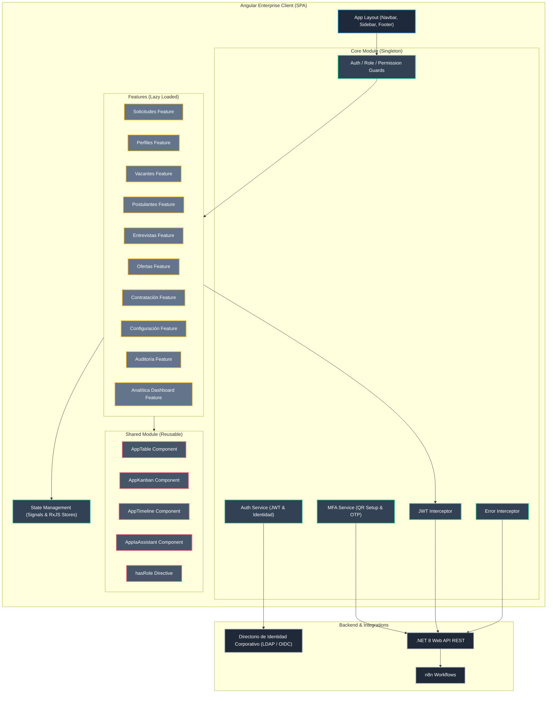

# Especificación de Arquitectura Frontend: Angular Enterprise
## Proyecto: Sistema Inteligente de Reclutamiento (SIR) - Nacional Seguros

Este documento define la arquitectura técnica formal para el desarrollo del frontend del **Sistema Inteligente de Reclutamiento (SIR)** de **Nacional Seguros**. Está diseñado bajo estándares corporativos rigurosos, utilizando **Angular 20+**, **TypeScript**, **Standalone Components**, **Angular Material**, **Signals** para manejo de estado local y **RxJS** para reactividad basada en flujos asíncronos. Es compatible al 100% con la arquitectura de backend de .NET 8 aprobada.

---

## 1. Diagrama de Arquitectura Frontend

El siguiente diagrama detalla la arquitectura modular y el flujo unidireccional de comunicación del frontend con los servicios del backend:



---

## 2. Estructura de Carpetas del Proyecto

El código fuente del proyecto se organiza bajo una arquitectura modular limpia utilizando componentes Standalone para facilitar la escalabilidad:

```text
src/
├── app/
│   ├── app.config.ts          # Configuración global de providers (Routes, HTTP Client, Animations, Proveedor de Autenticación)
│   ├── app.routes.ts          # Definición de enrutamiento raíz
│   ├── app.component.ts       # Componente raíz del cliente
│   │
│   ├── core/                  # Singleton Services y utilidades transversales (No duplicables)
│   │   ├── auth/              # Lógica de login y Directorio de Identidad
│   │   │   ├── auth.service.ts
│   │   │   └── auth-provider.config.ts
│   │   ├── guards/            # Guardianes de seguridad
│   │   │   ├── auth.guard.ts
│   │   │   ├── role.guard.ts
│   │   │   └── permission.guard.ts
│   │   ├── interceptors/      # Interceptores HTTP
│   │   │   ├── jwt.interceptor.ts
│   │   │   ├── error.interceptor.ts
│   │   │   └── correlation.interceptor.ts
│   │   └── services/          # Servicios transversales
│   │       ├── mfa.service.ts
│   │       ├── notification.service.ts
│   │       └── theme.service.ts
│   │
│   ├── shared/                # Directivas, componentes, pipes y modelos reutilizables
│   │   ├── components/        # Componentes UI reutilizables
│   │   │   ├── table/         # Tabla de datos (AppTable)
│   │   │   ├── kanban/        # Tablero de drag and drop (AppKanban)
│   │   │   ├── timeline/      # Historial de cambios de estado (AppTimeline)
│   │   │   └── ia-assistant/  # Panel de Copilot de IA (AppIaAssistant)
│   │   ├── directives/        # Directivas personalizadas
│   │   │   └── has-role.directive.ts
│   │   ├── pipes/             # Convertidores de tubería
│   │   │   ├── safe-html.pipe.ts
│   │   │   └── money-censor.pipe.ts
│   │   └── models/            # Interfaces de dominio y tipos de datos TypeScript
│   │       ├── usuario.model.ts
│   │       ├── solicitud.model.ts
│   │       ├── vacante.model.ts
│   │       └── kpi.model.ts
│   │
│   ├── state/                 # Stores globales para gestión de estado con Angular Signals
│   │   ├── user.store.ts      # Datos del usuario conectado
│   │   ├── sla.store.ts       # Alertas y notificaciones de SLAs activos
│   │   └── ui.store.ts        # Configuración del tema visual y barra lateral
│   │
│   ├── layouts/               # Contenedores visuales principales (Estructura de la aplicación)
│   │   ├── main-layout/       # Layout una vez logueado
│   │   └── auth-layout/       # Layout para pantallas de inicio de sesión y MFA
│   │
│   └── features/              # Características funcionales (Lazy Loaded)
│       ├── auth/              # Login, MFA Setup, MFA Verify, Recovery, Reset
│       ├── solicitudes/       # Registro y aprobación de solicitudes
│       ├── perfiles/          # Gestión de profesiogramas sugeridos por la IA
│       ├── vacantes/          # Apertura, publicación y cierre de puestos
│       ├── postulantes/       # Registro de CVs y Kanban del pipeline
│       ├── entrevistas/       # Agenda y programación de citas
│       ├── ofertas/           # Emisión y tracking de ofertas salariales
│       ├── contratacion/      # Cierre administrativo e incorporación
│       ├── configuracion/     # Gestión de catálogos maestros y feriados
│       ├── auditoria/         # Visualización de bitácoras del sistema
│       └── analitica/         # Dashboards ejecutivos y de SLAs
│
├── assets/                    # Archivos estáticos (imágenes, logos, tipografías)
└── environments/              # Variables de entorno
    ├── environment.ts         # Producción
    └── environment.development.ts # Desarrollo
```

---

## 3. Catálogo de Módulos Funcionales

El frontend cuenta con 10 módulos funcionales que encapsulan los casos de uso descritos en el PRD:

1. **Módulo de Solicitudes:** Gestión de requerimientos de contratación por área. Soporta listados, filtros de departamento, vistas de consistencia arrojadas por la IA, flujos de aprobación y rechazo directo, y línea de tiempo transaccional.
2. **Módulo de Perfiles:** Edición manual e interactiva de profesiogramas sugeridos de forma asíncrona por el agente de perfilación.
3. **Módulo de Vacantes:** Apertura formal de procesos selectivos, configuración de bandas salariales enmascaradas, publicación en LinkedIn y cierre o cancelación por parte del reclutador.
4. **Módulo de Postulantes:** Registro automático de currículums, Kanban del pipeline de candidatos clasificados por idoneidad de la IA y acceso al expediente consolidado.
5. **Módulo de Entrevistas:** Calendario compartido que bloquea espacios corporativos de calendario mediante API, permite coordinar citas asíncronas con candidatos y visualizar el estado de confirmaciones en tiempo real.
6. **Módulo de Ofertas:** Generación de la carta oferta económica del candidato en terna final, aprobación interna y tracking digital del estado (enviada, aceptada, expirada).
7. **Módulo de Contratación:** Registro del cierre administrativo del pipeline, derivando la información del ingresante hacia el sistema de nómina (ERP).
8. **Módulo de Configuración:** Parametrización de pesos de scoring de IA, plantillas de correo y la carga física del calendario inmutable de la tabla `Feriado` para el cálculo de SLAs.
9. **Módulo de Auditoría:** Consola dedicada a la revisión de trazas de `AuditLogs` cifradas, historial de estados y registro detallado de llamadas a LLMs (`AgentExecution`).
10. **Módulo de Analítica:** Suite visual para directores y gerencias que consolida KPIs, SLA Heatmaps y monitoreo financiero de tokens de IA.

---

## 4. Catálogo de Componentes de UI

### 4.1 Componentes Compartidos (Shared Components)
* **`AppTableComponent` (`<app-table>`):**
  - Implementa `MatTableDataSource` de Angular Material.
  - Ofrece paginación reactiva mediante inputs de configuración, filtros de texto por columna y ordenamiento nativo (`matSort`).
  - Botón integrado para exportación en CSV/Excel formateado.
* **`AppKanbanComponent` (`<app-kanban>`):**
  - Implementa drag-and-drop utilizando `@angular/cdk/drag-drop`.
  - Agrupa ítems en columnas dinámicas basadas en los estados del dominio.
  - Permite configurar restricciones en las transiciones (ej: impedir mover candidatos si no cumplen validaciones de negocio).
  - Incluye semaforización visual de tiempos mediante barras de progreso y colores.
* **`AppTimelineComponent` (`<app-timeline>`):**
  - Muestra una lista secuencial vertical que expone los cambios históricos de una entidad (`StateHistory`).
  - Indica la fecha, hora, responsable y justificación textual de cada transición de estado.
* **`AppIaAssistantComponent` (`<app-ia-assistant>`):**
  - Panel flotante o tarjeta de asistencia de copiloto.
  - Renderiza las sugerencias de la IA con botones explícitos de interacción humana (Aprobar, Editar en campo de texto enriquecido, Rechazar).
  - Incluye tooltip y badges de explicabilidad ("¿Cómo determinó la IA este resultado?").

### 4.2 Componentes de Layouts y Estructura
* **`MainLayoutComponent`:** Grid de estructura principal que inyecta la barra lateral (`SidebarComponent`), el encabezado con notificaciones (`HeaderComponent`) y la vista activa mediante `<router-outlet>`.
* **`AuthLayoutComponent`:** Vista limpia y centrada, libre de barras de navegación, diseñada exclusivamente para procesos de autenticación y enrolamiento.

---

## 5. Catálogo de Servicios del Frontend

* **`AuthService` (`core/auth/auth.service.ts`):**
  - Gestiona la autenticación híbrida: local (`POST /auth/login`) y corporativa mediante el flujo del proveedor de identidad corporativo (`POST /auth/external`).
  - Emite, valida y refresca tokens de sesión JWT de manera transparente.
  - Invalida la sesión actual en sessionStorage y notifica al `UserStore`.
* **`MfaService` (`core/services/mfa.service.ts`):**
  - Gestiona el enrolamiento inicial del doble factor de autenticación consumiendo `GET /api/v1/auth/mfa/setup`. Devuelve la URI del secreto y la representación QR en Base64.
  - Valida códigos OTP temporales consumiendo `POST /api/v1/auth/mfa/verify`.
* **`SlaStoreService` (`state/sla.store.ts`):**
  - Servicio que expone señales reactivas con el estado de alertas de SLA.
  - Ejecuta consultas periódicas asíncronas para actualizar la cantidad de solicitudes próximas a vencer en el dashboard de reclutamiento.
* **`IntegrationApiService` (`shared/services/integration-api.service.ts`):**
  - Envoltura genérica del `HttpClient` de Angular.
  - Adjunta de forma centralizada la cabecera `X-Correlation-ID` en cada llamada externa y realiza el mapeo directo a DTOs de TypeScript.

---

## 6. Catálogo de Modelos (TypeScript Interfaces)

Mapean exactamente las firmas y estructuras del backend de .NET 8 y base de datos SQL Server:

```typescript
// src/app/shared/models/usuario.model.ts
export interface Usuario {
  usuarioId: number;
  nombre: string;
  correo: string;
  tipoAutenticacion: 'Local' | 'ActiveDirectory';
  estado: 'Activo' | 'Inactivo';
  mfaHabilitado: boolean;
  roles: string[];
  permisos: string[];
}

// src/app/shared/models/solicitud.model.ts
export interface Solicitud {
  solicitudId: number;
  cargo: string;
  area: string;
  solicitanteId: number;
  decisorId?: number;
  prioridad: 'Baja' | 'Media' | 'Alta' | 'Critica';
  estadoId: number;
  estadoNombre: string;
  fechaCreacion: string;
  fechaIdeal: string;
  funciones: string;
  skills: string;
}

// src/app/shared/models/feriado.model.ts
export interface Feriado {
  feriadoId: number;
  fecha: string; // Formato YYYY-MM-DD
  descripcion: string;
  esRecurrente: boolean;
}

// src/app/shared/models/sla.model.ts
export interface SLAExecution {
  slaExecutionId: number;
  slaId: number;
  entidad: 'Solicitud' | 'Vacante' | 'Postulante';
  entidadId: number;
  fechaInicio: string;
  fechaLimite: string;
  fechaFin?: string;
  cumplido?: boolean;
  correlationId: string;
  porcentajeTranscurrido: number; // Calculado en backend
}
```

---

## 7. Matriz Ruta ──> Pantalla

Todas las rutas utilizan carga perezosa (`loadComponent`) para optimizar el rendimiento de la aplicación descargando componentes solo cuando son accedidos:

| Ruta | Layout | Componente Features | Guardia de Acceso | Propósito |
| :--- | :--- | :--- | :--- | :--- |
| `/login` | `AuthLayout` | `LoginComponent` | Ninguna | Pantalla de ingreso de credenciales. |
| `/auth/mfa-setup`| `AuthLayout` | `MfaSetupComponent` | `AuthGuard` | Enrolamiento y generación de QR Code para aplicación de autenticación corporativa. |
| `/auth/mfa-verify`| `AuthLayout`| `MfaVerifyComponent`| `AuthGuard` | Validación del código OTP de 6 dígitos. |
| `/dashboard` | `MainLayout` | `DashboardComponent` | `AuthGuard` | Inicio dinámico con widgets según el rol del usuario. |
| `/solicitudes` | `MainLayout` | `SolicitudListComponent` | `AuthGuard`, `RoleGuard` | Gestión y Kanban del estado de solicitudes. |
| `/perfiles` | `MainLayout` | `PerfilDetailComponent` | `AuthGuard`, `RoleGuard` | Edición y aprobación de profesiogramas de cargo. |
| `/vacantes` | `MainLayout` | `VacanteListComponent` | `AuthGuard`, `RoleGuard` | Gestión de vacantes y bandas salariales. |
| `/postulantes` | `MainLayout` | `PipelineKanbanComponent`| `AuthGuard`, `RoleGuard` | Pipeline de reclutamiento (Drag & Drop). |
| `/agenda` | `MainLayout` | `AgendaCalendarComponent`| `AuthGuard`, `RoleGuard` | Calendario de entrevistas integrado a Outlook. |
| `/ofertas` | `MainLayout` | `OfertaListComponent` | `AuthGuard`, `RoleGuard` | Emisión y control de cartas de oferta. |
| `/configuracion` | `MainLayout` | `ConfiguracionComponent`| `AuthGuard`, `RoleGuard` | Carga de feriados y ponderación de pesos de IA. |
| `/auditoria` | `MainLayout` | `AuditoriaLogsComponent`| `AuthGuard`, `RoleGuard` | Panel de trazabilidad e inmutabilidad de logs. |

---

## 8. Matriz Rol ──> Pantalla y Permisos

El sistema aplica un control estricto de accesibilidad basado en los roles locales cargados desde el token JWT:

| Pantalla / Ruta | Administrador | RRHH | Reclutador | Decisor (Gerente) | Auditor | Permisos Requeridos (Claims) |
| :--- | :---: | :---: | :---: | :---: | :---: | :--- |
| **Inicio / Dashboard** | ✔ | ✔ | ✔ | ✔ | ✔ | Ninguno |
| **Solicitudes (Borrador)**| ✔ | ✔ | ❌ | ✔ | ❌ | `solicitudes.crear` |
| **Solicitudes (Aprobar)** | ✔ | ❌ | ❌ | ✔ | ❌ | `solicitudes.aprobar` |
| **Perfiles (Revisión)** | ✔ | ✔ | ❌ | ❌ | ❌ | `perfiles.editar` |
| **Vacantes (Apertura)** | ✔ | ✔ | ✔ | ❌ | ❌ | `vacantes.crear` |
| **Postulantes (Pipeline)**| ✔ | ✔ | ✔ | ❌ | ❌ | `postulantes.ver_pipeline` |
| **Postulantes (Salario)** | ✔ | ✔ | ❌ | ❌ | ❌ | `postulantes.ver_salario` |
| **Agenda (Calendario)** | ✔ | ✔ | ✔ | ❌ | ❌ | `agenda.agendar` |
| **Ofertas (Generar)** | ✔ | ✔ | ❌ | ❌ | ❌ | `ofertas.crear` |
| **Configuración (Pesos)** | ✔ | ✔ | ❌ | ❌ | ❌ | `configuracion.pesos` |
| **Configuración (Feriado)**| ✔ | ❌ | ❌ | ❌ | ❌ | `configuracion.feriados` |
| **Auditoría (Logs)** | ✔ | ❌ | ❌ | ❌ | ✔ | `auditoria.ver_logs` |

---

## 9. Estrategia de Gestión de Estado (State Management)

El frontend de Angular SIR utiliza un esquema híbrido y reactivo que optimiza el ciclo de vida del renderizado de componentes combinando **Angular Signals** y **RxJS**:

```
┌─────────────────────────────────────────────────────────────────┐
│                    ESTADO DEL FRONTEND (SIR)                    │
├────────────────────────────────┬────────────────────────────────┤
│  1. Angular Signals (Síncrono) │  2. RxJS Observables (Asínc.)  │
│  - Usuario Conectado (User)    │  - Peticiones HTTP (HttpClient)│
│  - Configuración de UI         │  - WebSocket (Notificaciones)  │
│  - Filtros y Paginación Activa │  - Flujo de Tiempo Real        │
└────────────────────────────────┴────────────────────────────────┘
```

### 9.1 Angular Signals (Estado Síncrono Local)
Se emplea para variables y estados de la UI que cambian de forma interactiva e inmediata:
* **`userStore`:** Guarda el perfil del usuario activo (`currentUser = signal<Usuario | null>(null)`), sus roles y permisos para ser consultados por guards y directivas.
* **`uiStore`:** Administra el estado de colapso de la barra lateral y el tema activo (Light/Dark Mode).
* **`activeVacante`:** Señal que almacena los detalles de la vacante seleccionada en la vista principal para inyectar su identificador a componentes dependientes.

### 9.2 RxJS (Estado Asíncrono y Flujos de Eventos)
Se utiliza para la comunicación asíncrona, encolamientos de peticiones HTTP, manejo de reintentos con retrasos exponenciales y streams de datos reactivos:
* **`SlaAlertStream$`:** Flujo basado en un `BehaviorSubject` que se actualiza periódicamente para emitir las alertas de SLAs pendientes.
* **`WebSocketNotification$`:** Canal de comunicación persistente (SignalR o WebSockets estándar) que empuja notificaciones en tiempo real al frontend cuando un callback de IA o una respuesta de WhatsApp modifica una entidad en el backend.

---

## 10. Estrategia de Seguridad Frontend

### 10.1 Almacenamiento Seguro de JWT (Anti-XSS/CSRF)
Para evitar ataques de cross-site scripting (XSS), el token de acceso JWT y el Refresh Token se almacenan estrictamente en la **`sessionStorage`** del navegador, garantizando que el token sea destruido de forma automática al cerrar la pestaña o la ventana del navegador. Queda terminantemente prohibido almacenar tokens en `localStorage`.

### 10.2 Rotación de Refresh Tokens (RTR) en el Frontend
* **Interceptor de Renovación:** El `JwtInterceptor` monitorea el tiempo de expiración del JWT de acceso.
* **Lanzamiento Asíncrono:** Cuando al token le restan menos de 2 minutos de validez, el interceptor suspende temporalmente las peticiones salientes y dispara un llamado asíncrono a `/api/v1/auth/refresh` enviando el Refresh Token activo.
* **Actualización e Invalidación:** Tras recibir el nuevo par de tokens del backend, actualiza la `sessionStorage` y reanuda las llamadas encoladas. Si la llamada de refresco falla debido a una sospecha de reuso detectada por el backend (Replay Attack), el interceptor borra inmediatamente la sesión local y redirige al usuario a `/login` con un mensaje de alerta.

### 10.3 Flujo de Doble Factor de Autenticación (MFA)
El sistema SIR implementa un flujo de control de acceso de doble factor obligatorio en el login:

```
[Usuario + Clave] ──> [Auth Exitoso] ──> [¿MFA Habilitado?] 
                                               │
               ┌───────────────────────────────┴───────────────────────────────┐
               ▼ (Sí)                                                          ▼ (No)
[MFA Verify (Ingresar OTP)]                                          [MFA Setup (Render QR)]
               │                                                               │
               ▼ (Código Válido)                                               ▼ (OTP Correcto)
[Emitir JWT final y redirección]                                     [Habilitar MFA y Redirección]
```

1. **Setup de MFA (QR Code):**
   * Tras la primera autenticación local exitosa de un usuario, si la entidad tiene `MfaHabilitado = false`, el frontend redirige a la ruta `/auth/mfa-setup`.
   * El servicio `MfaService` consume el endpoint `/api/v1/auth/mfa/setup` inyectando el token temporal provisto por el backend.
   * El backend retorna una cadena Base64 que representa la imagen del código QR que contiene el secreto OTP.
   * El componente `MfaSetupComponent` renderiza la imagen sin almacenar el secreto en ninguna variable local persistente del navegador.
   * El usuario escanea el código QR con su aplicación autenticadora (ej. aplicación autenticadora corporativa) e ingresa el primer código de verificación de 6 dígitos para asociar y habilitar su cuenta.
2. **Verificación de MFA:**
   * En inicios de sesión posteriores, si el usuario tiene `mfaHabilitado = true`, el flujo de login redirige temporalmente a `/auth/mfa-verify`.
   * El usuario ingresa el código OTP temporal y el frontend consume `POST /api/v1/auth/mfa/verify`.
   * Tras la verificación exitosa en el backend, se emite el JWT y Refresh Token finales y se redirige a `/dashboard`.

---

## 11. Kanban de Reclutamiento y Semaforización de SLAs

El Tablero Kanban del módulo de postulantes utiliza componentes interactivos y dinámicos para guiar al reclutador en el avance del pipeline operativo:

### 11.1 Drag & Drop e Invariantes del Pipeline
* **CDK Drag & Drop:** Los candidatos (`Postulantes`) se representan como tarjetas interactivas que pueden arrastrarse entre columnas (ej: *Captado* ──> *Evaluación Curricular* ──> *Entrevista* ──> *Terna Final* ──> *Oferta*).
* **Bloqueo Transaccional:** Cada movimiento del mouse dispara una validación local en el frontend antes de enviar el callback de actualización de estado al backend:
  - Se prohibe mover un postulante a *Terna Final* si sus notas de entrevista no han sido guardadas.
  - Se bloquea el movimiento a *Oferta* si la vacante no tiene una banda salarial aprobada.
  - Si la validación falla, la tarjeta regresa automáticamente a su columna de origen y se muestra una notificación toast de advertencia.

### 11.2 Semaforización SLA (SLA Heatmap Visual)
Cada tarjeta de postulante o vacante activa renderiza una barra de semaforización de tiempo basada en los datos devueltos en `SLAExecution`:
* 🟢 **Verde (Bajo):** Consumido $< 50\%$ del tiempo máximo asignado al estado actual.
* 🟡 **Amarillo (Medio / Advertencia):** Consumido entre $50\%$ y $80\%$ del tiempo del SLA.
* 🟠 **Naranja (Alto / Vencimiento Próximo):** Consumido entre $80\%$ y $100\%$ del SLA.
* 🔴 **Rojo (Crítico / Incumplimiento):** Tiempo transcurrido $\ge 100\%$ del SLA asignado. La tarjeta parpadea levemente en el dashboard de reclutamiento y habilita el botón de escalamiento manual si el rol es supervisor.

---

## 12. Dashboard de Monitoreo de SLAs

La pantalla de monitoreo de SLAs en el módulo de analítica presenta widgets avanzados para visualizar desvíos temporales en la operación de Nacional Seguros:

* **SLA Heatmap:** Matriz bidimensional que cruza las áreas operativas (ej. TI, Finanzas, Comercial) contra las etapas del pipeline, pintando con celdas de calor (de verde a rojo oscuro) el tiempo promedio de retraso por intersección.
* **Gráfico de Líneas de Cumplimiento:** Muestra la evolución semanal de la métrica `MET-OPS-01` (Porcentaje de cumplimiento de SLAs) respecto al umbral objetivo del $90\%$.
* **Lista de Escalamientos Activos:** Panel que resalta los procesos que han superado el $120\%$ de su tiempo límite y detalla el flujo de escalamiento (ej. *"Asignación transferida automáticamente de Analista RRHH a Jefe de Reclutamiento"*).

---

## 13. Integración de APIs y Manejo de Errores

* **Client DTO Mapping:** Se implementan interfaces estrictas de TypeScript para los requests y responses. El servicio mapea las firmas en formato camelCase (estándar de Angular) a PascalCase si el backend lo requiere, aunque se asume configuración camelCase nativa del backend en `Program.cs`.
* **Interceptador global de errores (`ErrorInterceptor`):**
  - Captura fallos HTTP de red y respuestas con código 4xx/5xx del servidor.
  - Oculta de inmediato mensajes técnicos internos en producción para el usuario, traduciéndolos a notificaciones legibles en base al código de error de negocio (ej: `CIRCULAR_DEPENDENCY_DETECTED` $\rightarrow$ *"Se detectó una dependencia circular en la jerarquía del catálogo. Operación cancelada."*).
  - Propaga el `X-Correlation-ID` en el modal de alerta de error para facilitar el reporte del usuario al soporte técnico L1/L2.
* **Estrategia de Reintentos:** Para llamadas fallidas fallas de timeout o pérdida temporal de señal, el servicio HTTP de Angular reintenta de forma automática la llamada 3 veces con una separación de 2 segundos antes de propagar el error.

---

## 14. Observabilidad y Trazabilidad en el Cliente

* **CorrelationId Tracking:** El interceptor de correlación captura la cabecera `X-Correlation-ID` si existe, o genera un UUID de seguimiento en el frontend en cada petición saliente. Este ID se inyecta en todas las trazas de log locales y en las peticiones HTTP para asegurar la trazabilidad del flujo de principio a fin.
* **Frontend Log Redirection:** En desarrollo, los logs del sistema imprimen detalles de flujos y estados en la consola del navegador. En producción, el servicio de logging intercepta llamadas a `console.log` o `console.error` de depuración y las suprime, permitiendo únicamente el envío estructurado de trazas críticas al servidor de auditoría del cliente.

---

## 15. UX/UI: Layout y Accesibilidad

* **Responsive Design:** Diseñado bajo principios de Mobile-First. Las pantallas colapsan a una sola columna en pantallas pequeñas y colapsan la barra de navegación lateral en un menú hamburguesa desplegable.
* **Accessibility WCAG 2.1 AA:**
  - Contraste de colores certificado para cumplir con el estándar AA en modos Light y Dark.
  - Etiquetas descriptivas `aria-label` en todos los controles de formularios, botones interactivos y widgets de analítica.
  - Navegación completa habilitada mediante teclado en el Kanban y formularios de creación.
* **Soporte de Tema Visual (Light / Dark Mode):** Basado en clases de estilos del sistema cargadas de forma reactiva en el body (`dark-theme` / `light-theme`) administradas desde el `uiStore`.

---

## 16. Riesgos Técnicos y Mitigaciones (Frontend)

| ID | Riesgo Detectado | Severidad | Impacto | Control y Mitigación Propuesta |
| :---: | :--- | :---: | :--- | :--- |
| **R-FE-01** | **Exposición de Tokens en Consola (Fugas)** | 🔴 Alto | Robo de credenciales por inspección de logs físicos del navegador. | Suprimir logs de consola en entornos productivos y sanitizar payloads antes de la impresión en desarrollo. |
| **R-FE-02** | **XSS por Almacenamiento en LocalStorage** | 🟠 Medio | Robo de sesión mediante scripts de inyección maliciosa en el navegador. | Forzar el uso exclusivo de `sessionStorage` para guardar tokens de sesión temporales. |
| **R-FE-03** | **Degradación por Renderizado de Kanban Grande** | 🟠 Medio | Lentitud de interfaz y bloqueos al cargar postulantes masivos en el drag and drop. | Implementar scroll infinito en las columnas de postulantes del Kanban utilizando virtual scroll de Angular Material. |
| **R-FE-04** | **Pérdida de Correlación en Refresh Token** | 🟡 Bajo | Interrupción de la traza de observabilidad en las peticiones de refresco automáticas. | Inyectar de manera obligatoria el `X-Correlation-ID` activo en el interceptor de refresco. |

---

## 17. Recomendaciones de Implementación

1. **Uso de Virtual Scroll en Listados y Kanban:** Para garantizar un alto rendimiento en la carga masiva de postulantes y logs de auditoría en el frontend, se recomienda implementar `CdkVirtualScrollViewport` en lugar de iteradores estándar en tablas extensas.
2. **Validación de Peso Total en Local antes del Envío:** Garantizar que los formularios de ponderación impidan llamadas HTTP si la validación de suma 100% no se cumple localmente en el componente de Angular.
3. **Auditoría de Accesibilidad Continua:** Utilizar herramientas SAST de accesibilidad (ej. Axe-core o ESLint plugin para Angular template accessibility) en el pipeline de CI/CD para impedir la aprobación de componentes que violen las directrices WCAG 2.1.
