# Especificación de Arquitectura de Workflows n8n Enterprise
## Proyecto: Sistema Inteligente de Reclutamiento (SIR) - Nacional Seguros

Este documento define la arquitectura técnica formal para la orquestación y automatización de procesos utilizando **n8n Enterprise** como motor central. Esta arquitectura está integrada al 100% con la API de backend de .NET 8, la base de datos SQL Server 2022 y las políticas de seguridad y observabilidad de Nacional Seguros.

---

## 1. Diagrama Maestro de Workflows n8n

El siguiente diagrama ilustra la arquitectura de integración y el flujo transaccional entre el core en .NET 8, el motor de n8n, el proveedor de IA y los proveedores de servicios externos:

```mermaid
graph TD
    classDef dotnet fill:#1E293B,stroke:#38BDF8,stroke-width:2px,color:#fff;
    classDef n8n fill:#334155,stroke:#34D399,stroke-width:2px,color:#fff;
    classDef vertex fill:#475569,stroke:#FB7185,stroke-width:2px,color:#fff;
    classDef ext fill:#1F2937,stroke:#9CA3AF,stroke-width:2px,color:#fff;

    subgraph Core_Backend [".NET 8 Web API & SQL Server"]
        API["API Rest (Controllers & Handlers)"]:::dotnet
        DB["SQL Server 2022 (SIR_NacionalSeguros)"]:::dotnet
        Jwt["JWT & API Key Validator"]:::dotnet
    end

    subgraph n8n_Orchestrator ["n8n Enterprise Orchestrator"]
        WF_Main["Workflows Ejecutivos (WF-01 a WF-10)"]:::n8n
        WF_Err["WF-ERR-01: Global Error Handler"]:::n8n
        Cred["Cifrado de Credenciales (Credentials Manager)"]:::n8n
    end

    subgraph AI_Layer ["Proveedor de IA Configurable"]
        Vertex["API del Proveedor de IA (Servicios LLM)"]:::vertex
    end

    subgraph External_Providers ["External Services & APIs"]
        SMTP["Servidor SMTP Corporativo"]:::ext
        Graph["Microsoft Graph API (Outlook / Teams)"]:::ext
        Meta["Meta WhatsApp Business API"]:::ext
        LinkedIn["LinkedIn Talent Solutions API"]:::ext
    end

    %% Triggering flow (.NET to n8n)
    API -->|1. POST Webhook / X-Correlation-ID / X-API-Key| WF_Main
    
    %% n8n executing flow
    WF_Main -->|2. GET Prompts/active| API
    WF_Main -->|3. Invoke Prompt / Context| Vertex
    Vertex -->|4. Return structured JSON| WF_Main
    
    %% Integration execution
    WF_Main -->|OAuth 2.0 / SSL| SMTP
    WF_Main -->|OAuth 2.0| Graph
    WF_Main -->|Bearer Token| Meta
    WF_Main -->|API Key| LinkedIn
    
    %% Callback flow (n8n to .NET)
    WF_Main -->|5. POST Callback / CorrelationId / Telemetry| Jwt
    Jwt -->|6. Authorize & Persist| API
    API -->|7. Update State / Write AgentExecution| DB

    %% Error capturing
    WF_Main -->|On Failure| WF_Err
    WF_Err -->|8. POST Callback / ErrorLog| API
```



---

## 2. Catálogo Oficial de Workflows

### WF-01-ConsistenciaSolicitud (Módulo Solicitudes)
* **Propósito:** Evaluar y validar la viabilidad y coherencia de las solicitudes de personal cargadas por los decisores.
* **Trigger:** Evento de dominio `SolicitudEnviadaAprobacionEvent` (HTTP POST desde el backend al webhook).
* **Entradas:** `SolicitudId`, cargo, área, funciones y habilidades requeridas.
* **Procesamiento:** 
  1. Obtiene de la API .NET el prompt activo `PR_SOL_VALIDATE`.
  2. Llama al Agente de Solicitud (`AGE-01`) usando el modelo de lenguaje configurado (LLM).
  3. Evalúa si las funciones corresponden al cargo y si las habilidades requeridas son realistas.
* **Callback:** Envía el veredicto structured JSON a `POST /api/v1/solicitudes/callback/consistencia`.
* **Auditoría:** Inserta fila en `AgentExecution` detallando los tokens consumidos y duración del análisis.

### WF-02-GeneracionPerfil (Módulo Perfiles)
* **Propósito:** Generar el profesiograma (perfil de cargo) automatizado tras la aprobación formal de la solicitud.
* **Trigger:** Evento de dominio `SolicitudAprobadaEvent`.
* **Entradas:** `SolicitudId` y el JSON validado de la solicitud de personal.
* **Procesamiento:**
  1. Descarga el prompt activo `PR_PERF_BUILD`.
  2. Llama al Agente de Perfil (`AGE-02`) usando el modelo de lenguaje configurado (LLM).
  3. Estructura el profesiograma detallando habilidades técnicas obligatorias, competencias blandas, fit cultural sugerido y bandas de experiencia requeridas.
* **Callback:** Retorna a `POST /api/v1/perfiles/callback/generacion` guardando el perfil en estado `BORRADOR` para revisión manual.

### WF-03-PublicacionVacante (Módulo Vacantes)
* **Propósito:** Publicar automáticamente el puesto vacante aprobado en los portales corporativos y externos autorizados.
* **Trigger:** Transición de la vacante al estado `VAC-02 PUBLICADA`.
* **Entradas:** `VacanteId`, descripción del perfil de cargo aprobado, área y código de referencia.
* **Procesamiento:**
  1. Llama al Agente de Sourcing (`AGE-03`) usando el modelo de lenguaje configurado (LLM) para sugerir palabras clave (hashtags) y canales optimizados.
  2. Consume la API de LinkedIn Talent Solutions inyectando el anuncio con las credenciales cifradas de n8n.
* **Callback:** Reporta el éxito y enlaces de los anuncios a `POST /api/v1/vacantes/callback/publicacion`.

### WF-04-SourcingPostulantes (Módulo Sourcing)
* **Propósito:** Captar currículums de candidatos postulados y normalizar los datos curriculares en un formato JSON estándar.
* **Trigger:** Evento de entrada (petición HTTP POST entrante desde LinkedIn Easy Apply o carga manual del currículum PDF/Docx en el frontend).
* **Entradas:** Archivo adjunto del currículum vitae y datos de contacto iniciales.
* **Procesamiento:**
  1. Lee el archivo binario del currículum.
  2. Llama al modelo de lenguaje configurado (LLM) para extraer los datos de educación, experiencia laboral, habilidades informáticas y pretensión salarial.
  3. Anonimiza los datos de PII (nombres, contactos, direcciones) del payload que será enviado al matching.
* **Callback:** Envía los datos estructurados a `POST /api/v1/postulantes/registro` para crear el registro de postulante en la base de datos local.

### WF-05-MatchingCurricular (Módulo Postulantes)
* **Propósito:** Medir la adecuación semántica del currículum de un postulante frente al perfil de cargo de la vacante activa.
* **Trigger:** Postulante transita al estado `POST-01 CAPTADO` (CV cargado e indexado).
* **Entradas:** `PostulanteId`, `VacanteId` y el JSON estructurado y anonimizado del postulante.
* **Procesamiento:**
  1. Consume el prompt activo `PR_MAT_CV_PERFIL`.
  2. Invoca al Agente de Matching (`AGE-04`) usando el modelo de lenguaje configurado (LLM).
  3. Mide coincidencias y brechas, arrojando un reporte explicable en texto plano e identificando referencias textuales del currículum que respaldan la evaluación.
* **Callback:** Retorna los resultados del matching a `POST /api/v1/postulantes/callback/matching`.

### WF-06-ScoringExplicable (Módulo Postulantes)
* **Propósito:** Calcular una nota final de idoneidad ponderada en base a las reglas configuradas en el sistema.
* **Trigger:** Finalización exitosa del matching en el backend.
* **Entradas:** Resultados del matching y pesos de scoring activos de la tabla de configuraciones.
* **Procesamiento:**
  1. Llama al Agente de Scoring (`AGE-05`) usando el modelo de lenguaje configurado (LLM) con el prompt `PR_SCO_POSTULANTE`.
  2. Calcula los puntajes de adecuación técnica, experiencia profesional y adecuación cultural.
  3. Genera una justificación textual explicable detallando por qué el postulante obtuvo dicha puntuación.
* **Callback:** Envía las notas (que serán cifradas en BD con Always Encrypted) y justificaciones a `POST /api/v1/postulantes/callback/scoring`.

### WF-07-CoordinacionEntrevistas (Módulo Entrevistas)
* **Propósito:** Coordinar dinámicamente la programación y confirmación de entrevistas de forma interactiva con el postulante y entrevistador.
* **Trigger:** Transición del postulante al estado `POST-05 ENTREVISTA_PEND`.
* **Entradas:** `PostulanteId`, `VacanteId`, correos de los entrevistadores y disponibilidad de agenda inicial.
* **Procesamiento:**
  1. Invoca al Agente de Coordinación (`AGE-06`).
  2. Consume Microsoft Graph API para bloquear la agenda del entrevistador en Outlook y generar el enlace de Teams.
  3. Envía mensaje interactivo al candidato mediante WhatsApp Business API con las opciones de confirmación.
  4. Espera reactiva (Wait Node) por la confirmación del candidato (Webhook de entrada).
* **Callback:** Envía la fecha y estado confirmado a `POST /api/v1/entrevistas/callback/confirmacion`.

### WF-08-MonitoreoSLA (Módulo SLAs y Alertas)
* **Propósito:** Monitorear de forma recurrente (Cron job cada 1 hora) la tabla `SLAExecution` y disparar alertas progresivas o escalamientos operativos.
* **Trigger:** Programación de tiempo (n8n Cron Node).
* **Entradas:** Lista de SLAs activos en proceso (`SLAExecution` con `Cumplido = NULL`).
* **Procesamiento:**
  1. Consulta a la API de .NET 8 los registros de SLAs activos que han superado los umbrales de alerta (50%, 80%, 100%, 120%).
  2. Para alertas preventivas (50% y 80%), envía recordatorios automáticos por correo SMTP y notificaciones web al responsable.
  3. Para alertas críticas (100% y 120%), dispara flujos de escalamiento reasignando tareas al gerente del área por correo corporativo y alerta Teams.
* **Callback:** Reporta las alertas enviadas a `POST /api/v1/sla/callback/alerta` para actualizar el log histórico de notificaciones.

### WF-09-GestionOfertas (Módulo Ofertas)
* **Propósito:** Construir y enviar digitalmente la carta oferta de trabajo al candidato finalista seleccionado.
* **Trigger:** Aprobación interna del DTO de oferta por parte de la Gerencia de RRHH.
* **Entradas:** `PostulanteId`, banda salarial final sugerida, beneficios y términos de la contratación.
* **Procesamiento:**
  1. Inyecta los datos de la oferta en la plantilla oficial HTML correspondiente cargada desde el backend.
  2. Genera y envía un correo electrónico formal firmado digitalmente al candidato con un enlace único de respuesta.
  3. Implementa un nodo de espera (Wait Node) configurado a 48 horas hábiles.
* **Callback:** Envía la aceptación o rechazo a `POST /api/v1/ofertas/callback/respuesta`.

### WF-10-CierreContratacion (Módulo Contratación)
* **Propósito:** Consolidar el expediente de contratación tras la aceptación de la oferta e iniciar el proceso de incorporación de datos en el ERP.
* **Trigger:** Oferta transita al estado `OFE-04 ACEPTADA`.
* **Entradas:** Expediente completo del candidato, currículum, notas, ofertas firmadas y justificación del scoring.
* **Procesamiento:**
  1. Compila un reporte JSON consolidado anonimizando datos de telemetría e IA.
  2. Envía un correo SMTP a la Gerencia de RRHH indicando la disponibilidad del expediente y genera un ticket de integración seguro dirigido al sistema de nómina corporativo.
* **Callback:** Retorna a `POST /api/v1/contratacion/callback/cierre` para transitar el proceso a `CUBIERTA`.

---

## 3. Matriz Trigger ──> Workflow

Esta matriz detalla los eventos de negocio del backend y sistemas externos que inician la ejecución de los flujos de automatización:

| Evento de Negocio / Disparador | Sistema de Origen | Protocolo | Workflow n8n Invocado |
| :--- | :--- | :---: | :--- |
| Solicitud enviada a validación | Core .NET 8 (Domain Event) | HTTP POST Webhook | `WF-01-ConsistenciaSolicitud` |
| Solicitud aprobada formalmente | Core .NET 8 (Domain Event) | HTTP POST Webhook | `WF-02-GeneracionPerfil` |
| Apertura y aprobación de Vacante | Core .NET 8 (Domain Event) | HTTP POST Webhook | `WF-03-PublicacionVacante` |
| Postulación externa del candidato | LinkedIn Easy Apply API | HTTP POST (External) | `WF-04-SourcingPostulantes` |
| Carga de CV en el frontend | SPA Angular $\rightarrow$ API .NET | HTTP POST Webhook | `WF-04-SourcingPostulantes` |
| CV parseado y guardado en base de datos | Core .NET 8 (Domain Event) | HTTP POST Webhook | `WF-05-MatchingCurricular` |
| Matching de IA completado | Core .NET 8 (Domain Event) | HTTP POST Webhook | `WF-06-ScoringExplicable` |
| Postulante pasa a pendiente de entrevista| Core .NET 8 (Domain Event) | HTTP POST Webhook | `WF-07-CoordinacionEntrevistas` |
| Respuesta interactiva por WhatsApp | WhatsApp Webhook (Meta) | HTTP POST (External) | `WF-07-CoordinacionEntrevistas` |
| Ejecución periódica programada | Cron Job (n8n Engine) | Interno (Cron) | `WF-08-MonitoreoSLA` |
| Emisión de carta oferta aprobada | Core .NET 8 (Domain Event) | HTTP POST Webhook | `WF-09-GestionOfertas` |
| Respuesta del candidato al enlace de oferta| Navegador (Enlace único de Oferta) | HTTP POST Callback | `WF-09-GestionOfertas` |
| Oferta aceptada digitalmente | Core .NET 8 (Domain Event) | HTTP POST Webhook | `WF-10-CierreContratacion` |

---

## 4. Matriz Workflow ──> API (.NET 8 Callbacks)

Muestra los endpoints expuestos en la Web API de .NET 8 consumidos por n8n para retornar los resultados del procesamiento asíncrono:

| Workflow n8n | Endpoint de Destino (Callback API) | Método HTTP | Parámetros Clave Retornados |
| :--- | :--- | :---: | :--- |
| `WF-01-ConsistenciaSolicitud` | `/api/v1/solicitudes/callback/consistencia` | POST | `SolicitudId`, `EsConsistente`, `ObservacionesText` |
| `WF-02-GeneracionPerfil` | `/api/v1/perfiles/callback/generacion` | POST | `SolicitudId`, `PerfilCargoJson` |
| `WF-03-PublicacionVacante` | `/api/v1/vacantes/callback/publicacion` | POST | `VacanteId`, `PublicacionUrls`, `PublicadoOk` |
| `WF-04-SourcingPostulantes` | `/api/v1/postulantes/registro` | POST | `CvEstructuradoJson`, `DocumentoAdjuntoUrl` |
| `WF-05-MatchingCurricular` | `/api/v1/postulantes/callback/matching` | POST | `PostulanteId`, `VacanteId`, `ScoreCoincidencia`, `BrechasText` |
| `WF-06-ScoringExplicable` | `/api/v1/postulantes/callback/scoring` | POST | `PostulanteId`, `VacanteId`, `ScoreSkills`, `ScoreExperiencia`, `ScoreFinal`, `JustificacionText` |
| `WF-07-CoordinacionEntrevistas`| `/api/v1/entrevistas/callback/confirmacion` | POST | `EntrevistaId`, `FechaHoraConfirmada`, `EstadoConfirmacion` |
| `WF-08-MonitoreoSLA` | `/api/v1/sla/callback/alerta` | POST | `SLAExecutionId`, `AlertaNivelEnviada`, `FechaAlerta` |
| `WF-09-GestionOfertas` | `/api/v1/ofertas/callback/respuesta` | POST | `PostulanteId`, `OfertaId`, `Aceptada`, `JustificacionRechazo` |
| `WF-10-CierreContratacion` | `/api/v1/contratacion/callback/cierre` | POST | `PostulanteId`, `VacanteId`, `IntegradoErdOk` |
| `WF-ERR-01-GlobalErrorHandler` | `/api/v1/logs/callback/error` | POST | `CorrelationId`, `WorkflowName`, `FailedNode`, `ErrorMessage` |

---

## 5. Matriz Workflow ──> Agente de IA

Detalla qué agente de Inteligencia Artificial especializado es invocado y parametrizado por cada flujo de n8n:

| Workflow n8n | Agente de IA Invocado | Modelo LLM Asignado | Propósito del Procesamiento de IA |
| :--- | :--- | :--- | :--- |
| `WF-01-ConsistenciaSolicitud` | `AGE-01: AgenteSolicitud` | Modelo LLM Configurado | Analizar consistencia lógica y dependencias de la vacante. |
| `WF-02-GeneracionPerfil` | `AGE-02: AgentePerfil` | Modelo LLM Configurado | Diseñar la estructura del profesiograma adaptado al cargo. |
| `WF-03-PublicacionVacante` | `AGE-03: AgenteSourcing` | Modelo LLM Configurado | Optimizar la descripción del puesto y palabras clave para canales externos. |
| `WF-04-SourcingPostulantes` | `AGE-03: AgenteSourcing` | Modelo LLM Configurado | Parsear y normalizar CVs estructurando datos curriculares. |
| `WF-05-MatchingCurricular` | `AGE-04: AgenteMatching` | Modelo LLM Configurado | Evaluar y comparar afinidad del CV contra perfil de cargo. |
| `WF-06-ScoringExplicable` | `AGE-05: AgenteScoring` | Modelo LLM Configurado | Calcular calificaciones ponderadas y justificar la idoneidad. |
| `WF-07-CoordinacionEntrevistas`| `AGE-06: AgenteCoordinacion`| Modelo LLM Configurado | Gestionar diálogos para acordar y confirmar fechas de entrevistas. |
| `WF-10-CierreContratacion` | `AGE-07: AgenteAnalitico` | Modelo LLM Configurado | Consolidar la información del expediente para el onboarding. |

---

## 6. Matriz Workflow ──> Transición de Estados

Esta matriz detalla las modificaciones en la máquina de estados transaccionales de la base de datos SQL Server provocadas por las finalizaciones de los workflows:

| Workflow n8n | Entidad Modificada | Estado Inicial en DB | Estado Final Exitoso | Estado de Contingencia (Error) |
| :--- | :--- | :--- | :--- | :--- |
| `WF-01` | `Solicitud` | `SOL-02 ENVIADA` | `SOL-03 EN_REVISION` | `SOL-04 OBSERVADA` |
| `WF-02` | `PerfilCargo` | `PERF-01 BORRADOR` | `PERF-02 EN_REVISION` | `PERF-05 RECHAZADO` |
| `WF-03` | `Vacante` | `VAC-01 BORRADOR` | `VAC-02 PUBLICADA` | `VAC-01 BORRADOR` |
| `WF-04` | `Postulante` | — (Nuevo Registro) | `POST-01 CAPTADO` | — (Rechazo en Webhook) |
| `WF-05` | `Postulante` | `POST-01 CAPTADO` | `POST-02 EN_REVISION_CV`| `POST-09 DESCARTADO` |
| `WF-06` | `Postulante` | `POST-02 EN_REVISION_CV`| `POST-03 CV_APROBADO` | `POST-09 DESCARTADO` |
| `WF-07` | `Entrevista` | `ENT-01 AGENDADA` | `ENT-02 CONFIRMADA` | `ENT-06 CANCELADA` |
| `WF-09` | `Oferta` | `OFE-02 ENVIADA` | `OFE-04 ACEPTADA` | `OFE-05 RECHAZADA` |
| `WF-10` | `Vacante` | `VAC-03 EN_PROCESO` | `VAC-05 CUBIERTA` | `VAC-03 EN_PROCESO` |

---

## 7. Estrategia de Control de Errores y Fail-Safe

Para garantizar la estabilidad del sistema y la coherencia en la base de datos de Nacional Seguros, n8n implementa un flujo centralizado de gestión de errores:

```
[Error en Nodo de un Workflow]
               │
               ▼
[Redirección a Workflow de Error] ──> [WF-ERR-01-GlobalErrorHandler]
                                                    │
               ┌────────────────────────────────────┴────────────────────────────────────┐
               ▼ (Paso 1)                                                                ▼ (Paso 2)
[Enviar Callback de Error a .NET 8]                                             [Notificar Alerta]
- Envía CorrelationId.                                                          - Enviar alerta a soporte
- Ejecuta Fail-Safe en DB.                                                      L2 mediante correo/Teams.
- Libera hilos del semáforo.
```

1. **Workflow de Error Centralizado (`WF-ERR-01-GlobalErrorHandler`):**
   - Configurado en n8n a través del nodo nativo **`Error Trigger`**.
   - Captura excepciones en tiempo de ejecución, fallos de red al invocar LLMs, timeouts de APIs externas y errores de parseo JSON.
   - Extrae los metadatos del fallo: nombre del workflow de origen, nodo que falló, mensaje del error técnico y el `X-Correlation-ID` activo.
2. **Callback de Falla a .NET 8 (Fail-Safe transaccional):**
   - El workflow de error consume el endpoint `POST /api/v1/logs/callback/error` enviando el `CorrelationId` y la traza del error.
   - **Acción Correctiva en Backend:** El backend de .NET 8 captura el callback de error, escribe en `ErrorLog` y ejecuta la lógica de transición segura de la máquina de estados (ej. si falla el scoring en `WF-06`, transita al postulante a `POST-09 DESCARTADO` con el motivo "Fallo en procesamiento de IA" para no dejar al candidato en un estado de procesamiento indefinido).
3. **Notificación de Soporte:**
   - Envía automáticamente una alerta estructurada de severidad alta al canal de soporte TI mediante correo electrónico SMTP o Teams con el CorrelationId para simplificar la depuración.

---

## 8. Estrategia de Reintentos (Resilience Engine)

n8n gestiona la resiliencia en la capa de integración de red para tolerar interrupciones temporales de servicios externos:

* **Reintento Exponencial con Jitter:**
  - Ante fallos de código HTTP 5xx, timeouts o caídas de sockets, las peticiones HTTP salientes de n8n hacia APIs externas (Microsoft Graph, WhatsApp Business, SMTP) reintentan la conexión automáticamente.
  - Configurado a **3 intentos** con un retraso exponencial:
    $$\text{Espera} = 2^{\text{intento}} \text{ minutos} + \text{jitter (segundos aleatorios)}$$
  - El jitter (variación de tiempo aleatoria) evita que múltiples reintentos simultáneos colapsen el firewall o las APIs de los proveedores.
* **Cola de Descarte (Dead Letter Queue - DLQ):**
  - Si los 3 reintentos automáticos fallan, el nodo transfiere la petición al workflow de errores `WF-ERR-01`.
  - El payload original, las cabeceras HTTP y el CorrelationId se persisten en la tabla `IntegrationLog` en estado `Fallido` marcados para reenvío, permitiendo al administrador TI reintentar la llamada de forma manual desde la consola de administración del frontend una vez solucionada la caída del servicio externo.

---

## 9. Estrategia de Observabilidad de IA y Telemetría

Para cumplir con las auditorías de costos de Inteligencia Artificial y no repudio, n8n captura y reporta de forma obligatoria los datos de telemetría de cada inferencia hacia la API de .NET 8 en el callback de éxito:

* **CorrelationId Extremo a Extremo:** Toda llamada a n8n incluye en la cabecera `X-Correlation-ID`. n8n propaga esta variable en las cabeceras de todas las llamadas HTTP salientes a LLMs y APIs externas, y la incluye en los logs de callback.
* **Telemetría de Tokens de IA:** El nodo de llamada al proveedor de IA en n8n extrae de la metadata de respuesta de la API del proveedor:
  - Modelo exacto del LLM ejecutado.
  - Conteo de tokens de entrada (`prompt_tokens`).
  - Conteo de tokens de salida (`completion_tokens`).
  - Duración exacta del procesamiento en el proveedor de IA (milisegundos).
* **Reporte y Persistencia:** El callback de retorno inyecta estos parámetros. El backend calcula el costo financiero exacto en USD en base a la tarifa del modelo parametrizada en base de datos y persiste los datos de forma inmutable en la tabla `AgentExecution` enlazados al `CorrelationId` de la transacción.

---

## 10. Riesgos Técnicos y Mitigaciones (Workflows)

| ID | Riesgo Detectado | Severidad | Impacto | Control y Mitigación Propuesta |
| :---: | :--- | :---: | :--- | :--- |
| **R-WF-01** | **Bloqueo de Hilos por Loops Infinitos (Deadlocks)** | 🔴 Alto | n8n no responde callbacks, dejando hilos consumiendo memoria en el backend. | Timeout estricto de 60 segundos en cada nodo HTTP de n8n; si se supera, el flujo se aborta y se desvía al DLQ. |
| **R-WF-02** | **Fuga de Secretos en Trazas de n8n** | 🔴 Alto | Claves de API y credenciales legibles en los logs históricos de ejecución de n8n. | Utilizar exclusivamente el Credentials Manager de n8n. Deshabilitar el almacenamiento de logs detallados de payloads en n8n para producción. |
| **R-WF-03** | **Duplicación de Transiciones en Base de Datos** | 🟠 Medio | Reintentos de red de n8n provocan múltiples callbacks de éxito, rompiendo la integridad de estados. | El backend inyecta `IdempotencyFilter` basado en la capa de caché distribuida, rechazando peticiones repetidas con el mismo CorrelationId. |
| **R-WF-04** | **Saturación de Conexión HTTP (Socket Exhaustion)** | 🟠 Medio | Caída del servicio web de n8n ante ráfagas concurrentes de postulaciones en LinkedIn. | Configurar el backend con `SemaphoreSlim` limitando a 10 llamadas concurrentes y middleware de Token Bucket a 50 req/min. |

---

## 11. Recomendaciones de Implementación

1. **Uso de Ambiente de n8n Aislado para Pruebas (n8n QA Instance):** Contar con dos instancias físicas de n8n (Desarrollo/QA y Producción). Las modificaciones en workflows, prompts o credenciales deben certificarse en la instancia de desarrollo antes de importar el JSON al entorno productivo.
2. **Inyección de Prompts por Referencia de Versión Activa:** Mantener la política inquebrantable de no tener texto de prompts hardcodeados en n8n. Si un prompt necesita cambiarse, se crea una nueva fila con versión superior en la base de datos SQL y se aprueba mediante el flujo de gobierno del sistema.
3. **Monitoreo de Uso de Memoria en el Servidor de n8n:** Dado que n8n almacena payloads en memoria durante ejecuciones extensas (ej. parseo de currículums pesados), se recomienda configurar el autoscaling del contenedor de n8n para escalar horizontalmente si el uso de memoria RAM supera el 80% durante 5 minutos.
4. **Configuración de Logs Inmutables en n8n:** Configurar la rotación y el envío automático de los logs de ejecución del contenedor de n8n hacia el Log Analytics corporativo o Grafana Loki para centralizar el diagnóstico técnico de la infraestructura.
