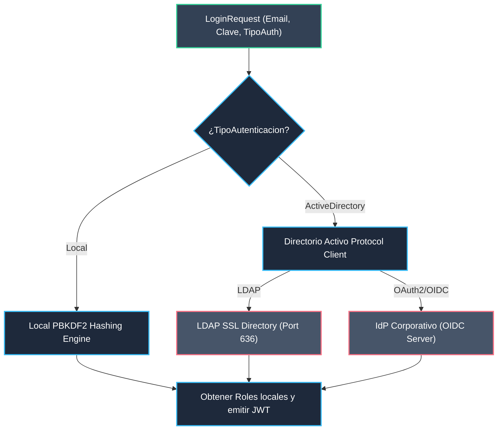
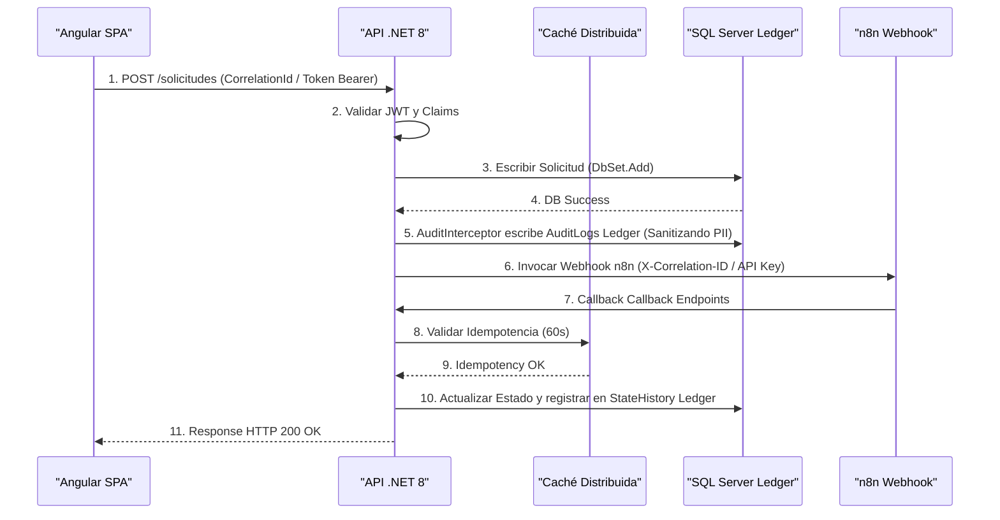
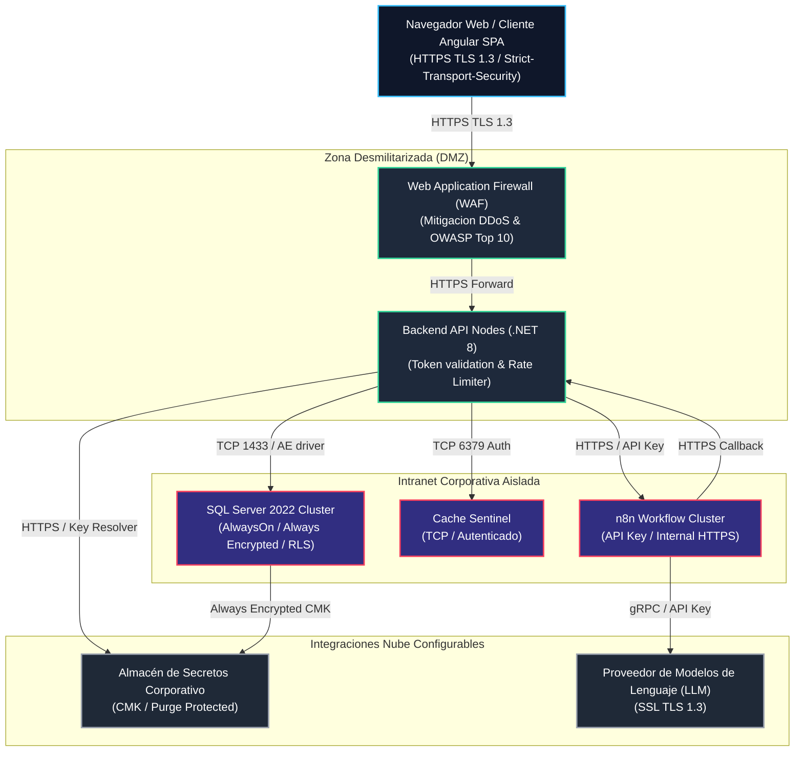

# Arquitectura de Seguridad (Enterprise Security Architecture - ESA)
## Proyecto: Sistema Inteligente de Reclutamiento (SIR) - Nacional Seguros

> **Versión:** 1.0.0 | **Estado:** APROBADO PARA AUDITORÍA  
> **Fecha:** 2026-06-26  
> **Autores:** Enterprise Security Architect, Solution Architect, Software Security Architect, Cloud Security Architect, Data Security Architect, Identity & Access Management Architect, DevSecOps Architect, Project Auditor  

---

## 1. Introducción

### 1.1 Objetivo
El propósito de este documento es definir la **Arquitectura de Seguridad Empresarial (ESA)** del **Sistema Inteligente de Reclutamiento (SIR)** para **Nacional Seguros**. Este documento detalla las políticas, mecanismos, tecnologías y controles criptográficos y de red implementados de forma transversal para salvaguardar la confidencialidad, integridad y disponibilidad del sistema y asegurar el cumplimiento de normativas locales e internacionales sobre protección de datos personales.

### 1.2 Alcance
El alcance contempla todos los contenedores y capas lógicas de la Fase 1:
*   **Identidad y Accesos:** Control híbrido de usuarios, JWT con firmas simétricas, MFA TOTP y políticas de RBAC granulares.
*   **Seguridad de Datos:** Cifrado en reposo mediante Always Encrypted en base de datos para salarios y calificaciones de IA, auditoría criptográfica Ledger inmutable, y seguridad lógica Row Level Security (RLS).
*   **Integración y APIs:** Comunicaciones TLS 1.3, Rate Limiting y validación de tokens de callbacks mediante filtros de idempotencia en la capa de caché distribuida.
*   **Gobernanza de IA:** Versionado físico inmutable de prompts en base de datos y logs de telemetría de inferencia de modelos de lenguaje.
*   **Infraestructura y DevSecOps:** Setup de entornos DEV, QA, UAT y PROD mediante inyección segura de secretos con el almacén de secretos corporativo.

### 1.3 Principios de Seguridad
La solución se rige bajo un marco de seguridad defensivo y proactivo, garantizando que el diseño técnico resista intentos de intrusión y fallos de manera controlada.

### 1.4 Supuestos
*   La red corporativa posee firewalls y controles de perímetro perimetral activos.
*   El aprovisionamiento de identidades corporativas en el servicio de directorio está centralizado por el área de infraestructura de Nacional Seguros.
*   El almacén de secretos corporativo se encuentra configurado con protección de purga en UAT/PROD.

### 1.5 Restricciones
*   Queda estrictamente prohibido persistir credenciales o secretos en texto plano dentro del código fuente o archivos de configuración locales.
*   Ninguna inferencia o descarte curricular por Inteligencia Artificial puede ejecutarse de manera autónoma sin una aprobación manual y confirmada por parte del usuario.

---

## 2. Principios de Seguridad

El diseño de seguridad del SIR se fundamenta en los siguientes pilares de arquitectura de seguridad de software:

*   **Zero Trust (Confianza Cero):** No se asume confianza por la ubicación de red del usuario. Cada solicitud entrante al backend debe validarse de forma explícita mediante un token JWT firmado y vigente, sin importar si proviene de la red interna corporativa o de la DMZ pública.
*   **Least Privilege (Mínimo Privilegio):** Los roles asignados a los usuarios poseen únicamente los permisos necesarios para realizar sus tareas de negocio diarias. Las acciones sobre catálogos o auditorías críticas quedan restringidas estrictamente a administradores y auditores certificados.
*   **Defense in Depth (Defensa en Profundidad):** Múltiples capas de protección protegen los datos corporativos. Si un atacante compromete la red del frontend, es bloqueado por la autenticación JWT en el backend; si compromete el backend, los datos salariales siguen cifrados mediante Always Encrypted y el log de auditoría está blindado en tablas Ledger.
*   **Secure by Design (Seguro por Diseño):** Los controles de seguridad, middlewares de sanitización SQL e interceptores de privacidad se diseñan como cimientos transversales del sistema desde la primera fase de desarrollo de código del backend.
*   **Privacy by Design (Privacidad por Diseño):** Los datos personales identificables (PII) son enmascarados de forma dinámica en los interceptores de Entity Framework Core antes de registrarse en bitácoras para garantizar que los auditores visualicen payloads anonimizados.
*   **Fail Secure (Fallo Seguro):** Ante excepciones del servidor o caídas de base de datos, el middleware global intercepta el error, oculta de inmediato las trazas del servidor SQL y el Connection String, responde un error genérico sanitizado y propaga únicamente el CorrelationId.
*   **Separation of Duties (Segregación de Funciones):** Roles diferenciados controlan el ciclo. La Gerencia de RRHH parametriza pesos de IA y aprueba ofertas; el Reclutador gestiona el pipeline; y el Auditor fiscaliza las bitácoras, impidiendo que un único usuario cree, apruebe y audite sus propios registros.

---

## 3. Arquitectura de Identidad

El SIR utiliza un modelo híbrido para validar la identidad de los usuarios operativos internos y externos de Nacional Seguros:



*   **Directorio Corporativo Híbrido:** Los usuarios internos corporativos se autentican utilizando su cuenta de red a través de LDAP sobre conexiones cifradas SSL (puerto 636) o mediante OIDC a través del proveedor de identidad corporativo.
*   **Autenticación Local:** Para consultores o evaluadores externos, el sistema valida las credenciales locales comparándolas contra la base de datos transaccional del SIR.
*   **Gestión y Aprovisionamiento en el Directorio:** Si un usuario inicia sesión correctamente a través del directorio corporativo pero no está registrado localmente, el backend autoprovisiona el registro local con `TipoAutenticacion = 'ActiveDirectory'`, `ClaveHash = NULL` (forzado por el Check Constraint físico en base de datos), su estado en `'Activo'`, y le asigna el rol mínimo `Reclutador`, escribiendo el log de auditoría `'AUTO_PROVISION_AD'`.
*   **Gestión de Sesiones:** El sistema mantiene el estado de sesión activa guardando un token temporal único `RefreshToken` en la tabla `Sesion`.

---

## 4. Autenticación

*   **Firma y Expiración de JWT:** Los tokens de acceso se emiten en formato JSON Web Token (JWT) utilizando el manejador moderno **`JsonWebTokenHandler`** de .NET. Tienen un tiempo de expiración estricto de **15 minutos** y se firman simétricamente utilizando un secreto criptográfico de al menos 256 bits resuelto desde el almacén de secretos corporativo.
*   **Refresh Token Rotation (RTR):** Los tokens de refresco son de un solo uso. Cuando el cliente consume el endpoint `/auth/refresh`, el backend emite un nuevo JWT y un nuevo Refresh Token, marcando el anterior como inactivo.
*   **Detección de Reuso:** Si se detecta una solicitud de refresco con un token que ya figura como consumido en la base de datos (sospecha de robo de sesión), el sistema activa una alerta crítica en los logs, marca **todas** las sesiones activas del usuario como inactivas (`Activa = 0`) para bloquear accesos, y retorna `HTTP 403 Forbidden` con el código `TOKEN_REUSE_DETECTED`.
*   **MFA TOTP de Dos Fases:** El setup del doble factor de autenticación TOTP (RFC 6238) exige una secuencia de dos fases: se genera el código QR inicial en Base64 pero el flag `MfaHabilitado` de la cuenta de usuario se mantiene en `false` hasta que el usuario envíe y confirme exitosamente un código de validación de 6 dígitos correcto, evitando bloqueos incidentales.
*   **Políticas de Contraseña Local:** FluentValidation obliga a que las contraseñas locales cumplan con:
    *   Longitud mínima de 12 caracteres.
    *   Presencia de al menos una letra mayúscula y una minúscula.
    *   Al menos un dígito numérico y un carácter especial.
    *   PBKDF2 nativo en .NET con 100,000 iteraciones y sal aleatoria.

---

## 5. Autorización

El control de accesos dentro del SIR se rige bajo un modelo híbrido de **Control de Acceso Basado en Roles (RBAC)** y políticas basadas en permisos granulares (Claims):

### 5.1 Matriz de Roles y Permisos Granulares

| Permiso Corporativo (Claim) | Administrador | RRHH | Reclutador | Decisor (Gerente) | Auditor |
| :--- | :---: | :---: | :---: | :---: | :---: |
| `solicitudes.crear` | ✔ | ✔ | ❌ | ✔ | ❌ |
| `solicitudes.aprobar` | ✔ | ❌ | ❌ | ✔ | ❌ |
| `perfiles.editar` | ✔ | ✔ | ❌ | ❌ | ❌ |
| `vacantes.crear` | ✔ | ✔ | ✔ | ❌ | ❌ |
| `postulantes.ver_pipeline` | ✔ | ✔ | ✔ | ❌ | ❌ |
| `postulantes.ver_salario` | ✔ | ✔ | ❌ | ❌ | ❌ |
| `agenda.agendar` | ✔ | ✔ | ✔ | ❌ | ❌ |
| `ofertas.crear` | ✔ | ✔ | ❌ | ❌ | ❌ |
| `configuracion.pesos` | ✔ | ✔ | ❌ | ❌ | ❌ |
| `configuracion.feriados` | ✔ | ❌ | ❌ | ❌ | ❌ |
| `auditoria.ver_logs` | ✔ | ❌ | ❌ | ❌ | ✔ |

### 5.2 Implementación en Código
*   **Seguridad en API:** Los controladores REST decoran sus rutas utilizando políticas estrictas en base a claims:
    ```csharp
    [Authorize(Policy = "solicitudes.aprobar")]
    ```
*   **Seguridad en UI:** La aplicación cliente en Angular aplica la directiva estructural `*hasRole` para ocultar o deshabilitar elementos del DOM directamente en la interfaz del usuario, validando las credenciales reactivas del `UserStore`.

---

## 6. Seguridad de APIs

El intercambio de datos con la Web API del SIR implementa controles rigurosos de protección de red:

*   **Cifrado de Comunicaciones:** Obligatoriedad de HTTPS con cifrado **TLS 1.3** (y TLS 1.2 como protocolo mínimo compatible). Las suites de cifrado débiles se deshabilitan en el servidor IIS/Kestrel.
*   **Rate Limiting (Control de Cuotas):** El middleware de API limita la concurrencia utilizando el algoritmo de Token Bucket con una capacidad máxima de **50 peticiones por minuto** para endpoints de integración de callbacks. Si se supera la cuota, la API retorna `HTTP 429 Too Many Requests`.
*   **Filtro de Idempotencia:** Endpoints callback críticos aplican `[IdempotentCallbackFilter]`. n8n inyecta la cabecera `X-Correlation-ID`. Si una llamada se reintenta, el backend intercepta la clave en la capa de caché distribuida, aborta de inmediato la ejecución duplicada y retorna un status aceptado con el código `IDEMPOTENCY_CALLBACK_DUPLICATED` para evitar inconsistencias en la máquina de estados.
*   **Validación de Payloads:** Toda petición entrante es validada por **FluentValidation** antes de llegar al handler. Se rechazan inputs con código `HTTP 400 Bad Request` si contienen formatos inválidos o longitudes excedidas.
*   **Protección contra Ataques OWASP API Security:**
    *   *XSS (Cross-Site Scripting):* Sanitización de cadenas HTML y uso estricto de CSP (Content Security Policy) en Angular.
    *   *SQL Injection:* Parametrización estricta de consultas SQL mediante EF Core 9 y Dapper.
    *   *IDOR (Insecure Direct Object Reference):* Cada query de lectura a nivel de handler valida que el `UsuarioId` solicitante posea el rol de visualización y pertenezca al área del registro consultado (RLS en filas).

---

## 7. Seguridad de Datos

La base de datos relacional `SIR_NacionalSeguros` sobre SQL Server 2022 aplica un esquema de protección de datos en reposo:

```
┌─────────────────────────────────────────────────────────────────┐
│                     PROTECCIÓN DE DATOS                         │
├───────────────────┬──────────────────────┬──────────────────────┤
│ 1. Always         │ 2. Row Level         │ 3. Ledger Tables     │
│    Encrypted      │    Security          │ - Bitácoras firmadas │
│ - Master Key      │ - Filtros por áreas  │ - AuditLogs          │
│ - Enclaves VBS    │ - Rol del usuario    │ - StateHistory       │
└───────────────────┴──────────────────────┴──────────────────────┘
```

1.  **Always Encrypted con Enclaves de Seguridad:**
    *   Columnas confidenciales de salarios y scores de IA se cifran nativamente en base de datos.
    *   El descifrado de las columnas se realiza de manera transparente en la aplicación cliente API .NET 8 utilizando el proveedor de enclaves y resolviendo las llaves criptográficas con certificados en el almacén de secretos corporativo. Los DBAs nunca visualizan bandas salariales ni scores en texto plano.
2.  **Row Level Security (RLS) Predicativo:**
    *   Filtro predicativo en base de datos que restringe las filas devueltas en consultas sobre `Solicitudes` y `Vacantes` en base al área de trabajo registrada del usuario que ejecuta la consulta.
    *   Se evita la exposición accidental de requerimientos confidenciales de personal entre diferentes vicepresidencias o departamentos.
3.  **SQL Server Ledger (Auditoría Criptográfica):**
    *   Las tablas `AuditLogs`, `StateHistory` y `AgentExecutions` se configuran como tablas **Ledger (Append-Only)** del sistema.
    *   El motor de base de datos genera de forma automática un historial de hashes criptográficos firmado. Cualquier intento de modificar o eliminar un registro de log es detectado e impide la validación criptográfica del motor, garantizando no repudio.

---

## 8. Gestión de Claves

Para garantizar que las claves maestras de cifrado de Always Encrypted nunca se expongan, Nacional Seguros delega la gobernanza al almacén central corporativo:

*   **Proveedor de Secrets corporativo:** Repositorio centralizado para el resguardo de la llave maestra de columna (Column Master Key - CMK) y certificados SSL del API.
*   **Políticas de Protección del Proveedor de Secrets:**
    *   *Soft-Delete (Borrado Suave):* Habilitado para permitir la recuperación de llaves en caso de borrado accidental en un plazo de 90 días.
    *   *Purge Protection (Protección de Purga):* Activado mandatoriamente para impedir que usuarios, inclusive administradores globales, puedan eliminar de forma permanente y física las llaves maestras de cifrado.
*   **Column Encryption Key (CEK):** La llave de cifrado de columnas se genera de forma segura, se cifra con la CMK del almacén de secretos corporativo y se guarda en la base de datos.
*   **Rotación y Respaldo:**
    *   Rotación automática y programada de la CMK cada 12 meses.
    *   Respaldos periódicos de la CMK mediante comandos seguros de gestión persistidos en bóvedas de seguridad aisladas físicamente (DRP de TI).

---

## 9. Seguridad en Inteligencia Artificial

La arquitectura de Inteligencia Artificial basada en el proveedor de modelos de lenguaje (LLM) configurado (con soporte para modelos avanzados y rápidos) se rige bajo un marco de gobernanza estricto para mitigar riesgos de inyección y sobrecostos:

*   **Protección contra Prompt Injection:** Los handlers sanitizan las entradas textuales del CV y las solicitudes antes de incorporarlas en los prompts. Los prompts del sistema (*System Prompts*) se definen de forma aislada en la base de datos inmutable. n8n utiliza variables y nunca concatena entradas de usuario directamente en las instrucciones de ejecución.
*   **Soberanía de Datos en el LLM:** Se configura la conexión con el proveedor de LLM asegurando que la información curricular enviada de forma anonimizada se procese temporalmente en enclaves seguros y **no** sea utilizada para entrenamiento o afinamiento de modelos LLM públicos.
*   **Auditoría Ledger de Inferencia:** Cada llamada de IA registra de forma obligatoria e inmutable el modelo de LLM ejecutado, el `X-Correlation-ID`, la duración del procesamiento en el proveedor de LLM y el conteo de tokens de entrada y salida en la tabla `AgentExecution`.
*   **Control de Concurrencia del LLM:** Los handlers de MediatR para matching y scoring limitan la concurrencia hacia el proveedor de LLM a un máximo de **10 peticiones simultáneas** mediante el uso de `SemaphoreSlim`, encolando asíncronamente en memoria local de .NET 8 los excesos de solicitudes para evitar bloqueos por cuotas.

---

## 10. Auditoría

El sistema garantiza trazabilidad total de negocio a través del registro unificado e inmutable de logs enlazados por el CorrelationId:



*   **`AuditLogs` Ledger:** Registra cada cambio transaccional. El `AuditInterceptor` escanea los objetos de negocio. Si detecta atributos marcados como sensibles, enmascara el valor en los JSON de `EstadoAnterior` y `EstadoNuevo` reemplazándolos con asteriscos, asegurando la privacidad en las bitácoras.
*   **`StateHistory` Ledger:** Registra inmutablemente cada cambio en el estado de Solicitudes, Vacantes y Postulantes, impidiendo la alteración física de las transiciones operativas del pipeline.
*   **`AgentExecution` Ledger:** Registra toda inferencia de agentes de IA correlacionada al CorrelationId activo de la transacción, permitiendo auditorías financieras del consumo de APIs de modelos de lenguaje.

---

## 11. Observabilidad

*   **Logging Estructurado con Serilog:** Configurado para formatear las trazas del servidor en formato JSON estruturado. Serilog inyecta filtros y regex automáticos que escanean y censuran de forma preventiva tokens de sesión, claves de API y secretos LDAP antes de escribir los logs en disco.
*   **Exception Middleware Sanitizer:** El middleware intercepta errores técnicos de SQL Server y suprime las cadenas de conexión del Connection String y los nombres internos del servidor del mensaje de log de respuesta HTTP, previniendo fuga de metadatos del motor de base de datos.
*   **Trazabilidad Distribuida con OpenTelemetry:** Se inicializan coleccionadores de telemetría de red que propagan la cabecera `X-Correlation-ID` en todas las llamadas REST entrantes y salientes a n8n, permitiendo a Grafana o Kibana correlacionar los logs entre múltiples contenedores.

---

## 12. Seguridad DevSecOps

El SIR adopta prácticas modernas de DevSecOps para asegurar la integridad de la base de código y la cadena de suministro de software:

*   **Secrets Management:** Queda terminantemente prohibido almacenar contraseñas, secretos del directorio corporativo o llaves de API en archivos de configuración locales. El equipo de desarrollo utiliza la herramienta **Secret Manager** (`dotnet user-secrets`) en desarrollo local, y el pipeline de CI/CD inyecta los secretos dinámicamente desde el **almacén de secretos corporativo** en UAT/PROD.
*   **Dependencias y Escaneo de Vulnerabilidades:**
    *   *SAST (Análisis de Código Estático):* Integración de **SonarQube** en el pipeline de CI/CD, bloqueando la fusión de ramas si el análisis estático detecta advertencias críticas o debilidades de seguridad.
    *   *Dependency Scanning:* El pipeline ejecuta herramientas automáticas de escaneo de dependencias NuGet y npm para advertir e impedir el empaquetado de librerías obsoletas o con vulnerabilidades clasificadas en CVE.
*   **Contenerización y Hardening:** Los contenedores compatibles de la API de .NET y n8n corren utilizando usuarios no root (`non-root USER`) para evitar escalamiento de privilegios si el contenedor es comprometido. Las imágenes base se escanean periódicamente con herramientas de análisis de vulnerabilidades.

---

## 13. Seguridad de Infraestructura

El despliegue de los contenedores se ejecuta dentro de zonas de red protegidas en los servidores de Nacional Seguros:



---

## 14. Cumplimiento Normativo

El diseño de seguridad del SIR se alinea formalmente con los siguientes estándares internacionales:

*   **ISO 27001:** Cumplimiento de los controles de seguridad A.12.4.1 (Registro de operaciones), A.14.2.1 (Políticas de desarrollo seguro) y A.18.1.1 (Identificación de la legislación aplicable y requisitos contractuales).
*   **OWASP ASVS v4.0.3:** Alineación con los niveles de seguridad L2 (Aplicación comercial estándar) y L3 (Sistemas de alta confidencialidad y datos sensibles) en el manejo de sesiones, validaciones de entrada, criptografía y control de accesos.
*   **OWASP Top 10 & API Security Top 10:** Mitigación completa de riesgos de inyección, IDOR, exposición de datos sensibles, rate limiting y fallos de autenticación JWT.
*   **NIST Cybersecurity Framework:** Implementación de las funciones de Identificar (Gobernanza de prompts), Proteger (Always Encrypted), Detectar (Serilog structured logging), Responder (flujo de error n8n) y Recuperar (planes de respaldo DRP de CMK).

---

## 15. Gestión de Riesgos de Seguridad

| ID | Riesgo Identificado | Severidad | Impacto Técnico / Negocio | Control Mitigante Implementado |
| :---: | :--- | :---: | :--- | :--- |
| **R-SEC-01** | **Fuga de Credenciales en appsettings local** | 🔴 Alto | Compromiso de claves de API de LinkedIn/WhatsApp o contraseñas del directorio corporativo. | Uso obligatorio de `dotnet user-secrets` en desarrollo. Prohibición de variables de configuración en texto plano en Git. |
| **R-SEC-02** | **Acceso No Autorizado por Ataque de Replay** | 🔴 Alto | Robo de sesión y acceso a solicitudes y vacantes confidenciales. | Rotación de Refresh Tokens (RTR) en cada llamada y anulación masiva preventiva de sesiones al detectar reuso. |
| **R-SEC-03** | **Manipulación Física de Bitácoras de Auditoría** | 🔴 Alto | Alteración maliciosa de logs de transiciones para ocultar fraudes. | Configuración de tablas Ledger inmutables y firmadas criptográficamente a nivel del motor SQL Server 2022. |
| **R-SEC-04** | **Pérdida de CMK por Borrado Accidental** | 🔴 Alto | Pérdida definitiva del acceso a salarios y scores en base de datos. | Habilitación de *Soft-Delete* y *Purge Protection* en el almacén de secretos corporativo. DRP de respaldos de llaves auditado por CISO. |
| **R-SEC-05** | **Exposición Accidental de PII en Logs** | 🟠 Medio | Visualización de salarios y pretensiones por auditores de TI. | Interceptor de EF Core `AuditInterceptor` que enmascara campos marcados con `[SensitiveData]` en los JSON antes de persistir. |
| **R-SEC-06** | **Denegación de Servicio en el LLM** | 🔴 Alto | Caída del matching de postulantes por superación de cuotas. | Control de concurrencia mediante `SemaphoreSlim(10, 10)` en handlers e inyección de Rate Limiter middleware. |

---

## 16. Decisiones Arquitectónicas de Seguridad (SADRs)

*   **SADR-01: Autenticación por Bearer JWT (`JsonWebTokenHandler`):**
    *   *Justificación:* Estándar de la industria para APIs REST de alto rendimiento. `JsonWebTokenHandler` reduce asignaciones de memoria y aumenta la velocidad de validación de claims en comparación con la clase legacy de .NET, alineándose con ASP.NET Core 8.
*   **SADR-02: Doble Factor Obligatorio TOTP de Dos Fases:**
    *   *Justificación:* Refuerza el inicio de sesión del personal administrativo. Exigir la validación del código antes de activar el flag en base de datos impide bloqueos por enrolamientos erróneos.
*   **SADR-03: Autorización RBAC basada en Claims Granulares:**
    *   *Justificación:* Permite mapear los permisos del usuario de forma desacoplada a los roles tradicionales. Oculta opciones del menú web a través de directivas en Angular Material.
*   **SADR-04: Cifrado en Reposo mediante Always Encrypted:**
    *   *Justificación:* Garantiza la confidencialidad de datos salariales y calificaciones de candidatos. El descifrado se realiza exclusivamente en la aplicación cliente API .NET 8, protegiendo los datos contra accesos no autorizados a nivel de base de datos.
*   **SADR-05: SQL Server Ledger para Auditoría:**
    *   *Justificación:* Cumple con el no repudio de la auditoría de negocio. La inmutabilidad de la base de datos asegura que las transiciones de estado de las solicitudes y vacantes sean inalterables criptográficamente.
*   **SADR-06: Gestión centralizada de llaves en el almacén de secretos corporativo:**
    *   *Justificación:* Aísla las llaves maestras de cifrado de la infraestructura local de servidores. Permite aplicar políticas corporativas de purga protegida y auditoría de accesos.
*   **SADR-07: Sanitización de Trazas mediante regex de Serilog:**
    *   *Justificación:* Evita que tokens JWT activos, Client Secrets de n8n o contraseñas LDAP corporativo se persistan en archivos de log JSON del servidor.

---

## 17. Anexos

### 17.1 Glosario de Seguridad
*   **Always Encrypted:** Tecnología de cifrado transparente de SQL Server que cifra la información en la aplicación cliente antes de enviarse a la base de datos, impidiendo que el motor de BD vea los datos en texto plano.
*   **Column Master Key (CMK):** Llave maestra de cifrado utilizada para proteger la llave de cifrado de columna. Reside en un almacén seguro externo como el proveedor corporativo de secretos.
*   **Column Encryption Key (CEK):** Llave utilizada para cifrar los datos de la columna física. Se almacena cifrada en la base de datos.
*   **Ledger Table:** Tabla del sistema de base de datos relacional que mantiene una cadena de hashes criptográficos para garantizar que las filas no sufran modificaciones físicas indetectables.
*   **TOTP:** Contraseña temporal de un solo uso basada en el tiempo y generada mediante un algoritmo criptográfico RFC 6238.

### 17.2 Acrónimos de Seguridad
*   **ESA:** Enterprise Security Architecture (Arquitectura de Seguridad Empresarial).
*   **PII:** Personally Identifiable Information (Información de Identificación Personal).
*   **RBAC:** Role-Based Access Control (Control de Acceso Basado en Roles).
*   **JWT:** JSON Web Token.
*   **TOTP:** Time-Based One-Time Password.
*   **OIDC:** OpenID Connect.
*   **RLS:** Row Level Security (Seguridad a Nivel de Fila).
*   **AKV:** Proveedor de Secrets corporativo (Almacén de secretos corporativo).
*   **ASVS:** Application Security Verification Standard.

### 17.3 Matriz de Controles de Seguridad (ISO 27001 & OWASP)

| ID Control | Objetivo del Control | Componente Técnico Implementado | Estándar de Referencia |
| :--- | :--- | :--- | :--- |
| **C-SEC-01** | Proteger credenciales en reposo local | `PBKDF2 Hashing Engine` con 100k iteraciones | OWASP ASVS v4.0.3 (V2) |
| **C-SEC-02** | Evitar replay attacks y secuestros de sesión| `RefreshToken` de un solo uso con políticas RTR | OWASP API Security (Top 2) |
| **C-SEC-03** | Resguardar datos salariales confidenciales | `Always Encrypted` con llaves en el almacén de secretos corporativo| ISO 27001 (A.14.2.1) |
| **C-SEC-04** | Segregar visualización por áreas funcionales | `Row Level Security (RLS)` en SQL Server 2022 | ISO 27001 (A.18.1.1) |
| **C-SEC-05** | Garantizar trazabilidad e inmutabilidad de logs| `AuditLogs` y `StateHistory` Ledger Tables | NIST CSF (PR.PT-1) |
| **C-SEC-06** | Sanitizar e interceptar errores de red | `ExceptionHandlingMiddleware` RFC 7807 | OWASP Top 10 (CWE-209) |
| **C-SEC-07** | Prevenir ataques de denegación por cuotas de IA| `SemaphoreSlim` concurrente y Token Bucket Limiter| OWASP API Security (Top 4) |
| **C-SEC-08** | Evitar inyección de prompts en LLMs | `PromptVersion` en BD y sanitización de inputs | KB_AI_Governance |

### 17.4 Matriz de Amenazas STRIDE

| Categoría STRIDE | Amenaza Identificada | Componente Afectado | Control Mitigante Implementado |
| :--- | :--- | :--- | :--- |
| **S** - Spoofing | Un atacante se hace pasar por un reclutador corporativo. | `AuthController.cs` | Autenticación LDAP corporativa sobre SSL y MFA TOTP de dos fases obligatorio. |
| **T** - Tampering | Modificación manual de salarios o scores de IA en base de datos. | `Vacantes`, `Postulantes` | Columnas cifradas nativamente con Always Encrypted y llaves maestras en el almacén de secretos corporativo. |
| **R** - Repudiation | Un usuario aprueba una solicitud y niega haberlo hecho. | `StateHistory` | Tabla Ledger inmutable con firmado de hashes criptográficos e inyección de CorrelationId. |
| **I** - Info Disclosure | Fuga de secretos en las trazas y archivos de logs del servidor. | `Serilog Log Files` | Regex de censura automáticos en Serilog que enmascaran tokens, claves y secretos. |
| **D** - Denial of Service | Envío concurrente masivo de CVs que colapsa la API del LLM. | `Matching` / `Scoring` | SemaphoreSlim(10, 10) en handlers e inyección de Rate Limiter middleware. |
| **E** - Elevation of Priv. | Un reclutador invoca endpoints de administración de catálogos. | `CatalogosController.cs` | Autorización RBAC basada en Claims de MediatR y decoración `[Authorize]` en controladores. |
