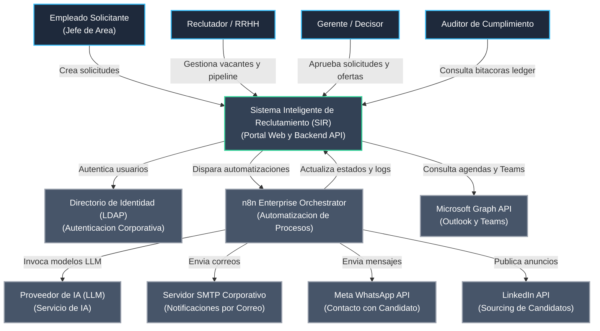
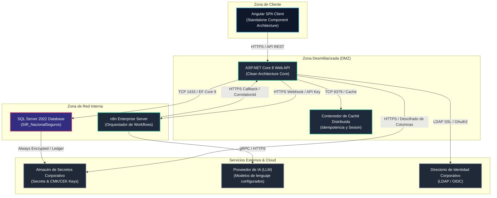
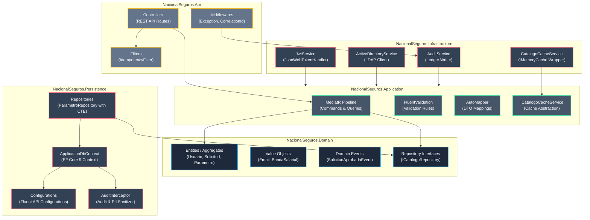
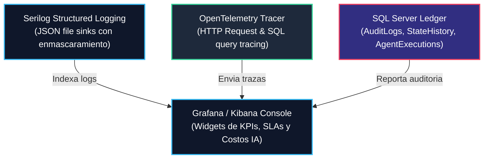
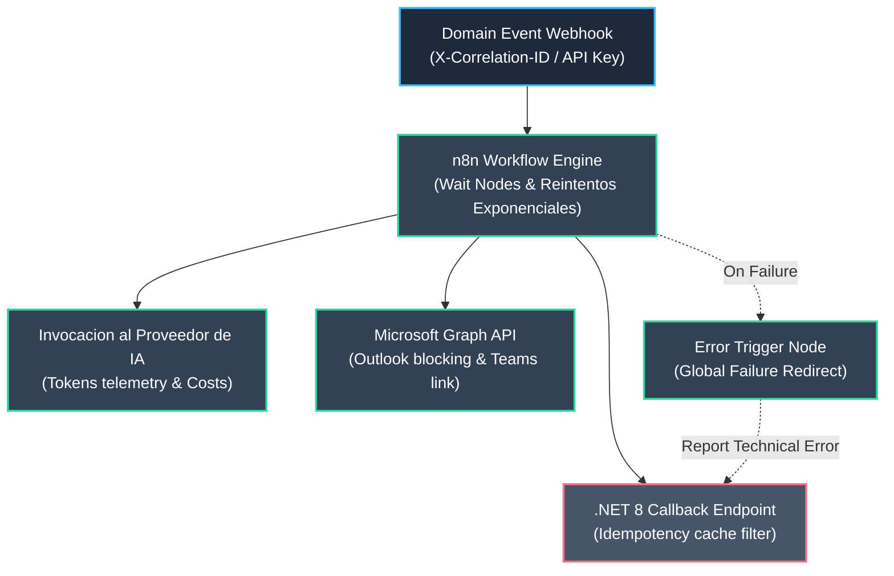
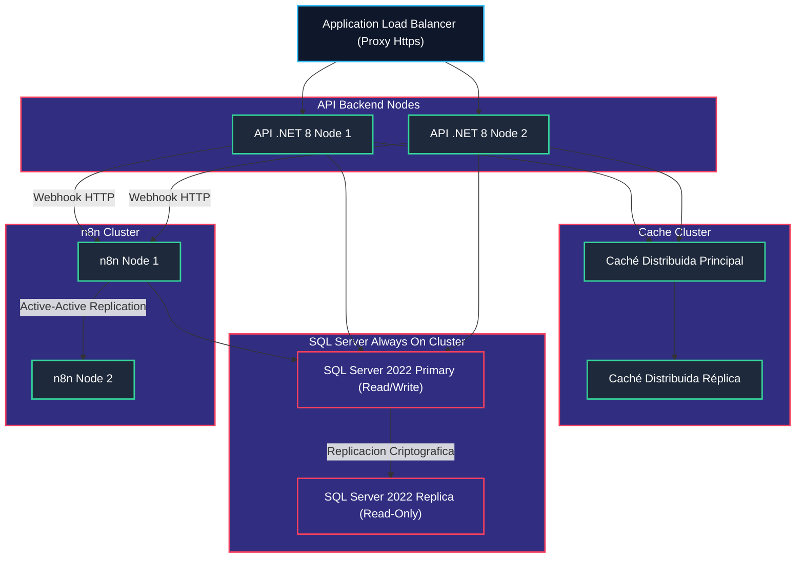

# Documento de Arquitectura de Solución (Solution Architecture Document - SAD)
## Proyecto: Sistema Inteligente de Reclutamiento (SIR) - Nacional Seguros

> **Versión:** 1.0.0 | **Estado:** APROBADO PARA AUDITORÍA  
> **Fecha:** 2026-06-26  
> **Autores:** Enterprise Solution Architect, Software Architect, Cloud Architect, Integration Architect, Security Architect, AI Solution Architect, Technical Lead, Project Auditor  

---

## 1. Introducción

### 1.1 Objetivo
El propósito de este documento es definir la **Arquitectura de Solución (SAD)** del **Sistema Inteligente de Reclutamiento (SIR)** para **Nacional Seguros**. Este documento consolida las especificaciones y decisiones de diseño técnico, integrando el backend en .NET 8, el frontend en Angular, la orquestación de workflows en n8n, la gobernanza de Inteligencia Artificial (mediante un proveedor configurable), el modelo de base de datos en SQL Server 2022 y las directrices transversales de seguridad y observabilidad aprobadas en el proyecto.

### 1.2 Alcance
El alcance contempla la Fase 1 del proyecto, la cual incluye:
*   Implementación y despliegue del motor relacional inmutable sobre SQL Server 2022.
*   Desarrollo de la API del Backend en .NET 8 bajo principios de Clean Architecture, DDD y CQRS.
*   Desarrollo de la aplicación cliente SPA en Angular con Standalone Components, Signals y RxJS.
*   Orquestación de los 10 workflows principales del sistema en n8n Enterprise.
*   Integración y gobernanza de los 7 agentes inteligentes basados en el modelo de lenguaje configurado por la organización.
*   Configuración de seguridad híbrida (Local y Directorio de Identidad Corporativo), políticas de auditoría Ledger e inmutabilidad, y cifrado transparente mediante Always Encrypted.

### 1.3 Audiencia
Este documento está dirigido a:
*   **Comité de TI y CISO:** Para certificar el cumplimiento normativo, de seguridad y la arquitectura híbrida de datos.
*   **Arquitectos y Líderes Técnicos:** Como guía definitiva para la implementación y la resolución de interfaces.
*   **Equipo DevOps y Operaciones:** Para el despliegue e infraestructura en entornos UAT y Producción.
*   **Auditores del Proyecto:** Como referencia oficial de validación de conformidad del software.

### 1.4 Supuestos
*   Se dispone de conectividad estable y segura de red (hacia el Directorio de Identidad Corporativo, el Proveedor de Inteligencia Artificial y APIs externas).
*   Se cuenta con las licencias correspondientes para el motor de bases de datos, n8n Enterprise y Microsoft Graph.
*   Las variables de entorno y certificados criptográficos en el Proveedor corporativo de gestión de secretos están debidamente aprovisionados para el inicio del despliegue.

### 1.5 Restricciones
*   **Motor de Base de Datos:** Restringido exclusivamente a Microsoft SQL Server 2022. No se admite el uso de alternativas NoSQL como base de datos transaccional principal.
*   **Soberanía y Privacidad:** Ningún dato personal identificable (PII) de candidatos o salarios corporativos puede enviarse a modelos LLM externos sin enmascaramiento o anonimización previa.
*   **Decisiones de IA:** Todos los procesos de cambio de estado transaccionales críticos (descarte, aprobación salarial, contratación) deben poseer intervención y confirmación humana obligatoria (*Human-in-the-Loop*).

---

## 2. Visión General de la Solución

### 2.1 Problema de Negocio
El proceso tradicional de selección de personal en Nacional Seguros sufría de desarticulación, lentitud operativa y falta de trazabilidad. La validación de requerimientos, la perfilación de puestos, el sourcing en portales y el filtrado curricular de miles de candidatos se ejecutaban de forma manual. Adicionalmente, el cálculo de cumplimiento de los Acuerdos de Nivel de Servicio (SLAs) era inexacto por la falta de integración de feriados nacionales y fines de semana, y no se garantizaba la confidencialidad de la información salarial sensible durante el pipeline.

### 2.2 Objetivos del Sistema
*   **Automatizar y Agilizar el Sourcing:** Extraer y normalizar currículums de forma estructurada e indexarlos de inmediato.
*   **Garantizar Decisiones Justificadas:** Evaluar de forma semántica y objetiva a los candidatos utilizando agentes de IA que justifiquen detalladamente la afinidad (*Scoring Explicable*), evitando sesgos de selección.
*   **Proteger Información Sensible:** Cifrar salarios y scores en reposo de tal modo que ni administradores de bases de datos ni desarrolladores sin privilegios puedan visualizarlos.
*   **Garantizar Trazabilidad Completa:** Rastrear inmutablemente todos los accesos, mutaciones de datos y llamadas de Inteligencia Artificial mediante tablas Ledger inmutables, resolviendo el no repudio.

### 2.3 Beneficios Obtenidos
*   **Reducción del 40%** en tiempos de revisión inicial y matching curricular.
*   **Visibilidad en Tiempo Real:** Monitorización del pipeline de reclutamiento bajo un tablero Kanban interactivo con alertas visuales de vencimiento de SLAs.
*   **Cumplimiento de Auditorías:** Historial de transiciones de estado (`StateHistory`) inalterable para peritajes legales.

### 2.4 Capacidades de la Solución
```
┌─────────────────────────────────────────────────────────────────┐
│                      CAPACIDADES DEL SIR                        │
├───────────────────┬──────────────────────┬──────────────────────┤
│ 1. Core Operativo │ 2. Motor de IA       │ 3. Orquestador n8n   │
│ - Portal Angular  │ - Matching Semántico │ - Integración SMTP   │
│ - API .NET 8      │ - Scoring Explicable │ - Microsoft Teams    │
│ - SQL Ledger      │ - Prompt Governance  │ - WhatsApp Business  │
└───────────────────┴──────────────────────┴──────────────────────┘
```

---

## 3. Arquitectura General (C4 Nivel 1 - Contexto)

El siguiente diagrama detalla la interacción del sistema con los usuarios finales, los proveedores de identidad corporativa y los servicios externos de orquestación y procesamiento de Inteligencia Artificial:



---

## 4. Arquitectura de Contenedores (C4 Nivel 2 - Contenedores)

La solución distribuye sus responsabilidades físicas en contenedores aislados y protegidos por zonas de red (DMZ e Interna):



---

## 5. Arquitectura de Componentes (C4 Nivel 3 - Componentes)

El backend está estructurado bajo los principios de **Clean Architecture**, aislando la lógica de negocio en el núcleo y propagando dependencias hacia afuera:



### 5.1 Descripción de las Capas del Backend:
1.  **`NacionalSeguros.Shared` (Transversal):** Aloja los tipos primitivos comunes, la clase base `Result<T>` para el manejo elegante de flujos de negocio sin lanzar excepciones de control, y las definiciones globales de errores.
2.  **`NacionalSeguros.Domain` (Core de Negocio):** Contiene el modelo de dominio puro (entidades, agregados, Value Objects) e interfaces de repositorios. Es completamente inmune a frameworks externos.
3.  **`NacionalSeguros.Contracts` (Mapeo de Contratos):** DTOs que configuran la estructura JSON de intercambio con la API, manteniendo la separación física con las entidades de base de datos.
4.  **`NacionalSeguros.Application` (Casos de Uso):** Contiene los controladores lógicos (Handlers de MediatR) de commands y queries. Implementa `IPipelineBehavior` para validar peticiones antes de procesar las transacciones.
5.  **`NacionalSeguros.Persistence` (Acceso a SQL):** Implementa el acceso físico a SQL Server 2022 mediante EF Core 9 y Dapper. Aloja el control de Query Filters globales de borrado lógico y el interceptor de auditoría que enmascara información confidencial.
6.  **`NacionalSeguros.Infrastructure` (Servicios de Terceros):** Implementa los adaptadores de integración (LDAP para AD, `JsonWebTokenHandler` para JWT, `IMemoryCache` de .NET 8 para caché, y clientes HTTP con resiliencia Polly para n8n).
7.  **`NacionalSeguros.Api` (Presentación):** Expone los endpoints HTTP. Inyecta el middleware de correlación y la sanitización RFC 7807 para prevenir la fuga de metadatos SQL.

---

## 6. Arquitectura de Datos

### 6.1 Diagrama Entidad-Relación (ERD) Simplificado
El modelo relacional mapea físicamente el ciclo transaccional de reclutamiento y auditoría Ledger inmutable:

```
  ┌───────────────┐          ┌───────────────────┐          ┌───────────────┐
  │   Usuarios    │1       N │    Sesiones       │          │   Feriados    │
  │               ├──────────┤                   │          │               │
  └───────┬───────┘          └───────────────────┘          └───────────────┘
          │1                                                        
          │                                                         
          │N                                                        
  ┌───────┴───────┐1       N ┌───────────────────┐N        1┌───────────────┐
  │   Catalogos   ├──────────┤    Parametros     ├──────────┤   Catalogos   │
  │               │          │ (Arbol Jerarquico)│          │ (Referencia)  │
  └───────┬───────┘          └─────────┬─────────┘          └───────────────┘
          │                            │1 (PadreId)
          │                            │N (Hijos)
          │                            ▼
          │                  ┌───────────────────┐
          │1                 │  ParametroPadre   │
          │                  └───────────────────┘
          │
          │N
  ┌───────┴───────┐1       N ┌───────────────────┐N        1┌───────────────┐
  │  Solicitudes  ├─────────┤   PerfilCargo     ├──────────┤   Vacantes    │
  │               │          │                   │          │(Bandas Cifr.) │
  └───────────────┘          └─────────┬─────────┘          └───────┬───────┘
                                       │1                           │1
                                       │                            │
                                       │N                           │N
                             ┌─────────┴─────────┐          ┌───────┴───────┐
                             │    Postulantes    │1        N│  Entrevistas  │
                             │ (Salario Cifrado) ├──────────┤               │
                             └─────────┬─────────┘          └───────────────┘
                                       │1
                                       │
                                       │N
                             ┌─────────┴─────────┐          ┌───────────────┐
                             │   StateHistory    │          │  AuditLogs    │
                             │ (Ledger Table)    │          │ (Ledger Table)│
                             └───────────────────┘          └───────────────┘
```

### 6.2 Catálogo del Diccionario de Datos Relacional

#### A) Módulo de Seguridad y Parametrización:
*   **`Usuarios`:** Registra las cuentas locales y del Directorio de Identidad Corporativo. Si `TipoAutenticacion = 'ActiveDirectory'`, el campo `ClaveHash` es obligatoriamente `NULL` (controlado por el check constraint `CK_Usuarios_ClaveHash_AD`).
*   **`Roles` y `Permisos`:** Mapeo RBAC clásico. Las tablas intermedias `UsuarioRoles` y `RolPermisos` controlan la asignación.
*   **`Sesiones`:** Almacena los refresh tokens e historial de login. Soporta la desactivación en cascada en caso de detección de reuso de token.
*   **`Catalogos`:** Define el código y nombre del catálogo maestro de parametrización.
*   **`Parametros`:** Tabla recursiva que implementa la estructura jerárquica de la organización. Posee la FK `ParametroIdPadre` apuntando a `ParametroId` de la misma tabla.
*   **`Estados`:** Catálogo inmutable que almacena los estados oficiales del dominio de la máquina de estados.
*   **`Feriados`:** Registra las fechas del calendario de Bolivia que deben ser excluidas al calcular los plazos de vencimiento en días hábiles corporativos.

#### B) Módulo de Negocio y Procesamiento:
*   **`Solicitudes`:** Almacena la justificación, cargo y prioridad del requerimiento de personal.
*   **`PerfilCargo`:** Profesiograma estructurado en JSON derivado de una solicitud aprobada.
*   **`Vacantes`:** Vacante formal publicada. Contiene las columnas `BandaSalarialMin` y `BandaSalarialMax` cifradas nativamente con **Always Encrypted**.
*   **`Postulantes`:** Información del candidato. Posee la columna `PretensionSalarial` cifrada en reposo.
*   **`Matching` y `Scoring`:** Almacenan los resultados de la Inteligencia Artificial. La columna `ScoreFinal` y el `ScoreCoincidencia` se protegen con cifrado de origen transparente.
*   **`Entrevistas`:** Programación y estados de citas. Almacena el `EnlaceTeams` generado asíncronamente.
*   **`SLAExecution`:** Controla la `FechaInicio`, `FechaLimite` (excluyendo feriados y fines de semana) y el estado de cumplimiento (`Cumplido = 1` o `0`).

#### C) Módulo de Auditoría y Trazabilidad:
*   **`AuditLogs`:** Tabla **Ledger (Append-Only)** de SQL Server 2022. Registra el `CorrelationId`, la acción realizada, el responsable y los payloads JSON sanitizados de cambios.
*   **`StateHistory`:** Tabla **Ledger** que registra inmutablemente las transiciones de estado de todas las máquinas de estado.
*   **`AgentExecutions`:** Registra la telemetría de tokens, costos financieros y prompts consumidos por el Proveedor de Inteligencia Artificial.

---

## 7. Arquitectura de Integración

El intercambio de información entre los contenedores de la solución y las plataformas de Nacional Seguros se ejecuta a través de contratos y protocolos estrictos:

```
┌─────────────────────────────────────────────────────────────────┐
│                    INTEGRACIÓN DEL SISTEMA                      │
├───────────────────┬──────────────────────┬──────────────────────┤
│ 1. API REST /     │ 2. Webhooks / n8n    │ 3. External / Ident. │
│    OpenAPI v3     │ - API Key en Header  │ - LDAP SSL (Auth)    │
│ - DTOs en JSON    │ - X-Correlation-ID   │ - MS Graph (Outlook) │
│ - Token Bearer    │ - Idemp. en Caché    │ - WhatsApp Webhook   │
└───────────────────┴──────────────────────┴──────────────────────┘
```

1.  **REST APIs (OpenAPI / Swagger):** El backend de .NET 8 expone todos sus servicios mediante controladores REST. El archivo de especificación `openapi.yaml` define la firma tipada de los DTOs en camelCase, los códigos de retorno HTTP (200, 201, 204, 400, 401, 403, 409, 429, 500) y la seguridad basada en Bearer JWT.
2.  **Webhooks n8n (Integración Asíncrona):**
    *   **Envío de Eventos:** El backend invoca los webhooks de n8n inyectando en la cabecera `X-API-Key` y propagando el `X-Correlation-ID` en el request.
    *   **Retorno de Datos (Callbacks):** n8n responde al backend llamando a endpoints específicos `/api/v1/callbacks/*`. Estas rutas aplican el middleware `IdempotencyFilter` que evita la inserción de registros duplicados en caso de reintentos de red de n8n, verificando la firma del correlation ID contra la capa de caché distribuida.
3.  **Directorio de Identidad Corporativo (LDAP Híbrido):** La autenticación de empleados de Nacional Seguros se conecta al Directorio de Identidad corporativo mediante LDAP a través de puertos seguros (SSL - 636) o vía el servicio de directorio de identidad usando el flujo OpenID Connect (OIDC).
4.  **Microsoft Graph (Calendario y Teams):** El Agente de Coordinación (`AGE-06`) interactúa con la API de Graph utilizando OAuth 2.0 (Application Permissions), programando la cita y generando el enlace de Teams, el cual retorna al backend.
5.  **WhatsApp Business API (Mensajería Interactiva):** n8n se comunica con la API de Meta para enviar mensajes de confirmación de agenda. El webhook de WhatsApp reporta la respuesta a n8n, el cual la procesa y gatilla el callback de confirmación en la API de .NET.

---

## 8. Arquitectura de Inteligencia Artificial

La solución implementa una arquitectura basada en **Agentes Inteligentes Especializados**, coordinados asíncronamente mediante workflows en n8n:

### 8.1 Catálogo Oficial de Agentes de IA
*   **`AGE-01: AgenteSolicitud` (Modelo de lenguaje configurable - rápido):** Analiza la consistencia funcional de la solicitud. Comprueba que las habilidades requeridas correspondan con las responsabilidades del cargo y no presenten contradicciones lógicas.
*   **`AGE-02: AgentePerfil` (Modelo de lenguaje configurable - avanzado):** Diseña el borrador estructurado del profesiograma basándose en la solicitud de personal aprobada.
*   **`AGE-03: AgenteSourcing` (Modelo de lenguaje configurable - rápido):** Optimiza la descripción de la vacante, genera hashtags del puesto y extrae de forma estructurada los datos curriculares de los candidatos en el parseo de CVs.
*   **`AGE-04: AgenteMatching` (Modelo de lenguaje configurable - avanzado):** Compara semánticamente el perfil del candidato contra el profesiograma activo de la vacante, anonimizando datos personales para evitar sesgos de selección.
*   **`AGE-05: AgenteScoring` (Modelo de lenguaje configurable - avanzado):** Calcula los puntajes de idoneidad y redacta la justificación detallada del ranking.
*   **`AGE-06: AgenteCoordinacion` (Modelo de lenguaje configurable - rápido):** Conduce el flujo de interacción conversacional de agenda con el candidato a través de mensajería.
*   **`AGE-07: AgenteAnalitico` (Modelo de lenguaje configurable - avanzado):** Consolida la información del ingresante para la emisión del reporte de expediente final.

### 8.2 Gobernanza de Prompts e Inferencia
Para garantizar el control del comportamiento de los LLM y evitar incidentes de seguridad, el SIR aplica las siguientes políticas de gobierno:
*   **Prompts en Base de Datos:** Queda estrictamente prohibido hardcodear prompts en los workflows de n8n. Todos los prompts se leen desde las tablas `Prompt` y `PromptVersion`. n8n siempre solicita el prompt activo por referencia de nombre (ej. `PR_MAT_CV_PERFIL`) mediante la API de .NET.
*   **Gobernanza de Cambios:** Toda modificación en las instrucciones del prompt se realiza mediante inserción de nueva versión, aprobada previamente en el ambiente de QA por el equipo de seguridad y el Tech Lead.
*   **Telemetría y Control Financiero:** Cada respuesta del Proveedor de IA devuelve el conteo de tokens (`TokensInput` y `TokensOutput`). n8n propaga esta información en el callback, y la API de .NET calcula y registra inmutablemente el costo financiero de la inferencia en la tabla `AgentExecution`.

### 8.3 Explicabilidad y Supervisión Humana (Human-in-the-Loop)
*   **Explicabilidad:** La IA no entrega notas secas. Las respuestas de scoring y matching deben incluir obligatoriamente el nivel de confianza, la justificación detallada en lenguaje natural y las evidencias directas extraídas de las líneas del CV del candidato.
*   **Decisión Humana Mandatoria:** La Inteligencia Artificial es un asistente consultivo. Los descartes curriculares y las ofertas económicas sugeridas no se ejecutan automáticamente; el reclutador o decisor debe revisar las justificaciones y confirmar manualmente la transición de estado en el Kanban web.

---

## 9. Arquitectura de Seguridad

La arquitectura de seguridad implementa un esquema de **Defensa en Profundidad** alineado a OWASP Top 10 y normativas corporativas:

```
┌─────────────────────────────────────────────────────────────────┐
│                     ZONAS DE SEGURIDAD                          │
├───────────────────┬──────────────────────┬──────────────────────┤
│ 1. Autenticación  │ 2. Cifrado / Always  │ 3. DB Security       │
│ - JWT / OIDC      │    Encrypted         │ - RLS Predicativos   │
│ - MFA de 2 fases  │ - Master Key en Secr.│ - Ledger Inmutable   │
│ - Ident. Provision│ - Sanitización PII   │ - Sanitización SQL   │
└───────────────────┴──────────────────────┴──────────────────────┘
```

1.  **Autenticación Híbrida y Aprovisionamiento:** La API valida las credenciales de forma híbrida. Si se autentica a través del Directorio de Identidad Corporativo pero la cuenta no existe localmente, el sistema realiza el autoprovisionamiento con roles por defecto y registra la traza `'AUTO_PROVISION_AD'`.
2.  **MFA de Doble Fase Obligatorio:** El setup de doble factor (`MfaHabilitado = true`) se valida mediante una transacción de dos fases en el login. El código QR del secreto TOTP se aprovisiona inicialmente, pero el estado de enrolamiento no se habilita en base de datos hasta que el usuario envíe y confirme exitosamente el primer código de verificación de 6 dígitos.
3.  **Always Encrypted (Cifrado Transparente en Repositorio):**
    *   Las columnas de salarios (`BandaSalarialMin`, `BandaSalarialMax`, `PretensionSalarial`) y puntajes de matching de IA se cifran nativamente en la base de datos SQL Server 2022.
    *   La clave maestra de columna (CMK) reside de forma segura en el **Proveedor corporativo de gestión de secretos** con las políticas de *Soft-Delete* y *Purge Protection* activadas mandatoriamente para evitar la pérdida o borrado físico permanente de las llaves.
4.  **Row Level Security (RLS) en SQL Server:** La base de datos aplica filtros de seguridad en filas. Los reclutadores y decisores solo visualizan solicitudes y vacantes pertenecientes a su área funcional, mientras que el rol `Administrador` y `Auditor` poseen acceso completo.
5.  **Auditoría Ledger e Inmutabilidad:** Las tablas transaccionales críticas (`AuditLogs` y `StateHistory`) se configuran como tablas **Ledger** del sistema en SQL Server 2022. Esto genera un historial criptográficamente firmado que impide la alteración o eliminación de trazas de auditoría.
6.  **CorrelationId Middleware:** El backend inyecta de forma transversal la cabecera `X-Correlation-ID` en cada petición HTTP, propagándola en todas las llamadas internas de aplicación, persistencia, n8n y el Proveedor de IA, garantizando la trazabilidad extrema de punta a punta.

---

## 10. Arquitectura de Observabilidad

La observabilidad de la solución SIR está diseñada bajo estándares de logging estructurado y tracing distribuido:



*   **Serilog con Enmascaramiento de Secretos:** Los logs de salida se formatean en JSON. Un enriquecedor personalizado en Serilog aplica regex para censurar automáticamente tokens JWT, contraseñas locales y Client Secrets antes de persistir las trazas en disco, previniendo fuga de credenciales.
*   **OpenTelemetry Instrumentation:** Configurado en `Program.cs` para recolectar métricas de CPU y memoria y trazar automáticamente la duración de las solicitudes HTTP entrantes y las queries de Entity Framework Core.
*   **Bitácora Ledger Unificada:** El interceptor de EF Core captura todas las mutaciones. Sanitiza los JSON en `AuditLogs` reemplazando campos marcados como `[SensitiveData]` con asteriscos, asegurando el cumplimiento de leyes de protección de datos personales.
*   **Monitoreo y Alertas:** n8n expone un flujo de error global (`WF-ERR-01`) que consume el webhook de error de la API ante caídas de nodos y envía notificaciones automáticas con el CorrelationId asociado a los equipos de soporte TI.

---

## 11. Arquitectura de Workflows

n8n Enterprise actúa como el motor de orquestación asíncrono y desacoplado del sistema, controlando el flujo operativo de los 10 procesos de negocio principales:



### 11.1 Resiliencia de Integración
*   **Reintento Exponencial con Jitter:** En la invocación de APIs de terceros (Outlook, SMTP, WhatsApp), n8n aplica una política de 3 reintentos con cálculo exponencial y variación aleatoria de segundos (*Jitter*) para evitar bloqueos por limitación de tasa del proveedor.
*   **Cola de Descarte (Dead Letter Queue - DLQ):** Si un workflow agota los reintentos automáticos, el nodo desvía la petición al workflow de error global `WF-ERR-01`. Los parámetros originales de la llamada se persisten en `IntegrationLog` en estado `Fallido`, listos para reenvío manual desde el panel de administración una vez solucionado el fallo.

### 11.2 Cálculo de SLAs Hábiles y Escalamientos
*   **Motor de SLA Hábil:** Al calcular el plazo de respuesta (`FechaLimite`), el sistema excluye fines de semana y las fechas registradas en la tabla `Feriado`.
*   **Flujo de Escalamiento:** El workflow `WF-08-MonitoreoSLA` corre en cron cada 1 hora. Si detecta registros en `SLAExecution` que han superado los límites tolerados sin completarse (100% y 120%), reasigna automáticamente el ticket al supervisor jerárquico y emite alertas críticas por Teams.

---

## 12. Arquitectura de Despliegue

La solución se despliega en una infraestructura corporativa redundante de alta disponibilidad para asegurar la continuidad del negocio de Nacional Seguros:



---

## 13. Atributos de Calidad

*   **Escalabilidad:** El backend en .NET 8 y el clúster de n8n se ejecutan sobre contenedores de aplicación listos para escalado horizontal (Autoscaling) basado en consumo de CPU y memoria. Las consultas de solo lectura pesadas de dashboards y reportes se desvían de forma transparente a la réplica secundaria de SQL Server.
*   **Disponibilidad:** Configuración en alta disponibilidad activa en todos los niveles. Clúster de base de datos SQL Server configurado en grupo de disponibilidad AlwaysOn. La capa de caché distribuida asegura la conmutación por error instantánea para mantener el filtro de idempotencia activo.
*   **Seguridad:** Aislamiento estricto de redes corporativas. Cifrado de datos en reposo mediante Always Encrypted. Auditoría física Ledger e inalterabilidad criptográfica. MFA en dos fases. RLS para segregación de acceso por departamentos.
*   **Rendimiento:** Tiempos de respuesta de endpoints transaccionales por debajo de los 200 ms. Caché local (`IMemoryCache`) con expiración de 12 horas en el endpoint de catálogos y parámetros de negocio, evitando accesos redundantes a base de datos.
*   **Mantenibilidad:** Separación física estricta de proyectos en Clean Architecture. Cobertura de pruebas unitarias superior al 80% en lógica de negocio.
*   **Observabilidad:** Logging structured JSON con enmascaramiento de PII. Propagación obligatoria de `X-Correlation-ID` en cabeceras. Monitoreo automatizado del consumo de tokens y costos estimativos en el Proveedor de IA.
*   **Resiliencia:** Tolerancia a fallos transitorios en APIs externas mediante políticas de reintentos exponenciales y disyuntor (*Circuit Breaker*) inyectados con Polly en .NET 8 y reintentos con Jitter en n8n.

---

## 14. Riesgos Arquitectónicos y Mitigaciones

| ID | Riesgo Identificado | Severidad | Impacto Técnico | Control y Mitigación Propuesta |
| :---: | :--- | :---: | :--- | :--- |
| **R-ARQ-01** | **Bloqueo en CTE del Árbol de Parámetros** | 🟠 Medio | Ralentización y bloqueos de tablas ante consultas recursivas concurrentes. | Implementación de caché de lectura local (`IMemoryCache`) con expiración de 12 horas en el handler. El trigger de BD actúa únicamente como control de última línea de defensa. |
| **R-ARQ-02** | **Fuga de Secretos de Identidad en Configuración** | 🔴 Alto | Compromiso de credenciales de LDAP corporativo en el control de versiones. | Uso obligatorio de la herramienta Secret Manager (`dotnet user-secrets`) en desarrollo y el almacén de secretos corporativo en producción. Prohibido texto plano en `appsettings.json`. |
| **R-ARQ-03** | **Saturación por Cuota del Proveedor de IA** | 🔴 Alto | Excesivas llamadas concurrentes en parseo de CVs provocan errores HTTP 429. | Control de concurrencia mediante `SemaphoreSlim(10, 10)` en handlers e inyección de middleware de Token Bucket (50 req/min). |
| **R-ARQ-04** | **Pérdida de CMK** | 🔴 Alto | Pérdida permanente del acceso a datos salariales y calificaciones históricas. | Configurar el Almacén de Secretos Corporativo con *Soft-Delete* y *Purge Protection* activos. Implementar respaldos inmutables auditados por el CISO. |
| **R-ARQ-05** | **Agotamiento de Conexiones HTTP (Socket Exhaustion)** | 🟠 Medio | Caída del backend por falta de puertos libres ante múltiples webhooks salientes. | Uso ineludible de `IHttpClientFactory` para registrar y reutilizar sockets en el cliente de n8n. |

---

## 15. Decisiones Arquitectónicas (Architectural Decision Records - ADR)

### ADR-01: Framework de Backend - .NET 8
*   **Estado:** Aprobado.
*   **Contexto:** Se requiere un entorno robusto, modular y de alto rendimiento compatible con estándares empresariales de Nacional Seguros.
*   **Decisión:** Utilizar .NET 8.0 SDK y C# 12 nativo como tecnología core del backend.
*   **Justificación:** Soporte a largo plazo (LTS), excelente rendimiento del middleware Kestrel, integración nativa con el Directorio de Identidad Corporativo y soporte completo para EF Core 9.
*   **Consecuencias:** Compilación estricta y warnings tratados como errores mediante `Directory.Build.props`.

### ADR-02: Framework de Frontend - Angular 20+
*   **Estado:** Aprobado.
*   **Contexto:** La interfaz administrativa del SIR requiere una SPA estructurada con reactividad óptima y carga eficiente.
*   **Decisión:** Utilizar Angular 20+ con Standalone Components, Signals y RxJS.
*   **Justificación:** Estructura modular estándar de desarrollo corporativo, mayor agilidad en renderizado gracias a Signals y control de flujos asíncronos robusto con RxJS.
*   **Consecuencias:** Eliminación de los módulos clásicos (`NgModule`), simplificando el árbol de componentes.

### ADR-03: Motor de Base de Datos - SQL Server 2022
*   **Estado:** Aprobado.
*   **Contexto:** Necesidad de un gestor de base de datos relacional robusto que admita encriptación nativa avanzada y bitácoras inmutables certificables.
*   **Decisión:** Adoptar Microsoft SQL Server 2022 Standard con Compatibility Level 160.
*   **Justificación:** Permite implementar tablas Ledger del sistema para auditorías, Always Encrypted con enclaves y particionamiento nativo.
*   **Consecuencias:** Requiere dependencias del driver de SQL Server de Microsoft y soporte de almacén de secretos para CMK.

### ADR-04: Estilo Arquitectónico - Clean Architecture
*   **Estado:** Aprobado.
*   **Contexto:** Se debe evitar el acoplamiento del núcleo de negocio con librerías externas o detalles de la base de datos.
*   **Decisión:** Implementar Clean Architecture dividiendo la solución en Domain, Application, Persistence, Infrastructure y Api.
*   **Justificación:** Aísla el dominio corporativo, facilita el testeo unitario mediante mocks y permite cambiar tecnologías de infraestructura sin modificar la lógica de negocio.
*   **Consecuencias:** Incremento inicial en el número de proyectos y mapeos de DTOs necesarios.

### ADR-05: Patrón de Diseño de Software - Domain-Driven Design (DDD)
*   **Estado:** Aprobado.
*   **Contexto:** El proceso de selección posee reglas complejas e invariantes que deben cumplirse de forma atómica.
*   **Decisión:** Diseñar la capa de Dominio utilizando agregados, entidades raíz, Value Objects y eventos de dominio.
*   **Justificación:** Asegura la consistencia transaccional y mapea el lenguaje ubicuo del negocio en el código fuente.
*   **Consecuencias:** El acceso a entidades relacionadas fuera de su agregado se restringe a través del Aggregate Root.

### ADR-06: Separación de Responsabilidad de Lectura/Escritura - CQRS (MediatR)
*   **Estado:** Aprobado.
*   **Contexto:** El volumen de lecturas del dashboard de SLAs y reportería es elevado en contraste con las mutaciones de datos del pipeline.
*   **Decisión:** Dividir el procesamiento de casos de uso en comandos (mutaciones) y consultas (lecturas) utilizando MediatR.
*   **Justificación:** Permite optimizar de forma independiente las consultas (usando Dapper y `AsNoTracking` en EF Core) y los comandos (usando lógica transaccional estricta).
*   **Consecuencias:** Duplicación de firmas de contratos en comandos y consultas.

### ADR-07: Acceso a Datos Relacionales - Entity Framework Core 9 & Dapper
*   **Estado:** Aprobado.
*   **Contexto:** Se requiere un ORM potente para las transacciones complejas y consultas rápidas para dashboard de SLAs.
*   **Decisión:** Utilizar EF Core 9 para escrituras y comandos CRUD, y Dapper para consultas de reportería y snapshots analíticos.
*   **Justificación:** EF Core 9 reduce tiempos de desarrollo y maneja el mapeo de configuraciones fluidas de forma nativa. Dapper ofrece alto rendimiento en queries complejas SQL sobre `MetricSnapshot`.
*   **Consecuencias:** Es necesario mantener la sincronización y coherencia de las transacciones compartiendo la misma conexión SQL.

### ADR-08: Motor de Automatización de Procesos - n8n Enterprise
*   **Estado:** Aprobado.
*   **Contexto:** La orquestación asíncrona de alertas, envío de WhatsApp y sincronización de calendarios Graph debe desacoplarse del API del backend.
*   **Decisión:** Utilizar n8n Enterprise como orquestador central de workflows.
*   **Justificación:** Permite editar y monitorear visualmente los flujos integrados, posee nodos nativos robustos de Microsoft Graph y Meta, y facilita la inyección de prompts al Proveedor de IA.
*   **Consecuencias:** Requiere infraestructura y despliegue del servidor de n8n y configuración de API Keys e intercambio cifrado.

### ADR-09: Proveedor y Plataforma de IA - Proveedor de IA configurable
*   **Estado:** Aprobado.
*   **Contexto:** Se requiere un entorno corporativo seguro y de alto rendimiento para el análisis masivo de currículums.
*   **Decisión:** Utilizar la API del Proveedor de IA (modelos de lenguaje avanzados y rápidos configurados por la organización).
*   **Justificación:** Excelente ventana de contexto, bajo costo por millón de tokens, y acuerdo empresarial que garantiza que los datos no se usarán para entrenamiento del modelo.
*   **Consecuencias:** Dependencia del canal e infraestructura de red segura con el proveedor de IA.

### ADR-10: Autenticación Corporativa - Directorio de Identidad Corporativo (LDAP Híbrido)
*   **Estado:** Aprobado.
*   **Contexto:** Los empleados administrativos de Nacional Seguros deben ingresar con sus cuentas del dominio corporativo.
*   **Decisión:** Integrar autenticación híbrida: cuentas locales para externos y LDAP sobre SSL / OIDC para internos.
*   **Justificación:** Cumplimiento de las políticas de seguridad de TI de la corporación y simplificación en la administración de accesos.
*   **Consecuencias:** Requiere aprovisionamiento automático y mapeo de roles locales tras la autenticación.

### ADR-11: Cifrado de Datos en Repositorio - Always Encrypted
*   **Estado:** Aprobado.
*   **Contexto:** La información salarial de los puestos y scores de matching de los candidatos es estrictamente confidencial.
*   **Decisión:** Aplicar Always Encrypted con enclaves de seguridad (VBS) en las columnas críticas.
*   **Justificación:** Garantiza que ni administradores de bases de datos (DBAs) ni atacantes con acceso físico a la base de datos puedan leer información salarial en texto plano.
*   **Consecuencias:** Restringe la ejecución de ciertas funciones de búsqueda sobre los campos cifrados (requiere indexaciones deterministas o enclaves activos).

### ADR-12: Trazabilidad del Pipeline de Estados - StateHistory Ledger
*   **Estado:** Aprobado.
*   **Contexto:** Cumplimiento normativo que exige auditar de forma inalterable por qué y quién cambió de estado una vacante o postulante.
*   **Decisión:** Configurar `StateHistory` como una tabla **Ledger (Append-Only)** en SQL Server 2022.
*   **Justificación:** Genera una firma criptográfica inalterable ligada al motor de base de datos que detecta y reporta cualquier intento de manipulación física de logs.
*   **Consecuencias:** Las inserciones son ligeramente más costosas y la base de datos almacena el histórico de transacciones Ledger.

### ADR-13: Doble Factor de Autenticación - MFA TOTP de Dos Fases
*   **Estado:** Aprobado.
*   **Contexto:** Asegurar el ingreso de administradores y RRHH mitigando ataques de robo de contraseñas.
*   **Decisión:** Implementar doble factor de autenticación TOTP obligatorio mediante una secuencia de registro de dos fases.
*   **Justificación:** Previene el enrolamiento fallido (bloqueo de cuenta) al exigir la validación exitosa del primer código OTP antes de habilitar el flag `MfaHabilitado = true` en base de datos.
*   **Consecuencias:** El login requiere una pantalla intermedia `/auth/mfa-verify`.

### ADR-14: Gestión de Idempotencia y Caché - Capa de caché distribuida configurable
*   **Estado:** Aprobado.
*   **Contexto:** Los callbacks de n8n pueden sufrir reintentos de red automáticos provocando reprocesamiento de IA o transiciones duplicadas en DB.
*   **Decisión:** Implementar caché distribuida basada en la capa de caché distribuida configurable (`IDistributedCache`) en entornos de QA y Producción.
*   **Justificación:** Provee una verificación rápida de idempotencia en entornos balanceados horizontalmente (multi-nodo) con expiración automática de claves.
*   **Consecuencias:** Agrega una dependencia de infraestructura de la capa de caché.

---

## 16. Roadmap Arquitectónico

La construcción física del Sistema Inteligente de Reclutamiento se alinea cronológicamente con el Plan Maestro de Construcción en **6 Sprints de 2 semanas cada uno**:

```
[Sprint 1: Cimientos] ──► [Sprint 2: Solicitudes] ──► [Sprint 3: Selección] ──► [Sprint 4: IA Matching] ──► [Sprint 5: Ofertas] ──► [Sprint 6: Analytics]
```

*   **Sprint 1: Cimientos e Infraestructura (Semanas 1-2):**
    *   *Objetivo:* Instalar base de datos y establecer el esqueleto del backend y la seguridad inicial.
    *   *Entregables:* Script maestro de base de datos (`instalar_sir.sql`) ejecutado, esqueleto Clean Architecture de .NET 8 creado, middleware JWT y MFA listo en la API, y aprovisionamiento base en SQL Server local.
*   **Sprint 2: Solicitudes de Personal (Semanas 3-4):**
    *   *Objetivo:* Implementar el flujo inicial de requisiciones de cargos.
    *   *Entregables:* API de Solicitudes, Kanban visual de solicitudes en Angular, e integración de `StateHistory` y logs en `AuditLogs` Ledger.
*   **Sprint 3: Gestión de Vacantes y Postulantes (Semanas 5-6):**
    *   *Objetivo:* Habilitar la captación de candidatos y la publicación de ofertas de trabajo.
    *   *Entregables:* API de Vacantes con Always Encrypted configurado localmente, registro demográfico de postulantes e interfaces de expedientes en Angular, e integración base de LinkedIn API.
*   **Sprint 4: Sourcing e Inteligencia Artificial (Semanas 7-8):**
    *   *Objetivo:* Desplegar la orquestación asíncrona de agentes de IA en n8n.
    *   *Entregables:* Workflows `WF-01` a `WF-06` configurados en n8n, tablas de telemetría de tokens y costos de IA integradas (`AgentExecutions`), y componentes de explicabilidad y matching visual en Angular.
*   **Sprint 5: Coordinación de Entrevistas y Ofertas (Semanas 9-10):**
    *   *Objetivo:* Ejecutar la agenda de entrevistas y la emisión de ofertas salariales.
    *   *Entregables:* Integración con Microsoft Graph API para Teams, mensajería de confirmación interactiva por WhatsApp, y API de Ofertas salariales y Contrataciones.
*   **Sprint 6: SLAs, Dashboards y Hardening (Semanas 11-12):**
    *   *Objetivo:* Consolidar la observabilidad y afinar el rendimiento general.
    *   *Entregables:* Motor de SLA hábil con tabla de Feriados configurada, snapshots analíticos en base de datos, tuning de planes de ejecución en Query Store, compresión de Ledger, y pruebas de penetración finales.

---

## 17. Anexos

### 17.1 Glosario de Términos
*   **Profesiograma:** Perfil de cargo oficial que detalla los requisitos técnicos, competencias, fit cultural y bandas de experiencia requeridas para una vacante.
*   **Inferencia:** Proceso por el cual un modelo de Inteligencia Artificial (LLM) procesa un prompt y devuelve una respuesta estructurada.
*   **Ledger Table:** Tabla inmutable en SQL Server 2022 que mantiene una firma criptográfica de cada transacción para garantizar la no alteración física de logs de auditoría.
*   **Always Encrypted:** Tecnología de cifrado de base de datos que garantiza que los datos sensibles se cifren en la aplicación cliente antes de enviarse al motor SQL Server.
*   **CorrelationId:** Identificador único global (UUID) que se inyecta en el flujo de una solicitud HTTP y se propaga en todas las llamadas de servicios para unificar los logs.

### 17.2 Acrónimos
*   **SAD:** Solution Architecture Document (Documento de Arquitectura de Solución).
*   **SIR:** Sistema Inteligente de Reclutamiento.
*   **DDD:** Domain-Driven Design (Diseño Guiado por el Dominio).
*   **CQRS:** Command Query Responsibility Segregation (Segregación de Responsabilidad de Comando y Consulta).
*   **RLS:** Row Level Security (Seguridad a Nivel de Fila).
*   **MFA:** Multi-Factor Authentication (Doble Factor de Autenticación).
*   **TOTP:** Time-Based One-Time Password (Contraseña Temporal de un Solo Uso).
*   **CISO:** Chief Information Security Officer (Oficial de Seguridad de la Información).
*   **DLQ:** Dead Letter Queue (Cola de Mensajes Fallidos).
*   **AKV:** Almacén de Secretos Corporativo.

### 17.3 Referencias Arquitectónicas Oficiales
*   [Especificación de Arquitectura de Backend (ARQUITECTURA_BACKEND_NET8.md)](file:///c:/Users/DELL%20XPS/Desktop/INTERSIM/nacional/arq/ARQUITECTURA_BACKEND_NET8.md)
*   [Especificación de Arquitectura de Frontend (ARQUITECTURA_FRONTEND_ANGULAR.md)](file:///c:/Users/DELL%20XPS/Desktop/INTERSIM/nacional/arq/ARQUITECTURA_FRONTEND_ANGULAR.md)
*   [Especificación de Arquitectura de Workflows (ARQUITECTURA_N8N_WORKFLOWS.md)](file:///c:/Users/DELL%20XPS/Desktop/INTERSIM/nacional/arq/ARQUITECTURA_N8N_WORKFLOWS.md)
*   [Especificación de Arquitectura de Base de Datos (ARQUITECTURA_SQL.md)](file:///c:/Users/DELL%20XPS/Desktop/INTERSIM/nacional/arq/ARQUITECTURA_SQL.md)
*   [Plan Maestro de Construcción (PLAN_MAESTRO_CONSTRUCCION.md)](file:///c:/Users/DELL%20XPS/Desktop/INTERSIM/nacional/arq/PLAN_MAESTRO_CONSTRUCCION.md)
*   [Especificación OpenAPI / Swagger (openapi.yaml)](file:///c:/Users/DELL%20XPS/Desktop/INTERSIM/nacional/openapi/openapi.yaml)
*   [Marco de Gobernanza de IA (KB_AI_Governance.md)](file:///c:/Users/DELL%20XPS/Desktop/INTERSIM/nacional/kb/KB_AI_Governance.md)

### 17.4 Matriz de Trazabilidad Documental

| Requisito del Sistema (PRD) | Componente Arquitectónico (SAD) | Clase / Archivo de Código | Tabla de Base de Datos | Workflow n8n |
| :--- | :--- | :--- | :--- | :--- |
| **RF-01: Autenticación Híbrida** | Sección 8.1 (Híbrida AD/Local) | `AutenticarUsuarioCommandHandler.cs`<br>`ActiveDirectoryService.cs` | `Usuarios`, `Sesiones` | N/A |
| **RF-02: Aprobación de Solicitudes** | Sección 5 (Application MediatR) | `AprobarSolicitudCommandHandler.cs` | `Solicitudes`, `StateHistory` | `WF-01-ConsistenciaSolicitud` |
| **RF-04: Profesiograma Automatizado** | Sección 8.1 (Catálogo de Agentes) | `GenerarPerfilCargoCommandHandler.cs`| `PerfilCargo`, `PerfilVersion` | `WF-02-GeneracionPerfil` |
| **RF-08: Cifrado de Bandas Salariales** | Sección 9 (Always Encrypted) | `BandaSalarial.cs` (Value Object)<br>`VacanteConfiguration.cs` | `Vacantes` (Columnas Cifradas)| N/A |
| **RF-10: Matching Curricular Explicable** | Sección 8.2 (Matching de IA) | `Matching.cs` (Entidad Domain) | `Matchings` (Columnas Cifradas)| `WF-05-MatchingCurricular` |
| **RF-12: Coordinación de Entrevistas** | Sección 7 (Integraciones Graph) | `ProgramarEntrevistaCommandHandler.cs`| `Entrevistas`, `EventoAgenda` | `WF-07-CoordinacionEntrevistas`|
| **RF-15: Trazabilidad Ledger** | Sección 9 (Auditoría Ledger) | `AuditInterceptor.cs`<br>`AuditService.cs` | `AuditLogs`, `StateHistory` | `WF-ERR-01-GlobalErrorHandler`|
| **RF-18: Exclusión de Feriados (SLA)** | Sección 6.2 (Parametrización) | `SLAExecutionService.cs` | `Feriados`, `SLAExecution` | `WF-08-MonitoreoSLA` |
