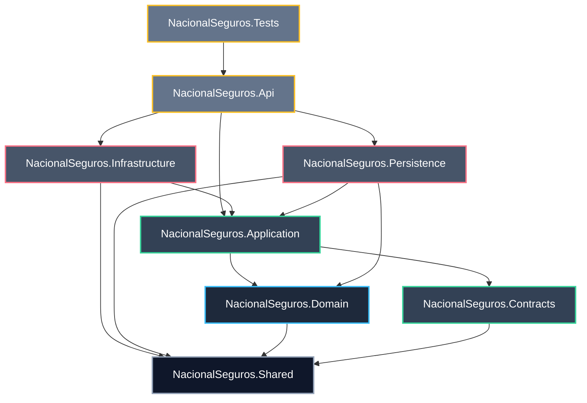

# Backend Development Blueprint (.NET 8 Solution)
## Proyecto: Sistema Inteligente de Reclutamiento (SIR) - Nacional Seguros

**Autores:** NacionalSeguros_BackendArchitect | NacionalSeguros_SolutionArchitect | NacionalSeguros_TechnicalLead | NacionalSeguros_ProjectAuditor  
**Fecha:** 2026-06-25  
**Estado:** **APROBADO PARA GENERACIÓN DE CÓDIGO**

---

## 1. Estructura de la Solución (NacionalSeguros.sln)

La solución se compone de 8 proyectos organizados para asegurar los principios de **Clean Architecture** y **Domain-Driven Design (DDD)**.



### 1.1 Catálogo de Proyectos y Responsabilidades

| Proyecto | Capa / Rol | Responsabilidad Técnica |
| :--- | :--- | :--- |
| **NacionalSeguros.Domain** | Core / Domain | Modelado de negocio puro. Contiene Entidades, Value Objects, Aggregates, Reglas del Dominio, Domain Events e interfaces de Repositorio. No depende de ningún framework ni proyecto (excepto Shared). |
| **NacionalSeguros.Application** | Core / Application | Casos de uso del sistema. Define los Commands, Queries, Handlers de MediatR, Validadores de FluentValidation, Mapeos de AutoMapper y Behaviors de Pipeline. |
| **NacionalSeguros.Contracts** | Core / Application | DTOs (Data Transfer Objects) puros de entrada/salida para la API. Define Requests, Responses y estructuras compartidas sin comportamiento. |
| **NacionalSeguros.Persistence** | Adapters / Infrastructure | Acceso físico a base de datos. Implementa el DbContext de EF Core 9, configuraciones de Fluent API, consultas directas en Dapper y repositorios concretos. |
| **NacionalSeguros.Infrastructure** | Adapters / Infrastructure | Clientes y servicios externos. Implementa conectores de Microsoft Graph (Teams), LDAP (Active Directory), JWT, SMTP (Email), Redis (Caché), y Webhooks (n8n/Vertex AI). |
| **NacionalSeguros.Api** | Presenter / Presentation | Punto de entrada del sistema. Controladores REST ASP.NET Core, middlewares globales (CorrelationId, Excepciones), filtros y políticas de autorización. |
| **NacionalSeguros.Shared** | Core / Shared | Tipos primitivos, clases auxiliares, patrón Result, excepciones genéricas y extensiones comunes utilizadas en toda la solución. |
| **NacionalSeguros.Tests** | Verification / QA | Pruebas unitarias de handlers y validadores, pruebas de integración de endpoints (con Testcontainers) y pruebas automatizadas de arquitectura. |

---

## 2. Estructura Interna de Carpetas y Dependencias

A continuación se define la estructura detallada de carpetas para cada proyecto, sus convenciones de nombres y dependencias permitidas:

```text
NacionalSeguros.sln/
├── src/
│   ├── NacionalSeguros.Shared/
│   │   ├── Primitives/          (Result.cs, Entity.cs, AggregateRoot.cs)
│   │   ├── Extensions/          (StringExtensions.cs, DateTimeExtensions.cs)
│   │   └── Exceptions/          (BaseException.cs, DomainException.cs)
│   │
│   ├── NacionalSeguros.Domain/
│   │   ├── Aggregates/          (UsuarioAggregate/, SolicitudAggregate/, etc.)
│   │   ├── Entities/            (Usuario.cs, Solicitud.cs, PerfilCargo.cs, etc.)
│   │   ├── ValueObjects/        (Email.cs, DocumentoIdentidad.cs, BandaSalarial.cs)
│   │   ├── Events/              (SolicitudCreadaEvent.cs, PerfilAprobadoEvent.cs)
│   │   ├── Repositories/        (IUsuarioRepository.cs, ISolicitudRepository.cs)
│   │   └── Specifications/      (SolicitudesActivasSpecification.cs)
│   │
│   ├── NacionalSeguros.Contracts/
│   │   ├── Requests/            (AutenticarRequest.cs, CrearSolicitudRequest.cs)
│   │   └── Responses/           (TokenResponse.cs, SolicitudResponse.cs)
│   │
│   ├── NacionalSeguros.Application/
│   │   ├── Behaviours/          (LoggingBehavior.cs, ValidationBehavior.cs)
│   │   ├── Handlers/
│   │   │   ├── Seguridad/       (AutenticarCommandHandler.cs, etc.)
│   │   │   ├── Solicitudes/     (CrearSolicitudCommandHandler.cs, etc.)
│   │   │   └── Perfiles/        (GenerarPerfilCommandHandler.cs, etc.)
│   │   ├── Validators/          (CrearSolicitudValidator.cs, etc.)
│   │   └── Mappings/            (MappingProfile.cs)
│   │
│   ├── NacionalSeguros.Persistence/
│   │   ├── Context/             (ApplicationDbContext.cs)
│   │   ├── Configurations/      (UsuarioConfiguration.cs, SolicitudConfiguration.cs)
│   │   ├── Interceptors/        (AuditLogsInterceptor.cs)
│   │   ├── Repositories/        (UsuarioRepository.cs, SolicitudRepository.cs)
│   │   └── Migrations/
│   │
│   ├── NacionalSeguros.Infrastructure/
│   │   ├── Security/            (JwtProvider.cs, LdapService.cs, MfaService.cs)
│   │   ├── Notifications/       (EmailSenderService.cs, WhatsAppService.cs)
│   │   ├── Integration/         (n8nClient.cs, VertexAiClient.cs)
│   │   ├── Cache/               (RedisCacheService.cs)
│   │   └── Logging/             (SerilogConfigurator.cs)
│   │
│   └── NacionalSeguros.Api/
│       ├── Controllers/         (AuthController.cs, SolicitudesController.cs)
│       ├── Middlewares/         (ExceptionHandlingMiddleware.cs, CorrelationMiddleware.cs)
│       ├── Filters/             (IdempotencyFilter.cs)
│       └── Program.cs
│
└── tests/
    ├── NacionalSeguros.UnitTests/
    ├── NacionalSeguros.IntegrationTests/
    └── NacionalSeguros.ArchitectureTests/
```

### 2.1 Tabla de Dependencias Permitidas

| Proyecto | Dependencias Permitidas (Proyectos) | Restricciones de Referencia |
| :--- | :--- | :--- |
| **NacionalSeguros.Domain** | `NacionalSeguros.Shared` | **Prohibido** referenciar persistencia, infraestructura o API. |
| **NacionalSeguros.Application** | `NacionalSeguros.Domain`, `NacionalSeguros.Contracts`, `NacionalSeguros.Shared` | **Prohibido** referenciar controladores, bases de datos o HTTP clients. |
| **NacionalSeguros.Contracts** | `NacionalSeguros.Shared` | **Prohibido** referenciar lógica de negocio u otros proyectos. |
| **NacionalSeguros.Persistence** | `NacionalSeguros.Domain`, `NacionalSeguros.Application`, `NacionalSeguros.Shared` | Solo implementa interfaces del Dominio/Aplicación. |
| **NacionalSeguros.Infrastructure** | `NacionalSeguros.Application`, `NacionalSeguros.Domain`, `NacionalSeguros.Shared` | Solo implementa interfaces de infraestructura definidas en Application. |
| **NacionalSeguros.Api** | `NacionalSeguros.Application`, `NacionalSeguros.Persistence`, `NacionalSeguros.Infrastructure`, `NacionalSeguros.Contracts` | Depende de la inyección de dependencias para resolver interfaces. |
| **NacionalSeguros.Shared** | Ninguna (Es auto-contenido) | No referencia ningún proyecto de la solución. |

---

## 3. Catálogo de Artefactos de la Capa de Aplicación por Módulo

A continuación se detallan los archivos concretos de la capa de aplicación que se generarán por cada módulo funcional:

1.  **Seguridad y Sesiones:**
    *   *Commands:* `LoginCommand`, `LogoutCommand`, `RefreshTokenCommand`.
    *   *Queries:* `GetUsuarioPermissionsQuery`.
    *   *Handlers:* `LoginCommandHandler`, `LogoutCommandHandler`, `RefreshTokenCommandHandler`, `GetUsuarioPermissionsQueryHandler`.
    *   *Validators:* `LoginCommandValidator`, `RefreshTokenCommandValidator`.
    *   *DTOs:* `LoginRequest`, `TokenResponse`, `RefreshRequest`.
    *   *Interfaces:* `ITokenProvider`, `IActiveDirectoryService`, `IMfaService`.
    *   *Behaviors:* `LoggingBehavior`, `ValidationBehavior`.
2.  **Solicitudes de Personal:**
    *   *Commands:* `CrearSolicitudCommand`, `TransitarSolicitudEstadoCommand`.
    *   *Queries:* `GetSolicitudByIdQuery`, `ListSolicitudesKanbanQuery`.
    *   *Handlers:* `CrearSolicitudCommandHandler`, `TransitarSolicitudEstadoCommandHandler`, `GetSolicitudByIdQueryHandler`, `ListSolicitudesKanbanQueryHandler`.
    *   *Validators:* `CrearSolicitudValidator`, `TransitarSolicitudValidator`.
    *   *DTOs:* `CrearSolicitudRequest`, `SolicitudResponse`, `TransicionRequest`.
3.  **Perfiles de Cargo (Profesiogramas):**
    *   *Commands:* `GenerarBorradorPerfilCommand`, `AprobarPerfilCargoCommand`.
    *   *Queries:* `GetPerfilByIdQuery`, `GetPerfilVersionsQuery`.
    *   *Handlers:* `GenerarBorradorPerfilCommandHandler`, `AprobarPerfilCargoCommandHandler`, `GetPerfilByIdQueryHandler`, `GetPerfilVersionsQueryHandler`.
    *   *Validators:* `AprobarPerfilValidator`.
    *   *DTOs:* `AprobarPerfilRequest`, `PerfilResponse`.
4.  **Vacantes:**
    *   *Commands:* `CrearVacanteCommand`, `CerrarVacanteCommand`.
    *   *Queries:* `GetVacanteByIdQuery`, `ListVacantesActivasQuery`.
    *   *Handlers:* `CrearVacanteCommandHandler`, `CerrarVacanteCommandHandler`, `GetVacanteByIdQueryHandler`, `ListVacantesActivasQueryHandler`.
    *   *Validators:* `CrearVacanteValidator` (validación de rango de sueldos).
    *   *DTOs:* `CrearVacanteRequest`, `VacanteResponse`.
5.  **Postulantes y Postulaciones:**
    *   *Commands:* `RegistrarPostulanteCommand`, `RegistrarPostulacionCommand`.
    *   *Queries:* `GetPostulanteExpedienteQuery`, `ListPostulantesPipelineQuery`.
    *   *Handlers:* `RegistrarPostulanteCommandHandler`, `RegistrarPostulacionCommandHandler`, `GetPostulanteExpedienteQueryHandler`, `ListPostulantesPipelineQueryHandler`.
    *   *Validators:* `RegistrarPostulanteValidator`.
    *   *DTOs:* `RegistrarPostulanteRequest`, `PostulanteResponse`, `PostulacionRequest`.
6.  **Matching Inteligente (IA):**
    *   *Commands:* `EjecutarMatchingAsincronoCommand`, `GuardarResultadoMatchingCommand`.
    *   *Queries:* `GetMatchingResultQuery`.
    *   *Handlers:* `EjecutarMatchingAsincronoCommandHandler`, `GuardarResultadoMatchingCommandHandler`, `GetMatchingResultQueryHandler`.
    *   *Validators:* `GuardarResultadoMatchingValidator`.
    *   *DTOs:* `MatchingRequest`, `MatchingResultResponse`.
7.  **Scoring e Idoneidad (IA):**
    *   *Commands:* `EjecutarScoringCommand`, `GuardarResultadoScoringCommand`.
    *   *Queries:* `GetScoringDetailQuery`.
    *   *Handlers:* `EjecutarScoringCommandHandler`, `GuardarResultadoScoringCommandHandler`, `GetScoringDetailQueryHandler`.
    *   *Validators:* `GuardarResultadoScoringValidator`.
    *   *DTOs:* `ScoringRequest`, `ScoringResponse`.
8.  **Coordinación de Entrevistas:**
    *   *Commands:* `ProgramarEntrevistaCommand`, `ReprogramarEntrevistaCommand`, `ConfirmarAsistenciaCommand`.
    *   *Queries:* `GetEntrevistasCalendarioQuery`.
    *   *Handlers:* `ProgramarEntrevistaCommandHandler`, `ReprogramarEntrevistaCommandHandler`, `ConfirmarAsistenciaCommandHandler`, `GetEntrevistasCalendarioQueryHandler`.
    *   *Validators:* `ProgramarEntrevistaValidator` (máximo 3 reprogramaciones).
    *   *DTOs:* `ProgramarEntrevistaRequest`, `EntrevistaResponse`.
9.  **Ofertas:**
    *   *Commands:* `GenerarOfertaSalarialCommand`, `ResponderOfertaCommand`.
    *   *Queries:* `GetOfertaByIdQuery`.
    *   *Handlers:* `GenerarOfertaSalarialCommandHandler`, `ResponderOfertaCommandHandler`, `GetOfertaByIdQueryHandler`.
    *   *Validators:* `GenerarOfertaValidator` (verifica bandas).
    *   *DTOs:* `CrearOfertaRequest`, `OfertaResponse`.
10. **Contrataciones:**
    *   *Commands:* `RegistrarContratacionCommand`.
    *   *Queries:* `GetContratacionByIdQuery`.
    *   *Handlers:* `RegistrarContratacionCommandHandler`, `GetContratacionByIdQueryHandler`.
    *   *Validators:* `RegistrarContratacionValidator`.
    *   *DTOs:* `ContratacionRequest`, `ContratacionResponse`.
11. **Control de SLAs:**
    *   *Commands:* `RegistrarFeriadoCommand`.
    *   *Queries:* `ListDesviosSLAQuery`.
    *   *Handlers:* `RegistrarFeriadoCommandHandler`, `ListDesviosSLAQueryHandler`.
    *   *Validators:* `RegistrarFeriadoValidator`.
    *   *DTOs:* `FeriadoRequest`, `SLADesvioResponse`.
12. **Dashboards y Reportes:**
    *   *Commands:* `EjecutarSnapshotMetricasCommand`.
    *   *Queries:* `GetDashboardEjecutivoQuery`, `GetDashboardSLAQuery`, `GetDashboardIAQuery`.
    *   *Handlers:* `EjecutarSnapshotMetricasCommandHandler`, `GetDashboardEjecutivoQueryHandler`, `GetDashboardSLAQueryHandler`, `GetDashboardIAQueryHandler`.
    *   *Validators:* Ninguno.
    *   *DTOs:* `DashboardEjecutivoResponse`, `DashboardSLAResponse`, `DashboardIAResponse`.
13. **Observabilidad:**
    *   *Queries:* `ListAuditLogsQuery`, `GetAgentExecutionsQuery`.
    *   *Handlers:* `ListAuditLogsQueryHandler`, `GetAgentExecutionsQueryHandler`.
    *   *Validators:* Ninguno.
    *   *DTOs:* `AuditLogsResponse`, `AgentExecutionsResponse`.

---

## 4. Estructura de la Capa de Dominio (Domain Layer) por Módulo

Mapeo de artefactos del Dominio orientados a DDD para cada módulo funcional:

| Módulo | Entities | Value Objects | Aggregates (Roots) | Domain Events |
| :--- | :--- | :--- | :--- | :--- |
| **Seguridad** | `Usuario`, `Rol`, `Permiso` | `Email` | `UsuarioAggregate` (Root: `Usuario`, incluye `Sesiones`) | `SesionIniciadaEvent`, `TokenReusedDetectedEvent` |
| **Solicitudes** | `Solicitud`, `SolicitudComentario` | Ninguno | `SolicitudAggregate` (Root: `Solicitud`, incluye `Comentarios`) | `SolicitudCreadaEvent`, `SolicitudAprobadaEvent` |
| **Perfiles** | `PerfilCargo` | Ninguno | `PerfilCargoAggregate` (Root: `PerfilCargo`) | `PerfilBorradorGeneradoEvent`, `PerfilAprobadoEvent` |
| **Vacantes** | `Vacante` | `BandaSalarial` (AE) | `VacanteAggregate` (Root: `Vacante`) | `VacanteCreadaEvent`, `VacanteCerradaEvent` |
| **Postulantes** | `Postulante`, `Postulacion` | `DocumentoIdentidad` | `PostulanteAggregate` (Root: `Postulante`, incluye `Postulaciones`) | `PostulanteRegistradoEvent`, `PostulacionCreadaEvent` |
| **Matching IA** | `Matching` | `ScoreCoincidencia` (AE) | `Matching` | `MatchingCompletadoEvent` |
| **Scoring IA** | `Scoring` | `ScoreFinal` (AE) | `Scoring` | `ScoringCompletadoEvent` |
| **Entrevistas** | `Entrevista` | Ninguno | `EntrevistaAggregate` (Root: `Entrevista`) | `EntrevistaProgramadaEvent` |
| **Ofertas** | `Ofertas` | `BandaSalarialOfrecida` (AE) | `Ofertas` | `OfertaCreadaEvent`, `OfertaFirmadaEvent` |
| **Contrataciones** | `Contrataciones` | Ninguno | `Contrataciones` | `ContratacionCompletadaEvent` |
| **SLAs** | `SLA`, `SLAExecution`, `SLAAlert`, `SLAEscalation`, `Feriado` | Ninguno | `SLAExecution` | `SLAExecutionIniciadoEvent`, `SLAVencidoEvent` |
| **Observabilidad** | `AuditLogs`, `StateHistory`, `AgentExecutions`, `IntegrationLogs`, `NotificationLogs`, `WorkflowExecutions`, `MetricSnapshot` | Ninguno | `AgentExecutions` | `SnapshotMetricasCargadoEvent` |

---

## 5. Especificación de Infraestructura (Infrastructure Layer)

El proyecto **NacionalSeguros.Infrastructure** provee la adaptación tecnológica de servicios externos:

*   **Active Directory (LDAP):** Clase `LdapActiveDirectoryService` (Namespace `NacionalSeguros.Infrastructure.Security`).
    *   *Responsabilidad:* Conectarse mediante protocolo seguro LDAPS (puerto 636) al AD de Nacional Seguros para validar el nombre de usuario y la contraseña corporativa.
*   **Security (JWT & MFA):** Clases `JwtProvider` y `GoogleMfaService`.
    *   *Responsabilidad:* Emitir y validar los tokens JWT del sistema firmados simétricamente con algoritmos HS256. Validar códigos numéricos TOTP generados por Google Authenticator.
*   **Email (SMTP):** Clase `EmailSenderService` (Namespace `NacionalSeguros.Infrastructure.Notifications`).
    *   *Responsabilidad:* Envío estructurado de correos asíncronos mediante plantillas HTML seguras.
*   **n8n Client & Vertex AI Wrapper:** Clase `n8nHttpClient` y `VertexAiWrapper`.
    *   *Responsabilidad:* Comunicación HTTP tipada con resiliencia Polly. Transfiere payloads sin datos personales del candidato (anonimizados) para análisis por agentes inteligentes de IA.
*   **Distributed Cache (Redis):** Clase `RedisCacheService` (Namespace `NacionalSeguros.Infrastructure.Cache`).
    *   *Responsabilidad:* Cachear listados de parámetros jerárquicos y mantener el estado del token bucket de control de cuotas e idempotencia de callbacks de n8n.
*   **Logging (Serilog Configurator):** Clase `SerilogConfigurator`.
    *   *Responsabilidad:* Enriquecer y registrar trazas estructuradas JSON en los sinks de Consola y Archivos. Sanitiza tokens de autenticación mediante regex antes del guardado.

---

## 6. Especificación de Persistencia (Persistence Layer)

El proyecto **NacionalSeguros.Persistence** provee el control de datos sobre SQL Server 2022:

*   **DbContext:** Clase `ApplicationDbContext`.
    *   Implementa la interfaz `IApplicationDbContext`.
    *   Expone las colecciones `DbSet<T>` mapeando entidades en singular a tablas físicas en plural.
    *   Configura el interceptor de guardado `AuditLogsInterceptor`.
*   **Configurations (Fluent API Mappings):**
    *   Clases en la carpeta `/Configurations` que implementan `IEntityTypeConfiguration<T>`.
    *   Especifican el mapeo exacto de constraints `UNIQUE`, llaves primarias clustered, y el check constraint `CK_Usuario_ClaveHash_AD` para Active Directory.
*   **Repositories:**
    *   Implementaciones concretas en `/Repositories` de las interfaces del dominio (ej. `SolicitudRepository`).
    *   La lectura pesada utiliza consultas directas `Dapper` contra vistas optimizadas de base de datos.
*   **Unit of Work:**
    *   Clase `UnitOfWork` que coordina los commits de EF Core y el rollback automático si alguna transacción en el pipeline de MediatR falla.
*   **Seed Data:**
    *   Clase `DatabaseSeed` que inserta los catálogos base consultando dinámicamente mediante variables SQL locales los IDs principales de la base de datos para no quemar claves enteras en duro.

---

## 7. Especificación de la Capa de Presentación (Api Layer)

El proyecto **NacionalSeguros.Api** es el punto de acceso expuesto a la red:

*   **Controllers:** Controladores REST heredados de `ApiControllerBase` con atributo `[ApiController]` y versionado por URL (ej. `[Route("api/v{version:apiVersion}/[controller]")]`).
*   **Middlewares:**
    *   `CorrelationIdMiddleware`: Inyecta un identificador transaccional único `Guid` a la cabecera `X-Correlation-ID` en el flujo entrante y saliente.
    *   `ExceptionHandlingMiddleware`: Atrapa errores del backend, sanitiza mensajes técnicos de SQL Server para evitar fuga de metadatos, y responde un JSON con el `CorrelationId` adjunto.
*   **Filters:**
    *   `IdempotentCallbackFilter`: Filtro de acción de lectura de la cabecera transaccional para anular callbacks duplicados provenientes de n8n.
*   **Authorization Policies:**
    *   Configuración de políticas RBAC basadas en claims de JWT (ej. `RequireAdminRole`, `RequireRRHHRole`).
*   **Health Checks:**
    *   Configuración en `Program.cs` de monitoreo de base de datos (`SELECT 1`), caché Redis y accesibilidad REST de webhooks n8n.

---

## 8. Estructura del Proyecto de Pruebas (Tests Project)

Estructura de validación integral sobre el proyecto **NacionalSeguros.Tests**:

*   **Unit Tests:**
    *   *Ubicación:* `/UnitTests` (Subcarpetas por handler o caso de uso).
    *   *Herramientas:* xUnit, NSubstitute.
    *   *Objetivo:* Validar la lógica aislada de los Handlers y la consistencia matemática de los Value Objects.
*   **Integration Tests:**
    *   *Ubicación:* `/IntegrationTests` (Subcarpetas por endpoints de controladores).
    *   *Herramientas:* Testcontainers (para instanciar localmente SQL Server 2022 en un contenedor Docker durante las pruebas de integración).
    *   *Objetivo:* Probar de extremo a extremo las políticas de RLS e inserciones Ledger reales.
*   **Architecture Tests:**
    *   *Ubicación:* `/ArchitectureTests`.
    *   *Herramientas:* NetArchTest.eShop.
    *   *Objetivo:* Garantizar que ninguna clase de la capa de Dominio o Aplicación instancie o referencie librerías de infraestructura u objetos de persistencia directamente.

---

## 9. Matriz Módulo $\rightarrow$ Artefactos Técnicos

Esta matriz correlaciona cada módulo funcional con los componentes exactos de código que se construirán en cada proyecto:

| Módulo | Entidades (Domain) | DTOs (Contracts) | Commands/Queries (Application) | Controllers (API) | Interfaces/Servicios (Infrastructure) | Stored Procedures |
| :--- | :--- | :--- | :--- | :--- | :--- | :--- |
| **Seguridad** | `Usuario`, `Rol`, `Permiso` | `LoginRequest`, `TokenResponse` | `LoginCommand`, `RefreshTokenCommand` | `AuthController` | `ITokenProvider` / `LdapService` | `sp_Seguridad_RegistrarSesion` |
| **Solicitudes** | `Solicitud`, `SolicitudComentario` | `CrearSolicitudRequest`, `SolicitudResponse` | `CrearSolicitudCommand`, `ListSolicitudesQuery` | `SolicitudesController` | Ninguno | Ninguno |
| **Perfiles** | `PerfilCargo` | `PerfilResponse` | `GenerarBorradorPerfilCommand` | `PerfilesController` | `In8nIntegrationService` | Ninguno |
| **Vacantes** | `Vacante` | `CrearVacanteRequest`, `VacanteResponse` | `CrearVacanteCommand`, `ListVacantesQuery` | `VacantesController` | Ninguno | Ninguno |
| **Postulantes** | `Postulante`, `Postulacion` | `RegistrarPostulanteRequest` | `RegistrarPostulacionCommand` | `PostulantesController` | `IBlobStorageService` | Ninguno |
| **Matching IA** | `Matching` | `MatchingResultResponse` | `GuardarResultadoMatchingCommand` | `CallbacksController` | `In8nIntegrationService` | Ninguno |
| **Scoring IA** | `Scoring` | `ScoringResponse` | `GuardarResultadoScoringCommand` | `CallbacksController` | Ninguno | Ninguno |
| **Entrevistas** | `Entrevista` | `ProgramarEntrevistaRequest` | `ProgramarEntrevistaCommand` | `EntrevistasController` | `IMicrosoftGraphService` | Ninguno |
| **Ofertas** | `Ofertas` | `CrearOfertaRequest` | `GenerarOfertaSalarialCommand` | `OfertasController` | Ninguno | Ninguno |
| **Contrataciones** | `Contrataciones` | `ContratacionRequest` | `RegistrarContratacionCommand` | `ContratacionesController` | `ISystemIntegratorService` | Ninguno |
| **SLAs** | `SLAExecution`, `Feriado` | `SLADesvioResponse` | `RegistrarFeriadoCommand` | `SlaController` | `ISlaAlertService` | `sp_SLA_CalcularFechaLimite` |
| **Observabilidad** | `AuditLogs`, `StateHistory` | `AuditLogsResponse` | `ListAuditLogsQuery` | `AuditoritaController` | `SerilogConfigurator` | `sp_Auditoria_ConsultarEjecucionesAgente` |

---

## 10. Estándares Técnicos del Backend

*   **Convenciones de Namespaces:**
    *   Formato jerárquico base: `NacionalSeguros.SIR.[NombreProyecto].[Carpeta]` (ej. `NacionalSeguros.SIR.Application.Handlers.Solicitudes`).
*   **Convenciones de Logging:**
    *   Uso mandatorio de interpolación estructurada (ej: `_logger.LogInformation("Solicitud {SolicitudId} creada por usuario {UsuarioNombre}", solicitud.SolicitudId, usuarioNombre)`).
*   **Convenciones de Validación:**
    *   Uso de FluentValidation en la capa de aplicación. No se permite lógica de validación de datos sintácticos dentro del cuerpo del CommandHandler.
*   **Convenciones de Excepciones:**
    *   Toda excepción personalizada debe heredar de `DomainException` (para fallas lógicas de dominio) o `BaseException` (para fallas genéricas). El middleware global mapea el tipo de excepción al código HTTP apropiado.

---

## 11. Orden de Generación del Código

Para minimizar errores de compilación y bloqueos de dependencias, el equipo de desarrollo debe generar las clases estrictamente en la siguiente secuencia:

1.  **Capa Shared:** Implementar `Result.cs`, excepciones base y tipos comunes de respuesta.
2.  **Capa Domain (Value Objects e Interfaces):** Definir Value Objects (`Email`, `BandaSalarial`) y las firmas de interfaces de repositorio (`ISolicitudRepository`).
3.  **Capa Domain (Entidades y Aggregates):** Escribir los modelos físicos de las entidades en singular.
4.  **Capa Contracts:** Crear todos los DTOs de Requests y Responses basados en el OpenAPI.
5.  **Capa Persistence (Mapeos y DbContext):** Configurar Fluent API en `/Configurations` y el `ApplicationDbContext`.
6.  **Capa Infrastructure (Seguridad y Conectores):** Implementar la generación de tokens JWT, LDAP, y la integración de Polly en el cliente HTTP para n8n.
7.  **Capa Application (Handlers y Behaviors):** Codificar el pipeline de validación MediatR y los Handlers correspondientes de CQRS.
8.  **Capa Api (Controladores y Middlewares):** Aprovisionar los endpoints, la inyección de dependencias global, y el middleware de control de errores.
9.  **Capa Tests:** Generar las pruebas unitarias y arquitectónicas finales para validar el cumplimiento.

---

## 12. Checklist de Implementación y Revisión Técnica (DoD)

Antes de promover un módulo de desarrollo a la fase de pruebas integradas (QA), debe completarse el siguiente checklist:

### 12.1 Checklist del Desarrollador (Developer Checklist)
*   [ ] El código compila al 100% de manera exitosa en modo `Release`.
*   [ ] El proyecto de arquitectura de pruebas (`NacionalSeguros.ArchitectureTests`) se ejecuta sin errores.
*   [ ] Las consultas de lectura en Entity Framework Core aplican explicitamente `.AsNoTracking()`.
*   [ ] Se sanitizan las trazas de Serilog para evitar la escritura de tokens JWT y claves en claro en los archivos físicos.
*   [ ] Se validó el control jerárquico recursivo en la inserción de parámetros desde el repositorio de C#.

### 12.2 Checklist de Revisión Técnica (Technical Lead Checklist)
*   [ ] El análisis estático de código en SonarQube no reporta vulnerabilidades críticas de seguridad.
*   [ ] La cobertura de pruebas unitarias supera el **80%** en la capa de lógica de negocio.
*   [ ] Se probó que la invalidación de refresh tokens RTR invalide de manera automática y masiva todas las sesiones ante intentos de reuso.
*   [ ] Se verificó que el Middleware de Excepciones capture errores de base de datos e impida la fuga de credenciales del servidor SQL Server 2022.
*   [ ] Se certificó la idemportencia de la cabecera `X-Correlation-ID` en todos los callbacks de n8n.

---
