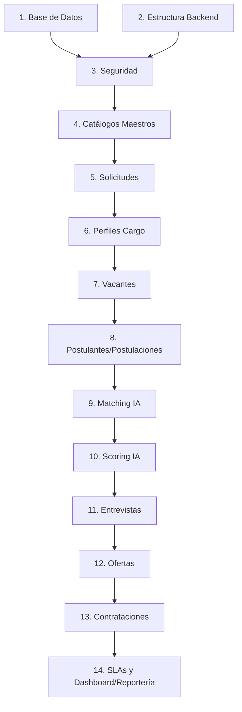

# Plan Maestro de Construcción (Implementation Roadmap)
## Proyecto: Sistema Inteligente de Reclutamiento (SIR) - Nacional Seguros

**Autores:** NacionalSeguros_SolutionArchitect | NacionalSeguros_ProjectManager | NacionalSeguros_TechnicalLead | NacionalSeguros_DevOpsArchitect | NacionalSeguros_ProjectAuditor  
**Fecha:** 2026-06-25  
**Estado:** **APROBADO PARA CONSTRUCCIÓN**  

---

## 1. Objetivos

### 1.1 Objetivo General
Establecer la ruta crítica, arquitectura de despliegue, estrategia DevOps y controles de calidad para la construcción física e integración del **Sistema Inteligente de Reclutamiento (SIR)** de **Nacional Seguros** (Fase 1), garantizando la entrega oportuna de un sistema modular, seguro y de alta disponibilidad.

### 1.2 Objetivos Específicos
*   **Desplegar e integrar la Base de Datos:** Instalar la base de datos relacional y las tablas Ledger sobre SQL Server 2022.
*   **Construir el Core del Backend:** Implementar los servicios y controladores en .NET 8 bajo el estándar Clean Architecture y EF Core 9.
*   **Construir la Interfaz de Usuario:** Implementar las vistas reactivas e intuitivas del portal administrativo en Angular 17+.
*   **Implementar Automatizaciones con n8n:** Orquestar los flujos de integración y la invocación de agentes de IA de forma desacoplada.
*   **Garantizar Cumplimiento de Seguridad:** Cifrar salarios (Always Encrypted), segmentar accesos (RLS predicativos) y resguardar trazas inmutables (Ledger).

### 1.3 Alcance
*   Construcción de los 20 módulos de negocio definidos en el PRD.
*   Integración nativa con n8n y agentes inteligentes.
*   Setup de infraestructura DEV, QA, UAT y PROD.
*   Automatización de pipelines CI/CD.

### 1.4 Exclusiones
*   Integración física con sistemas core de seguros (ej. emisión de pólizas de vida, siniestros).
*   Módulos de inducción funcional extendidos (Fase 2).
*   Soporte a navegadores obsoletos (ej. Internet Explorer).

---

## 2. Estrategia de Desarrollo

### 2.1 Desarrollo por Módulos Funcionales
El sistema se construirá dividiendo las responsabilidades en componentes lógicos independientes (Vertical Slicing), garantizando que cada incremento de software aporte valor de negocio completo (Base de Datos ↔ API Backend ↔ Front Angular ↔ Workflow n8n).

### 2.2 Desarrollo Incremental e Iterativo
Se adopta la metodología ágil Scrum, estructurando la fase de construcción en **6 Sprints de 2 semanas cada uno**. Al finalizar cada iteración, se presentará un incremento funcional potencialmente desplegable para su validación con los usuarios clave.

### 2.3 Integración Continua (CI)
Todo cambio en el código fuente debe pasar por pipelines automatizados que compilen, analicen la calidad estática (SonarQube) y ejecuten el set de pruebas unitarias antes de poder fusionarse con la rama de integración.

### 2.4 Gestión de Dependencias
Para mitigar cuellos de botella, se implementa una estrategia de desarrollo "Bottom-Up" (de abajo hacia arriba) en las capas tecnológicas e "Inception-to-Closure" (del inicio al fin) en el ciclo de vida del candidato:


---

## 3. Orden de Implementación Recomendado

A continuación se define y justifica técnicamente el orden óptimo para construir los 20 módulos del proyecto:

| Orden | Módulo / Componente | Justificación Técnica |
| :---: | :--- | :--- |
| **1** | **Base de Datos** | Define los esquemas físicos, tipos de datos lógicos y relaciones sobre SQL Server 2022. Es el cimiento estructural. |
| **2** | **Infraestructura Backend** | Establece el setup de Clean Architecture de .NET 8 (Domain, Application, Infrastructure, WebAPI) y la configuración de EF Core 9. |
| **3** | **Seguridad** | Habilita autenticación JWT, MFA y la encriptación física Always Encrypted. Bloquea el acceso al resto del API de forma temprana. |
| **4** | **Catálogos Maestros** | Semilla de la parametrización de negocio (Estados, Modalidades, SLAs, Prioridades). Requerido por todas las tablas funcionales. |
| **5** | **Solicitudes** | Módulo de ingreso de requisiciones de personal. Gatilla todo el ciclo de selección en el sistema. |
| **6** | **Perfiles** | Generación y almacenamiento del profesiograma del cargo ligado a la solicitud origen. |
| **7** | **Vacantes** | Configuración operativa de la vacante, cargando salarios cifrados en Always Encrypted y conectando el perfil de cargo. |
| **8** | **Postulantes** | Registro demográfico e inicio de postulaciones de candidatos a vacantes específicas (M:N). |
| **9** | **Matching IA** | Primer filtro inteligente. Compara la descripción del CV contra el perfil de cargo mediante workflows n8n. |
| **10** | **Scoring IA** | Evaluación explicable sobre habilidades y experiencia. Provee el ranking consolidado para la terna. |
| **11** | **Entrevistas** | Módulo de coordinación de agendas y generación automática de links de Microsoft Teams. |
| **12** | **Ofertas** | Emisión formal de ofertas salariales cruzando las pretensiones y las bandas autorizadas de la vacante. |
| **13** | **Contrataciones** | Módulo final de cierre del proceso. Cambia el estado a contratado y gatilla el alta del empleado en el backend. |
| **14** | **SLA** | Motor de cálculo de desvíos y disparador de alertas y escalaciones basado en días hábiles y feriados de Bolivia. |
| **15** | **Dashboards** | Vistas consolidadas de control del Kanban de selección, KPIs operativos y telemetría de IA. |
| **16** | **Reportes** | Exportación de fichas de candidatos, expedientes, KPIs a Excel/PDF y snapshots de métricas agregadas. |
| **17** | **Observabilidad** | Registro de auditorías de negocio Ledger, logs de integración externos y monitoreo de llamadas de API. |
| **18** | **Integraciones** | Implementación de conectores externos (Microsoft Graph API, WhatsApp API, API de LinkedIn). |
| **19** | **Workflows n8n** | Orquestación en tiempo real de todos los eventos desacoplados del sistema (mensajería, callbacks de agentes). |
| **20** | **Optimización y Hardening** | Afinación de planes de ejecución mediante Query Store, compresión de tablas Ledger y auditoría final de penetración. |

---

## 4. Matriz de Dependencias

Esta matriz mapea las interrelaciones críticas entre los módulos para prevenir bloqueos de desarrollo:

| Módulo | Predecesores | Sucesores | Dependencia Técnica (Código/DB) | Dependencia Funcional (Negocio) |
| :--- | :--- | :--- | :--- | :--- |
| **1. Base de Datos** | Ninguno | 2, 3 | Tablas y Filegroups creados físicamente. | Ninguna. |
| **2. Infraestructura Backend** | 1 | 3, 5 | DbContext y Repositorios base configurados. | Estructuración técnica de persistencia. |
| **3. Seguridad** | 1, 2 | 4, 5, 7 | Middleware JWT, RLS predicativos y CEK Always Encrypted. | Acceso seguro según rol del empleado. |
| **4. Catálogos Maestros** | 3 | 5, 8, 14 | Tablas y datos de parámetros disponibles en DB. | Mapeo de estados y seniorities del sistema. |
| **5. Solicitudes** | 3, 4 | 6, 7 | Tabla `Solicitudes` y Stored Procedures operativos. | Existencia de vacantes requiere una solicitud previa. |
| **6. Perfiles** | 5 | 7 | Mapeo de perfiles de cargos en el backend. | Un perfil de cargo se deriva de una solicitud aprobada. |
| **7. Vacantes** | 5, 6 | 8, 9, 12 | Cifrado Always Encrypted de bandas salariales en DB. | Apertura de vacante requiere solicitud aprobada. |
| **8. Postulantes** | 4, 7 | 9, 10, 11 | Tabla M:N `Postulaciones` y datos demográficos en DB. | El candidato debe postularse a una vacante activa. |
| **9. Matching IA** | 7, 8 | 10, 19 | Evento de matching y registro en `AgentExecutions`. | Requiere perfil de cargo y CV del postulante. |
| **10. Scoring IA** | 9 | 11, 15 | Cálculo explicable e inserción en tabla `Scorings`. | Evaluación sobre candidatos filtrados por matching. |
| **11. Entrevistas** | 8, 10 | 12, 18 | Integración con Graph API (Teams) y calendario. | Candidatos deben estar preseleccionados. |
| **12. Ofertas** | 7, 11 | 13 | Cifrado Always Encrypted en `Ofertas.BandaSalarial`. | Emisión de oferta basada en ranking e idoneidad. |
| **13. Contrataciones** | 12 | 14, 15 | Flujos del pipeline a estado final en BD. | Cierre del proceso tras aceptación de la oferta. |
| **14. SLA** | 4, 13 | 15, 16 | Funciones set-based de cálculo de días hábiles. | Monitoreo de tiempos de respuesta en cada fase. |
| **15. Dashboards** | 13, 14 | 16 | Vistas SQL Server optimizadas y queries Dapper. | Consolidación visual de la operación del SIR. |
| **16. Reportes** | 15 | 20 | Generadores de PDF/Excel sobre `MetricSnapshot`. | Exportación de reportes semanales y expedientes. |
| **17. Observabilidad** | 3 | 19, 20 | Tablas Ledger `AuditLogs`, `StateHistory`, `AgentExecutions`. | Auditoría inmutable de transacciones y costos de IA. |
| **18. Integraciones** | 11, 17 | 19 | APIs de conectores externos (WhatsApp/MS Graph). | Canales de notificación automatizados. |
| **19. Workflows n8n** | 9, 18 | 20 | Webhooks de integración y enrutador de eventos. | Orquestación asíncrona de alertas y callbacks de IA. |
| **20. Hardening** | Todos | Ninguno | Query Store activado, compresión y roles afinados. | Seguridad y rendimiento certificados para producción. |

---

## 5. Plan de Iteraciones (6 Sprints de Construcción)

```
[Sprint 1: Cimientos] ──► [Sprint 2: Solicitudes] ──► [Sprint 3: Selección] ──► [Sprint 4: IA Matching] ──► [Sprint 5: Ofertas] ──► [Sprint 6: Analytics]
```

### Iteración 1: Cimientos, Base de Datos y Seguridad (Semanas 1-2)
*   **Objetivo:** Establecer la base técnica operativa del proyecto.
*   **Módulos Incluidos:** 1. Base de Datos, 2. Infraestructura Backend, 3. Seguridad, 4. Catálogos Maestros.
*   **Entregables:** 
    *   Base de datos `SIR_NacionalSeguros` inicializada en SQL Server DEV con filegroups e inmutabilidad Ledger activa.
    *   Arquitectura base del Backend .NET 8 con Dapper/EF Core.
    *   Mapeo de autenticación JWT y MFA en API de Seguridad.
    *   Cifrado de Always Encrypted funcionando localmente (VBS Enclaves simulados).
*   **Riesgos:** Retraso en el aprovisionamiento de certificados locales para Always Encrypted.  
    *   *Mitigación:* Usar el bloque TRY-CATCH del instalador para desarrollo simulado y avanzar con tipos lógicos.
*   **Criterio de Cierre:** Los endpoints de autenticación responden exitosamente y la base de datos se instala al 100% mediante el script maestro.

### Iteración 2: Gestión de Solicitudes y Perfiles de Cargo (Semanas 3-4)
*   **Objetivo:** Construir el primer bloque funcional del flujo de contratación.
*   **Módulos Incluidos:** 5. Solicitudes, 6. Perfiles Cargo, 17. Observabilidad (Logs Ledger).
*   **Entregables:**
    *   API y UI Angular de creación de solicitudes de personal.
    *   Kanban interactivo de Solicitudes de Personal.
    *   Integración de auditoría inmutable de estados de solicitudes en `StateHistory` y logs generales en `AuditLogs` (Ledger).
*   **Riesgos:** Complejidad al realizar queries relacionales en las tablas Ledger por las restricciones del motor.  
    *   *Mitigación:* Configurar queries de solo lectura en EF Core y usar llamadas directas a Stored Procedures para transitar estados.
*   **Criterio de Cierre:** Es posible crear, validar e inmutar solicitudes desde la interfaz web Angular.

### Iteración 3: Sourcing y Registro de Postulantes (Semanas 5-6)
*   **Objetivo:** Habilitar la captación de candidatos y la publicación de ofertas de trabajo.
*   **Módulos Incluidos:** 7. Vacantes, 8. Postulantes/Postulaciones, 18. Integraciones (LinkedIn API base).
*   **Entregables:**
    *   API de creación de vacantes con bandas salariales cifradas.
    *   Expediente digital del candidato en Angular.
    *   Tabla intermedia `Postulaciones` controlando las postulaciones múltiples.
*   **Riesgos:** Colisiones de duplicidad de postulantes por números de documento de identidad.  
    *   *Mitigación:* Validar a través del constraint único `UQ_Postulantes_Documento` y permitir múltiples filas asociadas en `Postulaciones`.
*   **Criterio de Cierre:** Un reclutador puede abrir una vacante y postular a un candidato en la interfaz web de Angular.

### Iteración 4: Inteligencia Artificial y Filtro Curricular (Semanas 7-8)
*   **Objetivo:** Desplegar los asistentes consultivos de Inteligencia Artificial para el filtrado.
*   **Módulos Incluidos:** 9. Matching IA, 10. Scoring IA, 19. Workflows n8n (Integración agentes).
*   **Entregables:**
    *   Flujos n8n para llamado asíncrono a agentes de IA (Solicitud, Matching y Scoring).
    *   Tablas Ledger de gobernanza de IA integradas (`AgentExecutions`, `TokenConsumptions`).
    *   UI de Angular mostrando porcentaje de matching y scoring explicable sin datos personales expuestos.
*   **Riesgos:** Excesivo consumo de tokens en prompts masivos de CVs.  
    *   *Mitigación:* Implementar resúmenes estructurados de CVs en texto antes de enviarlos a n8n y delimitar límites mensuales en `CostTrackings`.
*   **Criterio de Cierre:** Los resultados del matching e idoneidad se guardan en base de datos de forma automática y asíncrona tras la subida de un CV.

### Iteración 5: Agenda de Entrevistas y Emisión de Ofertas (Semanas 9-10)
*   **Objetivo:** Llevar a cabo los flujos finales de selección de los postulantes.
*   **Módulos Incluidos:** 11. Entrevistas, 12. Ofertas, 13. Contrataciones, 18. Integraciones (MS Graph API y WhatsApp).
*   **Entregables:**
    *   Generación de salas de Microsoft Teams integradas con Graph API.
    *   Módulo de creación de ofertas económicas con pretensiones salariales cifradas.
    *   Plantilla y envío de contratos de contratación aprobados.
*   **Riesgos:** Inconsistencia de zonas horarias en la asignación de calendarios Outlook.  
    *   *Mitigación:* Guardar todas las fechas en la base de datos en formato UTC (`DATETIME2` con default `GETUTCDATE()`) y realizar la conversión local en el frontend Angular.
*   **Criterio de Cierre:** Se genera una oferta salarial y se transita la postulación a contratada, emitiendo alertas por correo y WhatsApp.

### Iteración 6: SLAs, Dashboards Analíticos y Hardening (Semanas 11-12)
*   **Objetivo:** Consolidar la observabilidad empresarial y afinar el rendimiento general.
*   **Módulos Incluidos:** 14. SLAs, 15. Dashboards, 16. Reportes, 20. Optimización y Hardening.
*   **Entregables:**
    *   Motor de cálculo de días hábiles set-based resolviendo SLAs.
    *   Vistas del Dashboard ejecutivo integradas con `MetricSnapshot`.
    *   Configuración y tuning de planes de ejecución en Query Store.
    *   Compresión de tablas Ledger in-place con PAGE compression.
*   **Riesgos:** Bloqueo en la ejecución del trigger jerárquico de parámetros bajo alta transaccionalidad.  
    *   *Mitigación:* Limitar la profundidad de recursión a 100 niveles e implementar caché de lectura en el backend.
*   **Criterio de Cierre:** Cero errores de rendimiento en pruebas de estrés concurrentes; todos los reportes muestran datos verídicos y actualizados.

---

## 6. Estrategia de Pruebas (QA Strategy)

Para cumplir con los estándares de calidad de Nacional Seguros, se define la siguiente matriz de aseguramiento:

*   **Pruebas Unitarias (Backend y Frontend):**
    *   *Herramientas:* xUnit, FluentAssertions, NSubstitute (C#) y Jasmine/Karma (Angular).
    *   *Alcance:* Cobertura mínima obligatoria del **80%** en la lógica de negocio (`Application` y `Domain`).
*   **Pruebas de Integración:**
    *   *Herramientas:* Testcontainers (.NET) para levantar instancias efímeras de SQL Server 2022 y validar queries Dapper/EF Core.
    *   *Alcance:* Comprobación de RLS, inserciones Ledger y compatibilidad con enclaves de Always Encrypted.
*   **Pruebas Funcionales (E2E):**
    *   *Herramientas:* Playwright.
    *   *Alcance:* Simulación completa de las 22 Historias de Usuario principales del PRD (desde la creación de la solicitud hasta el alta de la contratación).
*   **Pruebas de Seguridad (Cybersecurity Audit):**
    *   *Herramientas:* SonarQube (SAST), OWASP ZAP (DAST) y auditoría de inyectabilidad SQL.
    *   *Alcance:* Inspección del control de accesos JWT, expiración de sesiones, inmutabilidad de bitácoras y cifrado de datos financieros en reposo.
*   **Pruebas de Rendimiento:**
    *   *Herramientas:* JMeter / k6.
    *   *Alcance:* Simular 150 usuarios concurrentes en el Kanban de Postulaciones y validación del impacto de RLS sobre consultas masivas de base de datos.
*   **Pruebas de Aceptación (UAT):**
    *   *Proceso:* Despliegue en el entorno UAT. Los usuarios finales (RRHH, Decisores, Solicitantes) validarán el sistema basándose en casos de prueba formales.

---

## 7. Estrategia DevOps

### 7.1 Flujo de Git (GitFlow Estándar)
Se utiliza el modelo GitFlow adaptado para asegurar la estabilidad del código en producción:

*   `main`:** Código estable en producción. Solo recibe integraciones desde `release/*` o `hotfix/*`. Cada commit se etiqueta con el número de versión (ej. `v1.0.0`).
*   `develop`:** Rama de integración para desarrollo. Los desarrolladores integran sus características aquí.
*   `feature/*`:** Ramas de trabajo para tareas o HU específicas. Nacen de `develop` y vuelven a `develop` mediante Pull Requests.
*   `release/*`:** Ramas de preparación para producción. Nacen de `develop` para pruebas de QA finales.
*   `hotfix/*`:** Ramas de correcciones urgentes en producción. Nacen de `main` y se fusionan de vuelta a `main` y `develop`.

```
main       ●───────────────────────────────● (v1.0.0)
            \                             /
release      \             ●───●         /
              \           /     \       /
develop        ●───●─────●───────●─────● (v1.1.0-rc1)
                  \     /
feature            ●───●
```

### 7.2 Convención de Commits
Se utilizará la especificación de **Conventional Commits**:
*   `feat: [Módulo] <descripción>` (Para nuevas funcionalidades)
*   `fix: [Módulo] <descripción>` (Para corrección de errores)
*   `docs: [Módulo] <descripción>` (Cambios en la documentación)
*   `test: [Módulo] <descripción>` (Adición o refactorización de pruebas)

### 7.3 Pull Requests y Code Review
*   Las PRs hacia `develop` y `main` requieren la aprobación obligatoria de al menos **2 ingenieros de desarrollo principales (Tech Leads)**.
*   El pipeline de CI debe completarse al 100% de manera exitosa antes de permitir el merge (compilación limpia, SonarQube sin "code smells" y cobertura > 80%).

### 7.4 Pipelines de CI/CD
*   **CI (Integración Continua):** Ejecutado en el orquestador de despliegue configurado para CI/CD ante cada commit en `feature/*` and `develop`. Realiza compilación, linting y pruebas automáticas.
*   **CD (Despliegue Continuo):** Gatillado automáticamente al fusionar código en `develop` (despliega en DEV), al crear una rama `release/*` (despliega en QA) y mediante aprobación manual de tag en `main` (despliega en Producción).

### 7.5 Versionado Semántico
Se adopta **SemVer 2.0.0** bajo la nomenclatura `MAJOR.MINOR.PATCH` (ej. `1.0.2`):
*   `MAJOR`: Cambios incompatibles con la API.
*   `MINOR`: Nuevas funcionalidades compatibles.
*   `PATCH`: Correcciones de errores compatibles.

---

## 8. Definición de Entornos de Despliegue

```
[DEV Local] ──► [QA Integration] ──► [UAT Pre-Prod] ──► [PROD Live]
```

### 8.1 Entorno de Desarrollo (DEV)
*   **Objetivo:** Integración rápida de código y validación por los desarrolladores.
*   **Configuración:** Instancia local de SQL Server 2022, API .NET en contenedores locales y Angular levantado en puerto 4200. n8n en entorno local.
*   **Responsable:** Equipo de Desarrollo (Technical Leads).
*   **Criterio de Promoción:** Aprobación automática de pruebas unitarias y revisión de código estática.

### 8.2 Entorno de Aseguramiento de Calidad (QA)
*   **Objetivo:** Pruebas funcionales de integración y pruebas automatizadas E2E.
*   **Configuración:** Base de datos SQL Server 2022 en servidor centralizado. Always Encrypted configurado localmente.
*   **Responsable:** Equipo de Control de Calidad (QA Lead).
*   **Criterio de Promoción:** Cumplimiento de la cobertura de pruebas de integración y firma de aceptación funcional del QA.

### 8.3 Entorno de Preproducción (UAT)
*   **Objetivo:** Pruebas de aceptación del usuario y simulación de carga real.
*   **Configuración:** Réplica exacta de la arquitectura de producción. Conectado al proveedor corporativo de gestión de secretos para la desencriptación e inyección en enclaves de Always Encrypted.
*   **Responsable:** Administrador del Proyecto (Project Manager) y Product Owner.
*   **Criterio de Promoción:** Firma del acta de aceptación formal por el Negocio (Nacional Seguros).

### 8.4 Entorno de Producción (PROD)
*   **Objetivo:** Operación real del negocio en producción.
*   **Configuración:** Servidores redundantes de base de datos SQL Server 2022 Standard con alta disponibilidad activa. Cifrado Always Encrypted restrictivo e inmutabilidad Ledger completa.
*   **Responsable:** Equipo de Operaciones y DevOps Architect.
*   **Criterio de Promoción:** N/A (Despliegue final con ventana de mantenimiento aprobada).

---

## 9. Criterios de Calidad

### 9.1 Definition of Ready (DoR)
Una Historia de Usuario está lista para entrar al Sprint si cumple con:
*   [ ] Requerimientos funcionales especificados sin ambigüedades.
*   [ ] Criterios de aceptación definidos claramente (formato Given-When-Then).
*   [ ] Mockups de interfaz de usuario (Figma) completados.
*   [ ] Contratos de API (OpenAPI/Swagger) validados y aprobados.

### 9.2 Definition of Done (DoD)
Una funcionalidad se considera terminada si cumple con:
*   [ ] Código compilado limpiamente y sin advertencias severas de compilación.
*   [ ] Pruebas unitarias escritas y pasando satisfactoriamente.
*   [ ] Cobertura de pruebas unitarias mayor o igual al **80%**.
*   [ ] Code Review completada y aprobada por 2 revisores autorizados.
*   [ ] Despliegue exitoso en el entorno de desarrollo y QA.
*   [ ] Trazas de auditoría e inmutabilidad en tablas Ledger comprobadas.

---

## 10. Gestión de Riesgos de Construcción

| ID | Riesgo Identificado | Probabilidad | Impacto | Acción Preventiva | Plan de Contingencia |
| :---: | :--- | :---: | :---: | :--- | :--- |
| **TR-01** | **Bloqueo DDL por error de Always Encrypted local** | Media | 🔴 Alto | Utilizar la estructura de TRY-CATCH del instalador defensivo para omitir Always Encrypted en desarrollo local. | Continuar desarrollo con tipos de datos de texto plano y aplicar encriptación en el pipeline de QA/UAT. |
| **FR-01** | **Resistencia al cambio de flujos por el Kanban** | Baja | 🟠 Medio | Sesiones periódicas de capacitación con el personal de reclutamiento durante los despliegues de sprints. | Habilitar vistas de lista tradicionales paralelas en Angular para usuarios reacios al Kanban. |
| **OR-01** | **Pérdida de trazabilidad de cambios de estados** | Baja | 🔴 Alto | Triggers de base de datos automatizados en las tablas críticas. | Verificar semanalmente las discrepancias entre logs Ledger y tablas operativas. |
| **IR-01** | **Timeouts en llamados de APIs de IA (n8n)** | Alta | 🟠 Medio | Diseñar los llamados a agentes de IA de forma asíncrona mediante webhooks de callback. | Configurar reintentos con retraso exponencial (Backoff) en las colas n8n. |
| **DR-01** | **Incompatibilidad de base de datos en DEV vs PROD** | Baja | 🔴 Alto | Usar contenedores idénticos de SQL Server 2022 Standard en DEV y QA. | Ejecutar dry-runs de los scripts T-SQL de base de datos antes del despliegue en UAT/PROD. |

---

## 11. Cronograma de Ejecución Lógico (Estimación por Semanas)

```
Semana: 01   02   03   04   05   06   07   08   09   10   11   12
        [S1: Cimientos ]
             [S2: Solicitudes ]
                  [S3: Sourcing y Candidatos]
                       [S4: Matching y Scoring IA]
                            [S5: Agendas y Ofertas  ]
                                 [S6: SLAs y Hardening]
```

*   **Semanas 1-2 (Sprint 1):** Configuración de la base de datos SQL Server 2022 Standard, Setup de Clean Architecture .NET 8 e integración del API de Seguridad y roles.
*   **Semanas 3-4 (Sprint 2):** Desarrollo del módulo de Solicitudes, Kanban en Angular y trazas inmutables en Ledger.
*   **Semanas 5-6 (Sprint 3):** Desarrollo del módulo de Vacantes con Always Encrypted y el registro de Postulaciones (M:N).
*   **Semanas 7-8 (Sprint 4):** Orquestación de agentes de IA en n8n, desarrollo de matching y scoring e inmutabilidad de telemetría de IA.
*   **Semanas 9-10 (Sprint 5):** Integración con Graph API (Teams), emisión de Ofertas salariales y módulo de Contrataciones.
*   **Semanas 11-12 (Sprint 6):** Motor de SLAs en base a feriados, poblamiento de `MetricSnapshot`, tuning de Query Store y auditorías de seguridad finales.

---

## 12. Checklist de Preparación para Iniciar el Desarrollo

Antes del inicio oficial del desarrollo, los líderes técnicos deben marcar este checklist:
*   [ ] Servidor SQL Server 2022 Standard aprovisionado para el entorno DEV/QA.
*   [ ] Repositorios Git creados en la plataforma institucional (`sir-backend`, `sir-frontend`, `sir-workflows`).
*   [ ] Estructura de ramas GitFlow establecida y configurada en modo protegido para `main` y `develop`.
*   [ ] Proveedor corporativo de gestión de secretos configurado para UAT/PROD.
*   [ ] Servidores o clusters de n8n instalados y accesibles para desarrollo.
*   [ ] Licencias o SDK de agentes de IA asignadas para los workflows.
*   [ ] SonarQube e instancias de SonarLint aprovisionadas para los desarrolladores.
*   [ ] Documento de arquitectura, diccionarios de datos y scripts físicos distribuidos al equipo de desarrollo.

---
