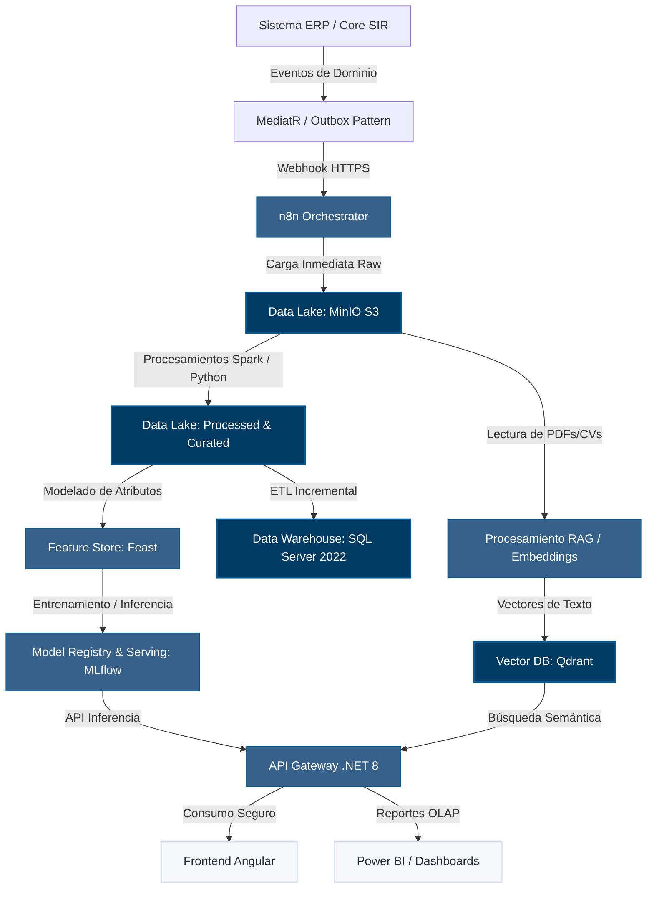
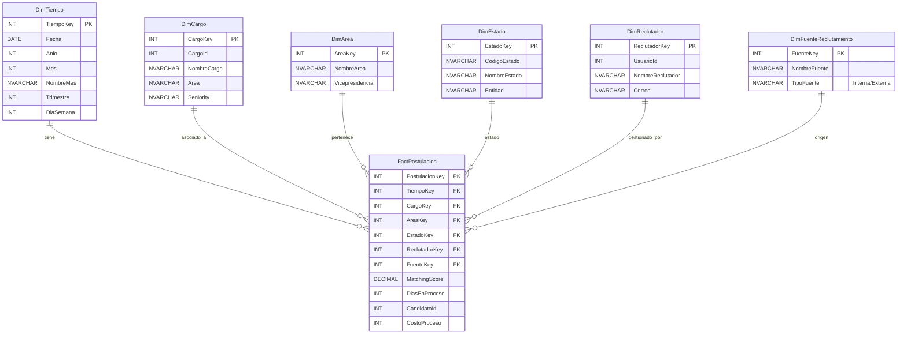
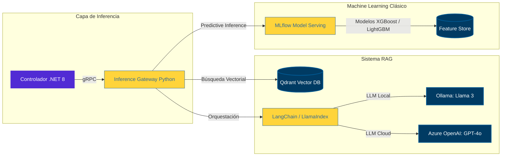

# Módulo 14 – Plataforma de Ciencia de Datos e Inteligencia Artificial

Este documento define la arquitectura, diseño y especificaciones del **Módulo 14 – Plataforma de Ciencia de Datos e Inteligencia Artificial**, concebido como una plataforma transversal de inteligencia analítica y predictiva para el **Sistema Inteligente de Reclutamiento (SIR)** de Nacional Seguros.

---

## 1. Objetivos del Módulo

El objetivo principal es transformar el flujo transaccional del SIR en un ecosistema de decisiones basadas en datos e inteligencia artificial (IA), logrando:
*   **Inteligencia de Negocio Centralizada:** Consolidar datos de solicitudes, vacantes, postulaciones y auditoría en un único repositorio analítico.
*   **Capacidad Predictiva y Prescriptiva:** Anticipar la probabilidad de éxito de candidatos, predecir el riesgo de rotación temprana y sugerir acciones correctivas.
*   **Eficiencia Operativa Automatizada:** Automatizar el cribado de currículos (CVs), evaluar competencias técnicas y psicológicas de manera imparcial y optimizar el emparejamiento (*matching*) candidato-vacante.
*   **Gobernanza de Datos e IA Responsable:** Asegurar el cumplimiento de estándares internacionales de privacidad (GDPR/ISO 27001), evitar sesgos algorítmicos y garantizar la explicabilidad (*Explainable AI - XAI*) de cada modelo.

---

## 2. Alcance

El módulo abarca:
1.  **Ingesta de Datos en Tiempo Real e Histórica:** Captura de eventos transaccionales desde el ERP y el SIR.
2.  **Estructura de Almacenamiento Híbrido:** Un Data Lake para datos no estructurados (CVs, audios de entrevistas) y un Data Warehouse para datos estructurados dimensionales.
3.  **Plataforma de Modelado (ML & GenAI):** Entornos para entrenamiento de modelos predictivos tradicionales (XGBoost, RandomForest) e integración con Modelos de Lenguaje Grandes (LLMs) mediante arquitecturas RAG (Generación Aumentada por Recuperación).
4.  **Operaciones de Machine Learning (MLOps):** Ciclo de vida completo de modelos, control de versiones de datos (DVC), registro de modelos (MLflow) y monitoreo de degradación (*drift*).
5.  **Capa de Consumo Inteligente:** API REST/gRPC en .NET 8 para servir predicciones al Frontend en Angular y Dashboards integrados.

---

## 3. Arquitectura General

El flujo de datos del SIR sigue una arquitectura moderna orientada a eventos (EDA) y arquitectura de datos tipo Lakehouse:



### Componentes del Flujo de Datos

1.  **Sistema ERP / SIR:** Origen transaccional que produce cambios de estado.
2.  **Eventos de Dominio (Outbox Pattern):** Asegura que cada acción confirmada en la base de datos transaccional genere un evento inmutable, garantizando la consistencia del Data Lake.
3.  **Orquestador n8n:** Consume eventos desde colas de mensajería y los distribuye al almacenamiento raw del Data Lake de forma asíncrona.
4.  **Data Lake (MinIO):** Almacena archivos planos, audios de entrevistas y PDFs de currículos.
5.  **Procesos ETL/ELT (Apache Spark / Python):** Limpian, estructuran y transforman los datos de las zonas *Raw* a *Processed* y *Curated*.
6.  **Data Warehouse (SQL Server 2022):** Almacena el modelo dimensional optimizado para consultas analíticas (OLAP).
7.  **Data Catalog (Apache Atlas / Custom Schema):** Mantiene el diccionario de datos, linaje y clasificación de sensibilidad.
8.  **Feature Store (Feast):** Centraliza la definición de características (*features*) para entrenamiento y servicio de modelos, evitando la discrepancia de datos (*training-serving skew*).
9.  **Machine Learning & Model Serving (MLflow / Triton):** Gestiona el ciclo de vida de los modelos predictivos y expone endpoints REST de inferencia.
10. **Vector Database (Qdrant):** Almacena representaciones vectoriales (*embeddings*) de CVs y perfiles de cargo para búsquedas semánticas y emparejamiento.
11. **API de Predicciones (.NET 8):** Actúa como pasarela segura, interactúa con la base vectorial y el servidor de modelos, y expone los resultados de manera unificada.
12. **Dashboard e IA Agent (Angular):** Interfaz gráfica avanzada que consume la API de predicciones y ofrece al usuario interacción conversacional y visualizaciones interactivas.

---

## 4. Data Lake

Diseñado sobre almacenamiento de objetos compatible con S3 (MinIO) para escalabilidad y desacoplamiento de cómputo y almacenamiento.

### Arquitectura de Zonas

| Zona | Propósito | Formato de Almacenamiento | Políticas de Acceso |
| :--- | :--- | :--- | :--- |
| **Raw (Bronze)** | Réplica exacta de los datos de origen (Logs, JSON de eventos, PDFs de CVs sin procesar). | JSON, PDF, WAV, MP4 | Solo escritura de servicios de ingesta. |
| **Processed (Silver)** | Datos limpios, estructurados y validados. Extracción de texto de PDFs realizada. | Apache Parquet | Ingenieros de Datos y Científicos de Datos (Lectura). |
| **Curated (Gold)** | Datos agregados, optimizados para entrenamiento de modelos y analítica compleja. | Apache Parquet / Delta Lake | Científicos de Datos y Analistas de Negocio. |
| **Analytics** | Estructuras dimensionales listas para inserción en el Data Warehouse. | Apache Parquet | Procesos automáticos de carga de DW. |
| **Sandbox** | Espacio de trabajo libre para experimentación y pruebas de hipótesis. | Libre (Parquet, CSV) | Científicos de Datos (Lectura y Escritura). |

### Tipos de Datos y Retención

*   **Curriculums Vitae (CVs):** Almacenados en *Raw* (PDF original) y *Processed* (texto limpio extraído). Retención: 2 años desde el último consentimiento activo del candidato (cumplimiento de protección de datos).
*   **Videos y Audios de Entrevistas:** Formatos compresivos (MP4, WAV). Procesados para extraer transcripciones (*Speech-to-Text*). Retención: 180 días tras el cierre del proceso de selección.
*   **Resultados e Inferencia de IA:** Puntuaciones de coincidencia (*matching scores*), transcripciones y resúmenes de idoneidad. Almacenados en zona *Curated*. Retención: 5 años para análisis de efectividad de modelos.
*   **Vectores y Embeddings:** Representaciones de 1536 dimensiones generadas a partir del texto del CV. Almacenados en la base vectorial Qdrant. Retención: Sincronizada con el ciclo de vida del candidato.

### Gobernanza y Resiliencia del Data Lake

*   **Versionado de Datos (DVC):** Los datasets utilizados para entrenar modelos se versionan usando DVC (*Data Version Control*) enlazado a repositorios Git para garantizar la reproducibilidad científica.
*   **Metadatos Automáticos:** Cada objeto ingresado en el Data Lake se etiqueta con metadatos obligatorios: `Origen`, `FechaIngesta`, `SensibilidadDatos` (Público/Confidencial/Altamente Confidencial), y `IDTransaccion`.
*   **Estrategia de Particionamiento Físico:** Los archivos de datos en MinIO se particionan bajo la estructura `/zona/sistema_origen/entidad/year=YYYY/month=MM/day=DD/` para optimizar las consultas de Spark y limitar el escaneo de objetos innecesarios.
*   **Políticas de Backup y Recuperación ante Desastres (DR):**
    *   **RPO (Objetivo de Punto de Recuperación):** < 24 horas.
    *   **RTO (Objetivo de Tiempo de Recuperación):** < 4 horas para la disponibilidad de servicios de inferencia críticos.
    *   **Replicación:** Configuración de replicación activa-pasiva multi-sitio entre el nodo de MinIO primario (Servidor Principal) y un bucket de respaldo en nube privada o secundaria.
    *   **Respaldo en Frío:** Copia de seguridad semanal completa y diaria incremental con retención bloqueada contra escritura (WORM - Write Once Read Many) durante 90 días para mitigar riesgos de Ransomware.

---

## 5. Data Catalog

El catálogo de datos proporciona una única fuente de verdad sobre el significado y procedencia de los datos analíticos del SIR, estructurado según las directrices de **DAMA-DMBOK**.

```
[Datos de Origen] ──(Linaje de Datos)──> [Procesamiento Silver] ──> [Modelo Dimensional Gold]
       │                                         │                                │
  (Owner: RRHH)                            (Steward: TI)                    (Owner: Finanzas)
  (Sensibilidad: PII)                      (Calidad: 99.9%)                 (Retención: 5 años)
```

### Roles de Gobierno

*   **Data Owners (Propietarios de Datos):** Gerente de Recursos Humanos (para datos de postulantes y evaluaciones) y Gerente de Operaciones (para métricas operativas de reclutadores). Tienen la autoridad de aprobación sobre quién hace uso de los datos.
*   **Data Stewards (Custodios de Datos):** Ingeniero de Datos Líder. Responsable de garantizar que se cumplan las reglas de calidad, almacenamiento y linaje definidas por los propietarios.

### Clasificación y Sensibilidad de Datos

*   **Altamente Confidencial (PII - Información de Identificación Personal):** Nombres, direcciones, correos, documentos de identidad, y pretensiones salariales. Requiere enmascaramiento dinámico en consultas analíticas ordinarias.
*   **Confidencial:** Evaluaciones psicométricas, comentarios de entrevistadores, históricos de desempeño.
*   **Interno:** Nombres de cargos, descripciones de vacantes, catálogo de universidades.

### Reglas de Calidad del Dato (Data Quality - DQ)

*   **Integridad:** Cero registros huérfanos entre hechos de postulación y dimensiones de tiempo o cargo.
*   **Precisión:** El campo `Correo` debe cumplir con expresión regular de formato válido.
*   **Consistencia:** El estado de una postulación en el Data Warehouse no puede tener una discrepancia de más de 15 minutos con respecto al sistema transaccional.
*   **Completitud:** Las métricas de tiempo de contratación (*Time-to-Hire*) no deben contener valores nulos en procesos finalizados.

### Linaje de Datos e Integración de Catálogo

Para cumplir con el linaje de datos de extremo a extremo:
*   **Mapeo de Linaje:** Se implementará **OpenLineage** integrado con los trabajos de Spark y scripts de Python. Cada transformación registrará los datasets de entrada, el código del job ejecutado y el dataset resultante.
*   **Catálogo y Consulta:** Los metadatos y relaciones de linaje se persistirán en **Apache Atlas**, permitiendo a los *Data Stewards* realizar análisis de impacto visual ante cualquier cambio estructural en las tablas transaccionales de SQL Server.

---

## 6. Modelo de Datos Analítico

Diseñado en el Data Warehouse bajo un modelo de **Esquema en Estrella (Star Schema)** optimizado para consultas analíticas rápidas y análisis en cubos OLAP.



### Dimensiones Principales

1.  **DimTiempo:** Jerarquía de `Fecha` -> `Día` -> `Mes` -> `Trimestre` -> `Año`. Incluye banderas de días hábiles y festivos de Bolivia.
2.  **DimCargo:** Detalle de cargos con atributos de jerarquía (`NombreCargo`, `FamiliaCargo`, `NivelJerarquico`).
3.  **DimArea:** Estructura organizacional (`Area`, `Departamento`, `Division`, `Vicepresidencia`).
4.  **DimCompetencia:** Catálogo de habilidades evaluadas (`NombreCompetencia`, `Tipo` [Blanda/Técnica], `NivelRequerido`).
5.  **DimUniversidad:** Catálogo de centros de estudio (`NombreInstitucion`, `Tipo` [Pública/Privada], `Ubicación`).
6.  **DimFuenteReclutamiento:** Origen del candidato (`LinkedIn`, `Trabajito.com.bo`, `Referido Interno`, `Portal Corporativo`).

### Tablas de Hechos (Fact Tables)

*   **FactPostulacion:** Mide el ingreso y avance de candidatos.
    *   *Medidas:* `CantidadPostulantes`, `PromedioMatchingScore`, `DiasEnEstadoActual`.
*   **FactEntrevista:** Registro detallado de la fase de entrevistas.
    *   *Medidas:* `CantidadEntrevistas`, `CalificacionPromedio`, `DesviacionCalificaciones`.
*   **FactContratacion:** Registra los ingresos efectivos.
    *   *Medidas:* `CantidadContratados`, `SalarioPactado`, `TiempoParaContratar` (*Time-to-Hire*).
*   **FactRotacion:** Mide la salida de personal contratado a través del sistema.
    *   *Medidas:* `CantidadBajas`, `PermanenciaDias`, `MotivoSalida` (Voluntaria/Involuntaria).

### Indicadores Clave de Rendimiento (KPIs)

$$Time\ to\ Fill = \frac{\sum (Fecha\ Contratación - Fecha\ Aprobación\ Solicitud)}{Total\ Vacantes\ Cubiertas}$$

$$Quality\ of\ Hire\ (QoH) = \frac{EvaluacionDesempenio1erAnio + TasaRetencion1erAnio + TiempoRampa}{3}$$

$$Tasa\ de\ Aceptacion\ de\ Ofertas = \frac{Ofertas\ Aceptadas}{Total\ Ofertas\ Emitidas} \times 100$$

### Estrategia de Historización (SCD) y Particionado

*   **Dimensiones de Cambios Lentos (Slowly Changing Dimensions - SCD):** Las dimensiones `DimCargo` y `DimArea` se implementarán como **SCD Tipo 2**. Cada cambio en los atributos (ej. cambio de dependencia de un cargo) generará una nueva fila en la dimensión con campos `FechaInicio`, `FechaFin` e `IsCurrent = 0/1`. Esto asegura que los reportes de hechos pasados se sigan asociando con los atributos vigentes al momento del evento.
*   **Particionado del Data Warehouse:** La tabla `FactPostulacion` y la tabla de auditoría `FactAuditoria` en SQL Server 2022 se particionarán horizontalmente por mes utilizando una función de partición basada en la columna `TiempoKey` (fecha). Esto optimiza los tiempos de respuesta de Power BI al limitar el escaneo de datos a los meses bajo análisis.

---

## 7. Plataforma Analítica

Proporciona capacidades analíticas avanzadas a diferentes niveles de la organización mediante Power BI integrado (*Embedded*) en el Frontend de Angular.

### Capacidades de Navegación Analítica

*   **Drill-Down:** Permite pasar de ver métricas a nivel de Vicepresidencia, hacer doble clic para abrir el detalle de Áreas, y finalmente llegar a nivel de Solicitud de Contratación individual.
*   **Drill-Through:** Seleccionar un Reclutador específico en un gráfico de barras de rendimiento y navegar automáticamente a una página de detalle con su historial de vacantes activas y tasas de conversión de candidatos.
*   **Análisis Temporal Integrado:** Comparativas año a año (*Year-Over-Year*) y de periodo actual frente a periodo anterior (*Month-Over-Month*) para identificar estacionalidad en las solicitudes de empleo.

### Tipos de Dashboards y Audiencias

```
┌────────────────────────────────────────────────────────┐
│               DASHBOARD DE PRESIDENCIA                 │
│  [QoH: 87%]    [Cost-per-Hire: $350]    [Time-to-Fill: 24d]  │
└───────────────────────────┬────────────────────────────┘
                            │ (Drill-Down)
┌───────────────────────────▼────────────────────────────┐
│                  DASHBOARD DE GERENCIA                 │
│  [Conversión: 12%]   [LinkedIn: 45%]   [Desviación SLA: +2d] │
└───────────────────────────┬────────────────────────────┘
                            │ (Drill-Through)
┌───────────────────────────▼────────────────────────────┐
│                 DASHBOARD DE OPERACIONES               │
│  [Reclutador: Juan]  [Vacantes Activas: 5]  [Entrevistas: 8] │
└────────────────────────────────────────────────────────┘
```

1.  **Dashboard Ejecutivo (Presidencia / Directores):** Indicadores macro de salud de talento. Foco en `Costo total de reclutamiento`, `Tiempo de cobertura promedio` e `Índice de permanencia al primer año`.
2.  **Dashboard de Gestión de RRHH (Gerencia de Talento Humano):** Seguimiento a la eficiencia del equipo de reclutadores, distribución de canales de reclutamiento y cumplimiento de políticas de diversidad e inclusión.
3.  **Dashboard Operativo (Reclutadores):** Vista diaria con vacantes activas asignadas, cuellos de botella en el pipeline (ej. candidatos atascados en fase de pruebas por más de 5 días) y alertas de SLA.

---

## 8. Arquitectura de IA

El SIR utiliza un enfoque híbrido de Inteligencia Artificial que combina modelos predictivos de Machine Learning clásicos con capacidades avanzadas de IA Generativa.



### Arquitectura RAG (Generación Aumentada por Recuperación)

Para responder preguntas sobre la idoneidad de un candidato o contrastar su perfil con las políticas internas de Nacional Seguros:
1.  **Ingesta de Documentos:** El texto extraído de los currículos se fragmenta (*chunking*) en bloques de 500 caracteres con un solape de 50 caracteres.
2.  **Generación de Embeddings:** Se utiliza el modelo `text-embedding-3-small` de OpenAI o un modelo local `all-MiniLM-L6-v2` ejecutado en Ollama.
3.  **Almacenamiento Vectorial:** Los vectores se indexan en **Qdrant** utilizando una métrica de distancia de coseno para calcular la similitud.
4.  **Recuperación y Contextualización:** Al analizar una postulación, el sistema recupera los 5 fragmentos de currículos más relevantes y los inyecta en el *prompt* enviado al LLM junto con la descripción del cargo.

### Agente de IA Conversacional (Agentic AI)

Diseñado utilizando patrones de diseño de agentes reactivos de IA:
*   **Memoria de Trabajo:** Persistida en Redis para mantener el contexto de la conversación del reclutador durante la evaluación del candidato.
*   **Skills (Herramientas del Agente):**
    *   `BuscarCandidatosSimilares`: Realiza consultas vectoriales en Qdrant.
    *   `ProgramarEntrevista`: Llama a la API del SIR para agendar en Microsoft Outlook.
    *   `GenerarPreguntasFiltro`: Llama al LLM para crear una guía de entrevista personalizada basada en las brechas identificadas en el CV del candidato.

---

## 9. Machine Learning

El desarrollo de modelos predictivos sigue la metodología estándar de la industria **CRISP-DM**.

```
  [Ingesta de Datos] 
          │
          ▼
 [Feature Engineering] ──> (Codificación One-Hot, Escalado MinMax)
          │
          ▼
  [Entrenamiento] ─────> (LightGBM, XGBoost, RandomForest)
          │
          ▼
   [Validación] ───────> (Métricas: AUC-ROC > 0.82, F1-Score)
          │
          ▼
   [Explicabilidad] ───> (Valores SHAP para justificar decisiones)
```

### Modelos en Producción

#### 1. Modelo de Ranking y Coincidencia (*Matching*)
*   **Algoritmo:** XGBoost Ranker / LightGBM.
*   **Entrada:** Características del candidato (experiencia en años, palabras clave del perfil, nivel educativo) y requisitos de la vacante.
*   **Salida:** Score de coincidencia de 0 a 100.

#### 2. Modelo de Predicción de Éxito (*Quality of Hire Predictor*)
*   **Algoritmo:** Random Forest Classifier.
*   **Entrada:** Resultados de pruebas técnicas, puntuaciones psicométricas, universidad de procedencia y concordancia de seniority.
*   **Salida:** Probabilidad de que el candidato obtenga una calificación de desempeño superior a "Cumple Expectativas" en su primera evaluación anual.

#### 3. Modelo de Permanencia y Fuga Temprana (*Retention Predictor*)
*   **Algoritmo:** Regresión de Cox (Análisis de Supervivencia) / Random Survival Forests.
*   **Entrada:** Distancia de la vivienda a la oficina de Nacional Seguros, tiempo de rampa, salario ofrecido vs pretensión salarial original, y consistencia del plan de carrera.
*   **Salida:** Curva de probabilidad de permanencia a los 90, 180 y 365 días de contratación.

### Explicabilidad del Modelo (Explainable AI - XAI)

Es requisito obligatorio que ningún modelo actúe como una "caja negra" (*black box*). 
*   **Valores SHAP (SHapley Additive exPlanations):** Para cada score de coincidencia o ranking generado, la API de Predicciones calculará los valores SHAP correspondientes.
*   **Visualización en Frontend:** La interfaz de usuario del reclutador mostrará los 3 principales factores positivos y los 2 principales factores negativos que influyeron en la recomendación del modelo (ej. *"+15% debido a experiencia en seguros generales"*, *"-5% por falta de certificación SQL"*).

---

## 10. Feature Store

Se implementa utilizando **Feast** como componente centralizado de ingeniería de características.

*   **Offline Store (SQL Server 2022 / Parquet):** Utilizado para el entrenamiento de modelos por lotes (*batch training*). Permite consultar características históricas con consistencia temporal (*point-in-time correctness*), evitando la fuga de datos del futuro (*data leakage*).
*   **Online Store (Redis):** Utilizado para inferencia en tiempo real de baja latencia (< 15ms). El SIR consulta las características actualizadas de un candidato al instante de visualizar su expediente.

### Características Clave Registradas

*   `candidato_promedio_permanencia_empleos_anteriores`
*   `candidato_coincidencia_tecnologica_score`
*   `cargo_tiempo_promedio_cobertura_area`
*   `reclutador_tasa_conversion_historica`

---

## 11. MLOps

Garantiza la automatización, monitoreo y confiabilidad de los modelos de inteligencia artificial en producción.

```
                  ┌─────────────────────────────────────────┐
                  │          MLflow Model Registry          │
                  │   [Candidate_Ranker: v2.1.0-prod]       │
                  └────────────────────┬────────────────────┘
                                       │ (Inferencia)
┌──────────────────────────┐           ▼           ┌──────────────────────────┐
│     Evidently AI         ├───────────────────────┤     Grafana Dashboard    │
│  [Drift Detect: YES]     │                       │  [Latencia Inferencia]   │
└────────────┬─────────────┘                       └────────────┬─────────────┘
             │ (Gatillo)                                        │ (Alerta)
             ▼                                                  ▼
[Reentrenamiento Automático]                           [Rollback a v2.0.9]
```

### Ciclo de MLOps y Herramientas

1.  **Control de Versiones de Modelos (Model Registry):** Gestionado mediante **MLflow**. Ningún modelo se despliega en producción sin estar registrado bajo un estado de aprobación formal (`Staging` -> `Production`).
2.  **Monitoreo de Degradación (Drift Detection):** Utiliza **Evidently AI** para evaluar semanalmente si los datos de los nuevos postulantes se desvían de los datos de entrenamiento originales (*Data Drift*) o si la relación entre las características y el target ha cambiado (*Concept Drift*).
3.  **Estrategias de Despliegue:**
    *   **Canary Deployments:** El nuevo modelo de ranking recibe inicialmente el 10% del tráfico de postulaciones para validar rendimiento técnico y de negocio.
    *   **Rollback Automático:** Si el tiempo de respuesta de inferencia supera los 200ms en el percentil 95 (P95) o la tasa de error de predicción supera el 5%, el API Gateway de .NET revierte automáticamente el tráfico al modelo anterior.

---

## 12. Seguridad, Ética y Privacidad

Diseñado bajo el principio de **Privacidad por Diseño** (Privacy by Design) y cumplimiento de estándares rigurosos de seguridad de la información.

### Seguridad Física y Lógica

*   **Cifrado de Datos:** Datos en reposo en el Data Lake y Data Warehouse cifrados mediante AES-256. Comunicaciones en tránsito mediante TLS 1.3 obligatoriamente.
*   **Control de Acceso Basado en Roles (RBAC):** Integración con Microsoft Entra ID. Los científicos de datos no tienen acceso directo a la zona de datos *Raw* (donde hay información personal identificable) sin un proceso previo de aprobación y auditoría.

### IA Responsable y Mitigación de Sesgos

*   **Anonimización y Enmascaramiento:** Antes de enviar datos al Feature Store o entrenar modelos, el pipeline de ingeniería de datos elimina características sensibles como: `Género`, `Edad`, `Fotografía`, `Dirección exacta`, `Estado Civil` y `Religión`.
*   **Evaluación de Sesgo (Fairness Metrics):** Evaluacion del impacto del modelo utilizando la métrica de **Diferencia de Tasa de Selección (Disparate Impact Ratio)**. Si el modelo aprueba a un grupo demográfico a una tasa menor al 80% con respecto al grupo mayoritario, el modelo se bloquea automáticamente y no puede ser promovido a producción.
*   **Pista de Auditoría Completa (Audit Trail):** Cada predicción e inferencia de modelo se registra en la tabla `AuditLogs` del SIR, detallando: `IDModelo`, `VersionModelo`, `InputsEnviados`, `PrediccionRetornada`, `UsuarioDestinatario` y `FechaHora`.

---

## 13. Diseño de Dashboards

### 1. Dashboard de Control de Calidad del Talento (RRHH)
*   **KPIs:** `Quality of Hire` (Calidad de Contratación), `Tasa de Retención Temprana` (90 días), `Índice de Diversidad e Inclusión`.
*   **Visualizaciones:**
    *   Gráfico de dispersión (*Scatter Plot*) comparando el desempeño del colaborador al año vs. el Score de Coincidencia de IA obtenido durante su postulación.
    *   Embudo (*Funnel*) de conversión de candidatos por canal de reclutamiento.
*   **Alertas de IA:** Identificación de áreas con alta probabilidad de fuga de personal técnico clave en los próximos 6 meses.

### 2. Dashboard de Eficiencia Operativa (Gerencia de Operaciones)
*   **KPIs:** `Time-to-Fill` (Tiempo de cobertura), `Costo de Adquisición de Talento` (Cost-per-Hire), `Eficiencia del Reclutador` (Vacantes cerradas/SLA).
*   **Visualizaciones:**
    *   Diagrama de Gantt interactivo que muestra las fases de las vacantes activas.
    *   Gráfico de líneas con proyección predictiva de la carga de trabajo del equipo de selección para el próximo trimestre.

---

## 14. Casos de Uso Detallados

### Caso de Uso 1: Cribado Inteligente y Ranking de Candidatos

```
[CVs en PDF] ──> [Extracción OCR] ──> [Generación de Embeddings] ──> [Similitud Coseno vs Perfil]
                                                                                │
                                                                                ▼
                                                                     [Top N Candidatos Ordenados]
```

*   **Flujo:**
    1.  El candidato sube su CV en formato PDF.
    2.  El sistema procesa el documento, extrae el texto limpio y genera su vector de embeddings en Qdrant.
    3.  El modelo calcula la distancia de coseno entre el vector del candidato y el vector de la vacante (generado a partir de la descripción del cargo en Stitch).
    4.  El modelo de machine learning ajusta el score considerando variables adicionales (años de experiencia específica en seguros).
    5.  El reclutador visualiza la lista de candidatos ordenada de mayor a menor idoneidad con una explicación clara de la recomendación de la IA.

### Caso de Uso 2: Alerta de Fuga Temprana de Colaboradores
*   **Flujo:**
    1.  Mensualmente, el modelo de supervivencia analiza el perfil de los colaboradores contratados en los últimos 12 meses.
    2.  Evalúa variables como: cambio de funciones, distancia de transporte, desempeño en pruebas iniciales y brecha salarial de mercado.
    3.  Si la probabilidad de permanencia a los 180 días cae por debajo del 65%, el sistema genera una alerta confidencial en el Dashboard del Gerente de RRHH.
    4.  La plataforma prescribe acciones de retención sugeridas (ej. *Alineación salarial*, *Plan de capacitación activo*).

### Caso de Uso 3: Detección de Anomalías y Fraude en Pruebas Técnicas
*   **Algoritmo:** Isolation Forest / Local Outlier Factor (LOF).
*   **Flujo:**
    1.  Durante la realización de las pruebas técnicas en línea en el portal del postulante, el Frontend en Angular registra telemetría detallada del comportamiento del usuario:
        *   Tiempo de respuesta por pregunta.
        *   Frecuencia de eventos de pérdida de foco (clics fuera de la pestaña de la prueba).
        *   Cambios rápidos de portapapeles (copiar/pegar).
        *   Patrones anormales de velocidad de escritura (potencial uso de herramientas automatizadas).
    2.  Estos datos se transmiten de forma asíncrona hacia el Data Lake y se registran como características temporales en el Feature Store.
    3.  Al finalizar la prueba, el servicio de inferencia ejecuta el modelo de detección de anomalías sobre el vector de comportamiento de la sesión.
    4.  Si el score de anomalía es superior al umbral establecido (0.75), la postulación se marca automáticamente con una bandera de advertencia (*"Alerta de Telemetría Anómala"*).
    5.  El reclutador visualiza en la ficha del postulante el aviso de alerta junto con el gráfico de desviación, permitiéndole tomar la decisión de invalidar la prueba o realizar una entrevista técnica de validación presencial.

---

## 15. Roadmap de Implementación

El despliegue de la Plataforma de Datos e IA se ejecutará en 7 fases estratégicas para asegurar el retorno de inversión (ROI) continuo:

```
Fase 1: BI & Data Warehouse ──────────────> (Mes 1 - 2)
Fase 2: Data Lake & ETLs ─────────────────> (Mes 3 - 4)
Fase 3: Machine Learning (Matching) ──────> (Mes 5 - 6)
Fase 4: IA Generativa (RAG & CV Screening) > (Mes 7 - 8)
Fase 5: Agentes de IA Conversacionales ───> (Mes 9 - 10)
Fase 6: Analítica Prescriptiva ───────────> (Mes 11 - 12)
Fase 7: IA Autónoma de Selección ─────────> (Mes 13+)
```

*   **Fase 1 – Inteligencia de Negocio Básica (Mes 1-2):** Implementación del modelo dimensional en SQL Server 2022 y desarrollo de los primeros Dashboards en Power BI.
*   **Fase 2 – Cimiento de Datos (Mes 3-4):** Configuración de MinIO como Data Lake, implementación de n8n para ingesta de eventos e instalación de pipelines de Spark en Python para estructuración.
*   **Fase 3 – Machine Learning Predictivo (Mes 5-6):** Entrenamiento y despliegue del modelo de Ranking y Coincidencia utilizando XGBoost y MLflow.
*   **Fase 4 – Integración con IA Generativa (Mes 7-8):** Implementación de la base vectorial Qdrant y desarrollo del RAG para lectura inteligente de currículos.
*   **Fase 5 – Agente de IA para Reclutadores (Mes 9-10):** Habilitación del asistente conversacional en la interfaz de Angular para responder dudas sobre candidatos.
*   **Fase 6 – Analítica Prescriptiva (Mes 11-12):** Despliegue de modelos de predicción de fuga y recomendación de acciones de retención de talento.
*   **Fase 7 – IA Autónoma (Mes 13+):** Habilitación de agentes capaces de realizar el primer contacto con candidatos y evaluar respuestas iniciales de forma autónoma.

---

## 16. Stack Tecnológico Propuesto

La plataforma se basa en tecnologías empresariales y de código abierto robustas:

*   **Capa de Servicios y Orquestación:**
    *   **Core API:** .NET 8 (C#) por su alto rendimiento, seguridad corporativa y facilidad de integración con la infraestructura de Nacional Seguros.
    *   **Pipeline de Ingesta:** **n8n** por su facilidad para conectar flujos visuales de eventos con colas de mensajería y almacenamiento en la nube.
*   **Capa de Datos:**
    *   **Data Warehouse:** **SQL Server 2022** con soporte para consultas analíticas directas y almacenamiento en columnas.
    *   **Data Lake:** **MinIO** instalado localmente o en nube privada, garantizando almacenamiento compatible con la API de Amazon S3 sin costes de salida de datos.
    *   **Base de Datos Vectorial:** **Qdrant** por su extraordinaria velocidad para búsquedas semánticas sobre millones de registros vectoriales.
*   **Capa de Inteligencia Artificial y Machine Learning:**
    *   **Procesamiento y Modelado:** **Python 3.11** junto con librerías estándar de la ciencia de datos (Scikit-Learn, LightGBM, XGBoost, Pandas, PySpark).
    *   **Model Serving & MLOps:** **MLflow** para el ciclo de vida completo y registro de modelos de Machine Learning.
    *   **IA Generativa Local:** **Ollama** (ejecutando modelos abiertos Llama 3 o Mistral) para tareas de clasificación de bajo costo y privacidad de datos sensible.
    *   **IA Generativa Cloud:** **Azure OpenAI Service (GPT-4o)** para razonamiento complejo de candidatos y resúmenes de idoneidad corporativa.
*   **Capa de Visualización y Frontend:**
    *   **Frontend:** **Angular 22** con componentes interactivos.
    *   **Visualización de Datos:** **Power BI Embedded** para los dashboards ejecutivos y operativos integrados en el portal.

---

## 17. Gestión de Riesgos del Módulo

| Riesgo Identificado | Impacto | Mitigación Propuesta |
| :--- | :--- | :--- |
| **Sesgo en Algoritmos de Selección** | Alto | Eliminación activa de variables demográficas en el Feature Store. Auditoría trimestral de Diferencia de Tasa de Selección (*Disparate Impact Ratio*). |
| **Fuga de Datos Sensibles (PII)** | Alto | Enmascaramiento de datos personales en base de datos. Cifrado AES-256 estricto y políticas de aislamiento de red para la base de datos vectorial Qdrant. |
| **Degradación del Modelo (*Model Drift*)** | Medio | Alertas automáticas semanales a través de **Evidently AI** y procesos de reentrenamiento programados con nuevos datos reales. |
| **Bajo Consumo por Reclutadores (Falta de Confianza)** | Medio | Explicabilidad del modelo mediante valores SHAP visibles en pantalla. Capacitación activa al equipo de RRHH sobre el rol del modelo como asistente, no como decisor final. |
