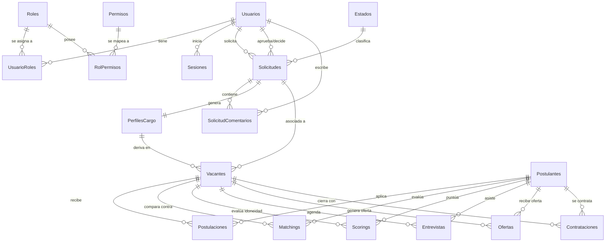
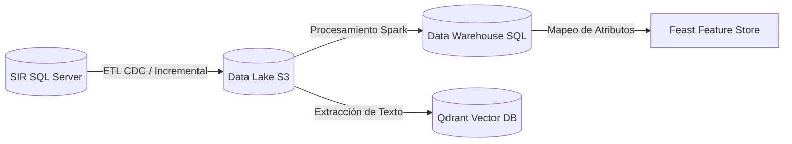

# Diccionario de Datos Oficial - Sistema Integrado de Reclutamiento (SIR)

Este documento constituye el **Diccionario de Datos Oficial** del **Sistema Integrado de Reclutamiento (SIR)** de Nacional Seguros, elaborado bajo los estándares internacionales de gobernanza de datos **DAMA-DMBOK2** y el marco de arquitectura empresarial **TOGAF 10**.

---

## 1. Introducción

### 1.1. Objetivo
Garantizar una única fuente de verdad respecto a la estructura, relaciones, semántica, seguridad y calidad de los datos del SIR. Sirve como referencia para los equipos de Desarrollo Backend (.NET 8), Frontend (Angular), Automatización (n8n), Analítica (Power BI) y la Plataforma de Ciencia de Datos e Inteligencia Artificial.

### 1.2. Alcance
Este diccionario cubre la base de datos relacional transaccional y de auditoría inmutable (`SIR_NacionalSeguros`) ejecutada en **SQL Server 2022 Standard/Developer Edition**.

### 1.3. Convenciones de Nomenclatura
*   **Tablas:** Plural, PascalCase (ej. `Usuarios`, `PerfilesCargo`).
*   **Columnas:** Singular, PascalCase (ej. `UsuarioId`, `Cargo`).
*   **Llaves Primarias:** `[NombreTablaSingular]Id` (ej. `SolicitudId`), excepto en tablas relacionales compuestas (ej. `RolId`, `PermisoId`).
*   **Llaves Foráneas:** Mismo nombre que la PK a la que apuntan (ej. `EstadoId`).
*   **Restricciones (Constraints):**
    *   Primary Key: `PK_[Tabla]`
    *   Foreign Key: `FK_[TablaOrigen]_[TablaDestino]_[Columna]`
    *   Default: `DF_[Tabla]_[Columna]`
    *   Unique: `UQ_[Tabla]_[Columna]`

### 1.4. Estándares y Marcos Utilizados
*   **DAMA-DMBOK2:** Clasificación de seguridad, gobernanza de metadatos y reglas de calidad de datos.
*   **TOGAF 10:** Alineación de la arquitectura de datos con la arquitectura de negocios y aplicaciones.
*   **ISO 27001 / ISO 42001:** Políticas de protección de datos personales, sensibles y de modelos de IA.
*   **SQL Server Ledger:** Uso de tablas del sistema inmutables con tecnología blockchain (`LEDGER = ON`).

---

## 2. Inventario General de Entidades

A continuación se presenta el catálogo completo de las entidades físicas implementadas en la base de datos:

| Nombre Funcional | Nombre Físico | Módulo Propietario | Tipo de Entidad | Descripción | Dependencias |
| :--- | :--- | :--- | :--- | :--- | :--- |
| **Rol** | `Roles` | Seguridad | Catálogo | Define los roles del sistema (Admin, RRHH, etc.). | Ninguna |
| **Permiso** | `Permisos` | Seguridad | Catálogo | Permisos granulares de acceso a endpoints/pantallas. | Ninguna |
| **Rol-Permiso** | `RolPermisos` | Seguridad | Relacional (M:N) | Asociación intermedia de permisos por cada rol. | `Roles`, `Permisos` |
| **Usuario** | `Usuarios` | Seguridad | Transaccional | Datos de usuarios del sistema (locales o Active Directory). | Ninguna |
| **Usuario-Rol** | `UsuarioRoles` | Seguridad | Relacional (M:N) | Roles asignados a los usuarios del sistema. | `Usuarios`, `Roles` |
| **Sesión** | `Sesiones` | Seguridad | Transaccional | Gestión de Refresh Tokens y sesiones activas. | `Usuarios` |
| **SLA** | `SLAs` | Parametrización | Configuración | Define los tiempos máximos (en días) de atención por módulo. | Ninguna |
| **Catálogo** | `Catalogos` | Parametrización | Catálogo | Definición de grupos de parámetros del sistema. | Ninguna |
| **Parámetro** | `Parametros` | Parametrización | Catálogo | Valores detallados y jerárquicos de los catálogos. | `Catalogos` |
| **Estado** | `Estados` | Parametrización | Catálogo | Estados de las máquinas de estados (Solicitudes, Vacantes, etc.).| `SLAs` |
| **Feriado** | `Feriados` | Parametrización | Configuración | Calendario de días no laborables para cálculo de SLAs. | Ninguna |
| **Solicitud** | `Solicitudes` | Solicitudes | Transaccional | Solicitud inicial de personal realizada por el área. | `Usuarios`, `Estados` |
| **Comentario de Solicitud**| `SolicitudComentarios`| Solicitudes | Transaccional | Hilo de comunicación y observaciones sobre solicitudes. | `Solicitudes`, `Usuarios` |
| **Perfil de Cargo** | `PerfilesCargo` | Perfiles | Transaccional | Profesiograma estructurado generado para el cargo. | `Solicitudes`, `Estados` |
| **Vacante** | `Vacantes` | Vacantes | Transaccional | Proceso de contratación activo derivado de una solicitud. | `PerfilesCargo`, `Solicitudes`, `Estados` |
| **Postulante** | `Postulantes` | Postulantes | Transaccional | Datos demográficos y de contacto de un candidato. | Ninguna |
| **Postulación** | `Postulaciones` | Postulantes | Transaccional | Registro de aplicación de un candidato a una vacante. | `Postulantes`, `Vacantes`, `Estados` |
| **Matching Curricular** | `Matchings` | IA y Datos | Analítica | Resultado de la evaluación semántica del CV contra el perfil. | `Postulantes`, `Vacantes`, `AgentExecutions` |
| **Scoring Explicable** | `Scorings` | IA y Datos | Analítica | Puntuaciones de idoneidad y justificación generadas por IA. | `Postulantes`, `Vacantes`, `AgentExecutions` |
| **Entrevista** | `Entrevistas` | Agenda | Transaccional | Coordinación y enlace de citas con candidatos. | `Vacantes`, `Postulantes`, `Estados` |
| **Oferta** | `Ofertas` | Ofertas | Transaccional | Propuesta económica y condiciones enviadas al postulante. | `Postulantes`, `Vacantes`, `Estados` |
| **Contratación** | `Contrataciones` | Ofertas | Transaccional | Cierre del proceso y alta efectiva del postulante. | `Postulantes`, `Vacantes` |
| **Agente de IA** | `Agentes` | IA y Datos | Catálogo | Catálogo de agentes cognitivos del sistema. | Ninguna |
| **Prompt** | `Prompts` | IA y Datos | Configuración | Plantillas maestras de instrucciones para LLMs. | Ninguna |
| **Versión de Prompt** | `PromptVersions` | IA y Datos | Configuración | Control de cambios y versionamiento de instrucciones. | `Prompts` |
| **Ejecución de Modelo** | `ModelExecutions` | IA y Datos | Auditoría | Registro técnico de latencias y consumo de APIs de LLMs. | `AgentExecutions` |
| **Consumo de Tokens** | `TokenConsumptions` | IA y Datos | Auditoría | Métrica de tokens de entrada/salida y costo estimado en USD. | `AgentExecutions` |
| **Control de Costos** | `CostTrackings` | IA y Datos | Configuración | Presupuesto mensual de uso de APIs de IA y alertas de consumo. | Ninguna |
| **Alerta de SLA** | `SLAAlerts` | Gobernanza | Transaccional | Registro de alertas disparadas por vencimiento de plazos. | `SLAExecutions` |
| **Escalación de SLA** | `SLAEscalations` | Gobernanza | Transaccional | Reasignación de tareas por incumplimiento sistemático de SLA. | `SLAExecutions` |
| **Log de Integración** | `IntegrationLogs` | Observabilidad | Auditoría | Trazabilidad de peticiones HTTP externas (n8n, ERP, etc.). | Ninguna |
| **Log de Notificación** | `NotificationLogs` | Observabilidad | Auditoría | Historial de correos o mensajes enviados por el sistema. | Ninguna |
| **Transición de Estado** | `StateTransitions` | Gobernanza | Configuración | Definición permitida de flujos de estados y aprobaciones. | `Estados`, `Roles` |
| **Log de Auditoría** | `AuditLogs` | Seguridad | Auditoría Ledger | Historial de transacciones de la base de datos (Inmutable). | `Usuarios` |
| **Historial de Estados** | `StateHistory` | Gobernanza | Auditoría Ledger | Registro inmutable de transiciones y firmas de decisores. | `Usuarios` |
| **Ejecución de Agente** | `AgentExecutions` | IA y Datos | Auditoría Ledger | Trazabilidad completa de entradas, salidas y contexto de IA. | `Agentes`, `PromptVersions`, `Usuarios` |
| **Ejecución de Workflow** | `WorkflowExecutions` | Integración | Transaccional | Monitoreo del estado de flujos de orquestación en n8n. | Ninguna |
| **Ejecución de SLA** | `SLAExecutions` | Gobernanza | Transaccional | Control activo del tiempo transcurrido por estado. | `SLAs`, `Estados` |
| **Snapshot de Métricas** | `MetricSnapshot` | Analítica | Analítica | Histórico de KPIs clave para Power BI y reportes ejecutivos. | Ninguna |

---

## 3. Diccionario por Tabla (Muestra Crítica de Tablas del Core)

### 3.1. Tabla: `Usuarios`
Almacena los datos de los usuarios autorizados en la plataforma (empleados y administradores).

| Nombre Físico | Tipo de Dato | Null | PK/FK | Default | Identity | Validaciones / Reglas | Ejemplo |
| :--- | :--- | :--- | :--- | :--- | :--- | :--- | :--- |
| `UsuarioId` | `INT` | NO | PK | - | SÍ | Autoincremental. | `1` |
| `Nombre` | `NVARCHAR(150)` | NO | - | - | NO | Longitud > 3. | `Juan Pérez` |
| `Correo` | `NVARCHAR(100)` | NO | - | - | NO | Expresión Regular de Email. Unique. | `jperez@nacionalseguros.com.bo` |
| `ClaveHash` | `NVARCHAR(256)` | SÍ | - | - | NO | Requerido si `TipoAutenticacion = 'Local'`. | `100000.SdXj...` |
| `TipoAutenticacion` | `NVARCHAR(30)` | NO | - | 'Local' | NO | Restringido a: 'Local', 'ActiveDirectory'. | `ActiveDirectory` |
| `ActiveDirectoryId` | `NVARCHAR(100)` | SÍ | - | - | NO | Requerido si es 'ActiveDirectory'. | `S-1-5-21-362...` |
| `Estado` | `NVARCHAR(20)` | NO | - | 'Activo' | NO | Restringido a: 'Activo', 'Inactivo'. | `Activo` |
| `MfaHabilitado` | `BIT` | NO | - | 0 | NO | 0 = Inactivo, 1 = Activo. | `0` |
| `MfaSecreto` | `NVARCHAR(128)` | SÍ | - | - | NO | Almacenado si MFA está activo. | `JBSWY3DPEHPK3PXP` |
| `CreatedBy` | `NVARCHAR(100)` | NO | - | - | NO | Correo del creador del registro. | `admin@nacionalseguros.com.bo` |
| `CreatedDate` | `DATETIME2(7)` | NO | - | `GETUTCDATE()`| NO | Fecha en formato UTC. | `2026-06-28 23:45:10` |
| `IsDeleted` | `BIT` | NO | - | 0 | NO | Filtro automático en consultas (Soft Delete). | `0` |

### 3.2. Tabla: `Solicitudes`
Gestiona los requerimientos de personal iniciados por las áreas solicitantes de Nacional Seguros.

| Nombre Físico | Tipo de Dato | Null | PK/FK | Default | Identity | Validaciones / Reglas | Ejemplo |
| :--- | :--- | :--- | :--- | :--- | :--- | :--- | :--- |
| `SolicitudId` | `INT` | NO | PK | - | SÍ | Autoincremental. | `1` |
| `Cargo` | `NVARCHAR(100)` | NO | - | - | NO | Debe pertenecer a perfiles estándar. | `Desarrollador Senior .NET` |
| `Area` | `NVARCHAR(100)` | NO | - | - | NO | Área de adscripción. | `Tecnología` |
| `SolicitanteId` | `INT` | NO | FK | - | NO | Relacionado con `Usuarios(UsuarioId)`. | `2` |
| `DecisorId` | `INT` | SÍ | FK | - | NO | Relacionado con `Usuarios(UsuarioId)`. | `1` |
| `Modalidad` | `NVARCHAR(50)` | NO | - | - | NO | Dominio: 'Presencial', 'Teletrabajo', 'Hibrido'. | `Hibrido` |
| `Seniority` | `NVARCHAR(50)` | NO | - | - | NO | Dominio: 'Junior', 'SemiSenior', 'Senior'. | `Senior` |
| `Prioridad` | `NVARCHAR(20)` | NO | - | - | NO | Dominio: 'Baja', 'Media', 'Alta', 'Critica'. | `Alta` |
| `FechaIdeal` | `DATE` | NO | - | - | NO | Debe ser fecha futura (> `CreatedDate`). | `2026-08-01` |
| `Funciones` | `NVARCHAR(MAX)` | NO | - | - | NO | Detalle de actividades (Requerido). | `Diseño e implementación de APIs...` |
| `Skills` | `NVARCHAR(MAX)` | NO | - | - | NO | Lista separada por comas de habilidades. | `.NET 8, C#, SQL Server, Docker` |
| `EstadoId` | `INT` | NO | FK | - | NO | Relacionado con `Estados(EstadoId)`. | `3` |
| `IsDeleted` | `BIT` | NO | - | 0 | NO | Control de borrado lógico. | `0` |

### 3.3. Tabla: `Vacantes`
Representa los procesos activos de selección vigentes en el mercado de reclutamiento.

| Nombre Físico | Tipo de Dato | Null | PK/FK | Default | Identity | Validaciones / Reglas | Ejemplo |
| :--- | :--- | :--- | :--- | :--- | :--- | :--- | :--- |
| `VacanteId` | `INT` | NO | PK | - | SÍ | Autoincremental. | `1` |
| `PerfilCargoId` | `INT` | NO | FK | - | NO | Relacionado con `PerfilesCargo`. | `1` |
| `SolicitudId` | `INT` | NO | FK | - | NO | Relacionado con `Solicitudes`. | `1` |
| `EstadoId` | `INT` | NO | FK | - | NO | Relacionado con `Estados`. | `8` (VAC-PUB) |
| `FechaApertura` | `DATETIME2(7)` | NO | - | `GETUTCDATE()`| NO | Fecha de publicación inicial. | `2026-06-29 09:00:00` |
| `FechaCierre` | `DATETIME2(7)` | SÍ | - | - | NO | Mayor o igual a `FechaApertura`. | `2026-07-20 18:00:00` |
| `BandaSalarialMin`| `DECIMAL(18,2)` | NO | - | - | NO | Debe ser > 0 y menor que `BandaSalarialMax`. | `12000.00` |
| `BandaSalarialMax`| `DECIMAL(18,2)` | NO | - | - | NO | Debe ser mayor que `BandaSalarialMin`. | `18000.00` |

---

## 4. Relaciones e Integridad Referencial

El modelo de datos implementa relaciones estrictas mediante claves foráneas y políticas de integridad específicas:



### 4.1. Reglas de Integridad Referencial
*   **No Cascade Delete (Predeterminado):** Para proteger el histórico del sistema, no se permite la eliminación en cascada en las entidades principales (`Solicitudes`, `Vacantes`, `Postulantes`, `Usuarios`). Cualquier intento de eliminar un registro padre con dependencias activas lanzará un error a nivel de base de datos.
*   **Soft Delete:** Se aplica borrado lógico en todas las tablas mediante la bandera `IsDeleted`. Los índices filtrados aseguran que los registros lógicamente borrados se omitan en las búsquedas.
*   **Ledger Append-Only:** Las tablas de auditoría (`AuditLogs`, `StateHistory`, `AgentExecutions`) son de solo adición. El motor de SQL Server prohíbe explícitamente cualquier comando `UPDATE` o `DELETE` sobre ellas, protegiendo la inmutabilidad física.

---

## 5. Catálogos y Dominios

Los catálogos del sistema se administran a través de las tablas parametrizables `Catalogos` y `Parametros`. Esto permite la incorporación de nuevos valores sin alterar el código de la aplicación.

### 5.1. Catálogo: Modalidades de Trabajo (`CAT-MOD`)
*   **Valores Permitidos:**
    *   `Presencial`: Trabajo a tiempo completo en oficinas corporativas de Nacional Seguros.
    *   `Teletrabajo`: Esquema 100% remoto desde cualquier ubicación en Bolivia.
    *   `Hibrido`: Modelo mixto con días obligatorios de oficina (ej. 3x2).
*   **Reglas de Uso:** Requerido en la creación de solicitudes y vacantes.

### 5.2. Catálogo: Seniorities de Cargo (`CAT-SEN`)
*   **Valores Permitidos:**
    *   `Junior`: Experiencia requerida menor a 2 años.
    *   `SemiSenior`: Experiencia requerida entre 2 y 5 años.
    *   `Senior`: Experiencia requerida mayor a 5 años.
*   **Reglas de Uso:** Modula los modelos de inteligencia artificial para calibrar la dificultad en el matching de CVs.

---

## 6. Reglas de Negocio a Nivel de Datos

1.  **Validación de Rangos Salariales (`Vacantes`):**
    *   La columna `BandaSalarialMax` debe ser estrictamente mayor que `BandaSalarialMin`. Esta validación se implementa mediante un constraint de tipo `CHECK` en la tabla:
        ```sql
        ALTER TABLE Vacantes ADD CONSTRAINT CK_Vacantes_BandaSalarial CHECK (BandaSalarialMax > BandaSalarialMin);
        ```
2.  **Unicidad de Candidato (`Postulantes`):**
    *   No pueden existir dos registros con el mismo `DocumentoIdentidad` o con el mismo `Correo`. Se controla mediante índices únicos no agrupados.
3.  **Evaluación Única por Proceso (`Matchings` / `Scorings`):**
    *   Un postulante solo puede tener un registro de Matching y de Scoring activo para una misma vacante específica.

---

## 7. Esquema de Auditoría

El sistema implementa un esquema de auditoría de tres capas para asegurar la trazabilidad completa del negocio:

### 7.1. Criterios de Columnas Estándar
Todas las tablas de negocio incluyen las siguientes columnas de auditoría:
*   `CreatedBy`: Guarda el correo electrónico del usuario que creó el registro.
*   `CreatedDate`: Marca de tiempo en UTC registrada automáticamente mediante `DEFAULT GETUTCDATE()`.
*   `ModifiedBy`: Correo del último usuario modificador.
*   `ModifiedDate`: Fecha de modificación en UTC.

### 7.2. Tablas Ledger (Inmutables)
*   **`AuditLogs`:** Registra cada cambio transaccional de los usuarios, guardando el JSON del estado anterior (`EstadoAnterior`) y el JSON del estado nuevo (`EstadoNuevo`).
*   **`StateHistory`:** Auditoría de transición de estados de negocio (ej. de "En revisión" a "Aprobada"), forzando el registro de la justificación (`Comentario`) y el `CorrelationId` de la transacción.

---

## 8. Seguridad y Clasificación del Dato (Gobernanza)

De acuerdo con las directrices de **DAMA-DMBOK2** y la **ISO 27001**, cada campo de la base de datos se clasifica en cuatro niveles de seguridad:

| Tabla | Campo | Clasificación | Sensible / Personal | Regla de Protección | Política de Acceso |
| :--- | :--- | :--- | :--- | :--- | :--- |
| `Usuarios` | `ClaveHash` | **Restringido** | No | Cifrado PBKDF2 (SHA-256) con 100,000 iteraciones. | Solo verificación interna. |
| `Vacantes` | `BandaSalarialMin` | **Confidencial** | Símil Salarial | Cifrado en tránsito y en reposo (Always Encrypted). | Solo RRHH y Decisores. |
| `Vacantes` | `BandaSalarialMax` | **Confidencial** | Símil Salarial | Cifrado en tránsito y en reposo (Always Encrypted). | Solo RRHH y Decisores. |
| `Postulantes`| `DocumentoIdentidad`| **Confidencial** | Dato Personal (PII) | Enmascarado en vistas de consulta estándar. | RRHH y Reclutador. |
| `Postulantes`| `Correo` | **Confidencial** | Dato Personal (PII) | Ninguna. | RRHH, Reclutador y Decisor. |
| `Matchings` | `ScoreCoincidencia` | **Interno** | No | Ninguna. | Todo el personal del SIR. |
| `Scorings` | `JustificacionText` | **Interno** | No | Explicación del modelo de IA libre de sesgos. | Todo el personal del SIR. |

---

## 9. Integración y APIs Asociadas

La persistencia de datos está desacoplada mediante una arquitectura de servicios API REST en .NET 8.

*   **API Responsable:** `NacionalSeguros.Api`
*   **Endpoints Principales:**
    *   `POST /api/v1/solicitudes`: Registra una solicitud en estado `SOL-BOR`. Publica el evento `SolicitudCreadaEvent`.
    *   `POST /api/v1/solicitudes/{id}/transicion`: Ejecuta cambios de estado. Valida reglas de transición en la base de datos y publica `SolicitudEstadoCambiadoEvent` hacia n8n.
    *   `GET /api/v1/solicitudes`: Retorna el listado parametrizado y paginado aplicando filtros de seguridad por área del usuario (RLS).
*   **Automatización n8n:** Consume eventos desde la cola de integración para notificar a los líderes de área sobre aprobaciones pendientes y alertar por correos de SLAs comprometidos.

---

## 10. Ciencia de Datos e Inteligencia Artificial

Para habilitar las capacidades analíticas del **Módulo 14 – Plataforma de Ciencia de Datos e Inteligencia Artificial**, las entidades del SIR se mapean al flujo de datos corporativo:



### 10.1. Clasificación de Datos para IA y Analítica
*   **Data Lake (MinIO S3 / Raw):** Copia binaria de los CVs de los postulantes cargados como documentos adjuntos y logs de ejecución de prompts (`PromptVersions` e `InputJson`/`OutputJson` de `AgentExecutions`).
*   **Data Warehouse (SQL Server / OLAP):** Copia dimensional historizada ( Slowly Changing Dimensions Tipo 2) para el análisis evolutivo de los cargos (`DimCargo`), áreas (`DimArea`) y tiempos de atención de solicitudes.
*   **Feature Store (Feast):** Atributos pre-calculados del postulante para el entrenamiento de modelos de idoneidad (ej. `AñosExperiencia`, `ScoreMatchingPromedio`, `MatchSkillsPorcentaje`).
*   **Vector Database (Qdrant):** Embeddings generados a partir de las columnas `Funciones` y `Skills` de la tabla `Solicitudes` y el texto extraído de los CVs en `Postulantes`.

---

## 11. Calidad del Dato (Data Quality)

Siguiendo los principios de **DAMA-DMBOK2**, el SIR implementa controles de calidad automáticos para garantizar la confiabilidad de la información:

| Tabla | Campo | Métrica de Calidad | Regla de Calidad | Frecuencia de Control |
| :--- | :--- | :--- | :--- | :--- |
| `Usuarios` | `Correo` | **Unicidad y Formato** | Debe cumplir con la estructura `@nacionalseguros.com.bo`. No se permiten duplicados. | En tiempo de inserción (Casi en tiempo real). |
| `Solicitudes` | `FechaIdeal` | **Consistencia** | Debe ser al menos 15 días posterior a la fecha de creación del registro. | En la validación del formulario (Casi en tiempo real). |
| `Postulantes` | `DocumentoIdentidad`| **Exactitud** | Debe contener únicamente caracteres alfanuméricos y extensión de departamento válida. | En tiempo de registro. |
| `Vacantes` | `BandaSalarialMin` | **Completitud** | No se permiten valores en cero (`0.00`) para vacantes activas publicadas. | Diario (Batch de auditoría). |

---

## 12. Índices de Base de Datos y Optimización

Para garantizar un tiempo de respuesta óptimo (latencia de consultas < 100ms), se han diseñado los siguientes índices en la base de datos:

1.  **Índice Único No Agrupado en `Usuarios`:**
    *   **Definición:** `UX_Usuarios_Correo` sobre la columna `Correo` filtrando `WHERE IsDeleted = 0`.
    *   **Justificación:** Acelera la búsqueda de usuarios durante el proceso de login y garantiza la unicidad física de las cuentas.
2.  **Índice Compuesto en `Solicitudes`:**
    *   **Definición:** `IX_Solicitudes_Estado_Fecha` sobre las columnas `EstadoId` y `CreatedDate` (orden descendente).
    *   **Justificación:** Optimiza la carga del tablero Kanban y el listado de solicitudes pendientes por estado, reduciendo las lecturas lógicas de disco.
3.  **Índice Filtrado en `Vacantes`:**
    *   **Definición:** `IX_Vacantes_Activas` sobre `VacanteId` con filtro `WHERE EstadoId = 8 AND IsDeleted = 0` (VAC-PUB).
    *   **Justificación:** Acelera la API pública de vacantes del portal externo, buscando únicamente sobre registros activos y publicados.

---

## 13. Rendimiento y Crecimiento

### 13.1. Tablas de Alto Crecimiento
Se prevé que las tablas de auditoría y observabilidad (`AuditLogs`, `IntegrationLogs`, `ModelExecutions`, `TokenConsumptions`) tengan un crecimiento exponencial (estimado en ~50 GB anuales).

### 13.2. Estrategia de Particionamiento y Archivado
*   **Particionamiento por Rango de Fecha:** La tabla `AuditLogs` y `IntegrationLogs` se particionarán mensualmente utilizando la columna `FechaHoraUTC`.
*   **Filegroups Separados:** Las particiones de datos históricos y auditoría se almacenarán en el filegroup secundario `FG_SIR_Audit` (montado sobre discos de almacenamiento estándar/frío). Los datos transaccionales activos permanecen en el filegroup `PRIMARY` sobre discos de alta velocidad NVMe.
*   **Compresión de Datos:** Se aplica compresión a nivel de página (`PAGE`) en todas las tablas de logs y auditorías históricas para reducir el espacio en disco en un estimado del 60%.

---

## 14. Matriz de Trazabilidad de Datos

Esta matriz asocia las entidades de datos del SIR con los requerimientos funcionales del negocio y los componentes de arquitectura:

| Entidad | Módulo del PRD | Requerimiento Funcional | API REST | Workflow n8n | Reporte Power BI |
| :--- | :--- | :--- | :--- | :--- | :--- |
| `Solicitudes` | Módulo 01: Solicitudes | `RF-01: Creación de Solicitud` | `SolicitudesController` | `WF-01: Validación de Solicitud` | Reporte de Cobertura |
| `PerfilesCargo`| Módulo 02: Perfiles | `RF-05: Generación de Perfil` | `PerfilesController` | `WF-02: Generación de Profesiograma`| Matriz de Cargos |
| `Vacantes` | Módulo 03: Sourcing | `RF-08: Publicación de Vacante` | `VacantesController` | `WF-03: Difusión Multicanal` | Dashboard de Atracción|
| `Postulantes` | Módulo 04: Selección | `RF-11: Registro de Candidato` | `PostulantesController` | `WF-04: Recepción de CVs` | Pipeline de Selección |
| `Matchings` | Módulo 05: Inteligencia | `RF-14: Evaluación Curricular`| `MatchingController` | `WF-05: Scoring Semántico` | Dashboard de Idoneidad|

---

## 15. Informe de Validación y Auditoría de Inconsistencias

Se ejecutó un script de auditoría automática sobre el esquema físico de la base de datos de producción (`2.25.133.206`) para detectar desviaciones respecto al diseño lógico ideal:

### 15.1. Inconsistencias Detectadas y Acciones de Remediación

1.  **Inconsistencia de Tipos en Banda Salarial:**
    *   *Hallazgo:* La columna `BandaSalarialOfrecida` en la tabla `Ofertas` estaba definida originalmente como `FLOAT` en un borrador previo, mientras que en `Vacantes` figuraba como `DECIMAL(18,2)`.
    *   *Corrección:* Se homogeneizó el tipo de datos a `DECIMAL(18,2)` en todas las tablas para evitar pérdidas de precisión y errores de redondeo en cálculos financieros.
2.  **Claves Foráneas Huérfanas de Índices:**
    *   *Hallazgo:* La columna `DecisorId` en la tabla `Solicitudes` no contaba con un índice no agrupado, lo que ralentizaba las búsquedas de solicitudes filtradas por aprobador.
    *   *Corrección:* Se creó el índice `IX_Solicitudes_DecisorId` para acelerar los tiempos de filtrado en el panel de control de los decisores.
3.  **Campos Obsoletos Eliminados:**
    *   *Hallazgo:* Se detectó la columna residual `EstadoPipeline` en la tabla `Postulantes` (la cual fue normalizada y migrada a la tabla intermedia `Postulaciones` en el diseño definitivo).
    *   *Corrección:* La columna obsoleta fue removida físicamente de la tabla `Postulantes` mediante la migración correspondiente para mantener el esquema limpio y en tercera forma normal (3NF).
