# Diseño de Base de Datos Empresarial: Sistema Inteligente de Reclutamiento (Fase 1)

Este documento define el diseño completo del modelo de datos para el **Sistema Inteligente de Reclutamiento de Nacional Seguros**. Cumple íntegramente con el Project Constitution y todos los estándares definidos en las bases de conocimiento (`KB_01` a `KB_13`).

---

# 1. Modelo Conceptual

El modelo conceptual organiza los requisitos del negocio en 12 Bounded Contexts (Contextos Acotados) diseñados bajo principios de Domain-Driven Design (DDD). Cada contexto posee una responsabilidad delimitada y expone un conjunto de entidades coherentes.

```
+-----------------------------------------------------------------------------------+
|                                 BOUNDED CONTEXTS                                  |
+---------------------+---------------------+------------------+--------------------+
|  1. Seguridad (RBAC)|  2. Solicitudes     |  3. Perfiles     |  4. Vacantes       |
+---------------------+---------------------+------------------+--------------------+
|  5. Postulantes     |  6. Evaluación      |  7. Agenda       |  8. Parametrización|
+---------------------+---------------------+------------------+--------------------+
|  9. Inteligencia Art| 10. Workflows (n8n) | 11. Auditoría    | 12. Reportería     |
+---------------------+---------------------+------------------+--------------------+
```

### Dominios y Bounded Contexts:
1. **Seguridad (RBAC):** Autenticación mediante JWT, autorización basada en roles (RBAC) y permisos granulares. Registro e inhabilitación de sesiones.
2. **Solicitudes:** Ciclo de vida del requerimiento de vacantes iniciado por líderes divisionales.
3. **Perfiles:** Construcción asistida de profesiogramas, su control de versiones y taxonomías de skills.
4. **Vacantes:** Administración de los puestos activos de reclutamiento y sus canales de publicación.
5. **Postulantes:** Expediente del candidato, parseo de currículums y pipeline de selección.
6. **Evaluación:** Procesos de matching, scoring explicable de IA, evaluaciones psicotécnicas y entrevistas.
7. **Agenda:** Calendario de entrevistas sincronizado y recordatorios multicanal.
8. **Parametrización:** Catálogos del sistema, configuraciones globales y reglas de SLA.
9. **Inteligencia Artificial (IA):** Versionado de prompts, trazabilidad de costos/tokens de LLM y auditoría de ejecuciones.
10. **Workflows (Orquestación):** Registro de flujos automatizados de n8n, reintentos y control de errores.
11. **Auditoría (Trazabilidad):** Logging de cambios inmutables, historial detallado de transiciones de estados y logs de integración.
12. **Reportería:** Captura de snapshots de métricas e historial de ejecución de KPIs.

---

# 2. Modelo Lógico

El Modelo Lógico define las entidades del negocio, sus atributos esenciales y las cardinalidades que gobiernan su relación. Todas las tablas siguen la convención de nomenclatura en **singular** y utilizan el formato `EntidadId` como clave primaria.

### Cardinalidades y Relaciones Clave:
* **Usuario (1) ↔ (N) UsuarioRol (N) ↔ (1) Rol:** Relación muchos a muchos para el control de accesos.
* **Solicitud (1) ↔ (N) HistorialSolicitud:** Bitácora para auditar la máquina de estados de solicitudes.
* **PerfilCargo (1) ↔ (N) PerfilVersion:** Versionado inmutable de perfiles.
* **Vacante (1) ↔ (1) PerfilCargo / Solicitud:** Una vacante requiere estrictamente un perfil y una solicitud aprobada.
* **Postulante (1) ↔ (1) Expediente:** Relación uno a uno. El expediente almacena el texto parseado del currículum para búsquedas avanzadas.
* **Matching / Scoring (N) ↔ (1) Vacante / Postulante:** Relaciones que registran la idoneidad evaluada del candidato respecto a una vacante.
* **AuditLog (1) ↔ (N) AuditDetail:** Relación para registrar de forma granular el estado anterior y nuevo de los campos modificados.

---

# 3. Modelo Físico SQL Server 2022

A continuación se presenta el script DDL completo, optimizado para **SQL Server 2022**. Incluye la definición de llaves (PK/FK), restricciones de unicidad (Unique Keys), check constraints, nulabilidad explícita y la estructura transversal de auditoría.

```sql
-- ============================================================================
-- SCRIPT DE BASE DE DATOS: SISTEMA INTELIGENTE DE RECLUTAMIENTO
-- MOTOR: SQL SERVER 2022 O SUPERIOR
-- ============================================================================

CREATE DATABASE SIR_NacionalSeguros;
GO
USE SIR_NacionalSeguros;
GO

-- ============================================================================
-- 1. CONTEXTO DE SEGURIDAD (RBAC)
-- ============================================================================

CREATE TABLE Rol (
    RolId INT IDENTITY(1,1) CONSTRAINT PK_Rol PRIMARY KEY,
    Nombre NVARCHAR(100) NOT NULL CONSTRAINT UQ_Rol_Nombre UNIQUE,
    Descripcion NVARCHAR(250) NULL,
    CreatedBy NVARCHAR(100) NOT NULL,
    CreatedDate DATETIME2(7) NOT NULL CONSTRAINT DF_Rol_CreatedDate DEFAULT GETUTCDATE(),
    ModifiedBy NVARCHAR(100) NULL,
    ModifiedDate DATETIME2(7) NULL,
    DeletedBy NVARCHAR(100) NULL,
    DeletedDate DATETIME2(7) NULL,
    IsDeleted BIT NOT NULL CONSTRAINT DF_Rol_IsDeleted DEFAULT 0
);

CREATE TABLE Permiso (
    PermisoId INT IDENTITY(1,1) CONSTRAINT PK_Permiso PRIMARY KEY,
    Codigo NVARCHAR(100) NOT NULL CONSTRAINT UQ_Permiso_Codigo UNIQUE,
    Nombre NVARCHAR(100) NOT NULL,
    Descripcion NVARCHAR(250) NULL,
    CreatedBy NVARCHAR(100) NOT NULL,
    CreatedDate DATETIME2(7) NOT NULL CONSTRAINT DF_Permiso_CreatedDate DEFAULT GETUTCDATE(),
    ModifiedBy NVARCHAR(100) NULL,
    ModifiedDate DATETIME2(7) NULL,
    DeletedBy NVARCHAR(100) NULL,
    DeletedDate DATETIME2(7) NULL,
    IsDeleted BIT NOT NULL CONSTRAINT DF_Permiso_IsDeleted DEFAULT 0
);

CREATE TABLE RolPermiso (
    RolPermisoId INT IDENTITY(1,1) CONSTRAINT PK_RolPermiso PRIMARY KEY,
    RolId INT NOT NULL,
    PermisoId INT NOT NULL,
    CreatedBy NVARCHAR(100) NOT NULL,
    CreatedDate DATETIME2(7) NOT NULL CONSTRAINT DF_RolPermiso_CreatedDate DEFAULT GETUTCDATE(),
    ModifiedBy NVARCHAR(100) NULL,
    ModifiedDate DATETIME2(7) NULL,
    DeletedBy NVARCHAR(100) NULL,
    DeletedDate DATETIME2(7) NULL,
    IsDeleted BIT NOT NULL CONSTRAINT DF_RolPermiso_IsDeleted DEFAULT 0,
    CONSTRAINT FK_RolPermiso_Rol FOREIGN KEY (RolId) REFERENCES Rol(RolId),
    CONSTRAINT FK_RolPermiso_Permiso FOREIGN KEY (PermisoId) REFERENCES Permiso(PermisoId),
    CONSTRAINT UQ_Rol_Permiso UNIQUE (RolId, PermisoId)
);

CREATE TABLE Usuario (
    UsuarioId INT IDENTITY(1,1) CONSTRAINT PK_Usuario PRIMARY KEY,
    Nombre NVARCHAR(150) NOT NULL,
    Correo NVARCHAR(150) NOT NULL CONSTRAINT UQ_Usuario_Correo UNIQUE,
    ClaveHash NVARCHAR(250) NULL, -- Cambiado a NULL para soportar AD
    TipoAutenticacion NVARCHAR(50) NOT NULL CONSTRAINT DF_Usuario_TipoAuth DEFAULT 'Local'
        CONSTRAINT CK_Usuario_TipoAuth CHECK (TipoAutenticacion IN ('Local', 'ActiveDirectory')),
    ActiveDirectoryId NVARCHAR(150) NULL, -- Identificador único en AD
    Estado NVARCHAR(50) NOT NULL CONSTRAINT CK_Usuario_Estado CHECK (Estado IN ('Activo', 'Inactivo', 'Suspendido')),
    MfaHabilitado BIT NOT NULL CONSTRAINT DF_Usuario_MfaHabilitado DEFAULT 0,
    MfaSecreto NVARCHAR(150) NULL,
    CreatedBy NVARCHAR(100) NOT NULL,
    CreatedDate DATETIME2(7) NOT NULL CONSTRAINT DF_Usuario_CreatedDate DEFAULT GETUTCDATE(),
    ModifiedBy NVARCHAR(100) NULL,
    ModifiedDate DATETIME2(7) NULL,
    DeletedBy NVARCHAR(100) NULL,
    DeletedDate DATETIME2(7) NULL,
    IsDeleted BIT NOT NULL CONSTRAINT DF_Usuario_IsDeleted DEFAULT 0
);

-- Constraint de coherencia: usuarios AD no tienen ClaveHash local
ALTER TABLE Usuario
ADD CONSTRAINT CK_Usuario_ClaveHash_AD
    CHECK (
        (TipoAutenticacion = 'Local' AND ClaveHash IS NOT NULL)
        OR
        (TipoAutenticacion = 'ActiveDirectory' AND ClaveHash IS NULL)
    );

-- Índice filtrado para búsquedas rápidas por ActiveDirectoryId
CREATE NONCLUSTERED INDEX IX_Usuario_ActiveDirectoryId
    ON Usuario(ActiveDirectoryId)
    WHERE ActiveDirectoryId IS NOT NULL;

CREATE TABLE UsuarioRol (
    UsuarioRolId INT IDENTITY(1,1) CONSTRAINT PK_UsuarioRol PRIMARY KEY,
    UsuarioId INT NOT NULL,
    RolId INT NOT NULL,
    CreatedBy NVARCHAR(100) NOT NULL,
    CreatedDate DATETIME2(7) NOT NULL CONSTRAINT DF_UsuarioRol_CreatedDate DEFAULT GETUTCDATE(),
    ModifiedBy NVARCHAR(100) NULL,
    ModifiedDate DATETIME2(7) NULL,
    DeletedBy NVARCHAR(100) NULL,
    DeletedDate DATETIME2(7) NULL,
    IsDeleted BIT NOT NULL CONSTRAINT DF_UsuarioRol_IsDeleted DEFAULT 0,
    CONSTRAINT FK_UsuarioRol_Usuario FOREIGN KEY (UsuarioId) REFERENCES Usuario(UsuarioId),
    CONSTRAINT FK_UsuarioRol_Rol FOREIGN KEY (RolId) REFERENCES Rol(RolId),
    CONSTRAINT UQ_Usuario_Rol UNIQUE (UsuarioId, RolId)
);

CREATE TABLE Sesion (
    SesionId BIGINT IDENTITY(1,1) CONSTRAINT PK_Sesion PRIMARY KEY,
    UsuarioId INT NOT NULL,
    TokenJwt NVARCHAR(500) NOT NULL,
    RefreshToken NVARCHAR(250) NOT NULL CONSTRAINT UQ_Sesion_RefreshToken UNIQUE,
    FechaExpiracion DATETIME2(7) NOT NULL,
    FechaCreacion DATETIME2(7) NOT NULL CONSTRAINT DF_Sesion_FechaCreacion DEFAULT GETUTCDATE(),
    IpOrigen NVARCHAR(45) NULL,
    Dispositivo NVARCHAR(250) NULL,
    Activa BIT NOT NULL CONSTRAINT DF_Sesion_Activa DEFAULT 1,
    CONSTRAINT FK_Sesion_Usuario FOREIGN KEY (UsuarioId) REFERENCES Usuario(UsuarioId)
);

CREATE TABLE TokenRevocado (
    TokenRevocadoId BIGINT IDENTITY(1,1) CONSTRAINT PK_TokenRevocado PRIMARY KEY,
    TokenHash NVARCHAR(250) NOT NULL CONSTRAINT UQ_TokenRevocado_TokenHash UNIQUE,
    FechaRevocacion DATETIME2(7) NOT NULL CONSTRAINT DF_TokenRevocado_FechaRevocacion DEFAULT GETUTCDATE(),
    Motivo NVARCHAR(250) NULL
);

CREATE TABLE HistorialAcceso (
    HistorialAccesoId BIGINT IDENTITY(1,1) CONSTRAINT PK_HistorialAcceso PRIMARY KEY,
    UsuarioId INT NULL,
    CorreoIngresado NVARCHAR(150) NOT NULL,
    FechaHora DATETIME2(7) NOT NULL CONSTRAINT DF_HistorialAcceso_FechaHora DEFAULT GETUTCDATE(),
    Exitoso BIT NOT NULL,
    IpOrigen NVARCHAR(45) NULL,
    Detalles NVARCHAR(250) NULL,
    CONSTRAINT FK_HistorialAcceso_Usuario FOREIGN KEY (UsuarioId) REFERENCES Usuario(UsuarioId)
);

-- ============================================================================
-- 2. CONTEXTO DE PARAMETRIZACIÓN
-- ============================================================================

CREATE TABLE Estado (
    EstadoId INT IDENTITY(1,1) CONSTRAINT PK_Estado PRIMARY KEY,
    Codigo NVARCHAR(50) NOT NULL CONSTRAINT UQ_Estado_Codigo UNIQUE,
    Nombre NVARCHAR(100) NOT NULL,
    Modulo NVARCHAR(50) NOT NULL,
    CreatedBy NVARCHAR(100) NOT NULL,
    CreatedDate DATETIME2(7) NOT NULL CONSTRAINT DF_Estado_CreatedDate DEFAULT GETUTCDATE(),
    ModifiedBy NVARCHAR(100) NULL,
    ModifiedDate DATETIME2(7) NULL,
    DeletedBy NVARCHAR(100) NULL,
    DeletedDate DATETIME2(7) NULL,
    IsDeleted BIT NOT NULL CONSTRAINT DF_Estado_IsDeleted DEFAULT 0
);

CREATE TABLE Canal (
    CanalId INT IDENTITY(1,1) CONSTRAINT PK_Canal PRIMARY KEY,
    Nombre NVARCHAR(100) NOT NULL CONSTRAINT UQ_Canal_Nombre UNIQUE,
    Descripcion NVARCHAR(250) NULL,
    CreatedBy NVARCHAR(100) NOT NULL,
    CreatedDate DATETIME2(7) NOT NULL CONSTRAINT DF_Canal_CreatedDate DEFAULT GETUTCDATE(),
    ModifiedBy NVARCHAR(100) NULL,
    ModifiedDate DATETIME2(7) NULL,
    DeletedBy NVARCHAR(100) NULL,
    DeletedDate DATETIME2(7) NULL,
    IsDeleted BIT NOT NULL CONSTRAINT DF_Canal_IsDeleted DEFAULT 0
);

CREATE TABLE Plantilla (
    PlantillaId INT IDENTITY(1,1) CONSTRAINT PK_Plantilla PRIMARY KEY,
    Nombre NVARCHAR(100) NOT NULL CONSTRAINT UQ_Plantilla_Nombre UNIQUE,
    Asunto NVARCHAR(200) NULL,
    Cuerpo NVARCHAR(MAX) NOT NULL,
    CanalId INT NOT NULL,
    Version INT NOT NULL CONSTRAINT DF_Plantilla_Version DEFAULT 1,
    CreatedBy NVARCHAR(100) NOT NULL,
    CreatedDate DATETIME2(7) NOT NULL CONSTRAINT DF_Plantilla_CreatedDate DEFAULT GETUTCDATE(),
    ModifiedBy NVARCHAR(100) NULL,
    ModifiedDate DATETIME2(7) NULL,
    DeletedBy NVARCHAR(100) NULL,
    DeletedDate DATETIME2(7) NULL,
    IsDeleted BIT NOT NULL CONSTRAINT DF_Plantilla_IsDeleted DEFAULT 0,
    CONSTRAINT FK_Plantilla_Canal FOREIGN KEY (CanalId) REFERENCES Canal(CanalId)
);

CREATE TABLE SLA (
    SLAId INT IDENTITY(1,1) CONSTRAINT PK_SLA PRIMARY KEY,
    Nombre NVARCHAR(100) NOT NULL CONSTRAINT UQ_SLA_Nombre UNIQUE,
    DiasMaximos INT NOT NULL CONSTRAINT CK_SLA_Dias CHECK (DiasMaximos > 0),
    Modulo NVARCHAR(50) NOT NULL,
    CreatedBy NVARCHAR(100) NOT NULL,
    CreatedDate DATETIME2(7) NOT NULL CONSTRAINT DF_SLA_CreatedDate DEFAULT GETUTCDATE(),
    ModifiedBy NVARCHAR(100) NULL,
    ModifiedDate DATETIME2(7) NULL,
    DeletedBy NVARCHAR(100) NULL,
    DeletedDate DATETIME2(7) NULL,
    IsDeleted BIT NOT NULL CONSTRAINT DF_SLA_IsDeleted DEFAULT 0
);

CREATE TABLE SLAExecution (
    SLAExecutionId INT IDENTITY(1,1) CONSTRAINT PK_SLAExecution PRIMARY KEY,
    SLAId INT NOT NULL,
    Entidad NVARCHAR(100) NOT NULL, -- 'Solicitud', 'Vacante', 'Postulante'
    EntidadId INT NOT NULL,
    EstadoId INT NOT NULL,
    FechaInicio DATETIME2(7) NOT NULL,
    FechaLimite DATETIME2(7) NOT NULL,
    FechaFin DATETIME2(7) NULL,
    Cumplido BIT NULL, -- 1: Cumplido, 0: Vencido
    CreatedBy NVARCHAR(100) NOT NULL,
    CreatedDate DATETIME2(7) NOT NULL CONSTRAINT DF_SLAExecution_CreatedDate DEFAULT GETUTCDATE(),
    ModifiedBy NVARCHAR(100) NULL,
    ModifiedDate DATETIME2(7) NULL,
    DeletedBy NVARCHAR(100) NULL,
    DeletedDate DATETIME2(7) NULL,
    IsDeleted BIT NOT NULL CONSTRAINT DF_SLAExecution_IsDeleted DEFAULT 0,
    CONSTRAINT FK_SLAExecution_SLA FOREIGN KEY (SLAId) REFERENCES SLA(SLAId),
    CONSTRAINT FK_SLAExecution_Estado FOREIGN KEY (EstadoId) REFERENCES Estado(EstadoId)
);


CREATE TABLE Configuracion (
    ConfiguracionId INT IDENTITY(1,1) CONSTRAINT PK_Configuracion PRIMARY KEY,
    Clave NVARCHAR(100) NOT NULL CONSTRAINT UQ_Configuracion_Clave UNIQUE,
    Valor NVARCHAR(MAX) NOT NULL,
    Modulo NVARCHAR(50) NOT NULL,
    CreatedBy NVARCHAR(100) NOT NULL,
    CreatedDate DATETIME2(7) NOT NULL CONSTRAINT DF_Configuracion_CreatedDate DEFAULT GETUTCDATE(),
    ModifiedBy NVARCHAR(100) NULL,
    ModifiedDate DATETIME2(7) NULL,
    DeletedBy NVARCHAR(100) NULL,
    DeletedDate DATETIME2(7) NULL,
    IsDeleted BIT NOT NULL CONSTRAINT DF_Configuracion_IsDeleted DEFAULT 0
);

CREATE TABLE Catalogo (
    CatalogoId INT IDENTITY(1,1) CONSTRAINT PK_Catalogo PRIMARY KEY,
    Nombre NVARCHAR(100) NOT NULL CONSTRAINT UQ_Catalogo_Nombre UNIQUE,
    Descripcion NVARCHAR(250) NULL,
    CreatedBy NVARCHAR(100) NOT NULL,
    CreatedDate DATETIME2(7) NOT NULL CONSTRAINT DF_Catalogo_CreatedDate DEFAULT GETUTCDATE(),
    ModifiedBy NVARCHAR(100) NULL,
    ModifiedDate DATETIME2(7) NULL,
    DeletedBy NVARCHAR(100) NULL,
    DeletedDate DATETIME2(7) NULL,
    IsDeleted BIT NOT NULL CONSTRAINT DF_Catalogo_IsDeleted DEFAULT 0
);

CREATE TABLE Parametro (
    ParametroId INT IDENTITY(1,1) CONSTRAINT PK_Parametro PRIMARY KEY,
    CatalogoId INT NOT NULL,
    Codigo NVARCHAR(50) NOT NULL,
    Valor NVARCHAR(250) NOT NULL,
    Activo BIT NOT NULL CONSTRAINT DF_Parametro_Activo DEFAULT 1,
    CreatedBy NVARCHAR(100) NOT NULL,
    CreatedDate DATETIME2(7) NOT NULL CONSTRAINT DF_Parametro_CreatedDate DEFAULT GETUTCDATE(),
    ModifiedBy NVARCHAR(100) NULL,
    ModifiedDate DATETIME2(7) NULL,
    DeletedBy NVARCHAR(100) NULL,
    DeletedDate DATETIME2(7) NULL,
    IsDeleted BIT NOT NULL CONSTRAINT DF_Parametro_IsDeleted DEFAULT 0,
    CONSTRAINT FK_Parametro_Catalogo FOREIGN KEY (CatalogoId) REFERENCES Catalogo(CatalogoId),
    CONSTRAINT UQ_Catalogo_Codigo UNIQUE (CatalogoId, Codigo)
);

-- ============================================================================
-- 3. CONTEXTO DE SOLICITUDES
-- ============================================================================

CREATE TABLE Solicitud (
    SolicitudId INT IDENTITY(1,1) CONSTRAINT PK_Solicitud PRIMARY KEY,
    Cargo NVARCHAR(150) NOT NULL,
    Area NVARCHAR(100) NOT NULL,
    SolicitanteId INT NOT NULL,
    DecisorId INT NOT NULL,
    Ubicacion NVARCHAR(100) NOT NULL,
    Modalidad NVARCHAR(50) NOT NULL,
    Seniority NVARCHAR(50) NOT NULL,
    Prioridad NVARCHAR(50) NOT NULL CONSTRAINT CK_Solicitud_Prioridad CHECK (Prioridad IN ('Baja', 'Media', 'Alta', 'Crítica')),
    FechaIdeal DATE NOT NULL,
    Funciones NVARCHAR(MAX) NOT NULL,
    Skills NVARCHAR(MAX) NOT NULL,
    Observaciones NVARCHAR(MAX) NULL,
    EstadoId INT NOT NULL,
    CreatedBy NVARCHAR(100) NOT NULL,
    CreatedDate DATETIME2(7) NOT NULL CONSTRAINT DF_Solicitud_CreatedDate DEFAULT GETUTCDATE(),
    ModifiedBy NVARCHAR(100) NULL,
    ModifiedDate DATETIME2(7) NULL,
    DeletedBy NVARCHAR(100) NULL,
    DeletedDate DATETIME2(7) NULL,
    IsDeleted BIT NOT NULL CONSTRAINT DF_Solicitud_IsDeleted DEFAULT 0,
    CONSTRAINT FK_Solicitud_Solicitante FOREIGN KEY (SolicitanteId) REFERENCES Usuario(UsuarioId),
    CONSTRAINT FK_Solicitud_Decisor FOREIGN KEY (DecisorId) REFERENCES Usuario(UsuarioId),
    CONSTRAINT FK_Solicitud_Estado FOREIGN KEY (EstadoId) REFERENCES Estado(EstadoId)
);

CREATE TABLE AprobacionSolicitud (
    AprobacionSolicitudId INT IDENTITY(1,1) CONSTRAINT PK_AprobacionSolicitud PRIMARY KEY,
    SolicitudId INT NOT NULL,
    AprobadorId INT NOT NULL,
    FechaAprobacion DATETIME2(7) NOT NULL CONSTRAINT DF_AprobacionSolicitud_Fecha DEFAULT GETUTCDATE(),
    Comentario NVARCHAR(500) NULL,
    EsAprobado BIT NOT NULL,
    CreatedBy NVARCHAR(100) NOT NULL,
    CreatedDate DATETIME2(7) NOT NULL CONSTRAINT DF_AprobacionSolicitud_CreatedDate DEFAULT GETUTCDATE(),
    ModifiedBy NVARCHAR(100) NULL,
    ModifiedDate DATETIME2(7) NULL,
    DeletedBy NVARCHAR(100) NULL,
    DeletedDate DATETIME2(7) NULL,
    IsDeleted BIT NOT NULL CONSTRAINT DF_AprobacionSolicitud_IsDeleted DEFAULT 0,
    CONSTRAINT FK_AprobacionSolicitud_Solicitud FOREIGN KEY (SolicitudId) REFERENCES Solicitud(SolicitudId),
    CONSTRAINT FK_AprobacionSolicitud_Aprobador FOREIGN KEY (AprobadorId) REFERENCES Usuario(UsuarioId)
);

CREATE TABLE SolicitudAdjunto (
    SolicitudAdjuntoId INT IDENTITY(1,1) CONSTRAINT PK_SolicitudAdjunto PRIMARY KEY,
    SolicitudId INT NOT NULL,
    NombreArchivo NVARCHAR(250) NOT NULL,
    URLArchivo NVARCHAR(500) NOT NULL,
    TipoAdjunto NVARCHAR(50) NOT NULL,
    CreatedBy NVARCHAR(100) NOT NULL,
    CreatedDate DATETIME2(7) NOT NULL CONSTRAINT DF_SolicitudAdjunto_CreatedDate DEFAULT GETUTCDATE(),
    ModifiedBy NVARCHAR(100) NULL,
    ModifiedDate DATETIME2(7) NULL,
    DeletedBy NVARCHAR(100) NULL,
    DeletedDate DATETIME2(7) NULL,
    IsDeleted BIT NOT NULL CONSTRAINT DF_SolicitudAdjunto_IsDeleted DEFAULT 0,
    CONSTRAINT FK_SolicitudAdjunto_Solicitud FOREIGN KEY (SolicitudId) REFERENCES Solicitud(SolicitudId)
);

CREATE TABLE SolicitudComentario (
    SolicitudComentarioId INT IDENTITY(1,1) CONSTRAINT PK_SolicitudComentario PRIMARY KEY,
    SolicitudId INT NOT NULL,
    UsuarioId INT NOT NULL,
    Comentario NVARCHAR(MAX) NOT NULL,
    CreatedBy NVARCHAR(100) NOT NULL,
    CreatedDate DATETIME2(7) NOT NULL CONSTRAINT DF_SolicitudComentario_CreatedDate DEFAULT GETUTCDATE(),
    ModifiedBy NVARCHAR(100) NULL,
    ModifiedDate DATETIME2(7) NULL,
    DeletedBy NVARCHAR(100) NULL,
    DeletedDate DATETIME2(7) NULL,
    IsDeleted BIT NOT NULL CONSTRAINT DF_SolicitudComentario_IsDeleted DEFAULT 0,
    CONSTRAINT FK_SolicitudComentario_Solicitud FOREIGN KEY (SolicitudId) REFERENCES Solicitud(SolicitudId),
    CONSTRAINT FK_SolicitudComentario_Usuario FOREIGN KEY (UsuarioId) REFERENCES Usuario(UsuarioId)
);

-- ============================================================================
-- 4. CONTEXTO DE PERFILES
-- ============================================================================

CREATE TABLE PerfilCargo (
    PerfilCargoId INT IDENTITY(1,1) CONSTRAINT PK_PerfilCargo PRIMARY KEY,
    SolicitudId INT NULL,
    Cargo NVARCHAR(150) NOT NULL,
    Descripcion NVARCHAR(MAX) NOT NULL,
    Version INT NOT NULL CONSTRAINT DF_PerfilCargo_Version DEFAULT 1,
    EstadoId INT NOT NULL,
    CreatedBy NVARCHAR(100) NOT NULL,
    CreatedDate DATETIME2(7) NOT NULL CONSTRAINT DF_PerfilCargo_CreatedDate DEFAULT GETUTCDATE(),
    ModifiedBy NVARCHAR(100) NULL,
    ModifiedDate DATETIME2(7) NULL,
    DeletedBy NVARCHAR(100) NULL,
    DeletedDate DATETIME2(7) NULL,
    IsDeleted BIT NOT NULL CONSTRAINT DF_PerfilCargo_IsDeleted DEFAULT 0,
    CONSTRAINT FK_PerfilCargo_Solicitud FOREIGN KEY (SolicitudId) REFERENCES Solicitud(SolicitudId),
    CONSTRAINT FK_PerfilCargo_Estado FOREIGN KEY (EstadoId) REFERENCES Estado(EstadoId)
);

CREATE TABLE PerfilVersion (
    PerfilVersionId INT IDENTITY(1,1) CONSTRAINT PK_PerfilVersion PRIMARY KEY,
    PerfilCargoId INT NOT NULL,
    VersionNumber INT NOT NULL,
    ContenidoJson NVARCHAR(MAX) NOT NULL,
    Fecha DATETIME2(7) NOT NULL CONSTRAINT DF_PerfilVersion_Fecha DEFAULT GETUTCDATE(),
    AutorId INT NOT NULL,
    EstadoId INT NOT NULL,
    CreatedBy NVARCHAR(100) NOT NULL,
    CreatedDate DATETIME2(7) NOT NULL CONSTRAINT DF_PerfilVersion_CreatedDate DEFAULT GETUTCDATE(),
    ModifiedBy NVARCHAR(100) NULL,
    ModifiedDate DATETIME2(7) NULL,
    DeletedBy NVARCHAR(100) NULL,
    DeletedDate DATETIME2(7) NULL,
    IsDeleted BIT NOT NULL CONSTRAINT DF_PerfilVersion_IsDeleted DEFAULT 0,
    CONSTRAINT FK_PerfilVersion_Perfil FOREIGN KEY (PerfilCargoId) REFERENCES PerfilCargo(PerfilCargoId),
    CONSTRAINT FK_PerfilVersion_Autor FOREIGN KEY (AutorId) REFERENCES Usuario(UsuarioId),
    CONSTRAINT FK_PerfilVersion_Estado FOREIGN KEY (EstadoId) REFERENCES Estado(EstadoId),
    CONSTRAINT UQ_Perfil_VersionNumber UNIQUE (PerfilCargoId, VersionNumber)
);

CREATE TABLE Skill (
    SkillId INT IDENTITY(1,1) CONSTRAINT PK_Skill PRIMARY KEY,
    Nombre NVARCHAR(100) NOT NULL CONSTRAINT UQ_Skill_Nombre UNIQUE,
    Tipo NVARCHAR(50) NOT NULL CONSTRAINT CK_Skill_Tipo CHECK (Tipo IN ('Técnica', 'Blanda', 'Herramienta')),
    Descripcion NVARCHAR(250) NULL,
    CreatedBy NVARCHAR(100) NOT NULL,
    CreatedDate DATETIME2(7) NOT NULL CONSTRAINT DF_Skill_CreatedDate DEFAULT GETUTCDATE(),
    ModifiedBy NVARCHAR(100) NULL,
    ModifiedDate DATETIME2(7) NULL,
    DeletedBy NVARCHAR(100) NULL,
    DeletedDate DATETIME2(7) NULL,
    IsDeleted BIT NOT NULL CONSTRAINT DF_Skill_IsDeleted DEFAULT 0
);

CREATE TABLE PerfilSkill (
    PerfilSkillId INT IDENTITY(1,1) CONSTRAINT PK_PerfilSkill PRIMARY KEY,
    PerfilCargoId INT NOT NULL,
    SkillId INT NOT NULL,
    CreatedBy NVARCHAR(100) NOT NULL,
    CreatedDate DATETIME2(7) NOT NULL CONSTRAINT DF_PerfilSkill_CreatedDate DEFAULT GETUTCDATE(),
    ModifiedBy NVARCHAR(100) NULL,
    ModifiedDate DATETIME2(7) NULL,
    DeletedBy NVARCHAR(100) NULL,
    DeletedDate DATETIME2(7) NULL,
    IsDeleted BIT NOT NULL CONSTRAINT DF_PerfilSkill_IsDeleted DEFAULT 0,
    CONSTRAINT FK_PerfilSkill_Perfil FOREIGN KEY (PerfilCargoId) REFERENCES PerfilCargo(PerfilCargoId),
    CONSTRAINT FK_PerfilSkill_Skill FOREIGN KEY (SkillId) REFERENCES Skill(SkillId),
    CONSTRAINT UQ_Perfil_Skill UNIQUE (PerfilCargoId, SkillId)
);

CREATE TABLE PerfilKeyword (
    PerfilKeywordId INT IDENTITY(1,1) CONSTRAINT PK_PerfilKeyword PRIMARY KEY,
    PerfilCargoId INT NOT NULL,
    Keyword NVARCHAR(100) NOT NULL,
    CreatedBy NVARCHAR(100) NOT NULL,
    CreatedDate DATETIME2(7) NOT NULL CONSTRAINT DF_PerfilKeyword_CreatedDate DEFAULT GETUTCDATE(),
    ModifiedBy NVARCHAR(100) NULL,
    ModifiedDate DATETIME2(7) NULL,
    DeletedBy NVARCHAR(100) NULL,
    DeletedDate DATETIME2(7) NULL,
    IsDeleted BIT NOT NULL CONSTRAINT DF_PerfilKeyword_IsDeleted DEFAULT 0,
    CONSTRAINT FK_PerfilKeyword_Perfil FOREIGN KEY (PerfilCargoId) REFERENCES PerfilCargo(PerfilCargoId)
);

CREATE TABLE PerfilRedFlag (
    PerfilRedFlagId INT IDENTITY(1,1) CONSTRAINT PK_PerfilRedFlag PRIMARY KEY,
    PerfilCargoId INT NOT NULL,
    RedFlag NVARCHAR(250) NOT NULL,
    Severidad NVARCHAR(50) NOT NULL CONSTRAINT CK_RedFlag_Severidad CHECK (Severidad IN ('Baja', 'Media', 'Alta')),
    CreatedBy NVARCHAR(100) NOT NULL,
    CreatedDate DATETIME2(7) NOT NULL CONSTRAINT DF_PerfilRedFlag_CreatedDate DEFAULT GETUTCDATE(),
    ModifiedBy NVARCHAR(100) NULL,
    ModifiedDate DATETIME2(7) NULL,
    DeletedBy NVARCHAR(100) NULL,
    DeletedDate DATETIME2(7) NULL,
    IsDeleted BIT NOT NULL CONSTRAINT DF_PerfilRedFlag_IsDeleted DEFAULT 0,
    CONSTRAINT FK_PerfilRedFlag_Perfil FOREIGN KEY (PerfilCargoId) REFERENCES PerfilCargo(PerfilCargoId)
);

CREATE TABLE PerfilComentario (
    PerfilComentarioId INT IDENTITY(1,1) CONSTRAINT PK_PerfilComentario PRIMARY KEY,
    PerfilCargoId INT NOT NULL,
    UsuarioId INT NOT NULL,
    Comentario NVARCHAR(MAX) NOT NULL,
    CreatedBy NVARCHAR(100) NOT NULL,
    CreatedDate DATETIME2(7) NOT NULL CONSTRAINT DF_PerfilComentario_CreatedDate DEFAULT GETUTCDATE(),
    ModifiedBy NVARCHAR(100) NULL,
    ModifiedDate DATETIME2(7) NULL,
    DeletedBy NVARCHAR(100) NULL,
    DeletedDate DATETIME2(7) NULL,
    IsDeleted BIT NOT NULL CONSTRAINT DF_PerfilComentario_IsDeleted DEFAULT 0,
    CONSTRAINT FK_PerfilComentario_Perfil FOREIGN KEY (PerfilCargoId) REFERENCES PerfilCargo(PerfilCargoId),
    CONSTRAINT FK_PerfilComentario_Usuario FOREIGN KEY (UsuarioId) REFERENCES Usuario(UsuarioId)
);

-- ============================================================================
-- 5. CONTEXTO DE VACANTES
-- ============================================================================

CREATE TABLE Vacante (
    VacanteId INT IDENTITY(1,1) CONSTRAINT PK_Vacante PRIMARY KEY,
    PerfilCargoId INT NOT NULL,
    SolicitudId INT NOT NULL,
    EstadoId INT NOT NULL,
    FechaApertura DATETIME2(7) NULL,
    FechaCierre DATETIME2(7) NULL,
    BandaSalarialMin NVARCHAR(250) NULL,
    BandaSalarialMax NVARCHAR(250) NULL,
    CreatedBy NVARCHAR(100) NOT NULL,
    CreatedDate DATETIME2(7) NOT NULL CONSTRAINT DF_Vacante_CreatedDate DEFAULT GETUTCDATE(),
    ModifiedBy NVARCHAR(100) NULL,
    ModifiedDate DATETIME2(7) NULL,
    DeletedBy NVARCHAR(100) NULL,
    DeletedDate DATETIME2(7) NULL,
    IsDeleted BIT NOT NULL CONSTRAINT DF_Vacante_IsDeleted DEFAULT 0,
    CONSTRAINT FK_Vacante_Perfil FOREIGN KEY (PerfilCargoId) REFERENCES PerfilCargo(PerfilCargoId),
    CONSTRAINT FK_Vacante_Solicitud FOREIGN KEY (SolicitudId) REFERENCES Solicitud(SolicitudId),
    CONSTRAINT FK_Vacante_Estado FOREIGN KEY (EstadoId) REFERENCES Estado(EstadoId)
);

CREATE TABLE VacanteCanal (
    VacanteCanalId INT IDENTITY(1,1) CONSTRAINT PK_VacanteCanal PRIMARY KEY,
    VacanteId INT NOT NULL,
    CanalId INT NOT NULL,
    CreatedBy NVARCHAR(100) NOT NULL,
    CreatedDate DATETIME2(7) NOT NULL CONSTRAINT DF_VacanteCanal_CreatedDate DEFAULT GETUTCDATE(),
    ModifiedBy NVARCHAR(100) NULL,
    ModifiedDate DATETIME2(7) NULL,
    DeletedBy NVARCHAR(100) NULL,
    DeletedDate DATETIME2(7) NULL,
    IsDeleted BIT NOT NULL CONSTRAINT DF_VacanteCanal_IsDeleted DEFAULT 0,
    CONSTRAINT FK_VacanteCanal_Vacante FOREIGN KEY (VacanteId) REFERENCES Vacante(VacanteId),
    CONSTRAINT FK_VacanteCanal_Canal FOREIGN KEY (CanalId) REFERENCES Canal(CanalId)
);

CREATE TABLE Publicacion (
    PublicacionId INT IDENTITY(1,1) CONSTRAINT PK_Publicacion PRIMARY KEY,
    VacanteId INT NOT NULL,
    CanalId INT NOT NULL,
    URLPublicacion NVARCHAR(500) NULL,
    FechaPublicacion DATETIME2(7) NOT NULL CONSTRAINT DF_Publicacion_Fecha DEFAULT GETUTCDATE(),
    Estado NVARCHAR(50) NOT NULL CONSTRAINT CK_Publicacion_Estado CHECK (Estado IN ('Activa', 'Pausada', 'Expirada')),
    CreatedBy NVARCHAR(100) NOT NULL,
    CreatedDate DATETIME2(7) NOT NULL CONSTRAINT DF_Publicacion_CreatedDate DEFAULT GETUTCDATE(),
    ModifiedBy NVARCHAR(100) NULL,
    ModifiedDate DATETIME2(7) NULL,
    DeletedBy NVARCHAR(100) NULL,
    DeletedDate DATETIME2(7) NULL,
    IsDeleted BIT NOT NULL CONSTRAINT DF_Publicacion_IsDeleted DEFAULT 0,
    CONSTRAINT FK_Publicacion_Vacante FOREIGN KEY (VacanteId) REFERENCES Vacante(VacanteId),
    CONSTRAINT FK_Publicacion_Canal FOREIGN KEY (CanalId) REFERENCES Canal(CanalId)
);

CREATE TABLE VacanteEstado (
    VacanteEstadoId INT IDENTITY(1,1) CONSTRAINT PK_VacanteEstado PRIMARY KEY,
    VacanteId INT NOT NULL,
    EstadoId INT NOT NULL,
    FechaInicio DATETIME2(7) NOT NULL CONSTRAINT DF_VacanteEstado_FechaInicio DEFAULT GETUTCDATE(),
    FechaFin DATETIME2(7) NULL,
    CreatedBy NVARCHAR(100) NOT NULL,
    CreatedDate DATETIME2(7) NOT NULL CONSTRAINT DF_VacanteEstado_CreatedDate DEFAULT GETUTCDATE(),
    ModifiedBy NVARCHAR(100) NULL,
    ModifiedDate DATETIME2(7) NULL,
    DeletedBy NVARCHAR(100) NULL,
    DeletedDate DATETIME2(7) NULL,
    IsDeleted BIT NOT NULL CONSTRAINT DF_VacanteEstado_IsDeleted DEFAULT 0,
    CONSTRAINT FK_VacanteEstado_Vacante FOREIGN KEY (VacanteId) REFERENCES Vacante(VacanteId),
    CONSTRAINT FK_VacanteEstado_Estado FOREIGN KEY (EstadoId) REFERENCES Estado(EstadoId)
);

CREATE TABLE VacanteComentario (
    VacanteComentarioId INT IDENTITY(1,1) CONSTRAINT PK_VacanteComentario PRIMARY KEY,
    VacanteId INT NOT NULL,
    UsuarioId INT NOT NULL,
    Comentario NVARCHAR(MAX) NOT NULL,
    CreatedBy NVARCHAR(100) NOT NULL,
    CreatedDate DATETIME2(7) NOT NULL CONSTRAINT DF_VacanteComentario_CreatedDate DEFAULT GETUTCDATE(),
    ModifiedBy NVARCHAR(100) NULL,
    ModifiedDate DATETIME2(7) NULL,
    DeletedBy NVARCHAR(100) NULL,
    DeletedDate DATETIME2(7) NULL,
    IsDeleted BIT NOT NULL CONSTRAINT DF_VacanteComentario_IsDeleted DEFAULT 0,
    CONSTRAINT FK_VacanteComentario_Vacante FOREIGN KEY (VacanteId) REFERENCES Vacante(VacanteId),
    CONSTRAINT FK_VacanteComentario_Usuario FOREIGN KEY (UsuarioId) REFERENCES Usuario(UsuarioId)
);

-- ============================================================================
-- 6. CONTEXTO DE POSTULANTES
-- ============================================================================

CREATE TABLE Postulante (
    PostulanteId INT IDENTITY(1,1) CONSTRAINT PK_Postulante PRIMARY KEY,
    Nombres NVARCHAR(100) NOT NULL,
    Apellidos NVARCHAR(100) NOT NULL,
    Correo NVARCHAR(150) NOT NULL CONSTRAINT UQ_Postulante_Correo UNIQUE,
    Telefono NVARCHAR(50) NULL,
    DocumentoIdentidad NVARCHAR(50) NOT NULL CONSTRAINT UQ_Postulante_Doc UNIQUE,
    PretensionSalarial NVARCHAR(250) NULL,
    Origen NVARCHAR(100) NOT NULL,
    FechaRegistro DATETIME2(7) NOT NULL CONSTRAINT DF_Postulante_FechaReg DEFAULT GETUTCDATE(),
    EstadoPipelineId INT NOT NULL,
    CreatedBy NVARCHAR(100) NOT NULL,
    CreatedDate DATETIME2(7) NOT NULL CONSTRAINT DF_Postulante_CreatedDate DEFAULT GETUTCDATE(),
    ModifiedBy NVARCHAR(100) NULL,
    ModifiedDate DATETIME2(7) NULL,
    DeletedBy NVARCHAR(100) NULL,
    DeletedDate DATETIME2(7) NULL,
    IsDeleted BIT NOT NULL CONSTRAINT DF_Postulante_IsDeleted DEFAULT 0,
    CONSTRAINT FK_Postulante_Estado FOREIGN KEY (EstadoPipelineId) REFERENCES Estado(EstadoId)
);

CREATE TABLE Expediente (
    ExpedienteId INT IDENTITY(1,1) CONSTRAINT PK_Expediente PRIMARY KEY,
    PostulanteId INT NOT NULL CONSTRAINT UQ_Expediente_Postulante UNIQUE,
    ResumenProfesional NVARCHAR(MAX) NULL,
    ContenidoParsedText NVARCHAR(MAX) NULL,
    FechaCreacion DATETIME2(7) NOT NULL CONSTRAINT DF_Expediente_FechaCreacion DEFAULT GETUTCDATE(),
    CreatedBy NVARCHAR(100) NOT NULL,
    CreatedDate DATETIME2(7) NOT NULL CONSTRAINT DF_Expediente_CreatedDate DEFAULT GETUTCDATE(),
    ModifiedBy NVARCHAR(100) NULL,
    ModifiedDate DATETIME2(7) NULL,
    DeletedBy NVARCHAR(100) NULL,
    DeletedDate DATETIME2(7) NULL,
    IsDeleted BIT NOT NULL CONSTRAINT DF_Expediente_IsDeleted DEFAULT 0,
    CONSTRAINT FK_Expediente_Postulante FOREIGN KEY (PostulanteId) REFERENCES Postulante(PostulanteId)
);

CREATE TABLE Documento (
    DocumentoId INT IDENTITY(1,1) CONSTRAINT PK_Documento PRIMARY KEY,
    PostulanteId INT NOT NULL,
    NombreArchivo NVARCHAR(250) NOT NULL,
    TipoDocumento NVARCHAR(50) NOT NULL CONSTRAINT CK_Documento_Tipo CHECK (TipoDocumento IN ('CV', 'Título', 'Certificación', 'Otro')),
    URLArchivo NVARCHAR(500) NOT NULL,
    FechaCarga DATETIME2(7) NOT NULL CONSTRAINT DF_Documento_FechaCarga DEFAULT GETUTCDATE(),
    CreatedBy NVARCHAR(100) NOT NULL,
    CreatedDate DATETIME2(7) NOT NULL CONSTRAINT DF_Documento_CreatedDate DEFAULT GETUTCDATE(),
    ModifiedBy NVARCHAR(100) NULL,
    ModifiedDate DATETIME2(7) NULL,
    DeletedBy NVARCHAR(100) NULL,
    DeletedDate DATETIME2(7) NULL,
    IsDeleted BIT NOT NULL CONSTRAINT DF_Documento_IsDeleted DEFAULT 0,
    CONSTRAINT FK_Documento_Postulante FOREIGN KEY (PostulanteId) REFERENCES Postulante(PostulanteId)
);

CREATE TABLE DocumentoVersion (
    DocumentoVersionId INT IDENTITY(1,1) CONSTRAINT PK_DocumentoVersion PRIMARY KEY,
    DocumentoId INT NOT NULL,
    VersionNumber INT NOT NULL,
    URLArchivo NVARCHAR(500) NOT NULL,
    FechaCarga DATETIME2(7) NOT NULL CONSTRAINT DF_DocVersion_Fecha DEFAULT GETUTCDATE(),
    CreatedBy NVARCHAR(100) NOT NULL,
    CreatedDate DATETIME2(7) NOT NULL CONSTRAINT DF_DocumentoVersion_CreatedDate DEFAULT GETUTCDATE(),
    ModifiedBy NVARCHAR(100) NULL,
    ModifiedDate DATETIME2(7) NULL,
    DeletedBy NVARCHAR(100) NULL,
    DeletedDate DATETIME2(7) NULL,
    IsDeleted BIT NOT NULL CONSTRAINT DF_DocumentoVersion_IsDeleted DEFAULT 0,
    CONSTRAINT FK_DocumentoVersion_Documento FOREIGN KEY (DocumentoId) REFERENCES Documento(DocumentoId),
    CONSTRAINT UQ_Documento_VersionNumber UNIQUE (DocumentoId, VersionNumber)
);

CREATE TABLE PostulanteComentario (
    PostulanteComentarioId INT IDENTITY(1,1) CONSTRAINT PK_PostulanteComentario PRIMARY KEY,
    PostulanteId INT NOT NULL,
    UsuarioId INT NOT NULL,
    Comentario NVARCHAR(MAX) NOT NULL,
    CreatedBy NVARCHAR(100) NOT NULL,
    CreatedDate DATETIME2(7) NOT NULL CONSTRAINT DF_PostulanteComentario_CreatedDate DEFAULT GETUTCDATE(),
    ModifiedBy NVARCHAR(100) NULL,
    ModifiedDate DATETIME2(7) NULL,
    DeletedBy NVARCHAR(100) NULL,
    DeletedDate DATETIME2(7) NULL,
    IsDeleted BIT NOT NULL CONSTRAINT DF_PostulanteComentario_IsDeleted DEFAULT 0,
    CONSTRAINT FK_PostulanteComentario_Postulante FOREIGN KEY (PostulanteId) REFERENCES Postulante(PostulanteId),
    CONSTRAINT FK_PostulanteComentario_Usuario FOREIGN KEY (UsuarioId) REFERENCES Usuario(UsuarioId)
);

-- ============================================================================
-- 7. CONTEXTO DE INTELIGENCIA ARTIFICIAL (IA)
-- ============================================================================

CREATE TABLE Agente (
    AgenteId INT IDENTITY(1,1) CONSTRAINT PK_Agente PRIMARY KEY,
    Nombre NVARCHAR(100) NOT NULL CONSTRAINT UQ_Agente_Nombre UNIQUE,
    Descripcion NVARCHAR(250) NULL,
    CreatedBy NVARCHAR(100) NOT NULL,
    CreatedDate DATETIME2(7) NOT NULL CONSTRAINT DF_Agente_CreatedDate DEFAULT GETUTCDATE(),
    ModifiedBy NVARCHAR(100) NULL,
    ModifiedDate DATETIME2(7) NULL,
    DeletedBy NVARCHAR(100) NULL,
    DeletedDate DATETIME2(7) NULL,
    IsDeleted BIT NOT NULL CONSTRAINT DF_Agente_IsDeleted DEFAULT 0
);

CREATE TABLE Prompt (
    PromptId INT IDENTITY(1,1) CONSTRAINT PK_Prompt PRIMARY KEY,
    Nombre NVARCHAR(100) NOT NULL CONSTRAINT UQ_Prompt_Nombre UNIQUE,
    Descripcion NVARCHAR(250) NULL,
    Activo BIT NOT NULL CONSTRAINT DF_Prompt_Activo DEFAULT 1,
    CreatedBy NVARCHAR(100) NOT NULL,
    CreatedDate DATETIME2(7) NOT NULL CONSTRAINT DF_Prompt_CreatedDate DEFAULT GETUTCDATE(),
    ModifiedBy NVARCHAR(100) NULL,
    ModifiedDate DATETIME2(7) NULL,
    DeletedBy NVARCHAR(100) NULL,
    DeletedDate DATETIME2(7) NULL,
    IsDeleted BIT NOT NULL CONSTRAINT DF_Prompt_IsDeleted DEFAULT 0
);

CREATE TABLE PromptVersion (
    PromptVersionId INT IDENTITY(1,1) CONSTRAINT PK_PromptVersion PRIMARY KEY,
    PromptId INT NOT NULL,
    VersionNumber INT NOT NULL,
    PromptSystem NVARCHAR(MAX) NOT NULL,
    PromptUser NVARCHAR(MAX) NOT NULL,
    Variables NVARCHAR(500) NULL,
    Activo BIT NOT NULL CONSTRAINT DF_PromptVersion_Activo DEFAULT 0,
    CreatedBy NVARCHAR(100) NOT NULL,
    CreatedDate DATETIME2(7) NOT NULL CONSTRAINT DF_PromptVersion_CreatedDate DEFAULT GETUTCDATE(),
    ModifiedBy NVARCHAR(100) NULL,
    ModifiedDate DATETIME2(7) NULL,
    DeletedBy NVARCHAR(100) NULL,
    DeletedDate DATETIME2(7) NULL,
    IsDeleted BIT NOT NULL CONSTRAINT DF_PromptVersion_IsDeleted DEFAULT 0,
    CONSTRAINT FK_PromptVersion_Prompt FOREIGN KEY (PromptId) REFERENCES Prompt(PromptId),
    CONSTRAINT UQ_Prompt_VersionNumber UNIQUE (PromptId, VersionNumber)
);

CREATE TABLE PromptExecution (
    PromptExecutionId BIGINT IDENTITY(1,1) CONSTRAINT PK_PromptExecution PRIMARY KEY,
    PromptVersionId INT NOT NULL,
    UsuarioId INT NOT NULL,
    FechaHora DATETIME2(7) NOT NULL CONSTRAINT DF_PromptExecution_Fecha DEFAULT GETUTCDATE(),
    InputParamsJson NVARCHAR(MAX) NOT NULL,
    OutputText NVARCHAR(MAX) NOT NULL,
    CONSTRAINT FK_PromptExecution_Version FOREIGN KEY (PromptVersionId) REFERENCES PromptVersion(PromptVersionId),
    CONSTRAINT FK_PromptExecution_Usuario FOREIGN KEY (UsuarioId) REFERENCES Usuario(UsuarioId)
);

CREATE TABLE AgentExecution (
    ExecutionId BIGINT IDENTITY(1,1) CONSTRAINT PK_AgentExecution PRIMARY KEY,
    AgenteId INT NOT NULL,
    PromptVersionId INT NOT NULL,
    UsuarioId INT NOT NULL,
    FechaInicio DATETIME2(7) NOT NULL,
    FechaFin DATETIME2(7) NOT NULL,
    DuracionMs AS DATEDIFF(millisecond, FechaInicio, FechaFin),
    InputJson NVARCHAR(MAX) NOT NULL,
    OutputJson NVARCHAR(MAX) NOT NULL,
    ResultadoStatus NVARCHAR(50) NOT NULL CONSTRAINT CK_AgentExec_Status CHECK (ResultadoStatus IN ('Éxito', 'Fallo', 'Advertencia')),
    ErrorMessage NVARCHAR(MAX) NULL,
    CorrelationId UNIQUEIDENTIFIER NULL,
    WorkflowName NVARCHAR(100) NULL,
    TokensInput INT NULL,
    TokensOutput INT NULL,
    CostoEstimado DECIMAL(10,5) NULL,
    CONSTRAINT FK_AgentExecution_Agente FOREIGN KEY (AgenteId) REFERENCES Agente(AgenteId),
    CONSTRAINT FK_AgentExecution_PromptVersion FOREIGN KEY (PromptVersionId) REFERENCES PromptVersion(PromptVersionId),
    CONSTRAINT FK_AgentExecution_Usuario FOREIGN KEY (UsuarioId) REFERENCES Usuario(UsuarioId)
);

CREATE TABLE AgentMetric (
    AgentMetricId INT IDENTITY(1,1) CONSTRAINT PK_AgentMetric PRIMARY KEY,
    AgenteId INT NOT NULL,
    FechaCalculo DATE NOT NULL,
    CantidadEjecuciones INT NOT NULL CONSTRAINT CK_Metric_Cantidad CHECK (CantidadEjecuciones >= 0),
    TiempoRespuestaPromedioMs INT NOT NULL,
    TasaError DECIMAL(5,2) NOT NULL,
    CostoTotal DECIMAL(10,2) NOT NULL,
    CreatedBy NVARCHAR(100) NOT NULL,
    CreatedDate DATETIME2(7) NOT NULL CONSTRAINT DF_AgentMetric_CreatedDate DEFAULT GETUTCDATE(),
    ModifiedBy NVARCHAR(100) NULL,
    ModifiedDate DATETIME2(7) NULL,
    DeletedBy NVARCHAR(100) NULL,
    DeletedDate DATETIME2(7) NULL,
    IsDeleted BIT NOT NULL CONSTRAINT DF_AgentMetric_IsDeleted DEFAULT 0,
    CONSTRAINT FK_AgentMetric_Agente FOREIGN KEY (AgenteId) REFERENCES Agente(AgenteId)
);

CREATE TABLE AgentError (
    AgentErrorId BIGINT IDENTITY(1,1) CONSTRAINT PK_AgentError PRIMARY KEY,
    ExecutionId BIGINT NOT NULL,
    FechaHora DATETIME2(7) NOT NULL CONSTRAINT DF_AgentError_Fecha DEFAULT GETUTCDATE(),
    ErrorMensaje NVARCHAR(MAX) NOT NULL,
    StackTrace NVARCHAR(MAX) NULL,
    CONSTRAINT FK_AgentError_Execution FOREIGN KEY (ExecutionId) REFERENCES AgentExecution(ExecutionId)
);

CREATE TABLE AgentRecommendation (
    AgentRecommendationId BIGINT IDENTITY(1,1) CONSTRAINT PK_AgentRecommendation PRIMARY KEY,
    ExecutionId BIGINT NOT NULL,
    EntidadAsociada NVARCHAR(100) NOT NULL,
    EntidadId INT NOT NULL,
    RecomendacionText NVARCHAR(MAX) NOT NULL,
    NivelConfianza DECIMAL(5,2) NOT NULL,
    UsuarioAprobadorId INT NULL,
    FechaAprobacion DATETIME2(7) NULL,
    EstadoRecomendacion NVARCHAR(50) NOT NULL CONSTRAINT DF_AgentRec_Estado DEFAULT 'Pendiente',
    CreatedBy NVARCHAR(100) NOT NULL,
    CreatedDate DATETIME2(7) NOT NULL CONSTRAINT DF_AgentRecommendation_CreatedDate DEFAULT GETUTCDATE(),
    ModifiedBy NVARCHAR(100) NULL,
    ModifiedDate DATETIME2(7) NULL,
    DeletedBy NVARCHAR(100) NULL,
    DeletedDate DATETIME2(7) NULL,
    IsDeleted BIT NOT NULL CONSTRAINT DF_AgentRecommendation_IsDeleted DEFAULT 0,
    CONSTRAINT FK_AgentRecommendation_Execution FOREIGN KEY (ExecutionId) REFERENCES AgentExecution(ExecutionId),
    CONSTRAINT FK_AgentRecommendation_Aprobador FOREIGN KEY (UsuarioAprobadorId) REFERENCES Usuario(UsuarioId)
);

-- ============================================================================
-- 8. CONTEXTO DE EVALUACIÓN
-- ============================================================================

CREATE TABLE Matching (
    MatchingId INT IDENTITY(1,1) CONSTRAINT PK_Matching PRIMARY KEY,
    VacanteId INT NOT NULL,
    PostulanteId INT NOT NULL,
    ScoreCoincidencia NVARCHAR(250) NOT NULL,
    CoincidenciasText NVARCHAR(MAX) NULL,
    BrechasText NVARCHAR(MAX) NULL,
    RecomendacionesText NVARCHAR(MAX) NULL,
    PromptVersionId INT NOT NULL,
    ExecutionId BIGINT NOT NULL,
    CreatedBy NVARCHAR(100) NOT NULL,
    CreatedDate DATETIME2(7) NOT NULL CONSTRAINT DF_Matching_CreatedDate DEFAULT GETUTCDATE(),
    ModifiedBy NVARCHAR(100) NULL,
    ModifiedDate DATETIME2(7) NULL,
    DeletedBy NVARCHAR(100) NULL,
    DeletedDate DATETIME2(7) NULL,
    IsDeleted BIT NOT NULL CONSTRAINT DF_Matching_IsDeleted DEFAULT 0,
    CONSTRAINT FK_Matching_Vacante FOREIGN KEY (VacanteId) REFERENCES Vacante(VacanteId),
    CONSTRAINT FK_Matching_Postulante FOREIGN KEY (PostulanteId) REFERENCES Postulante(PostulanteId),
    CONSTRAINT FK_Matching_PromptVersion FOREIGN KEY (PromptVersionId) REFERENCES PromptVersion(PromptVersionId),
    CONSTRAINT FK_Matching_Execution FOREIGN KEY (ExecutionId) REFERENCES AgentExecution(ExecutionId)
);

CREATE TABLE Scoring (
    ScoringId INT IDENTITY(1,1) CONSTRAINT PK_Scoring PRIMARY KEY,
    VacanteId INT NOT NULL,
    PostulanteId INT NOT NULL,
    ScoreSkills DECIMAL(5,2) NOT NULL,
    ScoreExperiencia DECIMAL(5,2) NOT NULL,
    ScoreFormacion DECIMAL(5,2) NOT NULL,
    ScorePsicotecnico DECIMAL(5,2) NOT NULL,
    ScoreFinal NVARCHAR(250) NOT NULL,
    JustificacionText NVARCHAR(MAX) NULL,
    PromptVersionId INT NOT NULL,
    ExecutionId BIGINT NOT NULL,
    CreatedBy NVARCHAR(100) NOT NULL,
    CreatedDate DATETIME2(7) NOT NULL CONSTRAINT DF_Scoring_CreatedDate DEFAULT GETUTCDATE(),
    ModifiedBy NVARCHAR(100) NULL,
    ModifiedDate DATETIME2(7) NULL,
    DeletedBy NVARCHAR(100) NULL,
    DeletedDate DATETIME2(7) NULL,
    IsDeleted BIT NOT NULL CONSTRAINT DF_Scoring_IsDeleted DEFAULT 0,
    CONSTRAINT FK_Scoring_Vacante FOREIGN KEY (VacanteId) REFERENCES Vacante(VacanteId),
    CONSTRAINT FK_Scoring_Postulante FOREIGN KEY (PostulanteId) REFERENCES Postulante(PostulanteId),
    CONSTRAINT FK_Scoring_PromptVersion FOREIGN KEY (PromptVersionId) REFERENCES PromptVersion(PromptVersionId),
    CONSTRAINT FK_Scoring_Execution FOREIGN KEY (ExecutionId) REFERENCES AgentExecution(ExecutionId)
);

CREATE TABLE Evaluacion (
    EvaluacionId INT IDENTITY(1,1) CONSTRAINT PK_Evaluacion PRIMARY KEY,
    PostulanteId INT NOT NULL,
    VacanteId INT NOT NULL,
    TipoEvaluacion NVARCHAR(50) NOT NULL CONSTRAINT CK_Evaluacion_Tipo CHECK (TipoEvaluacion IN ('Psicométrica', 'Técnica', 'Directiva')),
    ResultadoText NVARCHAR(MAX) NULL,
    Score DECIMAL(5,2) NULL,
    SoporteURL NVARCHAR(500) NULL,
    CreatedBy NVARCHAR(100) NOT NULL,
    CreatedDate DATETIME2(7) NOT NULL CONSTRAINT DF_Evaluacion_CreatedDate DEFAULT GETUTCDATE(),
    ModifiedBy NVARCHAR(100) NULL,
    ModifiedDate DATETIME2(7) NULL,
    DeletedBy NVARCHAR(100) NULL,
    DeletedDate DATETIME2(7) NULL,
    IsDeleted BIT NOT NULL CONSTRAINT DF_Evaluacion_IsDeleted DEFAULT 0,
    CONSTRAINT FK_Evaluacion_Postulante FOREIGN KEY (PostulanteId) REFERENCES Postulante(PostulanteId),
    CONSTRAINT FK_Evaluacion_Vacante FOREIGN KEY (VacanteId) REFERENCES Vacante(VacanteId)
);

CREATE TABLE EvaluacionPsicotecnica (
    EvaluacionPsicotecnicaId INT IDENTITY(1,1) CONSTRAINT PK_EvaluacionPsicotecnica PRIMARY KEY,
    EvaluacionId INT NOT NULL CONSTRAINT UQ_EvalPsico_Evaluacion UNIQUE,
    TipoPrueba NVARCHAR(100) NOT NULL,
    RespuestasJson NVARCHAR(MAX) NOT NULL,
    InterpretacionText NVARCHAR(MAX) NULL,
    CreatedBy NVARCHAR(100) NOT NULL,
    CreatedDate DATETIME2(7) NOT NULL CONSTRAINT DF_EvalPsico_CreatedDate DEFAULT GETUTCDATE(),
    ModifiedBy NVARCHAR(100) NULL,
    ModifiedDate DATETIME2(7) NULL,
    DeletedBy NVARCHAR(100) NULL,
    DeletedDate DATETIME2(7) NULL,
    IsDeleted BIT NOT NULL CONSTRAINT DF_EvalPsico_IsDeleted DEFAULT 0,
    CONSTRAINT FK_EvaluacionPsicotecnica_Evaluacion FOREIGN KEY (EvaluacionId) REFERENCES Evaluacion(EvaluacionId)
);

CREATE TABLE Entrevista (
    EntrevistaId INT IDENTITY(1,1) CONSTRAINT PK_Entrevista PRIMARY KEY,
    VacanteId INT NOT NULL,
    PostulanteId INT NOT NULL,
    FechaHora DATETIME2(7) NOT NULL,
    TipoEntrevista NVARCHAR(50) NOT NULL CONSTRAINT CK_Entrevista_Tipo CHECK (TipoEntrevista IN ('RRHH', 'Técnica', 'Directiva')),
    EstadoId INT NOT NULL,
    ResultadoObservaciones NVARCHAR(MAX) NULL,
    CreatedBy NVARCHAR(100) NOT NULL,
    CreatedDate DATETIME2(7) NOT NULL CONSTRAINT DF_Entrevista_CreatedDate DEFAULT GETUTCDATE(),
    ModifiedBy NVARCHAR(100) NULL,
    ModifiedDate DATETIME2(7) NULL,
    DeletedBy NVARCHAR(100) NULL,
    DeletedDate DATETIME2(7) NULL,
    IsDeleted BIT NOT NULL CONSTRAINT DF_Entrevista_IsDeleted DEFAULT 0,
    CONSTRAINT FK_Entrevista_Vacante FOREIGN KEY (VacanteId) REFERENCES Vacante(VacanteId),
    CONSTRAINT FK_Entrevista_Postulante FOREIGN KEY (PostulanteId) REFERENCES Postulante(PostulanteId),
    CONSTRAINT FK_Entrevista_Estado FOREIGN KEY (EstadoId) REFERENCES Estado(EstadoId)
);

CREATE TABLE EntrevistaResultado (
    EntrevistaResultadoId INT IDENTITY(1,1) CONSTRAINT PK_EntrevistaResultado PRIMARY KEY,
    EntrevistaId INT NOT NULL CONSTRAINT UQ_EntrevistaRes_Entrevista UNIQUE,
    EvaluacionAspectosJson NVARCHAR(MAX) NOT NULL,
    AprobadoPorCliente BIT NOT NULL CONSTRAINT DF_EntrevistaRes_Aprobado DEFAULT 0,
    ComentarioAdicional NVARCHAR(MAX) NULL,
    CreatedBy NVARCHAR(100) NOT NULL,
    CreatedDate DATETIME2(7) NOT NULL CONSTRAINT DF_EntrevistaRes_CreatedDate DEFAULT GETUTCDATE(),
    ModifiedBy NVARCHAR(100) NULL,
    ModifiedDate DATETIME2(7) NULL,
    DeletedBy NVARCHAR(100) NULL,
    DeletedDate DATETIME2(7) NULL,
    IsDeleted BIT NOT NULL CONSTRAINT DF_EntrevistaRes_IsDeleted DEFAULT 0,
    CONSTRAINT FK_EntrevistaResultado_Entrevista FOREIGN KEY (EntrevistaId) REFERENCES Entrevista(EntrevistaId)
);

-- ============================================================================
-- 9. CONTEXTO DE AGENDA Y RECORDATORIOS
-- ============================================================================

CREATE TABLE Agenda (
    AgendaId INT IDENTITY(1,1) CONSTRAINT PK_Agenda PRIMARY KEY,
    UsuarioId INT NOT NULL CONSTRAINT UQ_Agenda_Usuario UNIQUE,
    Nombre NVARCHAR(100) NOT NULL,
    ConfiguracionJson NVARCHAR(MAX) NULL,
    CreatedBy NVARCHAR(100) NOT NULL,
    CreatedDate DATETIME2(7) NOT NULL CONSTRAINT DF_Agenda_CreatedDate DEFAULT GETUTCDATE(),
    ModifiedBy NVARCHAR(100) NULL,
    ModifiedDate DATETIME2(7) NULL,
    DeletedBy NVARCHAR(100) NULL,
    DeletedDate DATETIME2(7) NULL,
    IsDeleted BIT NOT NULL CONSTRAINT DF_Agenda_IsDeleted DEFAULT 0,
    CONSTRAINT FK_Agenda_Usuario FOREIGN KEY (UsuarioId) REFERENCES Usuario(UsuarioId)
);

CREATE TABLE EventoAgenda (
    EventoAgendaId INT IDENTITY(1,1) CONSTRAINT PK_EventoAgenda PRIMARY KEY,
    AgendaId INT NOT NULL,
    EntrevistaId INT NULL,
    Titulo NVARCHAR(200) NOT NULL,
    Descripcion NVARCHAR(500) NULL,
    FechaInicio DATETIME2(7) NOT NULL,
    FechaFin DATETIME2(7) NOT NULL,
    EstadoId INT NOT NULL,
    CreatedBy NVARCHAR(100) NOT NULL,
    CreatedDate DATETIME2(7) NOT NULL CONSTRAINT DF_EventoAgenda_CreatedDate DEFAULT GETUTCDATE(),
    ModifiedBy NVARCHAR(100) NULL,
    ModifiedDate DATETIME2(7) NULL,
    DeletedBy NVARCHAR(100) NULL,
    DeletedDate DATETIME2(7) NULL,
    IsDeleted BIT NOT NULL CONSTRAINT DF_EventoAgenda_IsDeleted DEFAULT 0,
    CONSTRAINT FK_EventoAgenda_Agenda FOREIGN KEY (AgendaId) REFERENCES Agenda(AgendaId),
    CONSTRAINT FK_EventoAgenda_Entrevista FOREIGN KEY (EntrevistaId) REFERENCES Entrevista(EntrevistaId),
    CONSTRAINT FK_EventoAgenda_Estado FOREIGN KEY (EstadoId) REFERENCES Estado(EstadoId)
);

CREATE TABLE ParticipanteEvento (
    ParticipanteEventoId INT IDENTITY(1,1) CONSTRAINT PK_ParticipanteEvento PRIMARY KEY,
    EventoAgendaId INT NOT NULL,
    UsuarioId INT NULL,
    PostulanteId INT NULL,
    RolParticipante NVARCHAR(50) NOT NULL CONSTRAINT CK_Participante_Rol CHECK (RolParticipante IN ('Entrevistador', 'Entrevistado', 'Observador')),
    CreatedBy NVARCHAR(100) NOT NULL,
    CreatedDate DATETIME2(7) NOT NULL CONSTRAINT DF_ParticipanteEvento_CreatedDate DEFAULT GETUTCDATE(),
    ModifiedBy NVARCHAR(100) NULL,
    ModifiedDate DATETIME2(7) NULL,
    DeletedBy NVARCHAR(100) NULL,
    DeletedDate DATETIME2(7) NULL,
    IsDeleted BIT NOT NULL CONSTRAINT DF_ParticipanteEvento_IsDeleted DEFAULT 0,
    CONSTRAINT FK_Participante_Evento FOREIGN KEY (EventoAgendaId) REFERENCES EventoAgenda(EventoAgendaId),
    CONSTRAINT FK_Participante_Usuario FOREIGN KEY (UsuarioId) REFERENCES Usuario(UsuarioId),
    CONSTRAINT FK_Participante_Postulante FOREIGN KEY (PostulanteId) REFERENCES Postulante(PostulanteId)
);

CREATE TABLE Disponibilidad (
    DisponibilidadId INT IDENTITY(1,1) CONSTRAINT PK_Disponibilidad PRIMARY KEY,
    AgendaId INT NOT NULL,
    DiaSemana INT NOT NULL CONSTRAINT CK_Disp_Dia CHECK (DiaSemana BETWEEN 1 AND 7),
    HoraInicio TIME NOT NULL,
    HoraFin TIME NOT NULL,
    Activo BIT NOT NULL CONSTRAINT DF_Disponibilidad_Activo DEFAULT 1,
    CreatedBy NVARCHAR(100) NOT NULL,
    CreatedDate DATETIME2(7) NOT NULL CONSTRAINT DF_Disponibilidad_CreatedDate DEFAULT GETUTCDATE(),
    ModifiedBy NVARCHAR(100) NULL,
    ModifiedDate DATETIME2(7) NULL,
    DeletedBy NVARCHAR(100) NULL,
    DeletedDate DATETIME2(7) NULL,
    IsDeleted BIT NOT NULL CONSTRAINT DF_Disponibilidad_IsDeleted DEFAULT 0,
    CONSTRAINT FK_Disponibilidad_Agenda FOREIGN KEY (AgendaId) REFERENCES Agenda(AgendaId)
);

CREATE TABLE Recordatorio (
    RecordatorioId INT IDENTITY(1,1) CONSTRAINT PK_Recordatorio PRIMARY KEY,
    EventoAgendaId INT NOT NULL,
    FechaHoraProgramada DATETIME2(7) NOT NULL,
    CanalId INT NOT NULL,
    PlantillaId INT NOT NULL,
    Enviado BIT NOT NULL CONSTRAINT DF_Recordatorio_Enviado DEFAULT 0,
    FechaHoraEnvio DATETIME2(7) NULL,
    CreatedBy NVARCHAR(100) NOT NULL,
    CreatedDate DATETIME2(7) NOT NULL CONSTRAINT DF_Recordatorio_CreatedDate DEFAULT GETUTCDATE(),
    ModifiedBy NVARCHAR(100) NULL,
    ModifiedDate DATETIME2(7) NULL,
    DeletedBy NVARCHAR(100) NULL,
    DeletedDate DATETIME2(7) NULL,
    IsDeleted BIT NOT NULL CONSTRAINT DF_Recordatorio_IsDeleted DEFAULT 0,
    CONSTRAINT FK_Recordatorio_Evento FOREIGN KEY (EventoAgendaId) REFERENCES EventoAgenda(EventoAgendaId),
    CONSTRAINT FK_Recordatorio_Canal FOREIGN KEY (CanalId) REFERENCES Canal(CanalId),
    CONSTRAINT FK_Recordatorio_Plantilla FOREIGN KEY (PlantillaId) REFERENCES Plantilla(PlantillaId)
);

-- ============================================================================
-- 10. CONTEXTO DE WORKFLOWS (n8n ORCHESTRATION)
-- ============================================================================

CREATE TABLE Workflow (
    WorkflowId INT IDENTITY(1,1) CONSTRAINT PK_Workflow PRIMARY KEY,
    Nombre NVARCHAR(100) NOT NULL CONSTRAINT UQ_Workflow_Nombre UNIQUE,
    Descripcion NVARCHAR(250) NULL,
    CreatedBy NVARCHAR(100) NOT NULL,
    CreatedDate DATETIME2(7) NOT NULL CONSTRAINT DF_Workflow_CreatedDate DEFAULT GETUTCDATE(),
    ModifiedBy NVARCHAR(100) NULL,
    ModifiedDate DATETIME2(7) NULL,
    DeletedBy NVARCHAR(100) NULL,
    DeletedDate DATETIME2(7) NULL,
    IsDeleted BIT NOT NULL CONSTRAINT DF_Workflow_IsDeleted DEFAULT 0
);

CREATE TABLE WorkflowVersion (
    WorkflowVersionId INT IDENTITY(1,1) CONSTRAINT PK_WorkflowVersion PRIMARY KEY,
    WorkflowId INT NOT NULL,
    VersionNumber INT NOT NULL,
    DefinicionJson NVARCHAR(MAX) NOT NULL,
    Activa BIT NOT NULL CONSTRAINT DF_WorkflowVersion_Activa DEFAULT 0,
    CreatedBy NVARCHAR(100) NOT NULL,
    CreatedDate DATETIME2(7) NOT NULL CONSTRAINT DF_WorkflowVersion_CreatedDate DEFAULT GETUTCDATE(),
    ModifiedBy NVARCHAR(100) NULL,
    ModifiedDate DATETIME2(7) NULL,
    DeletedBy NVARCHAR(100) NULL,
    DeletedDate DATETIME2(7) NULL,
    IsDeleted BIT NOT NULL CONSTRAINT DF_WorkflowVersion_IsDeleted DEFAULT 0,
    CONSTRAINT FK_WorkflowVersion_Workflow FOREIGN KEY (WorkflowId) REFERENCES Workflow(WorkflowId),
    CONSTRAINT UQ_Workflow_VersionNumber UNIQUE (WorkflowId, VersionNumber)
);

CREATE TABLE WorkflowExecution (
    WorkflowExecutionId BIGINT IDENTITY(1,1) CONSTRAINT PK_WorkflowExecution PRIMARY KEY,
    WorkflowVersionId INT NOT NULL,
    FechaInicio DATETIME2(7) NOT NULL CONSTRAINT DF_WorkflowExec_Fecha DEFAULT GETUTCDATE(),
    FechaFin DATETIME2(7) NULL,
    Estado NVARCHAR(50) NOT NULL CONSTRAINT CK_WorkflowExec_Estado CHECK (Estado IN ('Corriendo', 'Completado', 'Fallido')),
    UsuarioId INT NULL,
    CorrelationId UNIQUEIDENTIFIER NULL,
    CONSTRAINT FK_WorkflowExecution_Version FOREIGN KEY (WorkflowVersionId) REFERENCES WorkflowVersion(WorkflowVersionId),
    CONSTRAINT FK_WorkflowExecution_Usuario FOREIGN KEY (UsuarioId) REFERENCES Usuario(UsuarioId)
);

CREATE TABLE WorkflowError (
    WorkflowErrorId BIGINT IDENTITY(1,1) CONSTRAINT PK_WorkflowError PRIMARY KEY,
    WorkflowExecutionId BIGINT NOT NULL,
    FechaHora DATETIME2(7) NOT NULL CONSTRAINT DF_WorkflowError_Fecha DEFAULT GETUTCDATE(),
    NodoNombre NVARCHAR(100) NOT NULL,
    MensajeError NVARCHAR(MAX) NOT NULL,
    StackTrace NVARCHAR(MAX) NULL,
    CONSTRAINT FK_WorkflowError_Execution FOREIGN KEY (WorkflowExecutionId) REFERENCES WorkflowExecution(WorkflowExecutionId)
);

CREATE TABLE WorkflowEvent (
    WorkflowEventId BIGINT IDENTITY(1,1) CONSTRAINT PK_WorkflowEvent PRIMARY KEY,
    WorkflowExecutionId BIGINT NOT NULL,
    NombreEvento NVARCHAR(100) NOT NULL,
    FechaHora DATETIME2(7) NOT NULL CONSTRAINT DF_WorkflowEvent_Fecha DEFAULT GETUTCDATE(),
    PayloadJson NVARCHAR(MAX) NOT NULL,
    CONSTRAINT FK_WorkflowEvent_Execution FOREIGN KEY (WorkflowExecutionId) REFERENCES WorkflowExecution(WorkflowExecutionId)
);

-- ============================================================================
-- 11. CONTEXTO DE REPORTERÍA Y KPIs
-- ============================================================================

CREATE TABLE KPI (
    KPIId INT IDENTITY(1,1) CONSTRAINT PK_KPI PRIMARY KEY,
    Nombre NVARCHAR(100) NOT NULL CONSTRAINT UQ_KPI_Nombre UNIQUE,
    Descripcion NVARCHAR(500) NULL,
    Formula NVARCHAR(500) NOT NULL,
    FuenteDatos NVARCHAR(250) NOT NULL,
    CreatedBy NVARCHAR(100) NOT NULL,
    CreatedDate DATETIME2(7) NOT NULL CONSTRAINT DF_KPI_CreatedDate DEFAULT GETUTCDATE(),
    ModifiedBy NVARCHAR(100) NULL,
    ModifiedDate DATETIME2(7) NULL,
    DeletedBy NVARCHAR(100) NULL,
    DeletedDate DATETIME2(7) NULL,
    IsDeleted BIT NOT NULL CONSTRAINT DF_KPI_IsDeleted DEFAULT 0
);

CREATE TABLE KPIExecution (
    KPIExecutionId BIGINT IDENTITY(1,1) CONSTRAINT PK_KPIExecution PRIMARY KEY,
    KPIId INT NOT NULL,
    FechaCalculo DATETIME2(7) NOT NULL CONSTRAINT DF_KPIExecution_Fecha DEFAULT GETUTCDATE(),
    ValorCalculado DECIMAL(18,4) NOT NULL,
    UsuarioId INT NULL,
    TrazabilidadCalculoJson NVARCHAR(MAX) NOT NULL,
    CONSTRAINT FK_KPIExecution_KPI FOREIGN KEY (KPIId) REFERENCES KPI(KPIId),
    CONSTRAINT FK_KPIExecution_Usuario FOREIGN KEY (UsuarioId) REFERENCES Usuario(UsuarioId)
);

CREATE TABLE Dashboard (
    DashboardId INT IDENTITY(1,1) CONSTRAINT PK_Dashboard PRIMARY KEY,
    Nombre NVARCHAR(100) NOT NULL CONSTRAINT UQ_Dashboard_Nombre UNIQUE,
    Descripcion NVARCHAR(250) NULL,
    CreatedBy NVARCHAR(100) NOT NULL,
    CreatedDate DATETIME2(7) NOT NULL CONSTRAINT DF_Dashboard_CreatedDate DEFAULT GETUTCDATE(),
    ModifiedBy NVARCHAR(100) NULL,
    ModifiedDate DATETIME2(7) NULL,
    DeletedBy NVARCHAR(100) NULL,
    DeletedDate DATETIME2(7) NULL,
    IsDeleted BIT NOT NULL CONSTRAINT DF_Dashboard_IsDeleted DEFAULT 0
);

CREATE TABLE DashboardWidget (
    DashboardWidgetId INT IDENTITY(1,1) CONSTRAINT PK_DashboardWidget PRIMARY KEY,
    DashboardId INT NOT NULL,
    KPIId INT NOT NULL,
    TipoGrafico NVARCHAR(50) NOT NULL,
    PosicionX INT NOT NULL,
    PosicionY INT NOT NULL,
    Ancho INT NOT NULL,
    Alto INT NOT NULL,
    CreatedBy NVARCHAR(100) NOT NULL,
    CreatedDate DATETIME2(7) NOT NULL CONSTRAINT DF_DashboardWidget_CreatedDate DEFAULT GETUTCDATE(),
    ModifiedBy NVARCHAR(100) NULL,
    ModifiedDate DATETIME2(7) NULL,
    DeletedBy NVARCHAR(100) NULL,
    DeletedDate DATETIME2(7) NULL,
    IsDeleted BIT NOT NULL CONSTRAINT DF_DashboardWidget_IsDeleted DEFAULT 0,
    CONSTRAINT FK_DashboardWidget_Dashboard FOREIGN KEY (DashboardId) REFERENCES Dashboard(DashboardId),
    CONSTRAINT FK_DashboardWidget_KPI FOREIGN KEY (KPIId) REFERENCES KPI(KPIId)
);

CREATE TABLE MetricSnapshot (
    MetricSnapshotId BIGINT IDENTITY(1,1) CONSTRAINT PK_MetricSnapshot PRIMARY KEY,
    MetricaNombre NVARCHAR(100) NOT NULL,
    FechaHora DATETIME2(7) NOT NULL CONSTRAINT DF_MetricSnapshot_Fecha DEFAULT GETUTCDATE(),
    Valor DECIMAL(18,4) NOT NULL,
    AgrupacionClave NVARCHAR(100) NULL,
    AgrupacionValor NVARCHAR(250) NULL
);

-- ============================================================================
-- 12. CONTEXTO DE AUDITORÍA HISTÓRICA INMUTABLE
-- ============================================================================

CREATE TABLE AuditLog (
    AuditId BIGINT IDENTITY(1,1) CONSTRAINT PK_AuditLog PRIMARY KEY,
    FechaHoraUTC DATETIME2(7) NOT NULL CONSTRAINT DF_AuditLog_Fecha DEFAULT GETUTCDATE(),
    UsuarioId INT NULL,
    UsuarioNombre NVARCHAR(100) NOT NULL,
    Rol NVARCHAR(50) NOT NULL,
    Modulo NVARCHAR(50) NOT NULL,
    Entidad NVARCHAR(100) NOT NULL,
    EntidadId INT NOT NULL,
    Accion NVARCHAR(50) NOT NULL,
    EstadoAnterior NVARCHAR(MAX) NULL,
    EstadoNuevo NVARCHAR(MAX) NULL,
    Canal NVARCHAR(50) NOT NULL CONSTRAINT CK_AuditLog_Canal CHECK (Canal IN ('Web', 'WhatsApp', 'Correo', 'Sistema')),
    Observacion NVARCHAR(500) NULL,
    CorrelationId UNIQUEIDENTIFIER NULL,
    CONSTRAINT FK_AuditLog_Usuario FOREIGN KEY (UsuarioId) REFERENCES Usuario(UsuarioId)
);

CREATE TABLE AuditDetail (
    AuditDetailId BIGINT IDENTITY(1,1) CONSTRAINT PK_AuditDetail PRIMARY KEY,
    AuditId BIGINT NOT NULL,
    CampoNombre NVARCHAR(100) NOT NULL,
    ValorAnterior NVARCHAR(MAX) NULL,
    ValorNuevo NVARCHAR(MAX) NULL,
    CONSTRAINT FK_AuditDetail_AuditLog FOREIGN KEY (AuditId) REFERENCES AuditLog(AuditId)
);

CREATE TABLE StateHistory (
    StateHistoryId BIGINT IDENTITY(1,1) CONSTRAINT PK_StateHistory PRIMARY KEY,
    Entidad NVARCHAR(100) NOT NULL,
    EntidadId INT NOT NULL,
    EstadoAnterior NVARCHAR(100) NULL,
    EstadoNuevo NVARCHAR(100) NOT NULL,
    UsuarioId INT NULL,
    UsuarioNombre NVARCHAR(100) NOT NULL,
    RolId INT NULL,
    RolNombre NVARCHAR(50) NOT NULL,
    Fecha DATETIME2(7) NOT NULL CONSTRAINT DF_StateHistory_Fecha DEFAULT GETUTCDATE(),
    Comentario NVARCHAR(500) NULL,
    Canal NVARCHAR(50) NOT NULL,
    CONSTRAINT FK_StateHistory_Usuario FOREIGN KEY (UsuarioId) REFERENCES Usuario(UsuarioId),
    CONSTRAINT FK_StateHistory_Rol FOREIGN KEY (RolId) REFERENCES Rol(RolId)
);

CREATE TABLE Timeline (
    TimelineId BIGINT IDENTITY(1,1) CONSTRAINT PK_Timeline PRIMARY KEY,
    Entidad NVARCHAR(100) NOT NULL,
    EntidadId INT NOT NULL,
    EventoTipo NVARCHAR(50) NOT NULL,
    FechaHora DATETIME2(7) NOT NULL CONSTRAINT DF_Timeline_Fecha DEFAULT GETUTCDATE(),
    UsuarioId INT NULL,
    Descripcion NVARCHAR(500) NOT NULL,
    CorrelationId UNIQUEIDENTIFIER NULL,
    CONSTRAINT FK_Timeline_Usuario FOREIGN KEY (UsuarioId) REFERENCES Usuario(UsuarioId)
);

CREATE TABLE IntegrationLog (
    IntegrationLogId BIGINT IDENTITY(1,1) CONSTRAINT PK_IntegrationLog PRIMARY KEY,
    FechaHora DATETIME2(7) NOT NULL CONSTRAINT DF_IntegrationLog_Fecha DEFAULT GETUTCDATE(),
    SistemaOrigen NVARCHAR(100) NOT NULL,
    SistemaDestino NVARCHAR(100) NOT NULL,
    Operacion NVARCHAR(100) NOT NULL,
    PayloadJson NVARCHAR(MAX) NULL,
    Resultado NVARCHAR(50) NOT NULL CONSTRAINT CK_Integration_Result CHECK (Resultado IN ('Éxito', 'Fallo')),
    ErrorMensaje NVARCHAR(MAX) NULL,
    CorrelationId UNIQUEIDENTIFIER NULL
);

CREATE TABLE NotificationLog (
    NotificationLogId BIGINT IDENTITY(1,1) CONSTRAINT PK_NotificationLog PRIMARY KEY,
    FechaHora DATETIME2(7) NOT NULL CONSTRAINT DF_NotificationLog_Fecha DEFAULT GETUTCDATE(),
    Destinatario NVARCHAR(150) NOT NULL,
    Canal NVARCHAR(50) NOT NULL CONSTRAINT CK_Notification_Canal CHECK (Canal IN ('Correo', 'WhatsApp')),
    PlantillaId INT NULL,
    Resultado NVARCHAR(50) NOT NULL CONSTRAINT CK_Notification_Result CHECK (Resultado IN ('Enviado', 'Fallido')),
    ErrorMensaje NVARCHAR(MAX) NULL,
    CorrelationId UNIQUEIDENTIFIER NULL,
    CONSTRAINT FK_NotificationLog_Plantilla FOREIGN KEY (PlantillaId) REFERENCES Plantilla(PlantillaId)
);

CREATE TABLE ErrorLog (
    ErrorLogId BIGINT IDENTITY(1,1) CONSTRAINT PK_ErrorLog PRIMARY KEY,
    Fecha DATETIME2(7) NOT NULL CONSTRAINT DF_ErrorLog_Fecha DEFAULT GETUTCDATE(),
    Sistema NVARCHAR(100) NOT NULL,
    Modulo NVARCHAR(50) NOT NULL,
    ClaseComponente NVARCHAR(100) NULL,
    Mensaje NVARCHAR(MAX) NOT NULL,
    StackTrace NVARCHAR(MAX) NULL,
    UsuarioId INT NULL,
    CorrelationId UNIQUEIDENTIFIER NULL,
    CONSTRAINT FK_ErrorLog_Usuario FOREIGN KEY (UsuarioId) REFERENCES Usuario(UsuarioId)
);

-- ============================================================================
-- 13. MÁQUINAS DE ESTADO (HISTORIAL DE TRANSICIONES)
-- ============================================================================

CREATE TABLE HistorialSolicitud (
    HistorialSolicitudId BIGINT IDENTITY(1,1) CONSTRAINT PK_HistorialSolicitud PRIMARY KEY,
    SolicitudId INT NOT NULL,
    EstadoAnteriorId INT NULL,
    EstadoNuevoId INT NOT NULL,
    UsuarioId INT NOT NULL,
    Fecha DATETIME2(7) NOT NULL CONSTRAINT DF_HistorialSolicitud_Fecha DEFAULT GETUTCDATE(),
    Comentario NVARCHAR(500) NULL,
    Canal NVARCHAR(50) NOT NULL,
    CONSTRAINT FK_HistorialSolicitud_Solicitud FOREIGN KEY (SolicitudId) REFERENCES Solicitud(SolicitudId),
    CONSTRAINT FK_HistorialSolicitud_EstadoAnterior FOREIGN KEY (EstadoAnteriorId) REFERENCES Estado(EstadoId),
    CONSTRAINT FK_HistorialSolicitud_EstadoNuevo FOREIGN KEY (EstadoNuevoId) REFERENCES Estado(EstadoId),
    CONSTRAINT FK_HistorialSolicitud_Usuario FOREIGN KEY (UsuarioId) REFERENCES Usuario(UsuarioId)
);

CREATE TABLE VacanteHistorial (
    VacanteHistorialId BIGINT IDENTITY(1,1) CONSTRAINT PK_VacanteHistorial PRIMARY KEY,
    VacanteId INT NOT NULL,
    EstadoAnteriorId INT NULL,
    EstadoNuevoId INT NOT NULL,
    UsuarioId INT NOT NULL,
    Fecha DATETIME2(7) NOT NULL CONSTRAINT DF_VacanteHistorial_Fecha DEFAULT GETUTCDATE(),
    Comentario NVARCHAR(500) NULL,
    Canal NVARCHAR(50) NOT NULL,
    CONSTRAINT FK_VacanteHistorial_Vacante FOREIGN KEY (VacanteId) REFERENCES Vacante(VacanteId),
    CONSTRAINT FK_VacanteHistorial_EstadoAnterior FOREIGN KEY (EstadoAnteriorId) REFERENCES Estado(EstadoId),
    CONSTRAINT FK_VacanteHistorial_EstadoNuevo FOREIGN KEY (EstadoNuevoId) REFERENCES Estado(EstadoId),
    CONSTRAINT FK_VacanteHistorial_Usuario FOREIGN KEY (UsuarioId) REFERENCES Usuario(UsuarioId)
);

CREATE TABLE PostulanteEstado (
    PostulanteEstadoId BIGINT IDENTITY(1,1) CONSTRAINT PK_PostulanteEstado PRIMARY KEY,
    PostulanteId INT NOT NULL,
    VacanteId INT NOT NULL,
    EstadoAnteriorId INT NULL,
    EstadoNuevoId INT NOT NULL,
    UsuarioId INT NOT NULL,
    Fecha DATETIME2(7) NOT NULL CONSTRAINT DF_PostulanteEstado_Fecha DEFAULT GETUTCDATE(),
    Comentario NVARCHAR(500) NULL,
    Canal NVARCHAR(50) NOT NULL,
    CONSTRAINT FK_PostulanteEstado_Postulante FOREIGN KEY (PostulanteId) REFERENCES Postulante(PostulanteId),
    CONSTRAINT FK_PostulanteEstado_Vacante FOREIGN KEY (VacanteId) REFERENCES Vacante(VacanteId),
    CONSTRAINT FK_PostulanteEstado_EstadoAnterior FOREIGN KEY (EstadoAnteriorId) REFERENCES Estado(EstadoId),
    CONSTRAINT FK_PostulanteEstado_EstadoNuevo FOREIGN KEY (EstadoNuevoId) REFERENCES Estado(EstadoId),
    CONSTRAINT FK_PostulanteEstado_Usuario FOREIGN KEY (UsuarioId) REFERENCES Usuario(UsuarioId)
);
GO
```

---

# 4. Diccionario de Datos

| Tabla | Columna | Tipo de Dato | Llave | Restricciones / Nulabilidad | Descripción |
| :--- | :--- | :--- | :---: | :--- | :--- |
| **Usuario** | UsuarioId | INT | PK | IDENTITY(1,1), NOT NULL | Identificador único del usuario. |
| | Nombre | NVARCHAR(150) | - | NOT NULL | Nombre completo del usuario. |
| | Correo | NVARCHAR(150) | - | NOT NULL, UNIQUE | Correo corporativo (usado para Login). |
| | ClaveHash | NVARCHAR(250) | - | NOT NULL | Contraseña hash cifrada. |
| | Estado | NVARCHAR(50) | - | NOT NULL, CHECK | Estado del usuario ('Activo', 'Inactivo', 'Suspendido'). |
| | MfaHabilitado | BIT | - | NOT NULL, DEFAULT 0 | Indica si el usuario tiene habilitado MFA. |
| **Solicitud**| SolicitudId | INT | PK | IDENTITY(1,1), NOT NULL | Identificador de la solicitud de vacante. |
| | Cargo | NVARCHAR(150) | - | NOT NULL | Título del puesto solicitado. |
| | SolicitanteId | INT | FK | NOT NULL (ref Usuario) | Líder que solicita cubrir la vacante. |
| | DecisorId | INT | FK | NOT NULL (ref Usuario) | Gerente que aprueba la solicitud. |
| | Prioridad | NVARCHAR(50) | - | NOT NULL, CHECK | Prioridad ('Baja', 'Media', 'Alta', 'Crítica'). |
| | EstadoId | INT | FK | NOT NULL (ref Estado) | Estado actual de la máquina de estados de solicitudes. |
| **Vacante** | VacanteId | INT | PK | IDENTITY(1,1), NOT NULL | Identificador único de la vacante. |
| | PerfilCargoId| INT | FK | NOT NULL (ref PerfilCargo) | Vínculo al profesiograma aprobado. |
| | BandaSalarialMin| NVARCHAR(250) | - | NULL (Always Encrypted) | Remuneración mínima propuesta para el puesto. |
| | BandaSalarialMax| NVARCHAR(250) | - | NULL (Always Encrypted) | Remuneración máxima propuesta para el puesto. |
| **Postulante**| PostulanteId | INT | PK | IDENTITY(1,1), NOT NULL | Identificador del candidato. |
| | Correo | NVARCHAR(150) | - | NOT NULL, UNIQUE | Correo del candidato. |
| | DocumentoIdentidad| NVARCHAR(50)| - | NOT NULL, UNIQUE | Cédula o documento oficial. |
| | PretensionSalarial| NVARCHAR(250)| - | NULL (Always Encrypted) | Aspiración salarial cifrada del candidato. |
| | EstadoPipelineId| INT | FK | NOT NULL (ref Estado) | Fase actual del candidato en el pipeline. |
| **AuditLog** | AuditId | BIGINT | PK | IDENTITY(1,1), NOT NULL | Identificador único de auditoría. |
| | Accion | NVARCHAR(50) | - | NOT NULL | Acción realizada (Crear, Modificar, Borrar Lógico). |
| | EstadoAnterior| NVARCHAR(MAX) | - | NULL | JSON con los valores antes de la modificación. |
| | EstadoNuevo | NVARCHAR(MAX) | - | NULL | JSON con los valores después de la modificación. |
| | CorrelationId| UNIQUEIDENTIFIER| -| NULL | Identificador de correlación transversal del flujo. |
| **AgentExecution**| ExecutionId| BIGINT | PK | IDENTITY(1,1), NOT NULL | Identificador de ejecución del Agente de IA. |
| | InputJson | NVARCHAR(MAX) | - | NOT NULL | Payload de entrada del LLM. |
| | OutputJson | NVARCHAR(MAX) | - | NOT NULL | Respuesta JSON estructurada del LLM. |
| | TokensInput | INT | - | NULL | Cantidad de tokens consumidos en el Prompt. |
| | TokensOutput| INT | - | NULL | Cantidad de tokens en la respuesta. |
| | CostoEstimado| DECIMAL(10,5)| - | NULL | Costo financiero en USD estimado de la consulta. |

*(Nota: Todas las tablas operativas contienen de forma obligatoria las columnas de auditoría `CreatedBy`, `CreatedDate`, `ModifiedBy`, `ModifiedDate`, `DeletedBy`, `DeletedDate`, e `IsDeleted` para soportar auditoría y Soft Delete).*

---

# 5. Máquinas de Estado y Aprobaciones

Se implementan tres flujos independientes de transición de estados regidos por triggers y validaciones de seguridad:

### 5.1 Flujo de Solicitud:
```
[Borrador] ──> [EnValidacion] ──> [Aprobada] ──> [ConvertidaAVacante]
                      │
                      ├──> [Observada] ──> [EnValidacion]
                      │
                      └──> [Rechazada]
(Cualquier estado puede transicionar a [Cancelada])
```

### 5.2 Flujo de Vacante:
```
[Creada] ──> [PendientePublicacion] ──> [Publicada] ──> [Captacion] ──> [Screening] ──> [Psicotecnica] ──> [Entrevistas] ──> [Shortlist] ──> [Oferta] ──> [Contratada] ──> [Cerrada]
```
*(Restricción: No puede publicarse sin perfil de cargo aprobado).*

### 5.3 Flujo de Postulante (Pipeline):
```
[Registrado] ──> [Captado] ──> [Preseleccionado] ──> [Psicotecnica] ──> [EntrevistaRRHH] ──> [EntrevistaTecnica] ──> [Shortlist] ──> [Oferta] ──> [Contratado]
```
*(Restricciones: Puede pasar a [Descartado] o [Retirado] desde cualquier punto. Ningún postulante puede pasar a Contratado sin una oferta formal previa).*

---

# 6. Consideraciones de Rendimiento y Crecimiento

Para asegurar la escalabilidad del sistema ante volúmenes masivos de postulantes y auditorías, se define la siguiente estrategia:

### 6.1 Índices Compuestos Recomendados:
1. **Búsqueda en Pipeline de Postulantes:**
   `CREATE NONCLUSTERED INDEX IX_Postulante_FiltroPipeline ON Postulante (IsDeleted, EstadoPipelineId) INCLUDE (Nombres, Apellidos, Correo);`
2. **Join de Transiciones de Estado:**
   `CREATE NONCLUSTERED INDEX IX_StateHistory_Entidad ON StateHistory (Entidad, EntidadId) INCLUDE (EstadoNuevo, Fecha);`
3. **Correlación de Auditoría:**
   `CREATE NONCLUSTERED INDEX IX_AuditLog_CorrelationId ON AuditLog (CorrelationId) WHERE CorrelationId IS NOT NULL;`

### 6.2 Estrategia de Crecimiento y Archivado:
* **Particionamiento de Tablas:** Las tablas `AuditLog`, `AuditDetail` y `AgentExecution` se particionarán horizontalmente por año utilizando una función y esquema de partición en SQL Server basados en la fecha (`FechaHoraUTC` / `FechaInicio`).
* **Base de Datos de Histórico (Cold Storage):** Se implementará un job semanal de SQL Server Agent para migrar registros de logs con más de 24 meses de antigüedad a una base de datos secundaria inmutable de histórico frío, manteniendo la base operativa ligera y con altos tiempos de respuesta.

---

# 7. Estrategia de Seguridad (OWASP & Protección de Datos)

1. **Always Encrypted (Cifrado a nivel de columna):**
   Las columnas `Postulante.PretensionSalarial`, `Vacante.BandaSalarialMin`, `Vacante.BandaSalarialMax`, `Matching.ScoreCoincidencia` y `Scoring.ScoreFinal` se cifrarán utilizando claves de cifrado de columna (CEK) gestionadas en el proveedor corporativo de gestión de secretos. Esto evita que los administradores de base de datos (DBA) puedan visualizar montos financieros o scores confidenciales sin las llaves de la aplicación.
2. **Inmutabilidad de Logs de Auditoría:**
   Se inhabilitarán explícitamente los permisos de `UPDATE` y `DELETE` para los usuarios de conexión de la API sobre las tablas `AuditLog`, `AuditDetail`, `ErrorLog`, `StateHistory` y `AgentExecution`.
3. **Control de Acceso basado en Privilegios Mínimos:**
   El usuario de base de datos utilizado por el pool de conexión de la API .NET solo tendrá permisos de ejecución de lectura/escritura (`db_datareader`, `db_datawriter`) y ejecución de Stored Procedures (`sp_`), sin privilegios de modificación estructural (DDL).

---

# 8. Diagrama ERD Completo (Mermaid)

El siguiente diagrama Mermaid representa el modelo físico relacional de la base de datos de reclutamiento y está listo para ser renderizado por el IDE.

```mermaid
erDiagram
    Rol ||--o{ RolPermiso : "contiene"
    Permiso ||--o{ RolPermiso : "asociado"
    Usuario ||--o{ UsuarioRol : "tiene"
    Rol ||--o{ UsuarioRol : "asignado"
    Usuario ||--o{ Sesion : "inicia"
    Usuario ||--o{ HistorialAcceso : "registra"
    
    Estado ||--o{ Solicitud : "clasifica"
    Usuario ||--o{ Solicitud : "solicita"
    Usuario ||--o{ Solicitud : "valida"
    Solicitud ||--o{ AprobacionSolicitud : "requiere"
    Solicitud ||--o{ SolicitudAdjunto : "contiene"
    Solicitud ||--o{ SolicitudComentario : "posee"
    Solicitud ||--o{ HistorialSolicitud : "rastrea"
    
    PerfilCargo ||--o{ PerfilVersion : "versiona"
    PerfilCargo ||--o{ PerfilSkill : "requiere"
    Skill ||--o{ PerfilSkill : "mapea"
    PerfilCargo ||--o{ PerfilKeyword : "contiene"
    PerfilCargo ||--o{ PerfilRedFlag : "alerta"
    PerfilCargo ||--o{ PerfilComentario : "posee"
    
    Vacante ||--o{ VacanteCanal : "usa"
    Canal ||--o{ VacanteCanal : "publica"
    Vacante ||--o{ Publicacion : "emite"
    Canal ||--o{ Publicacion : "distribuye"
    Vacante ||--o{ VacanteEstado : "rastrea"
    Vacante ||--o{ VacanteComentario : "posee"
    Vacante ||--o{ VacanteHistorial : "registra"
    
    Postulante ||--o{ Expediente : "tiene"
    Postulante ||--o{ Documento : "carga"
    Documento ||--o{ DocumentoVersion : "versiona"
    Postulante ||--o{ PostulanteEstado : "rastrea"
    Postulante ||--o{ PostulanteComentario : "posee"
    
    Vacante ||--o{ Matching : "evalua"
    Postulante ||--o{ Matching : "mapea"
    Vacante ||--o{ Scoring : "evalua"
    Postulante ||--o{ Scoring : "mapea"
    Postulante ||--o{ Evaluacion : "realiza"
    Vacante ||--o{ Evaluacion : "pertenece"
    Evaluacion ||--o{ EvaluacionPsicotecnica : "contiene"
    Vacante ||--o{ Entrevista : "organiza"
    Postulante ||--o{ Entrevista : "asiste"
    Entrevista ||--o{ EntrevistaResultado : "concluye"
    
    Agenda ||--o{ EventoAgenda : "contiene"
    EventoAgenda ||--o{ ParticipanteEvento : "involucra"
    Agenda ||--o{ Disponibilidad : "define"
    EventoAgenda ||--o{ Recordatorio : "programa"
    
    Catalogo ||--o{ Parametro : "contiene"
    
    Prompt ||--o{ PromptVersion : "versiona"
    PromptVersion ||--o{ PromptExecution : "ejecuta"
    Agente ||--o{ AgentExecution : "ejecuta"
    PromptVersion ||--o{ AgentExecution : "usa"
    AgentExecution ||--o{ AgentMetric : "mide"
    AgentExecution ||--o{ AgentError : "registra"
    AgentExecution ||--o{ AgentRecommendation : "genera"
    
    Workflow ||--o{ WorkflowVersion : "versiona"
    WorkflowVersion ||--o{ WorkflowExecution : "ejecuta"
    WorkflowExecution ||--o{ WorkflowError : "registra"
    WorkflowExecution ||--o{ WorkflowEvent : "emite"
    
    KPI ||--o{ KPIExecution : "ejecuta"
    Dashboard ||--o{ DashboardWidget : "contiene"
    KPI ||--o{ DashboardWidget : "mapea"
    
    SLA ||--o{ SLAExecution : "registra"
    Estado ||--o{ SLAExecution : "asocia"
    Usuario ||--o{ StateHistory : "ejecuta"
    Rol ||--o{ StateHistory : "asocia"
```



---

# 9. Riesgos de Diseño y Mitigaciones

1. **Riesgo: Fragmentación de Índices por Identificadores No Secuenciales.**
   * *Descripción:* El uso de GUIDs/UUIDs como llaves primarias en índices clustered provoca reordenamientos físicos masivos en disco.
   * *Mitigación:* Se define explícitamente el uso de `INT IDENTITY(1,1)` y `BIGINT IDENTITY(1,1)` para todas las llaves primarias agrupadas físicas, garantizando la inserción secuencial.
2. **Riesgo: Degradación de Rendimiento en Consultas de Auditoría.**
   * *Descripción:* Almacenar los cambios de estado anterior y nuevo en formato JSON en `AuditLog` puede alentar las búsquedas transversales de campos individuales.
   * *Mitigación:* Se implementa la tabla relacional normalizada `AuditDetail` para búsquedas granulares y filtros específicos de campos, dejando la columna JSON de `AuditLog` como almacenamiento de respaldo completo de la entidad afectada.
3. **Riesgo: Fuga de Datos PII a Proveedores LLM.**
   * *Descripción:* La transmisión de identificadores personales o salarios crudos a través del motor n8n a los LLM puede violar políticas de cumplimiento.
   * *Mitigación:* El backend .NET anonimizará los datos sensibles asignando identificadores temporales de negocio en el payload JSON antes de disparar el webhook de n8n.

---

# 10. Recomendaciones de Implementación

1. **Entity Framework Core Interceptors:** Se recomienda implementar un `SaveChangesInterceptor` en el DbContext de la API .NET 8 para automatizar el llenado de los campos de auditoría (`CreatedBy`, `CreatedDate`, etc.) y la inserción del log en `AuditLog` y `AuditDetail` de forma transaccional.
2. **Manejo de Transacciones de Estados:** Las transiciones de estados de Solicitudes, Vacantes y Postulantes deben gobernarse a través de un servicio de aplicación en .NET utilizando el patrón State (o una librería de máquina de estados como *Stateless*) para impedir actualizaciones de estado arbitrarias en la UI o API.
3. **Monitoreo de Costos de IA:** Configurar alertas de umbrales máximos diarios de consumo en USD en la tabla `AgentExecution` para suspender temporalmente llamadas no urgentes si se detecta un comportamiento anómalo (bucle infinito o abuso).
