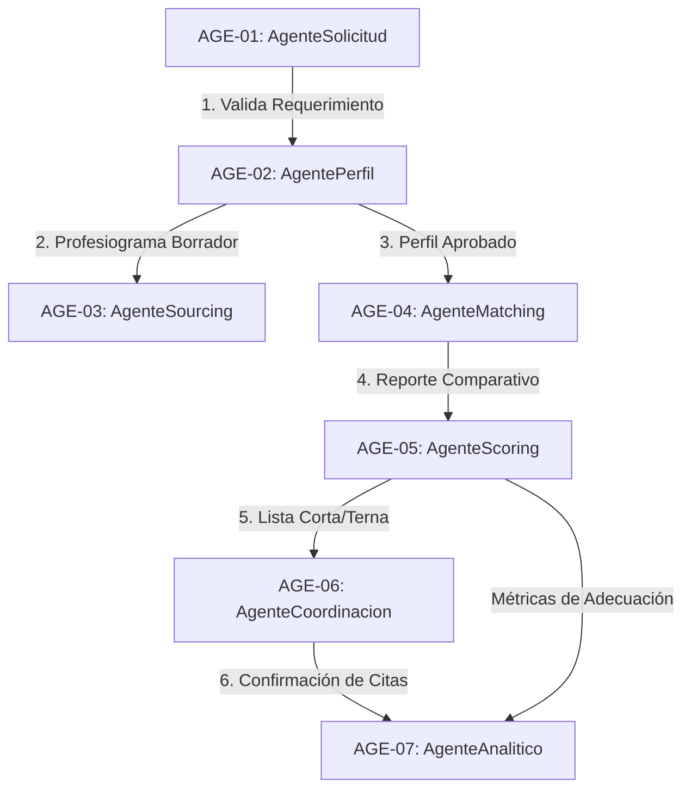

# KB_CatalogoAgentes — Catálogo y Gobierno de Agentes de Inteligencia Artificial
## Sistema Inteligente de Reclutamiento — Nacional Seguros

> **Versión:** 1.0.0 | **Estado:** PENDIENTE DE VALIDACIÓN
> **Última actualización:** 2026-06-20
> **Propietario:** NacionalSeguros_ProjectAuditor / Lead AI Architect
> **Audiencia:** Backend (.NET 8), Workflows (n8n), Frontend (Angular), QA, Auditoría, CISO

---

## Control de Versiones Documentales

| Versión | Fecha | Autor | Rol | Cambios Realizados |
| :---: | :---: | :---: | :---: | :--- |
| `1.0.0` | 2026-06-20 | Antigravity | Technical Writer / AI Architect | Creación del catálogo oficial de agentes, contratos de integración, matriz de responsabilidades e inputs/outputs. |

---

## Fuentes Oficiales

Esta KB se rige obligatoriamente por los siguientes documentos del proyecto:

| Documento | Rol en esta KB |
| :--- | :--- |
| `CONSTITUCION_PROYECTO.md` | Restricciones de flujo de datos (n8n no toca SQL) y no decisiones autónomas |
| `ANALISIS_FUNCIONAL.md` | Flujos de negocio asistidos por IA y requerimientos funcionales |
| `DISEÑO_ERD.md` | Tablas de control de ejecución de IA (`AgentExecution`, `AgentRecommendation`) |
| `DICCIONARIO_DATOS.md` | Definición física de los campos y tipos de datos del dominio de IA |
| `ARQUITECTURA_N8N.md` | Arquitectura de integración .NET <──> n8n y callback asíncrono |
| `POLITICAS_DE_SEGURIDAD.md` | Anonimización obligatoria de datos PII antes de enviar a LLMs |
| `AUDITORIA_CALIDAD_Y_CUMPLIMIENTO.md` | Registro de costos y tokens, métricas e inmutabilidad de logs |
| [KB_StateMachine](file:///c:/Users/DELL%20XPS/Desktop/INTERSIM/nacional/kb/KB_StateMachine.md) | Estados y transiciones que disparan o son influenciados por agentes IA |
| [KB_MasterData](file:///c:/Users/DELL%20XPS/Desktop/INTERSIM/nacional/kb/KB_MasterData.md) | Catálogo de tipos de agentes y prompts parametrizados |

---

## Principios Rectores de Gobernanza de IA

Para garantizar el cumplimiento ético, técnico y regulatorio de Nacional Seguros, todo desarrollo o flujo de Inteligencia Artificial debe respetar estrictamente estos principios rectores:

1. **Copiloto Asistido (Human-in-the-Loop):** Ningún agente de IA puede ejecutar transiciones automáticas en el pipeline de negocio o base de datos. Sus respuestas se consideran "Recomendaciones" y deben ser explícitamente validadas (Aprobada / Rechazada) por un usuario humano a través del frontend antes de impactar el sistema transaccional.
2. **Aislamiento de Persistencia:** Los agentes de IA ejecutados en workflows de n8n no tienen credenciales de conexión ni acceso físico a SQL Server. Toda la lectura de prompts, envío de datos de contexto y escritura de recomendaciones se realiza única y exclusivamente mediante APIs REST del backend .NET 8.
3. **Anonimización de Datos Personales (PII):** Está estrictamente prohibido enviar nombres, teléfonos, correos o documentos de identidad de postulantes a APIs de LLM externas. El backend .NET 8 debe anonimizar los datos de contexto enviando identificadores temporales (ej. `Postulante_UUID_1`) y únicamente información curricular desvinculada.
4. **Trazabilidad Inmutable:** Cada ejecución de agente en n8n debe registrarse obligatoriamente en `AgentExecution` de SQL Server capturando: `PromptVersionId`, `CorrelationId`, tokens de entrada y salida, costo estimado en USD y el estado del procesamiento.
5. **Gobernanza de Prompts:** Queda terminantemente prohibido hardcodear prompts en los nodos de n8n o código del backend. Todos los system/user prompts deben consumirse dinámicamente de la base de datos a través de la API .NET, respetando el versionado activo.

---

# Catálogo Oficial de Agentes IA

El Sistema Inteligente de Reclutamiento de Nacional Seguros se compone de los siguientes 7 agentes autorizados:

| Identificador | Nombre | Descripción Corta | LLM Sugerido / Rol | Integración Principal |
| :---: | :--- | :--- | :---: | :--- |
| **AGE-01** | **AgenteSolicitud** | Estructurador y validador de solicitudes de personal. | Modelo Avanzado | n8n $\rightarrow$ .NET 8 |
| **AGE-02** | **AgentePerfil** | Generador de borradores de profesiogramas estructurados. | Modelo Avanzado | n8n $\rightarrow$ .NET 8 |
| **AGE-03** | **AgenteSourcing** | Consultor de canales de difusión y sourcing de talento. | Modelo Rápido | n8n $\rightarrow$ .NET 8 |
| **AGE-04** | **AgenteMatching** | Comparador semántico curricular contra profesiograma. | Modelo Avanzado | n8n $\rightarrow$ .NET 8 |
| **AGE-05** | **AgenteScoring** | Evaluador y calificador analítico de idoneidad. | Modelo Avanzado | n8n $\rightarrow$ .NET 8 |
| **AGE-06** | **AgenteCoordinacion** | Asistente conversacional de recordatorios y agendas. | Modelo Rápido | WhatsApp / Email / n8n |
| **AGE-07** | **AgenteAnalitico** | Consolidador de métricas operativas y SLAs de RRHH. | Modelo Rápido | n8n $\rightarrow$ .NET 8 |

---

# Matriz de Responsabilidades de Agentes

| Agente | Propietario Funcional | Responsable Técnico | Auditor de Ejecución | Nivel de Supervisión Humana |
| :--- | :--- | :--- | :--- | :--- |
| **AgenteSolicitud** | Líder de Área Solicitante | Lead Backend Dev | Auditor Interno | Aprobación Obligatoria del Solicitante |
| **AgentePerfil** | Jefe de Compensación | AI Engineer | Auditor Interno | Aprobación / Edición Obligatoria de RRHH |
| **AgenteSourcing** | Analista de Reclutamiento | n8n Workflow Designer | Auditor Interno | Confirmación de Canales por Reclutador |
| **AgenteMatching** | Jefe de Reclutamiento | AI Engineer | Auditor Interno | Visualización en Expediente del Postulante |
| **AgenteScoring** | Líder de RRHH | AI / Data Scientist | Auditor Interno | Validación Humana de Calificación (RBAC) |
| **AgenteCoordinacion**| Reclutador Operativo | n8n Workflow Designer | CISO / Seguridad | Monitor de Bitácoras Conversacionales |
| **AgenteAnalitico** | Gerente de RRHH | BI Developer | Auditor Interno | Consulta y Exportación por RRHH |

---

# Matriz de Dependencias de Agentes IA



### Relaciones de Dependencia:
1. **AGE-02 (Perfil) depende de AGE-01 (Solicitud):** No se puede disparar el Agente de Perfil si el Agente de Solicitud no ha validado y estructurado los campos obligatorios del cargo en la solicitud inicial.
2. **AGE-03 (Sourcing) depende de AGE-02 (Perfil):** La sugerencia de canales externos depende de las habilidades críticas e incompatibilidades identificadas en el profesiograma generado.
3. **AGE-04 (Matching) depende de AGE-02 (Perfil):** El matching curricular requiere la estructura de habilidades y competencias definida en el profesiograma aprobado para comparar semánticamente contra el currículum parseado.
4. **AGE-05 (Scoring) depende de AGE-04 (Matching):** La nota analítica utiliza las brechas identificadas por el matching como parte de sus sub-scores.
5. **AGE-06 (Coordinación) depende de AGE-05 (Scoring):** Se coordina la agenda de entrevistas únicamente con postulantes que superaron la etapa curricular y obtuvieron un score mayor al umbral maestro parametrizado.
6. **AGE-07 (Analítico) recopila de todos los agentes:** Consume los logs en `AgentExecution` para evaluar el costo consolidado de los tokens de IA, tasas de error y rendimiento latente.

---

# Contratos y Especificación por Agente

---

## 1. AGE-01: AgenteSolicitud

### 1.1 Ficha Técnica
* **Nombre:** AgenteSolicitud
* **Descripción:** Asistente conversacional y estructurador que analiza las solicitudes de personal del líder de área para identificar incoherencias funcionales, datos faltantes o presupuestos fuera de rango.
* **Eventos Disparadores:** Cambio de estado de la solicitud a `SOL-02 ENVIADA` (Revisión de consistencia).
* **Workflows Involucrados:** `WF-SOL-01-ConsistenciaSolicitud` en n8n.
* **Estados Involucrados:** `SOL-01 BORRADOR` $\rightarrow$ `SOL-02 ENVIADA`.
* **APIs Involucradas:** `POST /api/v1/solicitudes/{id}/validar-consistencia` y callback de retorno `POST /api/v1/solicitudes/callback/consistencia`.

### 1.2 Entradas y Salidas (Contrato de Integración)

#### Datos Consumidos (Input JSON enviado del Backend a n8n):
```json
{
  "CorrelationId": "9b1deb4d-3b7d-4bad-9bdd-2b0d7b3dcb6d",
  "SolicitudId": 450,
  "Cargo": "Desarrollador .NET Mid",
  "Area": "Tecnología de la Información",
  "Prioridad": "Alta",
  "Funciones": "Diseño de APIs REST y refactorización de código legado en C#.",
  "Skills": "C#, SQL Server, .NET Core",
  "Modalidad": "Híbrida",
  "Ubicacion": "Santa Cruz",
  "Seniority": "Mid"
}
```

#### Datos Generados (Output JSON retornado por n8n al Callback):
```json
{
  "CorrelationId": "9b1deb4d-3b7d-4bad-9bdd-2b0d7b3dcb6d",
  "SolicitudId": 450,
  "Consistente": true,
  "AnalisisTexto": "La solicitud cuenta con funciones y tecnologías alineadas al seniority requerido. No se identifican brechas de información.",
  "Faltantes": [],
  "Recomendaciones": [
    "Incluir conocimientos en Entity Framework Core si utiliza SQL Server.",
    "Aclarar si la modalidad requiere disponibilidad para guardias pasivas."
  ],
  "ScoreConfianza": 94.50
}
```

### 1.3 Reglas de Negocio, Restricciones y Control
* **Restricción:** El agente de solicitud nunca aprueba la vacante directamente. Sus advertencias se guardan en la tabla `AprobacionSolicitud` y se despliegan al decisor humano para su firma.
* **Regla de Negocio:** Si el score de confianza de la validación es menor al 70%, el workflow de n8n automáticamente cataloga la solicitud como `OBSERVADA` y la devuelve al borrador del solicitante.
* **Criterios de Aceptación:**
  * Debe estructurar el análisis funcional en formato JSON en menos de 5 segundos.
  * Debe detectar si hay habilidades contradictorias (ej. "Desarrollador Junior" con "10 años de experiencia").
  * El log `AgentExecution` debe registrarse en base de datos con el ID del solicitante original.

---

## 2. AGE-02: AgentePerfil

### 2.1 Ficha Técnica
* **Nombre:** AgentePerfil
* **Descripción:** Generador cognitivo que asiste a RRHH en la creación del profesiograma definitivo de un cargo a partir de una solicitud aprobada. Identifica habilidades técnicas/blandas requeridas y define alertas tempranas ("red flags") de idoneidad.
* **Eventos Disparadores:** Solicitud en estado `SOL-05 APROBADA` (Inicio de creación de perfil).
* **Workflows Involucrados:** `WF-PERF-01-GenerarPerfil` en n8n.
* **Estados Involucrados:** `PERF-01 BORRADOR` $\rightarrow$ `PERF-02 EN_REVISION`.
* **APIs Involucradas:** `POST /api/v1/perfiles/generar-borrador` y callback `POST /api/v1/perfiles/callback/generador`.

### 2.2 Entradas y Salidas (Contrato de Integración)

#### Datos Consumidos (Input JSON enviado del Backend a n8n):
```json
{
  "CorrelationId": "1b1deb4d-3b7d-4bad-9bdd-2b0d7b3dcb6d",
  "SolicitudId": 450,
  "Cargo": "Desarrollador .NET Mid",
  "Funciones": "Diseño de APIs REST y refactorización de código legado en C#.",
  "Skills": "C#, SQL Server, .NET Core",
  "Area": "Tecnología de la Información"
}
```

#### Datos Generados (Output JSON retornado por n8n al Callback):
```json
{
  "CorrelationId": "1b1deb4d-3b7d-4bad-9bdd-2b0d7b3dcb6d",
  "PerfilCargoId": 102,
  "CargoNormalizado": "Desarrollador Back-End Mid",
  "DescripcionEstructurada": "Puesto responsable del desarrollo, mantenimiento e integración de APIs críticas utilizando Clean Architecture y tecnologías Microsoft.",
  "HabilidadesTecnicas": [
    {"Skill": "C#", "Importancia": "Mandatorio"},
    {"Skill": "Entity Framework Core", "Importancia": "Recomendado"},
    {"Skill": "SQL Server 2022", "Importancia": "Mandatorio"}
  ],
  "HabilidadesBlandas": [
    {"Skill": "Trabajo en equipo", "Importancia": "Recomendado"},
    {"Skill": "Comunicación asertiva", "Importancia": "Recomendado"}
  ],
  "RedFlagsSugeridos": [
    {"Alerta": "Ausencia de experiencia en testing unitario (xUnit).", "Severidad": "Media"},
    {"Alerta": "Nula experiencia previa con SQL Server.", "Severidad": "Alta"}
  ]
}
```

### 2.3 Reglas de Negocio, Restricciones y Control
* **Restricción:** El profesiograma generado es inmutable hasta que el analista de RRHH lo modifique o apruebe. Se persiste en la tabla `PerfilVersion` con estado `Borrador`.
* **Criterios de Aceptación:**
  * Debe generar el JSON con la estructura de habilidades técnicas y blandas separada al 100%.
  * No debe incluir en los Red Flags sugeridos criterios discriminatorios (edad, género, etc.) bajo pena de auditoría inmediata.
  * Tiempo de respuesta máximo de generación: 10 segundos.

---

## 3. AGE-03: AgenteSourcing

### 3.1 Ficha Técnica
* **Nombre:** AgenteSourcing
* **Descripción:** Agente recomendador de canales de publicación que determina la mejor estrategia de difusión (LinkedIn, portales abiertos, caza de talentos o referidos) según el perfil del puesto, nivel de urgencia y presupuesto.
* **Eventos Disparadores:** Perfil de cargo en estado `PERF-04 APROBADO` (Dispara sugerencia de sourcing).
* **Workflows Involucrados:** `WF-VAC-01-SourcingStrategy` en n8n.
* **Estados Involucrados:** `VAC-01 BORRADOR` $\rightarrow$ `VAC-02 PUBLICADA`.
* **APIs Involucradas:** `POST /api/v1/sourcing/estrategia` y callback `POST /api/v1/sourcing/callback`.

### 3.2 Entradas y Salidas (Contrato de Integración)

#### Datos Consumidos (Input):
```json
{
  "CorrelationId": "2b1deb4d-3b7d-4bad-9bdd-2b0d7b3dcb6d",
  "VacanteId": 12,
  "Cargo": "Desarrollador Back-End Mid",
  "Seniority": "Mid",
  "Urgencia": "Alta",
  "Ubicacion": "Santa Cruz"
}
```

#### Datos Generados (Output):
```json
{
  "CorrelationId": "2b1deb4d-3b7d-4bad-9bdd-2b0d7b3dcb6d",
  "VacanteId": 12,
  "CanalesSugeridos": [
    {"Canal": "LinkedIn", "Prioridad": "Alta", "Razon": "El perfil de desarrollo medio abunda en redes profesionales activas."},
    {"Canal": "Portal Corporativo", "Prioridad": "Media", "Razon": "Para postulaciones espontáneas."},
    {"Canal": "Referidos Internos", "Prioridad": "Alta", "Razon": "Vacante urgente, referidos acelera contratación."}
  ],
  "EstrategiaPromptText": "Sourcing dirigido enfocado en el reclutamiento activo de perfiles de c# mediante mensajes automáticos en redes."
}
```

### 3.3 Reglas de Negocio, Restricciones y Control
* **Restricción:** El reclutador humano es el único facultado para activar o desactivar canales de la vacante. Las sugerencias de sourcing no configuran por sí solas publicaciones externas.
* **Criterios de Aceptación:**
  * Debe arrojar canales con justificaciones estructuradas basadas en el seniority (ej. no sugerir headhunting tradicional para cargos operativos junior).
  * El procesamiento del webhook n8n no debe superar los 3 segundos.

---

## 4. AGE-04: AgenteMatching

### 4.1 Ficha Técnica
* **Nombre:** AgenteMatching
* **Descripción:** Motor semántico crítico que compara de manera automatizada el currículum del postulante (parseado en texto plano sanitizado) contra los requisitos de educación, experiencia y habilidades definidos en el profesiograma aprobado.
* **Eventos Disparadores:** Postulante en estado `POST-01 CAPTADO` (Carga y registro inicial de CV).
* **Workflows Involucrados:** `WF-POST-01-MatchingCV` en n8n.
* **Estados Involucrados:** `POST-01 CAPTADO` $\rightarrow$ `POST-02 EN_REVISION_CV`.
* **APIs Involucradas:** `POST /api/v1/postulantes/{id}/matching-curriculo` y callback `POST /api/v1/postulantes/callback/matching`.

### 4.2 Entradas y Salidas (Contrato de Integración)

#### Datos Consumidos (Input JSON - Anonimizado para cumplir con Políticas de Seguridad):
```json
{
  "CorrelationId": "3b1deb4d-3b7d-4bad-9bdd-2b0d7b3dcb6d",
  "MatchingId": 1004,
  "PostulanteUUID": "POST-UUID-992381",
  "PerfilRequisitos": {
    "Cargo": "Desarrollador Back-End Mid",
    "SkillsMandatorios": ["C#", "SQL Server", "APIs REST"],
    "ExperienciaMinimaAnios": 3
  },
  "CurriculoParsedText": "Desarrollador de software con 4 años de experiencia programando en C# y bases de datos relacionales en SQL Server. Creación de integraciones REST API en proyectos financieros..."
}
```

#### Datos Generados (Output JSON):
```json
{
  "CorrelationId": "3b1deb4d-3b7d-4bad-9bdd-2b0d7b3dcb6d",
  "MatchingId": 1004,
  "PostulanteUUID": "POST-UUID-992381",
  "AdecuacionCurricular": 85.00,
  "ExplicacionCoincidencias": "El postulante cuenta con 4 años de experiencia en C#, superando la barrera mínima de 3 años. Domina SQL Server y APIs REST.",
  "BrechasDetectadas": [
    "No se menciona conocimiento en testing unitario (xUnit/NUnit) en el currículum."
  ],
  "RedFlagsDetectadas": []
}
```

### 4.3 Explicabilidad y Criterios de Control de Privacidad
* **Explicabilidad Mandatoria:** El output debe proveer un resumen textual inteligible por humanos sobre cómo el LLM comparó la experiencia y por qué calculó la brecha, garantizando auditoría de sesgos.
* **Anonimización Estricta (PII):** Queda terminantemente prohibido pasar los campos `Nombres`, `Apellidos`, `Correo`, `Telefono` o `DocumentoIdentidad` al LLM en el campo `CurriculoParsedText`.
* **Criterios de Aceptación:**
  * Tasa de error en análisis semántico inferior al 2%.
  * Si el PDF del CV contiene codificación ilegible o texto vacío, el agente debe disparar un resultado de error controlado en `ResultadoStatus = 'Fallo'`.

---

## 5. AGE-05: AgenteScoring

### 5.1 Ficha Técnica
* **Nombre:** AgenteScoring
* **Descripción:** Evaluador estructurado de idoneidad analítica que analiza de forma consolidada el reporte de matching del currículum, las pruebas psicotécnicas asociadas, y los resultados de entrevistas del candidato para calcular el score explicable del postulante.
* **Eventos Disparadores:** Finalización de la revisión curricular o registro de notas evaluativas.
* **Workflows Involucrados:** `WF-POST-02-ScoringPostulante` en n8n.
* **Estados Involucrados:** `POST-02 EN_REVISION_CV` $\rightarrow$ `POST-03 PRESELECCIONADO` (o descarte sugerido).
* **APIs Involucradas:** `POST /api/v1/postulantes/{id}/calcular-scoring` y callback `POST /api/v1/postulantes/callback/scoring`.

### 5.2 Entradas y Salidas (Contrato de Integración)

#### Datos Consumidos (Input JSON - Cifrado y Anonimizado):
```json
{
  "CorrelationId": "4b1deb4d-3b7d-4bad-9bdd-2b0d7b3dcb6d",
  "ScoringId": 782,
  "PostulanteUUID": "POST-UUID-992381",
  "ScoreAdecuacionCV": 85.00,
  "NotaPruebaTecnica": 90.00,
  "NotaPsicotecnico": 78.00,
  "ComentariosEntrevistaRRHH": "Buena disposición al trabajo, comunicación fluida."
}
```

#### Datos Generados (Output JSON):
```json
{
  "CorrelationId": "4b1deb4d-3b7d-4bad-9bdd-2b0d7b3dcb6d",
  "ScoringId": 782,
  "PostulanteUUID": "POST-UUID-992381",
  "ScoreSkills": 85.00,
  "ScoreExperiencia": 88.00,
  "ScoreFinal": 86.40,
  "JustificacionDetallada": "El candidato destaca por su solidez en la prueba técnica (90/100) y consistencia curricular, compensando la nota intermedia del psicotécnico.",
  "AvanceSugerido": true
}
```

### 5.3 Explicabilidad y Seguridad de Datos
* **Explicabilidad:** La justificación del score final debe detallar de forma matemática y cualitativa la ponderación de las notas aplicadas.
* **Cifrado de Resultados:** La nota final (`ScoreFinal`) y su desglose son considerados datos de confidencialidad Alta. Deben viajar cifrados mediante HTTPS y almacenarse utilizando *Always Encrypted* en SQL Server 2022.
* **Restricción de Descartes:** **Prohibido descartar automáticamente.** Aunque el `AvanceSugerido` sea `false`, el sistema requiere confirmación humana para ejecutar la transición a `POST-09 DESCARTADO`.
* **Criterios de Aceptación:**
  * Tiempo de cálculo inferior a 4 segundos.
  * Consistencia de cálculo matemático contra las reglas parametrizadas.

---

## 6. AGE-06: AgenteCoordinacion

### 6.1 Ficha Técnica
* **Nombre:** AgenteCoordinacion
* **Descripción:** Asistente conversacional omnicanal encargado del contacto directo con los postulantes seleccionados para coordinar, agendar, reconfirmar y recordar las citas de entrevistas, integrándose con el calendario del entrevistador y la API de WhatsApp.
* **Eventos Disparadores:** Postulante transita a `POST-05 ENTREVISTA_PEND` o se agenda una entrevista (`ENT-01 AGENDADA`).
* **Workflows Involucrados:** `WF-ENT-01-CoordinarEntrevista` y `WF-ENT-02-EnvioRecordatorios` en n8n.
* **Estados Involucrados:** `POST-04 EN_CONTACTO` $\rightarrow$ `POST-05 ENTREVISTA_PEND` $\rightarrow$ `POST-06 EN_EVALUACION`.
* **APIs Involucradas:** `POST /api/v1/coordinacion/whatsapp/enviar`, `POST /api/v1/agenda/sincronizar` y webhooks de eventos entrantes de WhatsApp.

### 6.2 Entradas y Salidas (Contrato de Integración)

#### Datos Consumidos (Input para iniciar coordinación):
```json
{
  "CorrelationId": "5b1deb4d-3b7d-4bad-9bdd-2b0d7b3dcb6d",
  "PostulanteId": 1289,
  "Nombres": "Candidato_Anonimo_TI",
  "TelefonoDestino": "+59170000000",
  "EntrevistadorId": 14,
  "FechasDisponibles": ["2026-06-22T10:00:00Z", "2026-06-22T15:00:00Z"],
  "PlantillaWaNombre": "PLT_WA_RECORDATORIO_ENT"
}
```

#### Datos Generados (Output tras confirmación exitosa con el candidato):
```json
{
  "CorrelationId": "5b1deb4d-3b7d-4bad-9bdd-2b0d7b3dcb6d",
  "PostulanteId": 1289,
  "CoordinadoExito": true,
  "FechaSeleccionada": "2026-06-22T10:00:00Z",
  "LogConversacionWhatsApp": "System: Hola. Candidato: Hola, elijo las 10am. System: Confirmado.",
  "EntrevistaIdCreada": 88
}
```

### 6.3 Reglas de Negocio, Restricciones y Control
* **Restricción:** El agente de coordinación solo agenda entrevistas en base a los bloques de disponibilidad real persistidos en `EventoAgenda` por el entrevistador humano. No puede agendar fuera de dichos bloques.
* **Políticas de Privacidad:** Toda la conversación a través del canal de WhatsApp debe encriptarse en tránsito. No se transmiten datos salariales en el cuerpo del mensaje.
* **Criterios de Aceptación:**
  * Si el candidato no responde al contacto en un plazo de 24 horas, el agente debe abortar el workflow e iniciar una alerta operadora `ALERTA_SLA_VENCIDO`.
  * Sincronización en tiempo real con Outlook/Google Calendar mediante la API backend.

---

## 7. AGE-07: AgenteAnalitico

### 7.1 Ficha Técnica
* **Nombre:** AgenteAnalitico
* **Descripción:** Inteligencia analítica y agregadora que evalúa periódicamente el desempeño del pipeline, los desvíos de SLAs por área, el rendimiento de los reclutadores y los costos por tokens de IA, emitiendo reportes de calidad para la gerencia.
* **Eventos Disparadores:** Evento cron programado (cada lunes a las 08:00 AM UTC).
* **Workflows Involucrados:** `WF-REP-01-ConsolidadoMensual` en n8n.
* **Estados Involucrados:** Ninguno directamente (Monitorea transiciones globales).
* **APIs Involucradas:** `GET /api/v1/analitica/metricas-sla` y callback `POST /api/v1/analitica/callback/reporte-semanal`.

### 7.2 Entradas y Salidas (Contrato de Integración)

#### Datos Consumidos (Input JSON - Métricas consolidadas):
```json
{
  "CorrelationId": "6b1deb4d-3b7d-4bad-9bdd-2b0d7b3dcb6d",
  "FechaAnalisis": "2026-06-20",
  "MetricasSLA": {
    "TotalVacantesActivas": 25,
    "SlaCumplidos": 18,
    "SlaVencidos": 7
  },
  "CostosTokensIA_USD": 14.50,
  "TotalEjecucionesIA": 1250
}
```

#### Datos Generados (Output JSON - Recomendaciones directivas):
```json
{
  "CorrelationId": "6b1deb4d-3b7d-4bad-9bdd-2b0d7b3dcb6d",
  "ReporteGeneradoId": 45,
  "ResumenEjecutivo": "El pipeline de reclutamiento mantiene un cumplimiento del SLA del 72%. El principal cuello de botella se encuentra en el área de aprobación de perfiles de cargo.",
  "RecomendacionesOperativas": [
    "Reducir el SLA de aprobación de perfiles de 3 a 2 días hábiles.",
    "Ajustar umbral de matching para vacantes de TI comerciales a un 65%."
  ]
}
```

### 7.3 Reglas de Negocio, Restricciones y Control
* **Restricción:** El Agente Analítico tiene permisos puramente de lectura de agregados estadísticos (`MetricSnapshot`). No puede alterar datos de configuración operativa globales de forma autónoma.
* **Criterios de Aceptación:**
  * Generación del reporte consolidado semanal de forma puntual todos los lunes.
  * Los reportes resultantes se persisten en formato estructurado (no texto plano desordenado) listos para alimentar los dashboards de Angular.

---

# Resumen de Contratos de Agentes IA

Toda integración técnica entre .NET 8 y n8n sobre ejecuciones de IA debe seguir y mapear este contrato canónico para registrar la bitácora obligatoria.

### Esquema DTO de Registro en Base de Datos (`AgentExecution`)

```json
{
  "$schema": "https://json-schema.org/draft/2020-12/schema",
  "title": "AgentExecutionLog",
  "type": "object",
  "properties": {
    "ExecutionId": { "type": "integer", "description": "Clave primaria asignada por la base de datos." },
    "AgenteId": { "type": "integer", "description": "ID del Agente del Catálogo Maestro." },
    "PromptVersionId": { "type": "integer", "description": "Versión del prompt utilizada de SQL Server." },
    "UsuarioId": { "type": "integer", "description": "Usuario que disparó o validó la ejecución." },
    "FechaInicio": { "type": "string", "format": "date-time", "description": "Timestamp UTC de inicio." },
    "FechaFin": { "type": "string", "format": "date-time", "description": "Timestamp UTC de finalización." },
    "InputJson": { "type": "string", "description": "Snapshot de la petición enviada serializada en JSON." },
    "OutputJson": { "type": "string", "description": "Respuesta estructurada de la IA serializada en JSON." },
    "ResultadoStatus": { "type": "string", "enum": ["Éxito", "Fallo", "Advertencia"] },
    "ErrorMessage": { "type": "string", "nullable": true },
    "CorrelationId": { "type": "string", "format": "uuid" },
    "TokensInput": { "type": "integer", "nullable": true },
    "TokensOutput": { "type": "integer", "nullable": true },
    "CostoEstimado": { "type": "number", "minimum": 0, "nullable": true }
  },
  "required": ["AgenteId", "PromptVersionId", "UsuarioId", "FechaInicio", "FechaFin", "InputJson", "OutputJson", "ResultadoStatus", "CorrelationId"]
}
```

---

# Riesgos Detectados y Mitigaciones en Agentes IA

| ID | Severidad | Agente(s) | Riesgo Identificado | Control y Mitigación Propuesta |
| :---: | :---: | :--- | :--- | :--- |
| **R-AGE-01** | 🔴 **Alto** | Todos | **Decisiones Transaccionales Autónomas:** Fallos en workflows de n8n que cambien estados de contratación sin aprobación. | Desacoplar workflows de n8n de SQL Server. Las transiciones de estado sólo ocurren mediante endpoints del Backend protegidos por roles RBAC humanos. |
| **R-AGE-02** | 🔴 **Alto** | AGE-04 / AGE-05 | **Fuga de Datos Sensibles (PII):** Exposición de nombres, contactos y direcciones de postulantes en APIs externas. | Implementar un pipeline de sanitización y anonimización en el Backend de .NET 8 que reemplace datos PII por UUIDs antes de invocar a n8n. |
| **R-AGE-03** | 🟠 **Medio** | AGE-04 | **Alucinaciones en Validación Curricular:** La IA reportando cumplimiento de requisitos falsos. | La recomendación del Matching requiere visualización de brechas explícitas al reclutador y botón de "Verificar CV Original". |
| **R-AGE-04** | 🟠 **Medio** | AGE-06 | **Coordinación Invasiva Conversacional:** Envíos excesivos de mensajes que violen políticas de spam. | Configurar control de frecuencia estricto (máximo 2 recordatorios por cita en 24h) y botón de cancelado inmediato en WhatsApp. |
| **R-AGE-05** | 🟡 **Bajo** | AGE-07 | **Estadísticas Sesgadas por Fallos de SLA:** Fallos temporales que inflen artificialmente los KPIs. | Validar excepciones operativas (ej. feriados nacionales) en la base de datos de manera previa a la agregación semanal. |

---

# Recomendaciones de Implementación

1. **Configurar el Node Handler Central de n8n:** Implementar un nodo de *Error Trigger* global en n8n que responda con `ResultadoStatus = 'Fallo'` al endpoint de callback de .NET 8 para evitar solicitudes "colgadas" eternamente en estado procesando.
2. **Cifrado de Ponderaciones y Resultados:** Asegurar que los campos `ScoreCoincidencia` (`Matching`) y `ScoreFinal` (`Scoring`) utilicen cifrado simétrico robusto del lado de SQL Server 2022 (*Always Encrypted*).
3. **Mesa de Ayuda de IA (Human Override):** Habilitar a los usuarios con rol `Administrador` la capacidad de sobrescribir decisiones de validación curricular bloqueadas incorrectamente por el sistema (Explicabilidad y no-repudio).

---

## Cumplimiento de Lineamientos del Proyecto
**Resultado de la Evaluación:** `APPROVED`

### Justificación del Resultado:
* **Gobernanza Completa:** Se definieron responsabilidades, inputs, outputs y contratos para los 7 agentes obligatorios del PRD.
* **Cumplimiento de Seguridad:** Se detalla de forma explícita el requisito de anonimización de datos PII antes de enviar payloads a los LLMs.
* **Trazabilidad e Inmutabilidad:** Los contratos de integración alinean las respuestas de n8n con las tablas `AgentExecution` y `AgentRecommendation`.
* **Sin Hardcoding:** La obtención de prompts se delega dinámicamente mediante consultas parametrizadas a la API del backend.
