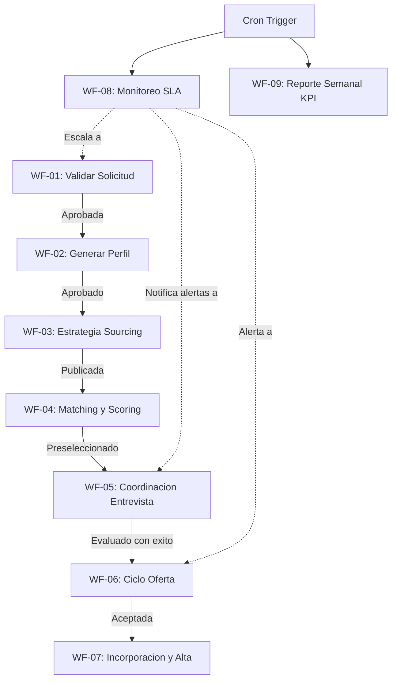

# KB_CatalogoWorkflows — Catálogo y Gobierno de Workflows de Automatización
## Sistema Inteligente de Reclutamiento — Nacional Seguros

> **Versión:** 1.0.0 | **Estado:** PENDIENTE DE VALIDACIÓN
> **Última actualización:** 2026-06-20
> **Propietario:** NacionalSeguros_ProjectAuditor / Lead n8n Architect
> **Audiencia:** Backend (.NET 8), Workflows (n8n), Frontend (Angular), QA, Auditoría, Operaciones TI

---

## Control de Versiones Documentales

| Versión | Fecha | Autor | Rol | Cambios Realizados |
| :---: | :---: | :---: | :---: | :--- |
| `1.0.0` | 2026-06-20 | Antigravity | Technical Writer / Workflow Architect | Creación del catálogo de workflows, matriz de dependencias, definición de reintentos y control de errores. |

---

## Fuentes Oficiales

Esta KB se rige obligatoriamente por los siguientes documentos del proyecto:

| Documento | Rol en esta KB |
| :--- | :--- |
| `CONSTITUCION_PROYECTO.md` | Restricciones de integración .NET <──> n8n (no SQL directo) |
| `ANALISIS_FUNCIONAL.md` | Casos de uso de automatización y orquestación |
| `DISEÑO_ERD.md` | Mapeo de ejecuciones y logs de orquestación (`WorkflowExecution`) |
| `DICCIONARIO_DATOS.md` | Campos y nulidades del contexto de reportería y auditoría |
| `ARQUITECTURA_BACKEND.md` | APIs del backend que exponen endpoints y reciben callbacks |
| `POLITICAS_DE_SEGURIDAD.md` | Autenticación HTTPS, cifrado de tokens y API keys rotativas |
| `AUDITORIA_CALIDAD_Y_CUMPLIMIENTO.md` | Requisitos de reintentos, logs estructurados y CorrelationId |
| [KB_StateMachine](file:///c:/Users/DELL%20XPS/Desktop/INTERSIM/nacional/kb/KB_StateMachine.md) | Transiciones y estados del pipeline del reclutamiento |
| [KB_MasterData](file:///c:/Users/DELL%20XPS/Desktop/INTERSIM/nacional/kb/KB_MasterData.md) | Configuración de alertas, notificaciones y SLAs de negocio |
| [KB_CatalogoAgentes](file:///c:/Users/DELL%20XPS/Desktop/INTERSIM/nacional/kb/KB_CatalogoAgentes.md) | Entradas y salidas de los agentes de IA invocados por n8n |

---

## Principios Rectores de los Workflows n8n

1. **Aislamiento Transaccional:** Los workflows de n8n actúan exclusivamente como orquestadores y canales. **n8n no tiene credenciales de conexión directa a SQL Server**. Toda lectura o escritura de datos maestros o entidades de negocio debe realizarse llamando a las APIs REST del Backend en .NET 8.
2. **Propagación del CorrelationId:** Todo workflow debe heredar el `CorrelationId` enviado en la petición HTTP del Trigger por el backend, propagándolo obligatoriamente en cada llamada REST intermedia y devolviéndolo en el callback final.
3. **Manejo de Errores Estandarizado (Error Trigger):** Todos los workflows del sistema deben contar con un nodo de control de fallos enlazado a un workflow de error global (`WF-ERR-01`) que notifique al backend el código del nodo fallido y los detalles técnicos.
4. **Política de Reintentos Controlada:** Los nodos que invoquen a APIs externas propensas a fallas temporales (ej. el proveedor de modelos de lenguaje (LLM), WhatsApp API, Outlook API) deben configurarse con reintentos exponenciales amortiguados (Backoff con Jitter) para evitar bloqueos por tasa de llamadas.
5. **Autenticación Basada en Header Seguro:** Las interacciones entre n8n y la API de .NET 8 se ejecutan a través de HTTPS (TLS 1.3) y requieren un encabezado de autorización seguro `X-API-Key` provisto por el backend.

---

# Catálogo Oficial de Workflows

| Código | Workflow | Módulo de Negocio | Frecuencia / Trigger | Agente IA Involucrado |
| :---: | :--- | :--- | :--- | :--- |
| **WF-01** | **Workflow Solicitud** | Solicitudes de Personal | Webhook (Enviada) | AGE-01: AgenteSolicitud |
| **WF-02** | **Workflow Perfil** | Perfiles de Cargo | Webhook (Aprobada) | AGE-02: AgentePerfil |
| **WF-03** | **Workflow Vacante** | Gestión de Vacantes | Webhook (Publicada/Cierre) | AGE-03: AgenteSourcing |
| **WF-04** | **Workflow Reclutamiento** | Pipeline de Postulantes | Webhook (Captación/Evaluación)| AGE-04 y AGE-05: Match/Score |
| **WF-05** | **Workflow Entrevistas** | Agenda y Coordinación | Webhook (Agendada/Reprog) | AGE-06: AgenteCoordinacion |
| **WF-06** | **Workflow Oferta** | Ofertas de Contrato | Webhook (Generada/Expira) | — |
| **WF-07** | **Workflow Contratación** | Incorporación de Personal | Webhook (Completada/Canc) | — |
| **WF-08** | **Workflow SLA** | SLAs y Escalamientos | Evento Cron (cada 30 min) | — |
| **WF-09** | **Workflow Analítico** | Reportería y KPIs | Evento Cron (cada lunes 8am) | AGE-07: AgenteAnalitico |

---

# Especificación por Workflow

---

## WF-01: Workflow Solicitud (Consistencia y Viabilidad)

### 1.1 Ficha Técnica
* **Nombre:** WF-01-ConsistenciaSolicitud
* **Objetivo:** Orquestar la verificación automática de consistencia de la solicitud enviada por un solicitante, consumiendo el prompt versionado y llamando al Agente de Solicitud para generar la recomendación.
* **Trigger:** Webhook HTTP REST llamado por la API de .NET 8 al transitar al estado `SOL-02 ENVIADA`.
* **Estados Involucrados:** `SOL-02 ENVIADA` $\rightarrow$ `SOL-03 EN_REVISION` (o `SOL-04 OBSERVADA` si falla consistencia).
* **Agentes Involucrados:** `AGE-01: AgenteSolicitud` (Modelo Avanzado).
* **Dependencias:** [KB_CatalogoAgentes](file:///c:/Users/DELL%20XPS/Desktop/INTERSIM/nacional/kb/KB_CatalogoAgentes.md#1-age-01-agentesolicitud) para el contrato de la IA.

### 1.2 Entradas y Salidas
* **Inputs (Petición recibida en n8n):**
  * Headers: `X-API-Key`, `X-Correlation-ID`.
  * Body: `SolicitudId`, `Cargo`, `Area`, `Funciones`, `Skills`, `Modalidad`, `Seniority`, `Prioridad`.
* **Outputs (Callback enviado por n8n a la API .NET):**
  * `POST /api/v1/solicitudes/callback/consistencia`
  * Payload: `CorrelationId`, `SolicitudId`, `Consistente` (boolean), `AnalisisTexto`, `Faltantes` (array), `Recomendaciones` (array), `ScoreConfianza`.

### 1.3 Auditoría, Manejo de Errores, Reintentos y SLA
* **Auditoría:** Registra en la API .NET el inicio y fin del workflow en la tabla `WorkflowExecution` y las llamadas a la IA en `AgentExecution`.
* **Manejo de Errores:** Cualquier fallo durante la llamada de la API del LLM intercepta el flujo mediante `Error Trigger` y devuelve un callback de error marcando el estado de la solicitud como `OBSERVADA` para revisión manual.
* **Reintentos:** 3 reintentos con intervalo de 30 segundos (Backoff exponencial) en la llamada del LLM.
* **SLA:** SLA máximo del workflow: 30 segundos en n8n.

---

## WF-02: Workflow Perfil (Generación y Estructuración)

### 2.1 Ficha Técnica
* **Nombre:** WF-02-GenerarBorradorPerfil
* **Objetivo:** Generar el profesiograma en borrador a partir de los datos validados de una solicitud de personal aprobada. Invoca al Agente de Perfil y devuelve el profesiograma estructurado con taxonomías de skills.
* **Trigger:** Webhook HTTP REST llamado por la API .NET al registrar una solicitud aprobada.
* **Estados Involucrados:** `PERF-01 BORRADOR`.
* **Agentes Involucrados:** `AGE-02: AgentePerfil`.
* **APIs Involucradas:** `GET /api/v1/prompts/perfil/active` (obtener prompt), `POST /api/v1/perfiles/callback/generador`.

### 2.2 Entradas y Salidas
* **Inputs:** `CorrelationId`, `SolicitudId`, `Cargo`, `Funciones`, `Skills`, `Area`.
* **Outputs:** `CorrelationId`, `PerfilCargoId`, `CargoNormalizado`, `DescripcionEstructurada`, `HabilidadesTecnicas` (array), `HabilidadesBlandas` (array), `RedFlagsSugeridos` (array).

### 2.3 Auditoría, Manejo de Errores y Reintentos
* **Auditoría:** La API del backend .NET escribe en la tabla `PerfilVersion` una nueva versión inmutable con estado `Borrador` y la asocia al `CorrelationId` de la orquestación.
* **Manejo de Errores:** En caso de caída de n8n o timeout de la IA, el workflow escribe en la tabla `WorkflowExecution` el estado `Fallido` y envía una notificación slack/email al administrador de sistemas. El perfil queda en estado `Borrador` sin contenido para completado manual por RRHH.
* **Reintentos:** 2 reintentos con intervalo de 1 minuto para el nodo del LLM.

---

## WF-03: Workflow Vacante (Publicación y Sourcing)

### 3.1 Ficha Técnica
* **Nombre:** WF-03-SourcingStrategy
* **Objetivo:** Ejecutar la consulta del Agente de Sourcing para estructurar la estrategia de canales de búsqueda idóneos para una vacante recién publicada y orquestar el envío de notificaciones de publicación externa.
* **Trigger:** Webhook de API .NET al cambiar el estado de la vacante a `VAC-02 PUBLICADA`.
* **Estados Involucrados:** `VAC-01 BORRADOR` $\rightarrow$ `VAC-02 PUBLICADA`.
* **Agentes Involucrados:** `AGE-03: AgenteSourcing`.
* **APIs Involucradas:** `POST /api/v1/sourcing/estrategia`, `POST /api/v1/notificaciones/publicar-externo`.

### 3.2 Entradas y Salidas
* **Inputs:** `CorrelationId`, `VacanteId`, `Cargo`, `Seniority`, `Urgencia`, `Ubicacion`.
* **Outputs:** `CorrelationId`, `VacanteId`, `CanalesSugeridos` (array de canales, prioridad e historiales), `EstrategiaPromptText`.

### 3.3 Auditoría, Manejo de Errores y SLA
* **Auditoría:** Genera entrada en `AuditLog` por cada canal sugerido y su respectiva publicación registrada en la tabla física `Publicacion`.
* **Manejo de Errores:** Si el envío de la publicación externa falla (ej. error 500 en LinkedIn API), el workflow registra la falla en la tabla `Publicacion` con estado `Expirada`/`Fallo` y reintenta pasados 10 minutos.
* **Reintentos:** 3 reintentos espaciados 5 minutos para llamadas de publicación externa.

---

## WF-04: Workflow Reclutamiento (Matching y Scoring)

### 4.1 Ficha Técnica
* **Nombre:** WF-04-MatchingYScoringPipeline
* **Objetivo:** Orquestar de forma asíncrona la comparación curricular del currículum parseado contra el profesiograma y el posterior cálculo de scoring ponderado del candidato.
* **Trigger:** Webhook del API .NET al captarse un postulante (`POST-01 CAPTADO`).
* **Estados Involucrados:** `POST-01 CAPTADO` $\rightarrow$ `POST-02 EN_REVISION_CV` $\rightarrow$ `POST-03 PRESELECCIONADO` (o descarte humano).
* **Agentes Involucrados:** `AGE-04: AgenteMatching` y `AGE-05: AgenteScoring`.
* **APIs Involucradas:** `POST /api/v1/postulantes/{id}/callback/matching` y `POST /api/v1/postulantes/{id}/callback/scoring`.

### 4.2 Entradas y Salidas
* **Inputs (Anonimizados):** `CorrelationId`, `MatchingId`, `ScoringId`, `PostulanteUUID`, `PerfilRequisitos` (JSON), `CurriculoParsedText`.
* **Outputs:** `CorrelationId`, `PostulanteUUID`, `AdecuacionCurricular` (score), `ScoreFinal` (cifrado), `ExplicacionCoincidencias`, `BrechasDetectadas`, `JustificacionDetallada`, `AvanceSugerido`.

### 4.3 Auditoría, Seguridad y Reintentos
* **Auditoría:** Escritura inmutable obligatoria de la recomendación de la IA en la tabla `AgentRecommendation`.
* **Seguridad (OWASP):** La API de .NET 8 no debe transmitir nombres ni contactos de postulantes a n8n. Toda entrada curricular debe ser anonimizada. Las calificaciones resultantes viajan cifradas por HTTPS.
* **Reintentos:** 2 reintentos con intervalo de 30 segundos en la llamada del LLM.

---

## WF-05: Workflow Entrevistas (Coordinación y Agenda)

### 5.1 Ficha Técnica
* **Nombre:** WF-05-CoordinacionEntrevista
* **Objetivo:** Orquestar el flujo conversacional e interactivo por WhatsApp o Email para agendar y reconfirmar una cita de entrevista con un postulante.
* **Trigger:** Webhook enviado por el API .NET al registrarse una entrevista pendiente (`ENT-01 AGENDADA`).
* **Estados Involucrados:** `POST-05 ENTREVISTA_PEND` $\rightarrow$ `POST-06 EN_EVALUACION`, `ENT-01 AGENDADA` $\rightarrow$ `ENT-02 CONFIRMADA` (o `ENT-03 REPROGRAMADA`).
* **Agentes Involucrados:** `AGE-06: AgenteCoordinacion`.
* **APIs Involucradas:** Webhooks de WhatsApp, `POST /api/v1/agenda/reservar`, `POST /api/v1/entrevistas/{id}/callback/coordinado`.

### 5.2 Entradas y Salidas
* **Inputs:** `CorrelationId`, `PostulanteId`, `Nombres`, `TelefonoDestino`, `EntrevistadorId`, `FechasDisponibles` (array), `PlantillaWaNombre`.
* **Outputs:** `CorrelationId`, `PostulanteId`, `CoordinadoExito` (boolean), `FechaSeleccionada`, `LogConversacion`, `EntrevistaIdCreada`.

### 5.3 Auditoría, Reintentos y SLA
* **Auditoría:** Registro de envíos de recordatorios en la tabla `NotificationLog`.
* **Manejo de Errores:** Si el postulante no responde las interacciones en 24h, el workflow transita automáticamente a la entrevista al estado `ENT-06 CANCELADA` y notifica al reclutador mediante una alerta.
* **Reintentos:** No aplica reintentos automáticos para el usuario. Reintentos de 3 veces para llamadas HTTP salientes a la API de WhatsApp.
* **SLA:** 24 horas máximo de SLA conversacional.

---

## WF-06: Workflow Oferta (Generación y Negociación)

### 6.1 Ficha Técnica
* **Nombre:** WF-06-CicloVidaOferta
* **Objetivo:** Orquestar el flujo de aprobaciones internas, envío de oferta salarial cifrada por correo electrónico y el control de plazos de expiración.
* **Trigger:** Petición HTTP del backend al generarse una oferta económica.
* **Estados Involucrados:** `OFE-01 GENERADA` $\rightarrow$ `OFE-02 ENVIADA` $\rightarrow$ `OFE-04 ACEPTADA` (o `OFE-05 RECHAZADA` / `OFE-06 EXPIRADA`).
* **Agentes Involucrados:** Ninguno (Flujo transaccional regulado).
* **APIs Involucradas:** `POST /api/v1/ofertas/{id}/callback/negociacion`, `POST /api/v1/notificaciones/enviar-correo`.

### 6.2 Entradas y Salidas
* **Inputs:** `CorrelationId`, `OfertaId`, `PostulanteId`, `MontoOfertado` (cifrado), `FechaLimiteRespuesta`, `PlantillaId`.
* **Outputs:** `CorrelationId`, `OfertaId`, `EstadoOferta` (Aceptada / Rechazada / Negociando), `ContrapropuestaMonto` (si aplica).

### 6.3 Auditoría, Seguridad y SLA
* **Auditoría:** Registro detallado de la oferta en `AuditLog` (cifrado en reposo).
* **Seguridad:** El monto de la oferta debe viajar cifrado. El enlace provisto al postulante requiere autenticación web segura en Angular.
* **Reintentos:** 3 reintentos espaciados por 1 hora en fallas de envío de SMTP.
* **SLA:** Configurado dinámicamente en el catálogo maestro (default: 48h hábiles). El workflow ejecuta un nodo de espera (Wait Node) y transita a `OFE-06 EXPIRADA` si no hay respuesta del candidato al cumplirse el plazo.

---

## WF-07: Workflow Contratación (Incorporación y Cierre)

### 7.1 Ficha Técnica
* **Nombre:** WF-07-IncorporacionYAlta
* **Objetivo:** Orquestar la solicitud del checklist de documentos al candidato, validar la correcta entrega por RRHH y notificar a las áreas internas para habilitaciones (TI, compras, etc.).
* **Trigger:** Petición HTTP de la API .NET al confirmarse la aceptación de la oferta.
* **Estados Involucrados:** `CON-01 INICIADA` $\rightarrow$ `CON-02 DOC_PENDIENTE` $\rightarrow$ `CON-05 PENDIENTE_FIRMA` $\rightarrow$ `CON-06 COMPLETADA`.
* **Agentes Involucrados:** Ninguno.
* **APIs Involucradas:** `POST /api/v1/contrataciones/{id}/callback/documentos`, `POST /api/v1/notificaciones/alta-usuario`.

### 7.2 Entradas y Salidas
* **Inputs:** `CorrelationId`, `ContratacionId`, `PostulanteId`, `TipoContratacion`, `DocumentosChecklist` (array).
* **Outputs:** `CorrelationId`, `ContratacionId`, `DocumentosAprobados` (boolean), `EstadoContratacion`.

### 7.3 Auditoría, Errores y SLA
* **Auditoría:** Registro del checklist en la tabla inmutable `StateHistory`.
* **Manejo de Errores:** Si el candidato entrega documentos incorrectos, el workflow cambia a `CON-04 DOC_OBSERVADA` y notifica de manera automática al postulante indicando las correcciones necesarias.
* **SLA:** SLA configurable para la entrega de documentación: 5 días hábiles.

---

## WF-08: Workflow SLA (Monitoreo, Alertas y Escalamientos)

### 8.1 Ficha Técnica
* **Nombre:** WF-08-MonitoreoSLA
* **Objetivo:** Evento por lotes (Batch) que consulta periódicamente los procesos activos pendientes de resolución y compara los tiempos contra la tabla maestra `SLA`. Dispara alertas y escalamientos operativos.
* **Trigger:** Nodo Cron de n8n ejecutándose de forma automática cada 30 minutos.
* **Estados Involucrados:** Ninguno directamente (Monitorea `SLAExecution`).
* **Agentes Involucrados:** Ninguno.
* **APIs Involucradas:** `GET /api/v1/workflows/evaluar-slas-pendientes`, `POST /api/v1/workflows/escalar-solicitud`.

### 8.2 Entradas y Salidas
* **Inputs (Consulta de lotes):** Array de SLAs en tiempo de ejecución de la tabla `SLAExecution`.
* **Outputs (Derivación):** Registro de alertas enviadas y escalamientos realizados en base de datos.

### 8.3 Auditoría y Controles
* **Auditoría:** Escribe en la tabla `StateHistory` y `AuditLog` todo escalamiento de aprobación o vacante.
* **Manejo de Errores:** En caso de fallar la API del backend, el nodo finaliza de forma fallida sin alterar los registros en curso de la base de datos (seguro ante fallos).
* **Reintentos:** Reintentos desactivados para evitar envíos de alertas duplicadas ante cortes de red.

---

## WF-09: Workflow Analítico (KPIs y Reportes)

### 9.1 Ficha Técnica
* **Nombre:** WF-09-ReporteSemanalKPI
* **Objetivo:** Consolidar periódicamente las métricas operativas registradas por los reclutadores y los agentes de IA, llamando al Agente Analítico para redactar el reporte de calidad.
* **Trigger:** Cron programado que se ejecuta de forma automática los lunes a las 08:00 AM UTC.
* **Estados Involucrados:** Ninguno.
* **Agentes Involucrados:** `AGE-07: AgenteAnalitico`.
* **APIs Involucradas:** `GET /api/v1/reporteria/consolidado-semanal`, `POST /api/v1/reporteria/callback/consolidar`.

### 9.2 Entradas y Salidas
* **Inputs:** `CorrelationId`, `FechaAnalisis`, `MetricasSLA` (JSON), `CostosTokensIA_USD`.
* **Outputs:** `CorrelationId`, `ReporteGeneradoId`, `ResumenEjecutivo` (texto estructurado), `Recomendaciones` (array).

### 9.3 Auditoría y Frecuencia
* **Auditoría:** El reporte final estructurado se guarda en la tabla `MetricSnapshot`.
* **Reintentos:** 3 reintentos espaciados por 15 minutos en caso de caída del servidor LLM.

---

# Inventario de Workflows n8n

| ID | Código | Nombre del Workflow | Trigger Principal | Rol Ejecutor | API Principal en .NET |
| :---: | :---: | :--- | :--- | :--- | :--- |
| **W-01** | **WF-01** | `WF-01-ConsistenciaSolicitud` | Webhook (SOL-02) | Solicitante | `/api/v1/solicitudes/callback/consistencia` |
| **W-02** | **WF-02** | `WF-02-GenerarBorradorPerfil` | Webhook (SOL-05) | RRHH | `/api/v1/perfiles/callback/generador` |
| **W-03** | **WF-03** | `WF-03-SourcingStrategy` | Webhook (VAC-02) | Reclutador | `/api/v1/sourcing/callback` |
| **W-04** | **WF-04** | `WF-04-MatchingYScoring` | Webhook (POST-01) | Reclutador | `/api/v1/postulantes/callback/matching` |
| **W-05** | **WF-05** | `WF-05-CoordinacionEntrevista` | Webhook (ENT-01) | Reclutador | `/api/v1/entrevistas/callback/coordinado` |
| **W-06** | **WF-06** | `WF-06-CicloVidaOferta` | Webhook (OFE-01) | Gerente RRHH | `/api/v1/ofertas/callback/negociacion` |
| **W-07** | **WF-07** | `WF-07-IncorporacionYAlta` | Webhook (OFE-04) | Reclutador | `/api/v1/contrataciones/callback/documentos` |
| **W-08** | **WF-08** | `WF-08-MonitoreoSLA` | Cron (30 min) | Automático | `/api/v1/workflows/evaluar-slas-pendientes` |
| **W-09** | **WF-09** | `WF-09-ReporteSemanalKPI` | Cron (Lunes 8am)| Gerente RRHH | `/api/v1/reporteria/callback/consolidar` |

---

# Matriz de Dependencias de Workflows n8n

### Relaciones de Dependencia Críticas:
1. **WF-02 (Perfil) depende de WF-01 (Solicitud):** La generación del profesiograma requiere el ID de la solicitud previamente aprobado por el decisor humano en la base de datos.
2. **WF-04 (Matching/Scoring) depende de WF-03 (Sourcing/Publicada):** No se realiza matching de postulantes en una vacante que no ha sido formalmente publicada en los canales correspondientes.
3. **WF-05 (Coordinación) depende de WF-04 (Matching/Scoring):** El agendamiento conversacional se inicia sólo para candidatos que superaron los filtros del matching semántico de la IA.
4. **WF-07 (Contratación) depende de WF-06 (Oferta):** La solicitud de checklist de incorporación sólo puede dispararse tras registrarse la aceptación formal firmada del candidato en la oferta económica.

---

# Riesgos Detectados y Mitigaciones en Workflows n8n

| ID | Severidad | Workflow(s) | Riesgo Identificado | Control y Mitigación Propuesta |
| :---: | :---: | :--- | :--- | :--- |
| **R-WF-01** | 🔴 **Alto** | Todos | **Llamadas Concurrentes Ilimitadas:** Múltiples ejecuciones de IA simultáneas bloqueando los límites de tokens del LLM. | Configurar el parámetro de concurrencia y velocidad máxima en las colas de n8n (*Concurrency Limit*) y alertas en .NET ante fallos de tasa. |
| **R-WF-02** | 🔴 **Alto** | WF-04 / WF-05 | **Falta de Trazabilidad por CorrelationId:** Workflows asíncronos que no propagan el CorrelationId imposibilitando auditar incidencias. | Implementar un validador obligatorio en el nodo de inicio de n8n que aborte el flujo con error si no recibe la cabecera `X-Correlation-ID`. |
| **R-WF-03** | 🟠 **Medio** | WF-08 (SLA) | **Bucle Infinito en Escalamientos:** Errores en la lógica cron que disparen múltiples escalamientos redundantes del mismo caso. | La API de .NET 8 debe verificar si un escalamiento ya fue realizado hoy antes de procesar la petición de n8n (Idempotencia). |
| **R-WF-04** | 🟠 **Medio** | WF-06 / WF-07 | **Exposición de Documentación Sensible:** Enlaces de carga de documentos compartidos sin token de expiración temporal. | Generar URLs temporales prefirmadas (Secure SAS Tokens) para la carga y descarga de currículums y contratos. |
| **R-WF-05** | 🟡 **Bajo** | WF-09 | **Fallo de Cron por Reinicio de Servidor:** Pérdida de ejecución del reporte consolidado de KPIs. | Configurar la persistencia de n8n en base de datos externa robusta en lugar de almacenamiento local en memoria. |

---

# Recomendaciones de Integración y Mantenimiento

1. **Workflow Central de Error (Global DLQ Handler):** Todos los workflows n8n deben apuntar en sus configuraciones nativas a un workflow de descarte (`WF-ERR-01`). Si un nodo arroja una excepción no controlada, este capturador recopila los metadatos y los envía a `/api/v1/workflows/callback/error` del backend para alertar en el dashboard del Administrador.
2. **Pruebas de Regresión en QA:** Automatizar en Postman pruebas de integración de punta a punta que verifiquen que ante cada callback enviado por n8n, la base de datos actualice la tabla `StateHistory` y registre la inmutabilidad de la auditoría.
3. **Idempotencia de callbacks:** Configurar las API de callback de .NET 8 con mecanismos de idempotencia (usando el `CorrelationId`) para prevenir que si n8n reintenta una llamada HTTP debido a un timeout temporal de red, el backend aplique dos veces la misma transición de estado.

---

## Cumplimiento de Lineamientos del Proyecto
**Resultado de la Aprobación:** `APPROVED`

### Justificación del Resultado:
* **Gobernanza Absoluta:** Se documentaron los 9 workflows requeridos por el PRD.
* **Integración Segura:** Se ratifica que n8n no realiza conexiones SQL directas y se comunica de manera exclusiva por REST HTTPS con .NET 8.
* **Auditoría Transversal:** Todos los contratos y flujos garantizan la propagación del `CorrelationId` y la inmutabilidad de los logs sobre `AuditLog`, `AuditDetail` y `StateHistory`.
* **Idempotencia y Control de Errores:** Se define el flujo de reintentos con backoff exponencial y el workflow global de control de fallos.
