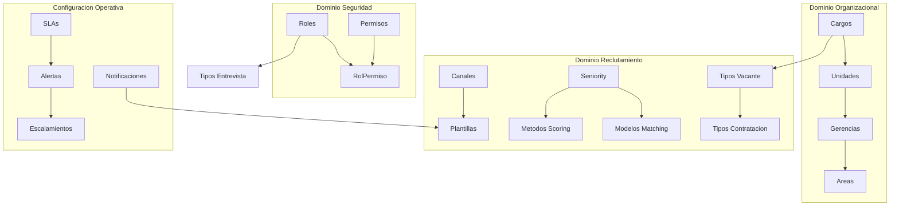

# KB_MasterData — Gobierno de Datos Maestros y Parametrización
## Sistema Inteligente de Reclutamiento — Nacional Seguros

> **Versión:** 1.0.0 | **Estado:** BORRADOR PENDIENTE DE VALIDACIÓN
> **Última actualización:** 2026-06-20
> **Propietario:** NacionalSeguros_MasterDataArchitect
> **Audiencia:** Backend (.NET 8), Frontend (Angular), SQL Server, n8n, QA, Arquitectura

---

## Control de Versiones Documentales

| Versión | Fecha | Autor | Rol | Cambios Realizados |
| :---: | :---: | :---: | :---: | :--- |
| `1.0.0` | 2026-06-20 | Antigravity | Technical Writer | Creación del estándar de datos maestros, matriz de dependencias y reglas de herencia. |

---

## Fuentes Oficiales

Esta KB se rige obligatoriamente por los siguientes documentos del proyecto:

| Documento | Rol en esta KB |
| :--- | :--- |
| `CONSTITUCION_PROYECTO.md` | Principios rectores y restricciones de hardcoding |
| `ANALISIS_FUNCIONAL.md` | Casos de uso de configuración global y por vacante |
| `DISEÑO_ERD.md` | Tablas relacionales y catálogo genérico de parametrización |
| `DICCIONARIO_DATOS.md` | Definición de campos, nulabilidad y tipos SQL Server 2022 |
| `ARQUITECTURA_BACKEND.md` | Contratos de servicios API y propagación de CorrelationId |
| `ARQUITECTURA_FRONTEND.md` | Inyección dinámica de configuraciones y carga de catálogos |
| `ARQUITECTURA_SQL.md` | Estructuras físicas, convenciones de nombres e índices |
| `POLITICAS_DE_SEGURIDAD.md` | RBAC, cifrado de datos salariales/scoring, y auditoría |
| `AUDITORIA_CALIDAD_Y_CUMPLIMIENTO.md` | Definición de AuditLog, AuditDetail e inmutabilidad de logs |
| PRD completo (KB_01, KB_02) | Reglas de negocio del sistema y flujos funcionales |

---

## Principios Rectores de Datos Maestros

1. **Cero Hardcoding (Absoluto):** Ningún valor de catálogo o parámetro operativo puede estar embebido en el código de .NET 8, en los componentes de Angular, en los nodos de n8n o en plantillas de comunicación. Todo debe persistirse en SQL Server y consumirse vía API.
2. **Soft Delete Transversal:** Queda prohibida la eliminación física (`DELETE`) de registros de catálogos en producción. Todos los catálogos deben soportar inactivación (`IsDeleted = 1` o `Activo = 0`).
3. **Auditoría por Defecto:** Todo cambio de configuración o valor maestro debe generar registros estructurados en `AuditLog` y `AuditDetail` propagando el `CorrelationId` de la transacción.
4. **Gobierno y Responsabilidad:** Cada catálogo tiene definidos propietarios funcionales (que solicitan o autorizan cambios) y responsables técnicos (que velan por la consistencia de los datos en la base de datos).
5. **No Dependencias Circulares:** Las relaciones jerárquicas y funcionales entre catálogos deben validarse mediante triggers o restricciones de integridad en base de datos para impedir ciclos infinitos.

---

## Arquitectura de Almacenamiento en Base de Datos

De acuerdo con `DISEÑO_ERD.md` y `DICCIONARIO_DATOS.md`, los datos maestros se dividen físicamente en dos aproximaciones de almacenamiento:

1. **Tablas de Entidades Específicas:** Reservadas para catálogos con relaciones complejas o campos específicos de negocio (ej. `Rol`, `Permiso`, `Estado`, `Canal`, `Plantilla`, `SLA`, `Agente`, `Skill`, `Configuracion`).
2. **Catálogo y Parámetro Genérico (Lookups):** Estructura clave-valor relacional para catálogos simples sin comportamiento relacional complejo (`Catalogo` y `Parametro`). Esto evita la proliferación de tablas DDL innecesarias.

---

# 1. Catálogos Organizacionales

### 1.1 Áreas
* **Nombre del Catálogo:** Áreas Organizacionales
* **Estructura Física:** Tabla genérica `Catalogo` (Nombre = 'Areas') y registros asociados en `Parametro` (ej. Código: `AREA_TI`, `AREA_COMM`).
* **Descripción:** Unidades departamentales principales del negocio.
* **Propósito:** Asignar la vacante y solicitud al departamento correspondiente para determinar decisores y presupuestos.
* **Responsable Funcional:** Director de Recursos Humanos.
* **Responsable Técnico:** DBA / Administrador del Sistema.
* **Valores Permitidos (Ejemplo):**
  * `AREA_TI` - Tecnología de la Información
  * `AREA_COMM` - Comercial y Ventas
  * `AREA_OPS` - Operaciones y Siniestros
  * `AREA_FIN` - Finanzas y Contabilidad
  * `AREA_LEG` - Legal y Cumplimiento
* **Estado Activo/Inactivo:** Controlado por el campo `Activo` en `Parametro`.
* **Versionado:** Registro de cambios en `Parametro` (campo `ModifiedDate`).
* **Auditoría:** Rueda sobre la tabla `AuditLog` en cada cambio.

### 1.2 Gerencias
* **Nombre del Catálogo:** Gerencias
* **Estructura Física:** Tabla genérica `Catalogo` (Nombre = 'Gerencias') y registros en `Parametro` dependientes de Áreas.
* **Descripción:** Nivel jerárquico directivo encargado de múltiples áreas o divisiones.
* **Propósito:** Definir el flujo de aprobación jerárquico de las solicitudes de personal.
* **Responsable Funcional:** Vicepresidente de Talento Humano.
* **Responsable Técnico:** Lead Backend Developer.
* **Valores Permitidos (Ejemplo):**
  * `GER_TEC` - Gerencia de Tecnología
  * `GER_MKT` - Gerencia de Marketing
  * `GER_LEG` - Gerencia Legal
* **Estado Activo/Inactivo:** Controlado por el campo `Activo` en `Parametro`.
* **Versionado:** Historial en `AuditLog`.
* **Auditoría:** Registro automático de modificaciones de responsables.

### 1.3 Unidades
* **Nombre del Catálogo:** Unidades
* **Estructura Física:** Tabla genérica `Catalogo` (Nombre = 'Unidades') y `Parametro`.
* **Descripción:** Subdivisiones dentro de una gerencia o área (ej. Unidad de Ciberseguridad).
* **Propósito:** Escribir el centro de costos exacto y alcance de la posición solicitada.
* **Responsable Funcional:** Gerente del Área Solicitante.
* **Responsable Técnico:** Lead Backend Developer.
* **Valores Permitidos (Ejemplo):**
  * `UNI_DEV` - Unidad de Desarrollo Angular
  * `UNI_NET` - Unidad de Infraestructura
  * `UNI_BI` - Unidad de Inteligencia de Negocios
* **Estado Activo/Inactivo:** Controlado por `Activo` en `Parametro`.
* **Versionado:** Gestión en base de datos transaccional con bitácora.
* **Auditoría:** Registro en `AuditLog`.

### 1.4 Cargos
* **Nombre del Catálogo:** Cargos Normalizados
* **Estructura Física:** Entidad relacional mapeada indirectamente en la columna `Cargo` de la tabla `PerfilCargo` y validada contra la tabla genérica `Parametro` (Nombre = 'Cargos').
* **Descripción:** Catálogo maestro de cargos formales aprobados en la estructura organizacional de Nacional Seguros.
* **Propósito:** Prevenir errores tipográficos al registrar vacantes e integrar con el sistema de nómina.
* **Responsable Funcional:** Jefe de Compensación y Estructura Organizacional.
* **Responsable Técnico:** DBA.
* **Valores Permitidos (Ejemplo):**
  * `CAR_DEV_MID` - Desarrollador .NET Mid
  * `CAR_QA_SR` - Ingeniero de QA Senior
  * `CAR_PM` - Gestor de Proyectos (Project Manager)
* **Estado Activo/Inactivo:** Soporta desactivación lógica mediante Soft Delete de parámetros.
* **Versionado:** Versionado robusto inmutable a través de `PerfilVersion` cuando un cargo se asocia a un profesiograma.
* **Auditoría:** Trazabilidad estricta ante cambios de descripción o perfil base.

### 1.5 Ubicaciones
* **Nombre del Catálogo:** Ubicaciones Geográficas
* **Estructura Física:** Tabla genérica `Catalogo` (Nombre = 'Ubicaciones') y `Parametro`.
* **Descripción:** Sedes físicas y oficinas donde se desempeñará el postulante contratado.
* **Propósito:** Definir el lugar de trabajo, moneda de pago asociada y normativas legales de contratación locales.
* **Responsable Funcional:** Gerente de Administración.
* **Responsable Técnico:** Administrador de Base de Datos.
* **Valores Permitidos (Ejemplo):**
  * `LOC_SCZ` - Santa Cruz (Sede Central)
  * `LOC_LPZ` - La Paz (Oficina Regional)
  * `LOC_CBB` - Cochabamba (Oficina Regional)
* **Estado Activo/Inactivo:** Atributo `Activo` en la tabla `Parametro`.
* **Versionado:** AuditLog.
* **Auditoría:** Log inmutable de creación y modificación de oficinas.

---

# 2. Catálogos de Reclutamiento

### 2.1 Tipos de Vacante
* **Nombre del Catálogo:** Tipos de Vacante
* **Estructura Física:** Tabla genérica `Catalogo` (Nombre = 'TiposVacante') y `Parametro`.
* **Descripción:** Clasificación funcional de la posición abierta (Nueva creación vs. Reemplazo).
* **Propósito:** Determinar si la vacante requiere aprobación presupuestaria adicional.
* **Responsable Funcional:** Líder de RRHH.
* **Responsable Técnico:** Analista QA (Validación de reglas).
* **Valores Permitidos:**
  * `VAC_NUEVA` - Nueva posición aprobada en Plan Anual.
  * `VAC_REEMPLAZO` - Cobertura de baja laboral, renuncia o despido.
* **Estado Activo/Inactivo:** Soporta desactivación por `Activo = 0`.
* **Versionado:** Auditoría en base de datos.
* **Auditoría:** Trazado en `AuditLog`.

### 2.2 Tipos de Contratación
* **Nombre del Catálogo:** Tipos de Contratación
* **Estructura Física:** Tabla genérica `Catalogo` (Nombre = 'TiposContratacion') y `Parametro`.
* **Descripción:** Naturaleza legal de la contratación del nuevo empleado.
* **Propósito:** Definir el checklist de documentos requeridos en el módulo de Contratación y los flujos legales asociados.
* **Responsable Funcional:** Gerente de Relaciones Laborales / Legal.
* **Responsable Técnico:** Lead Developer.
* **Valores Permitidos:**
  * `CON_INDEFINIDO` - Contrato por tiempo indefinido.
  * `CON_PLAZO_FIJO` - Contrato a plazo determinado.
  * `CON_EXTERNO` - Contrato civil de prestación de servicios (Consultor/Freelance).
* **Estado Activo/Inactivo:** Control en tabla `Parametro`.
* **Versionado:** AuditLog.
* **Auditoría:** Registro de modificaciones de contratos base.

### 2.3 Niveles de Seniority
* **Nombre del Catálogo:** Niveles de Seniority
* **Estructura Física:** Tabla genérica `Catalogo` (Nombre = 'Seniority') y `Parametro`.
* **Descripción:** Nivel de experiencia y competencias requerido para el cargo.
* **Propósito:** Configurar la escala salarial y ajustar los prompts de los agentes de IA (Matching y Scoring).
* **Responsable Funcional:** Jefe de Reclutamiento.
* **Responsable Técnico:** Ingeniero de IA (Prompt Engineer).
* **Valores Permitidos:**
  * `SEN_JR` - Junior
  * `SEN_MID` - Mid-level / Semi-Senior
  * `SEN_SR` - Senior
  * `SEN_LEAD` - Lead / Principal
* **Estado Activo/Inactivo:** Campo `Activo` en `Parametro`.
* **Versionado:** AuditLog.
* **Auditoría:** Trazabilidad obligatoria.

### 2.4 Canales de Reclutamiento
* **Nombre del Catálogo:** Canales de Publicación
* **Estructura Física:** Tabla física `Canal` en `DISEÑO_ERD.md` (Campos: `CanalId`, `Nombre`, `Descripcion`).
* **Descripción:** Medios autorizados para difundir las vacantes de Nacional Seguros.
* **Propósito:** Clasificar de dónde proceden los candidatos e integrar APIs de publicación externa.
* **Responsable Funcional:** Analista de Reclutamiento.
* **Responsable Técnico:** Lead Backend Developer.
* **Valores Permitidos (Ejemplo):**
  * `LinkedIn`
  * `Portal Web Corporativo`
  * `WhatsApp Corporativo`
  * `Referidos Internos`
* **Estado Activo/Inactivo:** Campo `IsDeleted` en `Canal`.
* **Versionado:** Registro de versionamiento transaccional de modificaciones.
* **Auditoría:** Log inmutable de cambios en `AuditLog`.

### 2.5 Motivos de Descarte
* **Nombre del Catálogo:** Motivos de Descarte
* **Estructura Física:** Tabla genérica `Catalogo` (Nombre = 'MotivosDescarte') y `Parametro`.
* **Descripción:** Catálogo maestro de justificaciones válidas para descartar un postulante del pipeline.
* **Propósito:** Prevenir justificaciones ambiguas y alimentar estadísticas analíticas.
* **Responsable Funcional:** Gerente de Recursos Humanos.
* **Responsable Técnico:** QA Engineer.
* **Valores Permitidos (Ejemplo):**
  * `DESC_PRE_SALARIAL` - Aspiración salarial fuera de la banda aprobada.
  * `DESC_EXP_INSUF` - Experiencia técnica menor a la mínima requerida.
  * `DESC_EVAL_FALLA` - Resultado fallido en pruebas psicotécnicas/técnicas.
  * `DESC_RED_FLAG` - Detección de incompatibilidades críticas (ej. antecedentes).
  * `DESC_CAND_DESISTE` - Candidato se retira de manera voluntaria.
* **Estado Activo/Inactivo:** Campo `Activo` en `Parametro`.
* **Versionado:** Registro histórico.
* **Auditoría:** Auditoría obligatoria.

### 2.6 Motivos de Cancelación
* **Nombre del Catálogo:** Motivos de Cancelación
* **Estructura Física:** Tabla genérica `Catalogo` (Nombre = 'MotivosCancelacion') y `Parametro`.
* **Descripción:** Justificaciones autorizadas para cancelar una solicitud de vacante o vacante activa.
* **Propósito:** Evaluar y auditar las decisiones organizativas que detienen un proceso de reclutamiento.
* **Responsable Funcional:** Gerente del Área Solicitante / Dirección.
* **Responsable Técnico:** Lead Developer.
* **Valores Permitidos (Ejemplo):**
  * `CANC_PRESUPUESTO` - Pérdida de presupuesto para el cargo.
  * `CANC_REESTRUCTURA` - Cambio en el organigrama organizacional.
  * `CANC_CUBIERTO_INT` - Posición cubierta mediante promoción interna directa.
* **Estado Activo/Inactivo:** Modificación de `Activo` en `Parametro`.
* **Versionado:** Auditoría en base de datos.
* **Auditoría:** Trazado de responsable y motivo en `StateHistory` y `AuditLog`.

---

# 3. Catálogos de Entrevistas

### 3.1 Tipos de Entrevista
* **Nombre del Catálogo:** Tipos de Entrevista
* **Estructura Física:** Tabla genérica `Catalogo` (Nombre = 'TiposEntrevista') y `Parametro` (ej. Código: `ENT_RRHH`, `ENT_TEC`).
* **Descripción:** Categorías de las citas de evaluación planificadas en el pipeline.
* **Propósito:** Asignar entrevistadores adecuados y cargar las plantillas de evaluación correspondientes.
* **Responsable Funcional:** Analista RRHH.
* **Responsable Técnico:** Desarrollador Backend.
* **Valores Permitidos:**
  * `ENT_SCREENING` - Filtro inicial rápido (RRHH / Asistente).
  * `ENT_RRHH` - Entrevista por competencias realizada por RRHH.
  * `ENT_TECNICA` - Evaluación práctica de conocimientos realizada por expertos técnicos.
  * `ENT_GERENCIAL` - Entrevista de ajuste cultural con líderes divisionales.
* **Estado Activo/Inactivo:** Campo `Activo` en `Parametro`.
* **Versionado:** AuditLog.
* **Auditoría:** Registro de cambios de catálogo.

### 3.2 Modalidades de Entrevista
* **Nombre del Catálogo:** Modalidad de Entrevista
* **Estructura Física:** Tabla genérica `Catalogo` (Nombre = 'ModalidadesEntrevista') y `Parametro`.
* **Descripción:** Entorno en el que se ejecuta la sesión de entrevista.
* **Propósito:** Determinar la logística del recordatorio (enlace virtual vs. dirección física).
* **Responsable Funcional:** Reclutador a cargo.
* **Responsable Técnico:** Lead Developer (Integración con Teams/Google Meet).
* **Valores Permitidos:**
  * `MOD_VIRTUAL` - Sesión remota (vía Microsoft Teams).
  * `MOD_PRESENCIAL` - Sesión física en oficinas de Nacional Seguros.
  * `MOD_HIBRIDA` - Entrevistador en oficina, candidato remoto.
* **Estado Activo/Inactivo:** Campo `Activo` en `Parametro`.
* **Versionado:** AuditLog.
* **Auditoría:** Log estructurado.

### 3.3 Resultados Posibles de Entrevista
* **Nombre del Catálogo:** Resultados de Entrevista
* **Estructura Física:** Tabla genérica `Catalogo` (Nombre = 'ResultadosEntrevista') y `Parametro`.
* **Descripción:** Resultados formales registrados al concluir una entrevista.
* **Propósito:** Automatizar la transición del postulante en el pipeline.
* **Responsable Funcional:** Jefe de Reclutamiento.
* **Responsable Técnico:** QA Engineer.
* **Valores Permitidos:**
  * `RES_APROBADO` - Candidato avanza a la siguiente fase.
  * `RES_RECHAZADO` - Candidato descartado del proceso.
  * `RES_EN_ESPERA` - Candidato en suspenso hasta evaluar la terna completa.
* **Estado Activo/Inactivo:** Atributo `Activo` en `Parametro`.
* **Versionado:** Bitácora transaccional.
* **Auditoría:** Registro de resultados inmutables en `Entrevista`.

---

# 4. Catálogos de IA (Gobernanza y Parámetros)

### 4.1 Tipos de Agentes IA
* **Nombre del Catálogo:** Agentes de IA Autorizados
* **Estructura Física:** Tabla física `Agente` en `DISEÑO_ERD.md` (Campos: `AgenteId`, `Nombre`, `Descripcion`).
* **Descripción:** Mapeo de los agentes de Inteligencia Artificial que apoyan la operación.
* **Propósito:** Auditar ejecuciones en la tabla central `AgentExecution`.
* **Responsable Funcional:** Comité de Gobernanza de IA / Dirección RRHH.
* **Responsable Técnico:** Lead AI Engineer.
* **Valores Permitidos:**
  * `Agente Solicitud` - Estructura la solicitud de personal.
  * `Agente Perfil` - Genera y versiona los profesiogramas.
  * `Agente Sourcing` - Genera estrategias y canales de búsqueda.
  * `Agente Matching` - Compara currículum contra profesiograma.
  * `Agente Scoring` - Calcula el puntaje de adecuación técnica y blanda.
  * `Agente Coordinación` - Gestiona agendas y envía mensajes conversacionales.
  * `Agente Analítico` - Genera KPIs y reportes ejecutivos.
* **Estado Activo/Inactivo:** Control mediante `IsDeleted` en `Agente`.
* **Versionado:** AuditLog de registros de agentes.
* **Auditoría:** Toda ejecución se loguea inmutablemente en `AgentExecution`.

### 4.2 Tipos de Scoring
* **Nombre del Catálogo:** Métodos de Scoring
* **Estructura Física:** Tabla genérica `Catalogo` (Nombre = 'TiposScoring') y `Parametro`.
* **Descripción:** Fórmulas o modelos matemáticos que el Agente de Scoring usa para calcular la nota del candidato.
* **Propósito:** Ajustar y refinar las fórmulas de ponderación sin desplegar nuevo código del backend.
* **Responsable Funcional:** Líder de Reclutamiento.
* **Responsable Técnico:** AI Engineer / Data Scientist.
* **Valores Permitidos:**
  * `SCOR_PONDERADO` - Suma ponderada de Skills (40%), Experiencia (40%) y Ajuste Cultural (20%).
  * `SCOR_ESTRICTO` - Multiplicativo (Si no cumple Red Flags, califica cero).
* **Lógica de Parametrización (Sliders):** Para el método `SCOR_PONDERADO`, la interfaz web expone sliders dinámicos interconectados (Adecuación Técnica, Experiencia Profesional, Ajuste Cultural). El sistema valida en tiempo real que la suma de las ponderaciones sea exactamente 100%, deshabilitando la confirmación ante cualquier desvío y exigiendo una justificación escrita para la bitácora.
* **Estado Activo/Inactivo:** Soporte `Activo` en `Parametro`.
* **Versionado:** Historial de parámetros en base de datos.
* **Auditoría:** Toda modificación del método requiere justificación, aprobación y se registra en `AuditLog`/`AuditDetail` con el CorrelationId asociado.

### 4.3 Tipos de Matching
* **Nombre del Catálogo:** Modelos de Matching Curricular
* **Estructura Física:** Tabla genérica `Catalogo` (Nombre = 'TiposMatching') y `Parametro`.
* **Descripción:** Algoritmo utilizado por el Agente de Matching para medir la afinidad del currículum (ej. Búsqueda Vectorial vs. Reglas Semánticas).
* **Propósito:** Permitir al equipo de desarrollo actualizar el modelo de embedding o prompt de matching dinámicamente.
* **Responsable Funcional:** Comité de Gobernanza de IA.
* **Responsable Técnico:** Lead AI Engineer.
* **Valores Permitidos:**
  * `MATCH_SEMANTIC` - Búsqueda de afinidad semántica por embedding vectorial.
  * `MATCH_KEYWORD` - Filtro estricto por palabras clave y certificaciones de perfil.
* **Estado Activo/Inactivo:** `Activo` en `Parametro`.
* **Versionado:** Trazabilidad en base de datos.
* **Auditoría:** Auditoría de prompts asociados a través de `PromptVersion`.

### 4.4 Estrategias de Sourcing
* **Nombre del Catálogo:** Estrategias de Sourcing
* **Estructura Física:** Tabla genérica `Catalogo` (Nombre = 'EstrategiasSourcing') y `Parametro`.
* **Descripción:** Configuraciones y enfoques sugeridos por el Agente de Sourcing para buscar candidatos.
* **Propósito:** Direccionar las consultas automatizadas a diferentes plataformas y redes según seniority.
* **Responsable Funcional:** Líder de Reclutamiento.
* **Responsable Técnico:** Prompt Engineer.
* **Valores Permitidos:**
  * `SRC_ACTIVE` - Publicación masiva en portales abiertos para reclutamiento rápido.
  * `SRC_HEADHUNTING` - Búsqueda dirigida en LinkedIn y bases de talento internas para perfiles Senior.
  * `SRC_INTERNAL` - Convocatoria de movilidad interna y plan de carrera.
* **Estado Activo/Inactivo:** Modificación de `Activo` en `Parametro`.
* **Versionado:** AuditLog.
* **Auditoría:** Auditoría estándar en base de datos.

---

# 5. Catálogos de Seguridad y Acceso

### 5.1 Roles (RBAC)
* **Nombre del Catálogo:** Roles de Usuario
* **Estructura Física:** Tabla física `Rol` en `DISEÑO_ERD.md` (Campos: `RolId`, `Nombre`, `Descripcion`).
* **Descripción:** Perfiles de rol formales que agrupan usuarios del sistema.
* **Propósito:** Garantizar el principio de menor privilegio (Least Privilege) en la aplicación y API.
* **Responsable Funcional:** Oficial de Seguridad de la Información (CISO).
* **Responsable Técnico:** Administrador del Directorio Corporativo de Identidad.
* **Valores Permitidos:**
  * `RRHH` - Operación y supervisión general.
  * `Solicitante` - Líderes de área que inician solicitudes.
  * `Decisor` - Gerentes/Directores con facultad de firma y aprobación.
  * `Reclutador` - Analistas de sourcing y coordinadores de agenda.
  * `Administrador` - Gestión total de la parametrización y seguridad.
  * `Auditor` - Solo lectura para verificación de logs de cumplimiento.
* **Estado Activo/Inactivo:** Controlado por el flag `IsDeleted` en `Rol`.
* **Versionado:** AuditLog de creación y edición.
* **Auditoría:** Registro de cambios de roles a través del trigger de auditoría de seguridad.

### 5.2 Permisos Granulares
* **Nombre del Catálogo:** Permisos del Sistema
* **Estructura Física:** Tabla física `Permiso` en `DISEÑO_ERD.md` (Campos: `PermisoId`, `Codigo`, `Nombre`, `Descripcion`).
* **Descripción:** Acciones de negocio individuales controladas en la plataforma.
* **Propósito:** Autorizar accesos a nivel de botón en Angular y endpoint en .NET 8.
* **Responsable Funcional:** Oficial de Seguridad de la Información.
* **Responsable Técnico:** Lead Architect.
* **Valores Permitidos (Ejemplo):**
  * `solicitudes.crear`, `solicitudes.aprobar`, `solicitudes.cancelar`
  * `perfiles.editar`, `perfiles.aprobar`
  * `postulantes.ver_salario` (Dato sensible cifrado)
  * `auditoria.consultar`
* **Estado Activo/Inactivo:** Campo `IsDeleted` en `Permiso`.
* **Versionado:** Estático (modificaciones documentadas).
* **Auditoría:** Altamente crítica, auditado en `AuditLog`.

### 5.3 Perfiles de Acceso (Matriz de Relación)
* **Nombre del Catálogo:** Relación Rol-Permiso
* **Estructura Física:** Tabla física `RolPermiso` (Llaves foráneas a `Rol` y `Permiso`).
* **Descripción:** Asignaciones que cruzan roles y permisos vigentes.
* **Propósito:** Gobernar de manera centralizada la matriz de seguridad.
* **Responsable Funcional:** Oficial de Seguridad de la Información.
* **Responsable Técnico:** Lead Backend Developer.
* **Valores Permitidos:** Combinaciones válidas entre `RolId` y `PermisoId` con constraint `UQ_Rol_Permiso` para evitar registros duplicados.
* **Estado Activo/Inactivo:** Campo `IsDeleted` en `RolPermiso`.
* **Versionado:** AuditLog.
* **Auditoría:** Registro estricto en `AuditLog`. Cualquier cambio alerta automáticamente al Oficial de Seguridad.

---

# 6. Configuración Operativa

### 6.1 SLAs (Acuerdos de Nivel de Servicio)
* **Nombre del Catálogo:** SLA por Proceso
* **Estructura Física:** Tabla física `SLA` en `DISEÑO_ERD.md` (Campos: `SLAId`, `Nombre`, `DiasMaximos`, `Modulo`).
* **Descripción:** Tiempos límites en días hábiles configurados para cada etapa o estado de negocio.
* **Propósito:** Monitorear cuellos de botella e iniciar alertas automáticas por n8n ante demoras.
* **Responsable Funcional:** Director de Operaciones / RRHH.
* **Responsable Técnico:** Lead Developer / n8n Workflow Designer.
* **Valores Permitidos:**
  * SLA-01: Aprobación de Solicitud (Límite: 3 días hábiles).
  * SLA-02: Creación de Profesiograma (Límite: 2 días hábiles).
  * SLA-03: Cobertura de Vacante (Límite: 30 días calendario).
  * SLA-04: Respuesta a Ofertas (Límite: 2 días hábiles).
* **Estado Activo/Inactivo:** Flag `IsDeleted` en `SLA`.
* **Versionado:** AuditLog.
* **Auditoría:** Monitoreo y control de excepciones registrado en `SLAExecution`.

### 6.2 Alertas Operacionales
* **Nombre del Catálogo:** Alertas del Sistema
* **Estructura Física:** Tabla genérica `Catalogo` (Nombre = 'Alertas') y `Parametro`.
* **Descripción:** Reglas de advertencia activadas ante desvíos de SLAs u otros eventos operacionales.
* **Propósito:** Notificar en tiempo real a los interesados de desvíos en el pipeline de selección.
* **Responsable Funcional:** Jefe de Reclutamiento.
* **Responsable Técnico:** n8n Workflow Designer.
* **Valores Permitidos:**
  * `ALERTA_SLA_VENCIDO` - Alerta enviada al gerente cuando se supera el tiempo límite.
  * `ALERTA_REPROG_MAX` - Alerta activada al superar 3 reprogramaciones de entrevista.
  * `ALERTA_RED_FLAG` - Notificación crítica cuando la IA detecta una Red Flag severa en un currículum.
* **Estado Activo/Inactivo:** Control `Activo` en `Parametro`.
* **Versionado:** Registro de cambios en catálogo.
* **Auditoría:** Bitácora en `AuditLog`.

### 6.3 Escalamientos Operativos
* **Nombre del Catálogo:** Reglas de Escalamiento
* **Estructura Física:** Tabla genérica `Catalogo` (Nombre = 'Escalamientos') y `Parametro`.
* **Descripción:** Jerarquía de derivación de tareas pendientes no resueltas en el tiempo del SLA.
* **Propósito:** Derivar la aprobación o gestión de una vacante atascada al nivel jerárquico superior.
* **Responsable Funcional:** Vicepresidente de Talento Humano.
* **Responsable Técnico:** Lead Backend Developer.
* **Valores Permitidos (Pares clave-valor):**
  * `ESC_SOL_REVISOR` -> Escalar de Analista RRHH a Gerente RRHH tras 24 horas sin acción en revisión.
  * `ESC_OFE_PENDIENTE` -> Escalar al Director de RRHH tras vencerse el plazo de oferta al candidato.
* **Estado Activo/Inactivo:** Campo `Activo` en `Parametro`.
* **Versionado:** AuditLog.
* **Auditoría:** Registro de escalamientos ejecutados auditado en `SLAExecution` y logs de integración de n8n.

### 6.4 Notificaciones
* **Nombre del Catálogo:** Canales y Tipos de Notificación
* **Estructura Física:** Tabla genérica `Catalogo` (Nombre = 'Notificaciones') y `Parametro`.
* **Descripción:** Tipos de mensajes estructurados enviados automáticamente por el sistema.
* **Propósito:** Gobernar las comunicaciones automatizadas hacia candidatos y usuarios internos.
* **Responsable Funcional:** Coordinador de Comunicaciones Internas.
* **Responsable Técnico:** Lead Developer.
* **Valores Permitidos:**
  * `NOTIF_CORREO` - Correo electrónico institucional.
  * `NOTIF_WHATSAPP` - Canal conversacional instantáneo.
* **Estado Activo/Inactivo:** Control mediante `Activo` en `Parametro`.
* **Versionado:** AuditLog.
* **Auditoría:** Registro de envíos detallado en `NotificationLog` (Mapeado en arquitectura de auditoría).

### 6.5 Plantillas de Comunicación
* **Nombre del Catálogo:** Plantillas de Mensajes
* **Estructura Física:** Tabla física `Plantilla` (Campos: `PlantillaId`, `Nombre`, `Asunto`, `Cuerpo`, `CanalId`, `Version`).
* **Descripción:** Texto preconfigurado con placeholders para envío automatizado de correos y WhatsApps.
* **Propósito:** Estandarizar la comunicación con candidatos e impedir textos duros en el código o en n8n.
* **Responsable Funcional:** Coordinador de Marca Empleadora / RRHH.
* **Responsable Técnico:** Lead Developer (Motor de renderizado de plantillas).
* **Valores Permitidos (Ejemplo):**
  * `PLT_CORREO_BIENVENIDA` - Email de confirmación de postulación recibida.
  * `PLT_WA_RECORDATORIO_ENT` - Mensaje de WhatsApp recordando la fecha y hora de la entrevista.
  * `PLT_CORREO_OFERTA` - Email con las condiciones de la oferta económica adjunta.
* **Estado Activo/Inactivo:** Campo `IsDeleted` en `Plantilla`.
* **Versionado:** Versionamiento con campo `Version` para conservar históricos e impedir sobrescrituras accidentales.
* **Auditoría:** Auditoría de edición de plantillas en `AuditLog`.

---

# Inventario Completo de Catálogos

| ID | Catálogo | Tipo de Almacenamiento | Responsable Funcional | Responsable Técnico | Nivel de Herencia |
| :---: | :--- | :--- | :--- | :--- | :--- |
| **C-01** | Áreas | Genérico (`Catalogo`/`Parametro`) | Director RRHH | DBA | Global |
| **C-02** | Gerencias | Genérico (`Catalogo`/`Parametro`) | VP Talento Humano | Lead Backend | Global |
| **C-03** | Unidades | Genérico (`Catalogo`/`Parametro`) | Gerente del Área | Lead Backend | Global |
| **C-04** | Cargos | Híbrido (`PerfilCargo`/`Parametro`) | Jefe de Estructura | DBA | Global |
| **C-05** | Ubicaciones | Genérico (`Catalogo`/`Parametro`) | Gerente de Administración | DBA | Global |
| **C-06** | Tipos de Vacante | Genérico (`Catalogo`/`Parametro`) | Líder RRHH | QA Engineer | Global |
| **C-07** | Tipos Contratación | Genérico (`Catalogo`/`Parametro`) | Gerente Relaciones Lab | Lead Backend | Global |
| **C-08** | Niveles Seniority | Genérico (`Catalogo`/`Parametro`) | Jefe de Reclutamiento | Prompt Engineer | Global |
| **C-09** | Canales Reclutamiento | Tabla Física (`Canal`) | Analista Reclutamiento | Lead Backend | Global |
| **C-10** | Motivos Descarte | Genérico (`Catalogo`/`Parametro`) | Gerente RRHH | QA Engineer | Global |
| **C-11** | Motivos Cancelación | Genérico (`Catalogo`/`Parametro`) | Gerente del Área | Lead Backend | Global |
| **C-12** | Tipos Entrevista | Genérico (`Catalogo`/`Parametro`) | Analista RRHH | Backend Dev | Global |
| **C-13** | Modalidad Entrevista | Genérico (`Catalogo`/`Parametro`) | Reclutador a cargo | Lead Backend | Global |
| **C-14** | Resultados Entrevista | Genérico (`Catalogo`/`Parametro`) | Jefe de Reclutamiento | QA Engineer | Global |
| **C-15** | Agentes IA | Tabla Física (`Agente`) | Gobernanza de IA | Lead AI Engineer | Global |
| **C-16** | Métodos Scoring | Genérico (`Catalogo`/`Parametro`) | Líder Reclutamiento | Data Scientist | Global |
| **C-17** | Modelos Matching | Genérico (`Catalogo`/`Parametro`) | Gobernanza de IA | Lead AI Engineer | Global |
| **C-18** | Estrategias Sourcing | Genérico (`Catalogo`/`Parametro`) | Líder Reclutamiento | Prompt Engineer | Global |
| **C-19** | Roles | Tabla Física (`Rol`) | CISO | Administrador del Directorio Corporativo | Global |
| **C-20** | Permisos | Tabla Física (`Permiso`) | CISO | Lead Architect | Global |
| **C-21** | Perfiles de Acceso | Tabla Física (`RolPermiso`) | CISO | Lead Backend | Global |
| **C-22** | SLAs | Tabla Física (`SLA`) | Director Operaciones | n8n Designer | Global |
| **C-23** | Alertas | Genérico (`Catalogo`/`Parametro`) | Jefe de Reclutamiento | n8n Designer | Global |
| **C-24** | Escalamientos | Genérico (`Catalogo`/`Parametro`) | VP Talento Humano | Lead Backend | Global |
| **C-25** | Notificaciones | Genérico (`Catalogo`/`Parametro`) | Coordinador Coms | Lead Backend | Global |
| **C-26** | Plantillas | Tabla Física (`Plantilla`) | Coordinador Coms | Lead Backend | Global |

---

# Matriz de Dependencias de Catálogos



### Relaciones de Dependencia Críticas:
1. **Unidad → Gerencia → Área:** Un Cargo no puede crearse sin estar asociado a una Unidad activa. Una Unidad requiere una Gerencia, y ésta requiere un Área activa.
2. **Plantilla → Canal:** Las plantillas de comunicación (`Plantilla`) dependen del canal de comunicación (`Canal`) definido. No se puede crear una plantilla para un canal inexistente o inactivo.
3. **RolPermiso → Rol / Permiso:** La matriz de perfiles de acceso depende estrictamente de que los roles y permisos individuales estén registrados y marcados como activos.
4. **SLAExecution → SLA / Estado:** El monitoreo en ejecución de acuerdos de nivel de servicio requiere la existencia física del parámetro de SLA y de los Estados de negocio configurados en la máquina de estados.

---

# Modelo de Herencia de Parámetros

El Sistema Inteligente de Reclutamiento implementa un modelo de herencia de tres niveles para garantizar consistencia operativa sin restar flexibilidad en procesos particulares.

```
[Nivel 1: Configuración Global (Tenant)]
             │
             ▼ hereda
[Nivel 2: Configuración por Tipo de Vacante]
             │
             ▼ hereda / sobrescribe
[Nivel 3: Configuración por Vacante Concreta (Proceso Activo)]
```

### 1. Nivel 1: Configuración Global (Tenant)
* **Descripción:** Parámetros por defecto que aplican a toda la plataforma.
* **Ejemplos:** Umbral de coincidencia mínimo general para Matching (70%), plazo de respuesta general a ofertas (48h), o remitente por defecto de correos corporativos.
* **Control de Modificación:** Restringido a administradores centrales con autorización de RRHH y Auditoría.

### 2. Nivel 2: Configuración por Tipo de Vacante
* **Descripción:** Parámetros especializados por área de negocio o tipo de vacante.
* **Ejemplos:** La vacante de tipo TI (`VAC_TI`) hereda los valores globales pero redefine el SLA de cobertura (45 días en lugar de los 30 días globales) y asigna un Agente de Scoring con pesos del 60% en habilidades técnicas.
* **Control de Modificación:** Autorizado a Gerentes de RRHH mediante flujo de validación.

### 3. Nivel 3: Configuración por Vacante Concreta (Proceso Activo)
* **Descripción:** Ajustes específicos realizados para un proceso de reclutamiento particular en tiempo de ejecución.
* **Ejemplos:** Modificar la banda salarial o desviar temporalmente el SLA de una entrevista debido a un feriado nacional.
* **Control de Modificación:** Exclusivo de Reclutadores Sénior con justificación escrita obligatoria registrada en `AuditLog` y aprobación del Decisor del Área.

---

# Reglas de Sobrescritura de Parámetros

Para mantener el control sobre los parámetros y evitar alteraciones que comprometan la calidad del servicio, se imponen las siguientes reglas de sobrescritura estricta:

| Parámetro | Nivel 1 (Global) | Nivel 2 (Tipo Vacante) | Nivel 3 (Vacante Concreta) | Regla de Sobrescritura |
| :--- | :---: | :---: | :---: | :--- |
| **Banda Salarial** | Sí | Hereda | Sobrescribe | Sólo se permite sobrescribir dentro de la banda salarial del Cargo. Requiere firma de Decisor. |
| **SLA de Cobertura** | 30 días | Sobrescribe | Bloqueado | No se puede alterar en el proceso activo para evitar adulteración de KPIs. |
| **Umbral de Matching IA** | 70% | Sobrescribe | Sobrescribe | El reclutador puede reducir el umbral hasta un 60% con justificación escrita si el mercado es escaso. |
| **Plantillas de Mensaje** | Sí | Hereda | Bloqueado | Las plantillas de correo y WhatsApp son inmutables para resguardar la identidad de la marca. |
| **Checklist Documental** | Estándar | Sobrescribe | Bloqueado | Depende estrictamente del Tipo de Contratación. No alterable por el reclutador. |

---

# Estrategia de Versionado de Catálogos

El versionado de los datos maestros protege la integridad de los datos históricos y garantiza que las auditorías puedan reconstruir el estado exacto del sistema en cualquier fecha del pasado.

### 1. Versionado por Reemplazo Inmutable (Profesiogramas)
* **Entidades:** `PerfilCargo`, `PerfilVersion`.
* **Mecanismo:** El perfil activo apunta a la última versión. Si se edita el profesiograma, no se ejecuta un `UPDATE` del contenido anterior; en su lugar, se inserta una nueva fila en `PerfilVersion` incrementando `VersionNumber` y guardando el snapshot JSON exacto.
* **Rollback:** El administrador puede cambiar la referencia del perfil activo a un `VersionNumber` anterior de forma instantánea.

### 2. Versionado por Auditoría Detallada (Lookups y Parámetros)
* **Entidades:** `Catalogo`, `Parametro`, `AuditLog`, `AuditDetail`.
* **Mecanismo:** Cambios en la tabla `Parametro` se realizan mediante `UPDATE` físico. El disparador de base de datos intercepta el cambio y registra la diferencia en `AuditDetail` (guardando `ValorAnterior` y `ValorNuevo`).
* **Reconstrucción:** Para auditar, el sistema consulta el log histórico de auditoría filtrando por el ID del parámetro.

---

# Estrategia de Auditoría de Catálogos

Conforme a las `POLITICAS_DE_SEGURIDAD.md` y `AUDITORIA_CALIDAD_Y_CUMPLIMIENTO.md`, la auditoría se implementa bajo las siguientes directrices técnicas:

1. **Propagación obligatoria del CorrelationId:** Todo request que modifique un parámetro debe capturar y propagar el `CorrelationId` generado por el API Gateway, registrándolo en la columna homónima de `AuditLog`.
2. **Registro de Dirección IP y Dispositivo:** Cada cambio de configuración almacena la IP de origen y el agente de usuario (navegador o dispositivo) para evitar fraudes por suplantación.
3. **Inmutabilidad:** Las tablas `AuditLog` y `AuditDetail` se configuran con permisos de base de datos que impiden sentencias `UPDATE` o `DELETE` para cualquier usuario, incluidos los administradores de base de datos (Write Once, Read Many).
4. **Soft Delete Mandatorio:** Las consultas del Backend y n8n deben aplicar siempre el filtro `WHERE IsDeleted = 0` o `WHERE Activo = 1` en sus consultas. Las inactivaciones lógicas quedan registradas registrando la columna `DeletedBy` y `DeletedDate`.

---

# Riesgos Detectados y Planes de Mitigación

| ID | Riesgo | Severidad | Impacto | Mitigación Propuesta |
| :---: | :--- | :---: | :--- | :--- |
| **R-MD-01** | **Dependencias Circulares en Lookups** | 🔴 Alto | Puede provocar bucles infinitos en consultas jerárquicas recursivas (ej. Gerencia depende de Unidad y Unidad de Gerencia). | Implementar el trigger `trg_Parametro_PreventCircular` en la base de datos y la validación `ValidateNoCircularDependency` en la capa de aplicación/repositorio para impedir relaciones jerárquicas circulares. |
| **R-MD-02** | **Carga Innecesaria de Logs por Polling de n8n** | 🟠 Medio | Los workflows de n8n consultando parámetros frecuentemente pueden llenar las tablas de logs. | Excluir las lecturas (`SELECT`) de auditoría. Registrar auditoría únicamente ante operaciones de escritura (`INSERT`, `UPDATE`, `DELETE`). |
| **R-MD-03** | **Modificación Directa en Base de Datos** | 🔴 Alto | Un DBA alterando valores en SQL Server sin pasar por la API rompe la traza del `CorrelationId` y la auditoría. | Activar triggers DDL y auditoría del motor SQL Server (SQL Server Audit) a nivel de servidor para registrar cualquier cambio directo sobre las tablas. |
| **R-MD-04** | **Inactivación de Parámetros en Uso** | 🟠 Medio | Inactivar una Ubicación o Cargo en uso activo puede romper las llaves foráneas o arrojar excepciones en cascada en las vistas. | Implementar validaciones en la API de .NET 8 que verifique la no existencia de registros dependientes activos (ej. Vacantes abiertas en esa Ubicación) antes de permitir inactivarla. |

---

# Recomendaciones Arquitectónicas

1. **Cachear Parámetros en Backend y Frontend:** Los catálogos maestros tienen una tasa de cambio extremadamente baja. Se recomienda implementar caché en memoria en la API de .NET 8 (Caché en memoria / Caché distribuida) y almacenamiento local en Angular (NGXS/State) con invalidación por webhook para evitar consultas redundantes a SQL Server.
2. **Middleware de Trazabilidad en .NET:** Desarrollar un Action Filter global en ASP.NET Core que obligue a los endpoints de parametrización a requerir un encabezado `X-Correlation-ID`.
3. **Pantalla Unificada de Configuración:** Diseñar en el módulo de Administración de Angular una interfaz intuitiva organizada por dominios para evitar que los usuarios de RRHH dependan de scripts SQL redactados por soporte TI.
4. **Cifrado de Datos de Configuración Sensible:** Si en un futuro se parametrizan llaves de APIs externas en la tabla `Configuracion` (ej. WhatsApp API Token), éstos valores deben almacenarse cifrados mediante certificados en SQL Server o referenciar secretos en el almacén de secretos corporativo.

---

## Cumplimiento de Lineamientos del Proyecto
**Resultado de la Evaluación:** `APPROVED`

### Justificación del Resultado:
* **Cero Hardcoding:** Se ha mapeado la estructura del Diccionario de Datos y el ERD oficial utilizando tablas de parametrización genéricas (`Catalogo`/`Parametro`) y tablas físicas específicas, asegurando la administración dinámica.
* **Auditoría y Trazabilidad:** Se incorporan los requerimientos de propagación de `CorrelationId` y no repudio inmutable sobre `AuditLog` y `AuditDetail`.
* **No dependencias circulares:** Se definieron las jerarquías claras y los riesgos de recursividad con sus debidas mitigaciones técnicas en la base de datos SQL Server 2022.
* **Modelo de Herencia:** El diseño describe de forma consistente cómo se heredan y sobrescriben los parámetros del Nivel Global al proceso activo.
