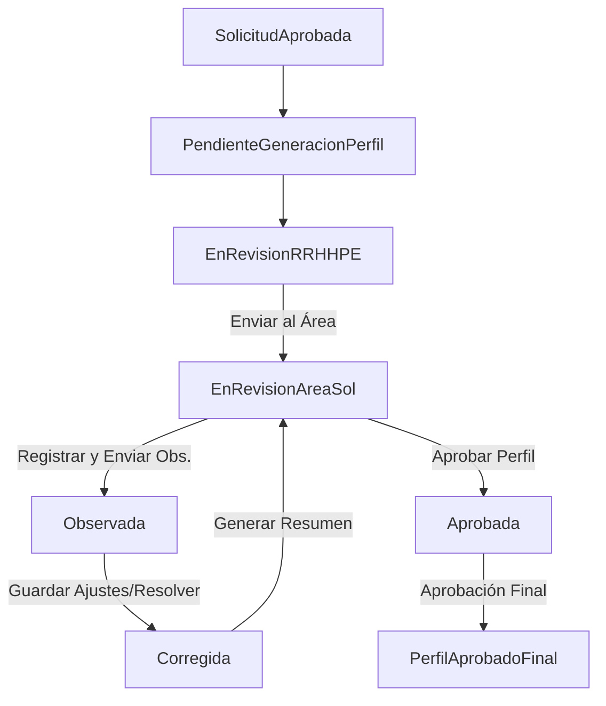

# Flujo de Estados del Módulo de Perfiles

**Estado de Implementación**: Implementado en Frontend / Transiciones Simuladas  
**Última Actualización**: 12/07/2026

---

## 1. Estados Oficiales
El módulo opera estrictamente bajo los siguientes estados definidos en la máquina de estados del perfil de cargo:

*   **SolicitudAprobada**: Estado inicial de sincronía con el Módulo de Solicitudes.
*   **PendienteGeneracionPerfil**: Esperando la ejecución asíncrona del Agente IA.
*   **EnRevisionRRHHPE**: El profesiograma estructurado está a disposición de RRHH para edición o ajustes.
*   **ResumenEjecutivoGenerado**: El resumen ejecutivo se encuentra consolidado y visible.
*   **EnRevisionAreaSol**: El perfil está bajo revisión interactiva por parte del Área Solicitante.
*   **Observada**: El Área Solicitante ha devuelto el perfil con observaciones/correcciones solicitadas globales.
*   **Corregida**: RRHH ha corregido/ajustado los campos conforme a las observaciones del área.
*   **Aprobada**: El Área Solicitante ha validado e impreso su conformidad sobre el perfil.
*   **PerfilAprobadoFinal**: RRHH ha efectuado el cierre formal de la vacante, finalizando el flujo del profesiograma.

---

## 2. Diagrama de Transición de Estados
Las transiciones autorizadas siguen el siguiente flujo lógico gobernado por el motor:

---

## 3. Reglas Críticas de Negocio

### Aprobación Escalonada Obligatoria
> [!IMPORTANT]
> Recursos Humanos (RRHH) **no puede** aprobar un perfil de vacante de forma definitiva (`PerfilAprobadoFinal`) hasta que el Área Solicitante interesada lo haya aprobado previamente (transición al estado `Aprobada`).

*   **El Estado `Aprobada`**: Significa que el Área Solicitante valida el contenido y da luz verde, pero el profesiograma aún se encuentra pendiente del cierre definitivo de control de RRHH.
*   **El Estado `PerfilAprobadoFinal`**: Representa la aprobación definitiva de RRHH y el consecuente congelamiento/cierre inmutable de la estructura del cargo, habilitando la publicación de la vacante.
